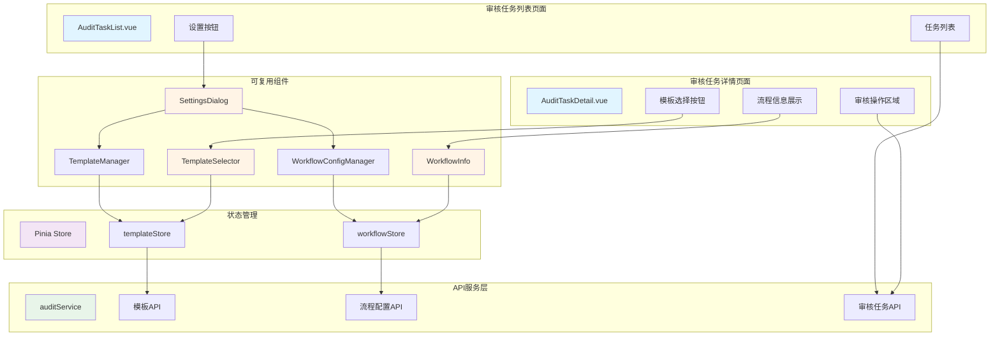
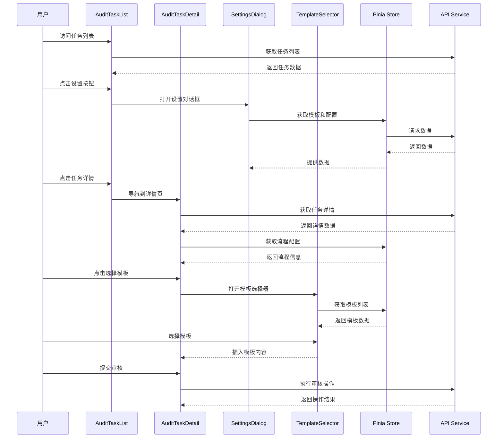

# 审核管理架构重构 - 设计文档

## 概述

本设计文档描述了审核管理架构重构的技术实现方案。该重构旨在优化当前分散的审核管理功能，将审核配置和模板功能整合到审核任务流程中，减少用户在多个页面间的切换，提升审核效率和用户体验。

### 设计目标

1. **简化页面结构**：移除独立的审核流程配置和审核意见模板页面，将功能整合到审核任务流程中
2. **提升用户体验**：在审核任务详情页面直接提供模板选择和流程信息展示
3. **保持API兼容性**：不改变现有后端API接口，仅在前端进行架构调整
4. **提高代码复用性**：将功能封装为独立的可复用组件
5. **优化交互流程**：减少页面跳转，提供更流畅的审核操作体验

### 核心变更

- **移除页面**：`AuditWorkflowConfig.vue`、`AuditCommentTemplates.vue`
- **保留页面**：`AuditTaskList.vue`、`AuditTaskDetail.vue`
- **新增组件**：`TemplateSelector`、`WorkflowInfo`、`SettingsDialog`、`TemplateManager`、`WorkflowConfigManager`
- **路由调整**：移除审核配置和模板相关路由

## 架构设计

### 系统架构图



### 组件层次结构

```
AuditTaskList.vue (审核任务列表)
├── 设置按钮
│   └── SettingsDialog (设置对话框)
│       ├── TemplateManager (模板管理)
│       └── WorkflowConfigManager (流程配置管理)
└── 任务列表

AuditTaskDetail.vue (审核任务详情)
├── WorkflowInfo (流程信息展示)
├── 审核操作区域
│   └── TemplateSelector (模板选择器)
└── 审核历史
```

### 数据流设计



## 组件设计

### 1. TemplateSelector (模板选择器组件)

**功能描述**：在审核任务详情页面提供快速选择和插入审核意见模板的功能。

**组件接口**：

```typescript
interface TemplateSelectorProps {
  // 当前审核类型（用于过滤模板）
  auditType?: 'approved' | 'need_revision' | 'rejected' | 'other'
  // 是否显示搜索框
  showSearch?: boolean
  // 最大显示数量
  maxDisplay?: number
}

interface TemplateSelectorEmits {
  // 选择模板事件
  (e: 'select', template: CommentTemplate): void
  // 关闭事件
  (e: 'close'): void
}
```

**UI设计**：
- 弹出式面板，显示在审核意见输入框旁边
- 顶部搜索框，支持模板名称和内容搜索
- 模板列表，显示模板名称和预览内容
- 支持键盘导航（上下箭头选择，回车确认）
- 响应式设计，移动端全屏显示

**状态管理**：
```typescript
const state = {
  visible: boolean
  searchKeyword: string
  selectedIndex: number
  templates: CommentTemplate[]
  filteredTemplates: CommentTemplate[]
}
```

### 2. WorkflowInfo (流程信息展示组件)

**功能描述**：在审核任务详情页面展示当前审核流程的完整信息。

**组件接口**：

```typescript
interface WorkflowInfoProps {
  // 审核任务ID
  taskId: string
  // 当前审核级别
  currentLevel: number
  // 流程配置
  workflowConfig?: AuditWorkflowConfig
  // 是否显示详细信息
  showDetails?: boolean
}
```

**UI设计**：
- 时间线样式展示审核流程
- 每个审核节点显示：级别名称、审核人、状态、时间
- 当前节点高亮显示
- 已完成节点显示绿色勾选标记
- 待审核节点显示等待图标
- 可折叠/展开详细信息

**数据结构**：
```typescript
interface WorkflowNode {
  level: number
  levelName: string
  auditor: string
  auditorName: string
  status: 'pending' | 'in_progress' | 'completed' | 'rejected'
  startTime?: Date
  endTime?: Date
  comments?: string
}
```

### 3. SettingsDialog (设置对话框组件)

**功能描述**：在审核任务列表页面提供统一的设置入口，管理模板和流程配置。

**组件接口**：

```typescript
interface SettingsDialogProps {
  // 是否显示
  visible: boolean
  // 默认激活的标签页
  defaultTab?: 'templates' | 'workflow'
}

interface SettingsDialogEmits {
  (e: 'update:visible', value: boolean): void
  (e: 'saved'): void
}
```

**UI设计**：
- 模态对话框，宽度800px
- 顶部标签页切换：审核意见模板、审核流程配置
- 内容区域嵌入TemplateManager或WorkflowConfigManager
- 底部操作按钮：关闭
- 响应式设计，移动端全屏显示

### 4. TemplateManager (模板管理组件)

**功能描述**：管理审核意见模板的增删改查操作。

**组件接口**：

```typescript
interface TemplateManagerProps {
  // 是否只读模式
  readonly?: boolean
}

interface TemplateManagerEmits {
  (e: 'change'): void
}
```

**功能列表**：
- 模板列表展示（表格形式）
- 添加新模板
- 编辑现有模板
- 删除模板
- 设置默认模板
- 按类型筛选
- 关键词搜索

**表单字段**：
```typescript
interface TemplateForm {
  name: string          // 模板名称
  type: string          // 审核类型
  content: string       // 模板内容
  isDefault: boolean    // 是否默认
}
```

### 5. WorkflowConfigManager (流程配置管理组件)

**功能描述**：管理审核流程配置的增删改查操作。

**组件接口**：

```typescript
interface WorkflowConfigManagerProps {
  // 是否只读模式
  readonly?: boolean
}

interface WorkflowConfigManagerEmits {
  (e: 'change'): void
}
```

**功能列表**：
- 审核级别列表展示
- 添加审核级别
- 编辑审核级别
- 删除审核级别
- 调整级别顺序
- 配置审核角色

**表单字段**：
```typescript
interface AuditLevelForm {
  order: number         // 级别顺序
  name: string          // 级别名称
  description: string   // 描述
  role: string          // 审核角色
  required: boolean     // 是否必需
}
```

## 数据模型

### 审核意见模板 (CommentTemplate)

```typescript
interface CommentTemplate {
  id: string
  name: string
  type: 'approved' | 'need_revision' | 'rejected' | 'other'
  content: string
  usageCount: number
  isDefault: boolean
  createdBy: string
  createdAt: Date
  updatedAt: Date
}
```

### 审核流程配置 (AuditWorkflowConfig)

```typescript
interface AuditWorkflowConfig {
  id: string
  name: string
  sampleTypes: string[]
  levels: AuditLevel[]
  parallelAudit: boolean
  status: 'active' | 'inactive'
  createdBy: string
  createdAt: Date
  updatedAt: Date
}

interface AuditLevel {
  id: string
  order: number
  name: string
  description?: string
  role: string
  roleName?: string
  required: boolean
  autoAssign: boolean
  createdAt: Date
  updatedAt: Date
}
```

### 审核任务 (AuditTask)

```typescript
interface AuditTask {
  id: string
  sampleId: string
  sampleName: string
  sampleBarcode: string
  level: number
  levelName: string
  auditor: string
  auditorName?: string
  status: 'pending' | 'approved' | 'rejected' | 'returned'
  priority: 'low' | 'normal' | 'high' | 'urgent'
  comments?: string
  attachments?: AuditAttachment[]
  submittedAt: Date
  auditedAt?: Date | null
  createdAt?: Date
  updatedAt?: Date
  sample?: SampleInfo
}
```

## API 接口设计

### 审核意见模板 API

#### 1. 获取模板列表

```
GET /api/audit/templates
Query Parameters:
  - type?: string (审核类型)
  - keyword?: string (搜索关键词)
  - page?: number
  - pageSize?: number

Response:
{
  success: boolean
  data: CommentTemplate[]
  pagination: {
    currentPage: number
    pageSize: number
    total: number
  }
}
```

#### 2. 创建模板

```
POST /api/audit/templates
Request Body:
{
  name: string
  type: string
  content: string
  isDefault: boolean
}

Response:
{
  success: boolean
  data: CommentTemplate
  message: string
}
```

#### 3. 更新模板

```
PUT /api/audit/templates/:id
Request Body:
{
  name: string
  type: string
  content: string
  isDefault: boolean
}

Response:
{
  success: boolean
  data: CommentTemplate
  message: string
}
```

#### 4. 删除模板

```
DELETE /api/audit/templates/:id

Response:
{
  success: boolean
  message: string
}
```

### 审核流程配置 API

#### 1. 获取流程配置列表

```
GET /api/audit/workflow-configs
Query Parameters:
  - status?: string
  - page?: number
  - pageSize?: number

Response:
{
  success: boolean
  data: AuditWorkflowConfig[]
  pagination: {
    currentPage: number
    pageSize: number
    total: number
  }
}
```

#### 2. 获取流程配置详情

```
GET /api/audit/workflow-configs/:id

Response:
{
  success: boolean
  data: AuditWorkflowConfig
}
```

#### 3. 创建流程配置

```
POST /api/audit/workflow-configs
Request Body:
{
  name: string
  sampleTypes: string[]
  levels: AuditLevel[]
  parallelAudit: boolean
}

Response:
{
  success: boolean
  data: AuditWorkflowConfig
  message: string
}
```

#### 4. 更新流程配置

```
PUT /api/audit/workflow-configs/:id
Request Body:
{
  name: string
  sampleTypes: string[]
  levels: AuditLevel[]
  parallelAudit: boolean
  status: string
}

Response:
{
  success: boolean
  data: AuditWorkflowConfig
  message: string
}
```

#### 5. 删除流程配置

```
DELETE /api/audit/workflow-configs/:id

Response:
{
  success: boolean
  message: string
}
```

### 审核任务 API（现有接口）

#### 1. 获取审核任务列表

```
GET /api/audits
Query Parameters:
  - level?: number
  - status?: string
  - barcode?: string
  - page?: number
  - pageSize?: number

Response:
{
  items: AuditTask[]
  total: number
  page: number
  pageSize: number
}
```

#### 2. 获取审核任务详情

```
GET /api/audits/:id

Response: AuditTask
```

#### 3. 执行审核操作

```
POST /api/audits/:id/review
Request Body:
{
  taskId: string
  decision: 'approved' | 'rejected' | 'returned'
  comments: string
  attachments?: File[]
}

Response:
{
  success: boolean
  message: string
}
```

#### 4. 获取审核历史

```
GET /api/audits/:id/history

Response: AuditHistoryRecord[]
```

## 状态管理设计

### Template Store (模板状态管理)

```typescript
import { defineStore } from 'pinia'
import type { CommentTemplate } from '@/types/audit'

export const useTemplateStore = defineStore('template', {
  state: () => ({
    templates: [] as CommentTemplate[],
    loading: false,
    error: null as string | null,
    lastFetchTime: null as Date | null
  }),
  
  getters: {
    // 按类型获取模板
    templatesByType: (state) => (type: string) => {
      return state.templates.filter(t => t.type === type)
    },
    
    // 获取默认模板
    defaultTemplates: (state) => {
      return state.templates.filter(t => t.isDefault)
    },
    
    // 按类型获取默认模板
    defaultTemplateByType: (state) => (type: string) => {
      return state.templates.find(t => t.type === type && t.isDefault)
    },
    
    // 搜索模板
    searchTemplates: (state) => (keyword: string) => {
      const lowerKeyword = keyword.toLowerCase()
      return state.templates.filter(t => 
        t.name.toLowerCase().includes(lowerKeyword) ||
        t.content.toLowerCase().includes(lowerKeyword)
      )
    }
  },
  
  actions: {
    // 获取模板列表
    async fetchTemplates(force = false) {
      // 缓存策略：5分钟内不重复请求
      if (!force && this.lastFetchTime) {
        const diff = Date.now() - this.lastFetchTime.getTime()
        if (diff < 5 * 60 * 1000) {
          return
        }
      }
      
      this.loading = true
      this.error = null
      
      try {
        const response = await http.get('/api/audit/templates')
        this.templates = response.data
        this.lastFetchTime = new Date()
      } catch (error: any) {
        this.error = error.message || '获取模板列表失败'
        throw error
      } finally {
        this.loading = false
      }
    },
    
    // 创建模板
    async createTemplate(template: Omit<CommentTemplate, 'id' | 'createdAt' | 'updatedAt' | 'usageCount' | 'createdBy'>) {
      try {
        const response = await http.post('/api/audit/templates', template)
        this.templates.push(response.data)
        return response.data
      } catch (error: any) {
        throw error
      }
    },
    
    // 更新模板
    async updateTemplate(id: string, template: Partial<CommentTemplate>) {
      try {
        const response = await http.put(`/api/audit/templates/${id}`, template)
        const index = this.templates.findIndex(t => t.id === id)
        if (index > -1) {
          this.templates[index] = response.data
        }
        return response.data
      } catch (error: any) {
        throw error
      }
    },
    
    // 删除模板
    async deleteTemplate(id: string) {
      try {
        await http.delete(`/api/audit/templates/${id}`)
        const index = this.templates.findIndex(t => t.id === id)
        if (index > -1) {
          this.templates.splice(index, 1)
        }
      } catch (error: any) {
        throw error
      }
    },
    
    // 设置默认模板
    async setDefaultTemplate(id: string, type: string) {
      // 取消同类型其他模板的默认状态
      this.templates.forEach(t => {
        if (t.type === type && t.id !== id) {
          t.isDefault = false
        }
      })
      
      // 设置当前模板为默认
      const template = this.templates.find(t => t.id === id)
      if (template) {
        template.isDefault = true
        await this.updateTemplate(id, { isDefault: true })
      }
    }
  }
})
```

### Workflow Store (流程配置状态管理)

```typescript
import { defineStore } from 'pinia'
import type { AuditWorkflowConfig, AuditLevel } from '@/types/audit'

export const useWorkflowStore = defineStore('workflow', {
  state: () => ({
    configs: [] as AuditWorkflowConfig[],
    currentConfig: null as AuditWorkflowConfig | null,
    loading: false,
    error: null as string | null,
    lastFetchTime: null as Date | null
  }),
  
  getters: {
    // 获取激活的配置
    activeConfigs: (state) => {
      return state.configs.filter(c => c.status === 'active')
    },
    
    // 按样品类型获取配置
    configBySampleType: (state) => (sampleType: string) => {
      return state.configs.find(c => 
        c.status === 'active' && c.sampleTypes.includes(sampleType)
      )
    },
    
    // 获取审核级别列表
    auditLevels: (state) => {
      return state.currentConfig?.levels || []
    }
  },
  
  actions: {
    // 获取流程配置列表
    async fetchConfigs(force = false) {
      // 缓存策略：5分钟内不重复请求
      if (!force && this.lastFetchTime) {
        const diff = Date.now() - this.lastFetchTime.getTime()
        if (diff < 5 * 60 * 1000) {
          return
        }
      }
      
      this.loading = true
      this.error = null
      
      try {
        const response = await http.get('/api/audit/workflow-configs')
        this.configs = response.data
        this.lastFetchTime = new Date()
        
        // 设置默认当前配置为第一个激活的配置
        if (!this.currentConfig && this.activeConfigs.length > 0) {
          this.currentConfig = this.activeConfigs[0]
        }
      } catch (error: any) {
        this.error = error.message || '获取流程配置失败'
        throw error
      } finally {
        this.loading = false
      }
    },
    
    // 获取流程配置详情
    async fetchConfigById(id: string) {
      try {
        const response = await http.get(`/api/audit/workflow-configs/${id}`)
        this.currentConfig = response.data
        return response.data
      } catch (error: any) {
        throw error
      }
    },
    
    // 创建流程配置
    async createConfig(config: Omit<AuditWorkflowConfig, 'id' | 'createdAt' | 'updatedAt' | 'createdBy'>) {
      try {
        const response = await http.post('/api/audit/workflow-configs', config)
        this.configs.push(response.data)
        return response.data
      } catch (error: any) {
        throw error
      }
    },
    
    // 更新流程配置
    async updateConfig(id: string, config: Partial<AuditWorkflowConfig>) {
      try {
        const response = await http.put(`/api/audit/workflow-configs/${id}`, config)
        const index = this.configs.findIndex(c => c.id === id)
        if (index > -1) {
          this.configs[index] = response.data
        }
        if (this.currentConfig?.id === id) {
          this.currentConfig = response.data
        }
        return response.data
      } catch (error: any) {
        throw error
      }
    },
    
    // 删除流程配置
    async deleteConfig(id: string) {
      try {
        await http.delete(`/api/audit/workflow-configs/${id}`)
        const index = this.configs.findIndex(c => c.id === id)
        if (index > -1) {
          this.configs.splice(index, 1)
        }
        if (this.currentConfig?.id === id) {
          this.currentConfig = null
        }
      } catch (error: any) {
        throw error
      }
    },
    
    // 设置当前配置
    setCurrentConfig(config: AuditWorkflowConfig) {
      this.currentConfig = config
    }
  }
})
```

## 正确性属性

*属性是一个特征或行为，应该在系统的所有有效执行中保持为真——本质上是关于系统应该做什么的正式陈述。属性作为人类可读规范和机器可验证正确性保证之间的桥梁。*

### 属性反思

在分析所有验收标准后，我识别出以下可测试的属性。为了消除冗余，我进行了以下合并：

**合并的属性**：
- 需求 3.3-3.6 关于模板选择器的多个属性可以合并为一个综合属性
- 需求 4.3-4.5 关于流程信息显示的多个属性可以合并为一个综合属性
- 需求 6.1-6.3 和 7.1-7.3 关于CRUD操作的属性可以合并为通用的CRUD属性
- 需求 6.5-6.6 和 14.2 关于空值验证的属性可以合并
- 需求 10.3-10.4 和 14.4-14.5 关于操作反馈的属性可以合并

**保留的独立属性**：
- 数据持久化的往返属性（需求 12.1-12.2）
- 模板内容格式保留的往返属性（需求 15.2-15.3）
- 搜索过滤功能属性（需求 3.5）

### 属性 1: 模板选择器完整功能

*对于任意*审核任务详情页面和任意模板集合，当用户打开模板选择器时，应该显示所有可用模板，每个模板应包含名称和预览内容，并且选择任意模板后应将其内容正确插入到审核意见输入框中。

**验证需求**: 3.3, 3.4, 3.6

### 属性 2: 模板搜索过滤正确性

*对于任意*搜索关键词和任意模板集合，搜索结果应该只包含名称或内容中包含该关键词的模板，并且所有匹配的模板都应该被返回。

**验证需求**: 3.5

### 属性 3: 流程信息完整展示

*对于任意*审核任务，流程信息组件应该显示该任务的所有审核节点，每个节点应包含级别名称、审核人信息和正确的状态标识（待审核、已审核、已通过、已驳回）。

**验证需求**: 4.3, 4.4, 4.5

### 属性 4: 模板CRUD操作正确性

*对于任意*有效的模板数据，系统应该能够成功创建、读取、更新和删除该模板，并且每次操作后数据应该在后端正确持久化。

**验证需求**: 6.1, 6.2, 6.3, 12.1

### 属性 5: 流程配置CRUD操作正确性

*对于任意*有效的流程配置数据，系统应该能够成功创建、读取、更新和删除该配置，并且每次操作后数据应该在后端正确持久化。

**验证需求**: 7.1, 7.2, 7.3, 12.2

### 属性 6: 输入验证拒绝空值

*对于任意*仅包含空格或空字符串的输入，系统应该拒绝保存模板名称、模板内容、审核意见等关键字段，并显示相应的验证错误消息。

**验证需求**: 6.5, 6.6, 14.2

### 属性 7: 流程配置验证规则

*对于任意*流程配置，如果审核级别列表为空或任意审核级别没有指定审核人，系统应该拒绝保存并显示验证错误消息。

**验证需求**: 7.7, 7.8

### 属性 8: 数据列表完整展示

*对于任意*模板集合或流程配置集合，系统应该在相应的管理界面中显示集合中的所有项目，不遗漏任何数据。

**验证需求**: 6.8, 7.9

### 属性 9: 操作成功反馈一致性

*对于任意*成功的保存、创建、更新或删除操作，系统应该显示成功提示消息，并且对于审核提交操作，还应该更新任务状态和刷新流程信息。

**验证需求**: 10.3, 14.4, 14.6

### 属性 10: 操作失败数据保留

*对于任意*失败的保存或提交操作，系统应该显示错误消息，并且保留用户已输入的所有数据，允许用户修改后重试。

**验证需求**: 10.4, 12.5, 14.5

### 属性 11: 异步操作加载指示

*对于任意*异步操作（如数据加载、保存、删除），系统应该在操作进行期间显示加载指示器，操作完成后隐藏加载指示器。

**验证需求**: 10.6

### 属性 12: 模板内容格式往返保留

*对于任意*包含换行符、空格等格式的模板内容，保存后重新加载应该保持完全相同的格式，并且插入到审核意见输入框后也应该保持原始格式。

**验证需求**: 15.1, 15.2, 15.3, 15.4

### 属性 13: 模板插入后可编辑

*对于任意*插入的模板内容，用户应该能够继续在审核意见输入框中编辑该内容，包括添加、删除或修改文本。

**验证需求**: 15.5

### 属性 14: 审核操作数据持久化往返

*对于任意*审核意见和审核决策，提交成功后应该能够从后端获取到相同的数据，包括审核意见内容、审核结果和时间戳。

**验证需求**: 14.3

## 错误处理

### 错误分类

#### 1. 网络错误

**场景**：API 请求失败、超时、网络断开

**处理策略**：
- 显示用户友好的错误消息
- 保留用户已输入的数据
- 提供重试选项
- 记录错误日志用于调试

#### 2. 验证错误

**场景**：用户输入不符合要求（空值、格式错误、长度超限）

**处理策略**：
- 在表单提交前进行客户端验证
- 显示具体的验证错误信息
- 高亮显示错误字段
- 阻止表单提交直到错误修正

#### 3. 权限错误

**场景**：用户尝试访问无权限的功能或数据

**处理策略**：
- 在 UI 层面隐藏无权限的功能
- 在 API 调用前检查权限
- 如果权限检查失败，显示友好的提示信息
- 记录权限违规尝试

#### 4. 数据错误

**场景**：后端返回的数据格式不符合预期、数据缺失

**处理策略**：
- 使用 TypeScript 类型检查
- 对关键数据进行空值检查
- 提供默认值或降级处理
- 记录数据异常日志

#### 5. 并发错误

**场景**：多个用户同时编辑同一数据、乐观锁冲突

**处理策略**：
- 使用版本号或时间戳进行冲突检测
- 提示用户数据已被其他用户修改
- 提供选项：重新加载最新数据或强制覆盖
- 记录冲突事件

## 测试策略

### 测试方法概述

本项目采用双重测试策略，结合单元测试和属性测试，确保代码质量和功能正确性。

#### 单元测试

**目的**：验证具体的功能实现和边界情况

**工具**：Vitest + Vue Test Utils

**覆盖范围**：
- 组件渲染和交互
- 状态管理逻辑
- 工具函数
- API 服务层
- 错误处理

#### 属性测试

**目的**：验证系统在各种输入下的通用属性和不变量

**工具**：fast-check (JavaScript 属性测试库)

**配置**：每个属性测试至少运行 100 次迭代

**标记格式**：
```typescript
// Feature: audit-management-refactor, Property 1: 模板选择器完整功能
```

### 测试覆盖率目标

- **语句覆盖率**: ≥ 80%
- **分支覆盖率**: ≥ 75%
- **函数覆盖率**: ≥ 85%
- **行覆盖率**: ≥ 80%

