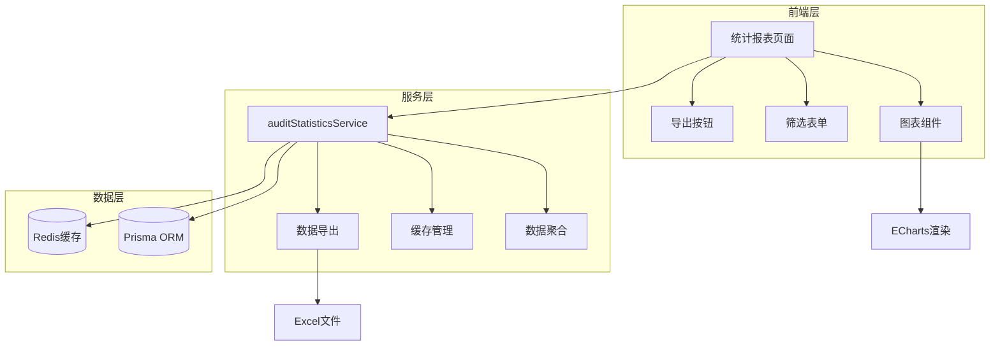

# 设计文档 - 审核统计与报表

## 概述

审核统计与报表功能为实验室管理系统提供全面的审核数据分析和可视化能力。该功能通过收集审核任务、审核历史和样品数据，计算关键性能指标（KPI），并通过ECharts图表库进行可视化展示。系统支持多维度数据筛选、实时统计更新和Excel格式数据导出。

### 设计目标

1. **数据准确性**: 确保统计数据的准确性和一致性
2. **性能优化**: 通过缓存机制提高查询性能，减少数据库负载
3. **用户体验**: 提供直观的图表展示和流畅的交互体验
4. **可扩展性**: 支持未来添加新的统计维度和图表类型

### 技术栈

- **后端**: Node.js + TypeScript + Prisma ORM
- **前端**: Vue 3 + TypeScript + Element Plus + ECharts
- **缓存**: Redis (5分钟TTL)
- **数据导出**: xlsx库 (Excel格式)

## 架构

### 系统架构图



### 数据流

1. **查询流程**:
   - 用户选择筛选条件 → 前端发送API请求
   - 后端检查Redis缓存 → 缓存命中则直接返回
   - 缓存未命中 → 查询数据库 → 计算统计指标
   - 将结果存入缓存 → 返回前端
   - 前端使用ECharts渲染图表

2. **缓存失效流程**:
   - 审核任务状态变更 → 触发缓存清除事件
   - 清除相关统计数据的缓存键
   - 下次查询时重新计算并缓存

3. **导出流程**:
   - 用户点击导出按钮 → 前端发送导出请求
   - 后端获取当前筛选条件的统计数据
   - 使用xlsx库生成Excel文件
   - 返回文件流 → 前端触发下载

## 组件和接口

### 后端组件

#### 1. AuditStatisticsService

统计服务核心类，负责数据聚合和计算。

```typescript
class AuditStatisticsService {
  // 工作量统计
  async getWorkloadStatistics(filters: StatisticsFilters): Promise<WorkloadData>
  
  // 通过率分析
  async getPassRateStatistics(filters: StatisticsFilters): Promise<PassRateData>
  
  // 时效性分析
  async getDurationStatistics(filters: StatisticsFilters): Promise<DurationData>
  
  // 问题分类统计
  async getIssueStatistics(filters: StatisticsFilters): Promise<IssueData>
  
  // 缓存管理
  private getCacheKey(type: string, filters: StatisticsFilters): string
  private getFromCache(key: string): Promise<any | null>
  private setToCache(key: string, data: any, ttl: number): Promise<void>
  async clearStatisticsCache(sampleId?: string): Promise<void>
}
```

#### 2. AuditStatisticsController

API控制器，处理HTTP请求。

```typescript
class AuditStatisticsController {
  // GET /api/statistics/audit/workload
  async getWorkload(req: Request, res: Response): Promise<void>
  
  // GET /api/statistics/audit/pass-rate
  async getPassRate(req: Request, res: Response): Promise<void>
  
  // GET /api/statistics/audit/duration
  async getDuration(req: Request, res: Response): Promise<void>
  
  // GET /api/statistics/audit/issues
  async getIssues(req: Request, res: Response): Promise<void>
  
  // POST /api/statistics/audit/export
  async exportStatistics(req: Request, res: Response): Promise<void>
}
```

#### 3. ExportService

数据导出服务，生成Excel文件。

```typescript
class ExportService {
  async exportWorkloadToExcel(data: WorkloadData, filters: StatisticsFilters): Promise<Buffer>
  async exportPassRateToExcel(data: PassRateData, filters: StatisticsFilters): Promise<Buffer>
  async exportDurationToExcel(data: DurationData, filters: StatisticsFilters): Promise<Buffer>
  async exportIssuesToExcel(data: IssueData, filters: StatisticsFilters): Promise<Buffer>
}
```

### 前端组件

#### 1. AuditStatisticsView

统计报表主页面组件。

```vue
<template>
  <div class="audit-statistics">
    <StatisticsFilters @filter-change="handleFilterChange" />
    <el-tabs v-model="activeTab">
      <el-tab-pane label="工作量统计" name="workload">
        <WorkloadChart :data="workloadData" />
        <WorkloadTable :data="workloadData" />
      </el-tab-pane>
      <el-tab-pane label="通过率分析" name="passRate">
        <PassRateChart :data="passRateData" />
        <PassRateTable :data="passRateData" />
      </el-tab-pane>
      <el-tab-pane label="时效性分析" name="duration">
        <DurationChart :data="durationData" />
        <DurationTable :data="durationData" />
      </el-tab-pane>
      <el-tab-pane label="问题分类" name="issues">
        <IssueChart :data="issueData" />
        <IssueTable :data="issueData" />
      </el-tab-pane>
    </el-tabs>
    <ExportButton @export="handleExport" />
  </div>
</template>
```

#### 2. StatisticsFilters

筛选条件组件。

```vue
<template>
  <el-form :model="filters" inline>
    <el-form-item label="时间范围">
      <el-date-picker
        v-model="filters.dateRange"
        type="daterange"
        range-separator="至"
        start-placeholder="开始日期"
        end-placeholder="结束日期"
      />
    </el-form-item>
    <el-form-item label="审核人员">
      <el-select v-model="filters.auditorId" clearable>
        <el-option v-for="auditor in auditors" :key="auditor.id" :label="auditor.name" :value="auditor.id" />
      </el-select>
    </el-form-item>
    <el-form-item label="审核级别">
      <el-select v-model="filters.level" clearable>
        <el-option label="一级审核" :value="1" />
        <el-option label="二级审核" :value="2" />
        <el-option label="三级审核" :value="3" />
      </el-select>
    </el-form-item>
    <el-form-item label="样品类型">
      <el-select v-model="filters.sampleType" clearable>
        <el-option v-for="type in sampleTypes" :key="type" :label="type" :value="type" />
      </el-select>
    </el-form-item>
    <el-form-item label="审核状态">
      <el-select v-model="filters.status" clearable>
        <el-option label="通过" value="approved" />
        <el-option label="退回" value="rejected" />
        <el-option label="待审核" value="pending" />
      </el-select>
    </el-form-item>
    <el-form-item>
      <el-button type="primary" @click="handleSearch">查询</el-button>
      <el-button @click="handleReset">重置</el-button>
    </el-form-item>
  </el-form>
</template>
```

#### 3. 图表组件

使用ECharts封装的图表组件。

```typescript
// WorkloadChart.vue - 柱状图
// PassRateChart.vue - 饼图 + 折线图
// DurationChart.vue - 箱线图 + 散点图
// IssueChart.vue - 帕累托图（柱状图 + 累积折线图）
```

### API接口定义

#### 1. 获取工作量统计

```
GET /api/statistics/audit/workload

Query Parameters:
- startDate: string (ISO 8601)
- endDate: string (ISO 8601)
- auditorId?: string
- level?: number
- sampleType?: string
- granularity?: 'day' | 'week' | 'month' | 'quarter' | 'year'

Response:
{
  "success": true,
  "data": {
    "byAuditor": [
      {
        "auditorId": "user-001",
        "auditorName": "张三",
        "totalTasks": 45,
        "completedTasks": 42,
        "pendingTasks": 3
      }
    ],
    "byTimePeriod": [
      {
        "period": "2024-03-01",
        "totalTasks": 15,
        "completedTasks": 14,
        "pendingTasks": 1
      }
    ]
  }
}
```

#### 2. 获取通过率统计

```
GET /api/statistics/audit/pass-rate

Query Parameters:
- startDate: string
- endDate: string
- level?: number
- sampleType?: string

Response:
{
  "success": true,
  "data": {
    "overall": {
      "totalTasks": 100,
      "approvedTasks": 85,
      "rejectedTasks": 15,
      "passRate": 85.0
    },
    "byLevel": [
      {
        "level": 1,
        "levelName": "一级审核",
        "totalTasks": 100,
        "approvedTasks": 90,
        "passRate": 90.0
      }
    ],
    "bySampleType": [
      {
        "sampleType": "水质",
        "totalTasks": 50,
        "approvedTasks": 45,
        "passRate": 90.0
      }
    ],
    "trend": [
      {
        "period": "2024-03",
        "passRate": 85.0
      }
    ]
  }
}
```

#### 3. 获取时效性统计

```
GET /api/statistics/audit/duration

Query Parameters:
- startDate: string
- endDate: string
- auditorId?: string
- level?: number

Response:
{
  "success": true,
  "data": {
    "overall": {
      "averageDuration": 4.5,
      "medianDuration": 3.8,
      "maxDuration": 12.0,
      "minDuration": 0.5,
      "overtimeTasks": 5,
      "overtimeRate": 5.0
    },
    "byAuditor": [
      {
        "auditorId": "user-001",
        "auditorName": "张三",
        "averageDuration": 3.2,
        "taskCount": 45
      }
    ],
    "distribution": [
      {
        "range": "0-2小时",
        "count": 30
      },
      {
        "range": "2-4小时",
        "count": 45
      }
    ]
  }
}
```

#### 4. 获取问题分类统计

```
GET /api/statistics/audit/issues

Query Parameters:
- startDate: string
- endDate: string
- sampleType?: string

Response:
{
  "success": true,
  "data": {
    "byReason": [
      {
        "reason": "数据录入错误",
        "count": 25,
        "percentage": 50.0
      },
      {
        "reason": "检测方法不当",
        "count": 15,
        "percentage": 30.0
      }
    ],
    "bySampleType": [
      {
        "sampleType": "水质",
        "issueCount": 20,
        "totalTasks": 50,
        "issueRate": 40.0
      }
    ]
  }
}
```

#### 5. 导出统计数据

```
POST /api/statistics/audit/export

Request Body:
{
  "type": "workload" | "passRate" | "duration" | "issues",
  "filters": {
    "startDate": "2024-03-01T00:00:00Z",
    "endDate": "2024-03-31T23:59:59Z",
    "auditorId": "user-001",
    "level": 1,
    "sampleType": "水质"
  }
}

Response:
Content-Type: application/vnd.openxmlformats-officedocument.spreadsheetml.sheet
Content-Disposition: attachment; filename="audit-statistics-workload-20240315.xlsx"

[Binary Excel file data]
```

## 数据模型

### 统计数据类型定义

```typescript
// 筛选条件
interface StatisticsFilters {
  startDate: Date
  endDate: Date
  auditorId?: string
  level?: number
  sampleType?: string
  status?: 'approved' | 'rejected' | 'pending'
  granularity?: 'day' | 'week' | 'month' | 'quarter' | 'year'
}

// 工作量统计数据
interface WorkloadData {
  byAuditor: Array<{
    auditorId: string
    auditorName: string
    totalTasks: number
    completedTasks: number
    pendingTasks: number
  }>
  byTimePeriod: Array<{
    period: string
    totalTasks: number
    completedTasks: number
    pendingTasks: number
  }>
}

// 通过率统计数据
interface PassRateData {
  overall: {
    totalTasks: number
    approvedTasks: number
    rejectedTasks: number
    passRate: number
  }
  byLevel: Array<{
    level: number
    levelName: string
    totalTasks: number
    approvedTasks: number
    passRate: number
  }>
  bySampleType: Array<{
    sampleType: string
    totalTasks: number
    approvedTasks: number
    passRate: number
  }>
  trend: Array<{
    period: string
    passRate: number
  }>
}

// 时效性统计数据
interface DurationData {
  overall: {
    averageDuration: number
    medianDuration: number
    maxDuration: number
    minDuration: number
    overtimeTasks: number
    overtimeRate: number
  }
  byAuditor: Array<{
    auditorId: string
    auditorName: string
    averageDuration: number
    taskCount: number
  }>
  distribution: Array<{
    range: string
    count: number
  }>
}

// 问题分类统计数据
interface IssueData {
  byReason: Array<{
    reason: string
    count: number
    percentage: number
  }>
  bySampleType: Array<{
    sampleType: string
    issueCount: number
    totalTasks: number
    issueRate: number
  }>
}
```

### 数据库查询策略

由于统计功能主要基于现有的 `AuditTask`、`AuditHistory` 和 `Sample` 模型，不需要新增数据库表。查询策略如下：

1. **工作量统计**: 
   - 查询 `AuditTask` 表，按 `auditorId` 和时间范围分组聚合
   - 使用 `status` 字段区分完成和待处理任务

2. **通过率统计**:
   - 查询 `AuditTask` 表，按 `level` 和 `sampleType` 分组
   - 使用 `decision` 字段统计通过和退回数量

3. **时效性统计**:
   - 查询 `AuditTask` 表，计算 `completedAt - submittedAt` 的时间差
   - 使用聚合函数计算平均值、中位数等

4. **问题分类统计**:
   - 查询 `AuditTask` 表，筛选 `decision = 'REJECT'` 的记录
   - 从 `comments` 字段提取退回原因并分类统计

### 缓存键设计

```typescript
// 缓存键格式: audit:stats:{type}:{hash(filters)}
// 示例:
// - audit:stats:workload:a1b2c3d4
// - audit:stats:passRate:e5f6g7h8
// - audit:stats:duration:i9j0k1l2
// - audit:stats:issues:m3n4o5p6

function generateCacheKey(type: string, filters: StatisticsFilters): string {
  const filterString = JSON.stringify(filters)
  const hash = crypto.createHash('md5').update(filterString).digest('hex').substring(0, 8)
  return `audit:stats:${type}:${hash}`
}
```


## 正确性属性

*属性是一个特征或行为，应该在系统的所有有效执行中保持为真——本质上是关于系统应该做什么的形式化陈述。属性作为人类可读规范和机器可验证正确性保证之间的桥梁。*

### 属性 1: 工作量统计数据完整性

*对于任何*时间段和审核人员集合，工作量统计返回的数据应该包含每个审核人员的姓名、总任务数、完成任务数和待处理任务数，且完成任务数加待处理任务数应等于总任务数。

**验证需求: 1.1, 1.3**

### 属性 2: 时间粒度支持

*对于任何*有效的时间粒度参数（日、周、月、季度、年），统计系统应该能够按该粒度正确聚合数据并返回结果。

**验证需求: 1.2**

### 属性 3: 通过率计算正确性

*对于任何*审核任务集合，通过率应该等于（通过任务数 / 总任务数）× 100，且结果应该在 0 到 100 之间。

**验证需求: 2.1**

### 属性 4: 分组统计一致性

*对于任何*按维度（审核级别或样品类型）分组的统计数据，所有分组的任务总数之和应该等于整体的任务总数。

**验证需求: 2.2, 2.3**

### 属性 5: 警告阈值标记

*对于任何*通过率数据，当通过率低于配置的阈值时，该数据项应该被标记为警告状态。

**验证需求: 2.5**

### 属性 6: 平均时长计算

*对于任何*已完成的审核任务集合，平均完成时长应该等于所有任务时长的算术平均值。

**验证需求: 3.1**

### 属性 7: 超时任务统计

*对于任何*审核任务集合和时限阈值，超时任务数量应该等于时长超过阈值的任务数量，超时率应该等于（超时任务数 / 总任务数）× 100。

**验证需求: 3.2**

### 属性 8: 按审核人员的时长统计

*对于任何*审核人员，其平均审核时长应该等于该审核人员所有已完成任务时长的算术平均值。

**验证需求: 3.3**

### 属性 9: 时长计算逻辑

*对于任何*审核任务，如果任务已完成，时长应该使用 completedAt - submittedAt；如果任务未完成，时长应该使用 currentTime - submittedAt。

**验证需求: 3.5, 3.6**

### 属性 10: 问题分类计数

*对于任何*退回原因集合，每种原因的出现次数应该等于该原因在所有退回任务中出现的实际次数。

**验证需求: 4.1**

### 属性 11: 问题分类排序

*对于任何*问题分类统计结果，退回原因应该按出现次数降序排列。

**验证需求: 4.2**

### 属性 12: 筛选条件应用

*对于任何*筛选条件组合（时间范围、审核人员、审核级别、样品类型、审核状态），统计结果应该只包含满足所有筛选条件的审核任务数据。

**验证需求: 7.1, 7.2, 7.3, 7.4, 7.5**

### 属性 13: 自定义原因归类

*对于任何*退回原因，如果该原因不在预定义的原因列表中，应该被归类为"其他"类别。

**验证需求: 4.5**

### 属性 14: Excel导出格式

*对于任何*统计数据，导出的Excel文件应该是有效的XLSX格式，包含数据表格，且文件名应该包含统计类型和时间戳。

**验证需求: 6.1, 6.2, 6.3**

### 属性 15: 导出错误处理

*对于任何*导出操作，如果发生错误，系统应该返回错误响应并在日志中记录错误详情。

**验证需求: 6.6**

### 属性 16: 缓存存储行为

*对于任何*首次查询的统计数据，结果应该被存入缓存，TTL设置为5分钟（300秒）。

**验证需求: 8.1**

### 属性 17: 缓存失效机制

*对于任何*审核任务的状态变更，相关的统计缓存应该被清除。

**验证需求: 8.2**

### 属性 18: 缓存键完整性

*对于任何*统计查询，生成的缓存键应该包含统计类型和所有筛选条件参数的哈希值。

**验证需求: 8.4**

### 属性 19: 缓存降级处理

*对于任何*统计查询，当缓存服务不可用时，系统应该直接查询数据库并在日志中记录警告。

**验证需求: 8.5**

### 属性 20: 输入验证

*对于任何*包含无效时间范围参数的API请求，系统应该返回400状态码和描述性错误消息。

**验证需求: 9.5**

### 属性 21: 权限验证

*对于任何*无统计查看权限的用户请求，系统应该返回403状态码。

**验证需求: 9.6**

## 错误处理

### 错误类型和处理策略

#### 1. 输入验证错误

**错误场景**:
- 时间范围无效（开始时间晚于结束时间）
- 时间粒度参数无效
- 审核人员ID不存在
- 审核级别超出范围

**处理策略**:
```typescript
// 返回 400 Bad Request
{
  "success": false,
  "error": {
    "code": "INVALID_INPUT",
    "message": "时间范围无效：开始时间不能晚于结束时间",
    "field": "dateRange"
  }
}
```

#### 2. 权限错误

**错误场景**:
- 用户无统计查看权限
- 用户尝试查看其他人员的统计数据（如果有权限限制）

**处理策略**:
```typescript
// 返回 403 Forbidden
{
  "success": false,
  "error": {
    "code": "PERMISSION_DENIED",
    "message": "您没有权限查看统计数据"
  }
}
```

#### 3. 数据库查询错误

**错误场景**:
- 数据库连接失败
- 查询超时
- SQL语法错误

**处理策略**:
```typescript
// 记录详细错误日志
logger.error('统计数据查询失败', {
  error: error.message,
  stack: error.stack,
  filters: filters
})

// 返回 500 Internal Server Error
{
  "success": false,
  "error": {
    "code": "DATABASE_ERROR",
    "message": "统计数据查询失败，请稍后重试"
  }
}
```

#### 4. 缓存服务错误

**错误场景**:
- Redis连接失败
- 缓存读写超时

**处理策略**:
```typescript
// 降级处理：直接查询数据库
logger.warn('缓存服务不可用，降级到数据库查询', {
  cacheKey: key,
  error: error.message
})

// 继续执行查询，不影响用户请求
const data = await this.queryFromDatabase(filters)
return data
```

#### 5. 导出错误

**错误场景**:
- Excel文件生成失败
- 文件写入失败
- 内存不足

**处理策略**:
```typescript
// 记录错误日志
logger.error('数据导出失败', {
  error: error.message,
  type: exportType,
  filters: filters
})

// 返回 500 Internal Server Error
{
  "success": false,
  "error": {
    "code": "EXPORT_ERROR",
    "message": "数据导出失败，请稍后重试"
  }
}
```

#### 6. 数据为空

**错误场景**:
- 筛选条件下没有数据
- 时间范围内没有审核任务

**处理策略**:
```typescript
// 返回空结果集，不视为错误
{
  "success": true,
  "data": {
    "byAuditor": [],
    "byTimePeriod": []
  },
  "message": "所选时间段内无审核数据"
}
```

### 错误日志记录

所有错误都应该记录到日志系统，包含以下信息：

```typescript
logger.error('操作失败', {
  operation: 'getWorkloadStatistics',
  userId: req.user.id,
  filters: filters,
  error: {
    message: error.message,
    stack: error.stack,
    code: error.code
  },
  timestamp: new Date().toISOString()
})
```

## 测试策略

### 双重测试方法

本功能采用单元测试和基于属性的测试相结合的方法，确保全面的测试覆盖。

#### 单元测试

单元测试专注于特定示例、边界情况和错误条件：

1. **API端点测试**:
   - 测试每个统计API端点返回正确的数据结构
   - 测试权限验证和输入验证
   - 测试错误响应格式

2. **边界情况测试**:
   - 空数据集的处理
   - 单个数据点的统计
   - 极大数据量的处理

3. **错误条件测试**:
   - 无效输入参数
   - 数据库连接失败
   - 缓存服务不可用

4. **集成测试**:
   - 前后端API集成
   - 缓存与数据库的交互
   - Excel导出功能

#### 基于属性的测试

基于属性的测试验证通用属性在所有输入下的正确性：

**测试库**: 使用 `fast-check` (JavaScript/TypeScript的属性测试库)

**测试配置**: 每个属性测试运行最少100次迭代

**测试标签格式**:
```typescript
// Feature: audit-statistics-reports, Property 1: 工作量统计数据完整性
test('工作量统计数据完整性', async () => {
  await fc.assert(
    fc.asyncProperty(
      // 生成器定义
      fc.record({
        auditors: fc.array(auditorGenerator, { minLength: 1, maxLength: 10 }),
        tasks: fc.array(auditTaskGenerator, { minLength: 0, maxLength: 100 }),
        dateRange: dateRangeGenerator
      }),
      async ({ auditors, tasks, dateRange }) => {
        // 属性验证逻辑
        const result = await statisticsService.getWorkloadStatistics({
          startDate: dateRange.start,
          endDate: dateRange.end
        })
        
        // 验证数据完整性
        for (const auditorData of result.byAuditor) {
          expect(auditorData).toHaveProperty('auditorId')
          expect(auditorData).toHaveProperty('auditorName')
          expect(auditorData).toHaveProperty('totalTasks')
          expect(auditorData).toHaveProperty('completedTasks')
          expect(auditorData).toHaveProperty('pendingTasks')
          
          // 验证数学关系
          expect(auditorData.completedTasks + auditorData.pendingTasks)
            .toBe(auditorData.totalTasks)
        }
      }
    ),
    { numRuns: 100 }
  )
})
```

### 测试数据生成器

为属性测试定义数据生成器：

```typescript
// 审核人员生成器
const auditorGenerator = fc.record({
  id: fc.uuid(),
  name: fc.string({ minLength: 2, maxLength: 20 })
})

// 审核任务生成器
const auditTaskGenerator = fc.record({
  id: fc.uuid(),
  sampleId: fc.uuid(),
  level: fc.integer({ min: 1, max: 3 }),
  auditorId: fc.uuid(),
  status: fc.constantFrom('PENDING', 'IN_PROGRESS', 'APPROVED', 'REJECTED'),
  decision: fc.option(fc.constantFrom('APPROVE', 'REJECT', 'RETURN')),
  submittedAt: fc.date({ min: new Date('2024-01-01'), max: new Date() }),
  completedAt: fc.option(fc.date({ min: new Date('2024-01-01'), max: new Date() })),
  comments: fc.option(fc.string({ maxLength: 200 }))
})

// 时间范围生成器
const dateRangeGenerator = fc.record({
  start: fc.date({ min: new Date('2024-01-01'), max: new Date() }),
  end: fc.date({ min: new Date('2024-01-01'), max: new Date() })
}).filter(range => range.start <= range.end)

// 筛选条件生成器
const filtersGenerator = fc.record({
  startDate: fc.date({ min: new Date('2024-01-01'), max: new Date() }),
  endDate: fc.date({ min: new Date('2024-01-01'), max: new Date() }),
  auditorId: fc.option(fc.uuid()),
  level: fc.option(fc.integer({ min: 1, max: 3 })),
  sampleType: fc.option(fc.constantFrom('水质', '土壤', '空气', '食品')),
  status: fc.option(fc.constantFrom('approved', 'rejected', 'pending'))
}).filter(f => f.startDate <= f.endDate)
```

### 测试覆盖目标

- **代码覆盖率**: 目标 ≥ 80%
- **分支覆盖率**: 目标 ≥ 75%
- **属性测试**: 每个正确性属性至少一个测试
- **单元测试**: 每个公共方法至少一个测试

### 性能测试

虽然不在属性测试范围内，但应该进行性能基准测试：

1. **查询性能**:
   - 无缓存情况下的查询时间 < 2秒
   - 有缓存情况下的查询时间 < 100毫秒

2. **导出性能**:
   - 1000条记录的导出时间 < 5秒
   - 10000条记录的导出时间 < 30秒

3. **并发测试**:
   - 支持10个并发查询请求
   - 缓存命中率 > 70%

### 测试执行

```bash
# 运行所有测试
npm test

# 运行单元测试
npm run test:unit

# 运行属性测试
npm run test:property

# 运行集成测试
npm run test:integration

# 生成覆盖率报告
npm run test:coverage
```

## 实现注意事项

### 1. 性能优化

- **数据库查询优化**: 使用索引、避免N+1查询、使用聚合函数
- **缓存策略**: 合理设置TTL，避免缓存雪崩
- **分页处理**: 对大数据量结果进行分页
- **异步处理**: 导出大文件时使用异步任务队列

### 2. 数据一致性

- **事务处理**: 缓存清除与数据更新保持一致
- **时区处理**: 统一使用UTC时间，前端转换为本地时间
- **精度控制**: 百分比保留一位小数，时长保留一位小数

### 3. 安全性

- **权限控制**: 验证用户是否有统计查看权限
- **数据隔离**: 根据用户权限过滤可见数据
- **SQL注入防护**: 使用参数化查询
- **XSS防护**: 对用户输入进行转义

### 4. 可维护性

- **代码复用**: 提取公共的统计计算逻辑
- **配置化**: 将阈值、时限等参数配置化
- **日志记录**: 记录关键操作和错误信息
- **文档完善**: 维护API文档和代码注释

### 5. 扩展性

- **插件化图表**: 支持添加新的图表类型
- **自定义统计**: 支持用户自定义统计维度
- **多语言支持**: 预留国际化接口
- **主题定制**: 支持图表主题配置

## 部署和监控

### 部署清单

1. **后端部署**:
   - 添加统计API路由
   - 部署统计服务代码
   - 配置Redis缓存
   - 更新API文档

2. **前端部署**:
   - 添加统计报表页面
   - 集成ECharts库
   - 配置路由和权限
   - 更新用户手册

3. **数据库**:
   - 验证现有索引是否满足查询需求
   - 如需要，添加新的索引

### 监控指标

1. **性能指标**:
   - API响应时间（P50, P95, P99）
   - 缓存命中率
   - 数据库查询时间
   - 导出操作耗时

2. **业务指标**:
   - 统计查询次数
   - 导出操作次数
   - 各类型统计的使用频率
   - 错误率

3. **资源指标**:
   - CPU使用率
   - 内存使用率
   - Redis内存使用
   - 数据库连接数

### 告警规则

- API响应时间 > 5秒
- 错误率 > 5%
- 缓存命中率 < 50%
- Redis内存使用 > 80%

## 未来改进

1. **实时统计**: 使用WebSocket推送实时统计更新
2. **自定义报表**: 支持用户自定义统计维度和图表
3. **数据对比**: 支持不同时间段的数据对比
4. **预测分析**: 基于历史数据进行趋势预测
5. **移动端适配**: 优化移动端的图表展示
6. **PDF导出**: 支持导出PDF格式的统计报告
7. **定时报表**: 支持定时生成和发送统计报表
8. **数据钻取**: 支持从汇总数据钻取到明细数据
