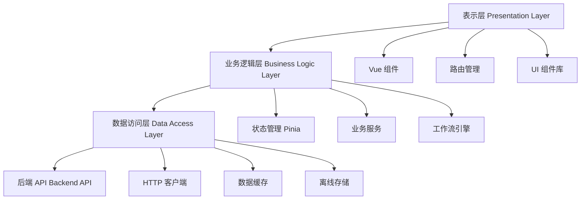
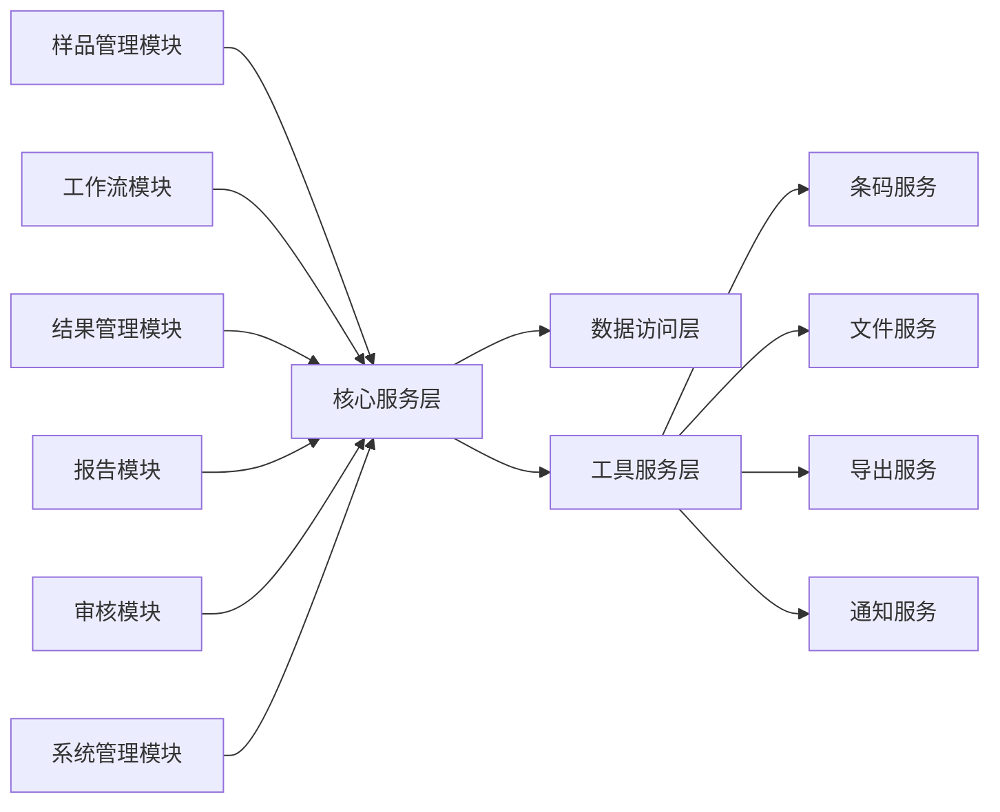
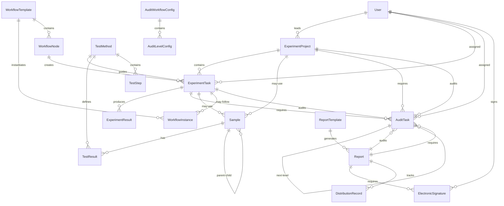
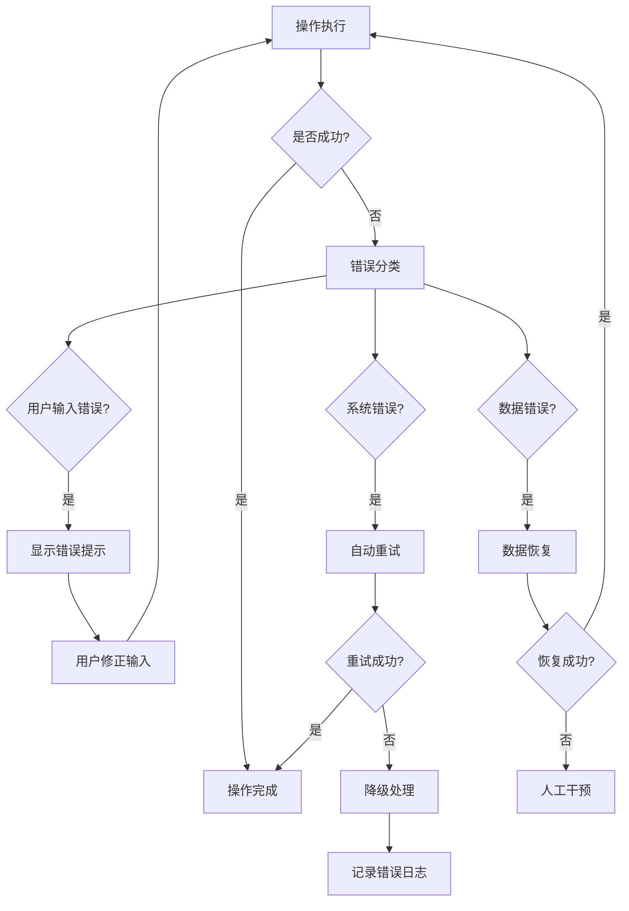

# 技术设计文档 - 实验室智能管理系统

## 概述

实验室智能管理系统是一个基于 Vue 3 + TypeScript 的现代化前端应用，采用组件化架构设计，为实验室提供全面的样品管理、检测流程控制、结果处理、质量审核和报告发布功能。系统支持样品全生命周期追踪、可配置化工作流、多级审核机制和自动化报告生成。

### 核心特性

- **样品全生命周期管理**：从登记、分样、检测到放行的完整追踪
- **可配置化工作流**：支持拖拽式工作流设计和动态节点控制
- **智能结果处理**：支持手工录入、自动导入和公式计算
- **多级审核机制**：灵活的审核流程配置和质量判定
- **电子签名报告**：标准化报告模板和电子签名功能
- **权限管理**：基于角色的细粒度权限控制
- **审计追溯**：完整的操作日志和审计功能

### 技术栈

- **前端框架**：Vue 3 + Composition API
- **类型系统**：TypeScript
- **状态管理**：Pinia
- **路由管理**：Vue Router 4
- **UI 组件库**：Element Plus
- **构建工具**：Vite
- **样式预处理**：SCSS
- **图表库**：ECharts
- **条码生成**：JsBarcode
- **PDF 生成**：jsPDF
- **Excel 处理**：SheetJS

## 架构

### 整体架构

系统采用分层架构设计，包含以下层次：



### 模块架构



### 前端架构模式

采用 **MVVM (Model-View-ViewModel)** 架构模式：

- **Model**：数据模型和业务逻辑，通过 Pinia Store 管理
- **View**：Vue 组件，负责 UI 渲染和用户交互
- **ViewModel**：Composition API 函数，连接 View 和 Model

## 组件和接口

### 核心组件结构

```
src/
├── components/           # 通用组件
│   ├── common/          # 基础组件
│   ├── forms/           # 表单组件
│   ├── charts/          # 图表组件
│   └── workflow/        # 工作流组件
├── views/               # 页面组件
│   ├── sample/          # 样品管理
│   ├── workflow/        # 工作流管理
│   ├── result/          # 结果管理
│   ├── audit/           # 审核管理
│   ├── report/          # 报告管理
│   └── system/          # 系统管理
├── stores/              # 状态管理
├── services/            # 业务服务
├── utils/               # 工具函数
└── types/               # 类型定义
```

### 主要组件接口

#### 样品管理组件

```typescript
// SampleRegistration.vue - 样品登记组件
interface SampleRegistrationProps {
  mode?: 'create' | 'edit'
  sampleId?: string
}

interface SampleRegistrationEmits {
  (e: 'submit', sample: Sample): void
  (e: 'cancel'): void
}

// SampleDetail.vue - 样品详情组件
interface SampleDetailProps {
  sampleId: string
  readonly?: boolean
}

// BarcodeDisplay.vue - 条码显示组件
interface BarcodeDisplayProps {
  code: string
  format?: 'CODE128' | 'CODE39' | 'EAN13'
  width?: number
  height?: number
  displayValue?: boolean
}
```

#### 工作流组件

```typescript
// WorkflowDesigner.vue - 工作流设计器
interface WorkflowDesignerProps {
  workflowId?: string
  readonly?: boolean
}

interface WorkflowDesignerEmits {
  (e: 'save', workflow: WorkflowTemplate): void
  (e: 'validate', isValid: boolean): void
}

// NodeConfig.vue - 节点配置组件
interface NodeConfigProps {
  node: WorkflowNode
  nodeTypes: NodeType[]
}

interface NodeConfigEmits {
  (e: 'update', node: WorkflowNode): void
  (e: 'delete', nodeId: string): void
}
```

#### 结果管理组件

```typescript
// ResultImport.vue - 结果导入组件
interface ResultImportProps {
  sampleId: string
  testMethod: TestMethod
}

interface ResultImportEmits {
  (e: 'imported', results: TestResult[]): void
  (e: 'error', error: ImportError): void
}

// FormulaEditor.vue - 公式编辑器
interface FormulaEditorProps {
  formula?: string
  variables: FormulaVariable[]
  readonly?: boolean
}

interface FormulaEditorEmits {
  (e: 'change', formula: string): void
  (e: 'validate', isValid: boolean): void
}
```

### API 接口设计

#### 样品管理 API

```typescript
interface SampleAPI {
  // 样品 CRUD
  createSample(sample: CreateSampleRequest): Promise<Sample>
  getSample(id: string): Promise<Sample>
  updateSample(id: string, updates: UpdateSampleRequest): Promise<Sample>
  deleteSample(id: string): Promise<void>
  
  // 样品操作
  splitSample(id: string, splitInfo: SplitSampleRequest): Promise<Sample[]>
  mergeSamples(sampleIds: string[], mergeInfo: MergeSampleRequest): Promise<Sample>
  transferSample(id: string, transferInfo: TransferRequest): Promise<void>
  
  // 样品查询
  searchSamples(criteria: SearchCriteria): Promise<PaginatedResult<Sample>>
  getSampleHistory(id: string): Promise<SampleHistory[]>
  getSamplesByBarcode(barcode: string): Promise<Sample>
}
```

#### 工作流管理 API

```typescript
interface WorkflowAPI {
  // 工作流模板
  createWorkflowTemplate(template: CreateWorkflowTemplateRequest): Promise<WorkflowTemplate>
  getWorkflowTemplate(id: string): Promise<WorkflowTemplate>
  updateWorkflowTemplate(id: string, updates: UpdateWorkflowTemplateRequest): Promise<WorkflowTemplate>
  deleteWorkflowTemplate(id: string): Promise<void>
  
  // 工作流实例
  startWorkflow(sampleId: string, templateId: string): Promise<WorkflowInstance>
  getWorkflowInstance(id: string): Promise<WorkflowInstance>
  completeNode(instanceId: string, nodeId: string, data: NodeCompletionData): Promise<void>
  
  // 任务管理
  getTaskList(userId: string, filters: TaskFilters): Promise<PaginatedResult<Task>>
  assignTask(taskId: string, userId: string): Promise<void>
  completeTask(taskId: string, result: TaskResult): Promise<void>
}
```

#### 审核管理 API

```typescript
interface AuditAPI {
  // 审核任务管理
  getAuditTasks(filters: AuditTaskFilters): Promise<PaginatedResult<AuditTask>>
  getAuditTask(id: string): Promise<AuditTask>
  assignAuditTask(taskId: string, userId: string): Promise<void>
  startAudit(taskId: string): Promise<void>
  
  // 审核执行
  submitAuditResult(taskId: string, result: AuditResult): Promise<void>
  returnForRevision(taskId: string, reason: string, issues: AuditIssue[]): Promise<void>
  approveWithConditions(taskId: string, conditions: string[], result: AuditResult): Promise<void>
  
  // 审核配置
  getAuditWorkflowConfigs(): Promise<AuditWorkflowConfig[]>
  createAuditWorkflowConfig(config: CreateAuditWorkflowConfigRequest): Promise<AuditWorkflowConfig>
  updateAuditWorkflowConfig(id: string, updates: UpdateAuditWorkflowConfigRequest): Promise<AuditWorkflowConfig>
  
  // 审核统计
  getAuditStatistics(filters: StatisticsFilters): Promise<AuditStatistics>
  getAuditHistory(taskId: string): Promise<AuditTask[]>  // 获取某任务的所有审核记录
  getAuditorWorkload(userId: string, dateRange: DateRange): Promise<AuditorWorkload>
}

interface AuditTaskFilters {
  status?: AuditStatus[]
  auditType?: AuditType[]
  assignedTo?: string
  sampleId?: string
  taskId?: string
  auditLevel?: number
  priority?: AuditPriority[]
  dateRange?: DateRange
}
```

## 数据模型

### 核心数据模型

#### 样品模型

```typescript
interface Sample {
  id: string
  barcode: string
  name: string
  source: string
  client: string
  receivedDate: Date
  status: SampleStatus
  location: SampleLocation
  storageConditions: StorageConditions
  parentSampleId?: string  // 分样时的母样品ID
  childSampleIds: string[] // 子样品ID列表
  mergedFromIds: string[]  // 合样来源ID列表
  properties: Record<string, any>
  createdAt: Date
  updatedAt: Date
  createdBy: string
}

enum SampleStatus {
  REGISTERED = 'registered',
  IN_PROGRESS = 'in_progress',
  TESTING = 'testing',
  UNDER_REVIEW = 'under_review',
  COMPLETED = 'completed',
  RELEASED = 'released',
  RETURNED = 'returned',
  RETAINED = 'retained'
}

interface SampleLocation {
  area: string
  shelf?: string
  position?: string
  building?: string
  room?: string
}

interface StorageConditions {
  temperature?: number
  humidity?: number
  lightCondition?: 'dark' | 'normal' | 'protected'
  specialRequirements?: string[]
}
```

#### 工作流模型

```typescript
interface WorkflowTemplate {
  id: string
  name: string
  description: string
  version: string
  sampleTypes: string[]
  nodes: WorkflowNode[]
  edges: WorkflowEdge[]
  isActive: boolean
  createdAt: Date
  updatedAt: Date
  createdBy: string
}

interface WorkflowNode {
  id: string
  type: NodeType
  name: string
  description: string
  position: { x: number; y: number }
  config: NodeConfig
  requiredRoles: string[]
  estimatedDuration?: number
}

enum NodeType {
  START = 'start',
  END = 'end',
  TASK = 'task',
  DECISION = 'decision',
  PARALLEL = 'parallel',
  MERGE = 'merge',
  WAIT = 'wait'
}

interface WorkflowEdge {
  id: string
  sourceNodeId: string
  targetNodeId: string
  condition?: string
  label?: string
}

interface WorkflowInstance {
  id: string
  templateId: string
  sampleId: string
  status: WorkflowStatus
  currentNodeIds: string[]
  completedNodeIds: string[]
  startedAt: Date
  completedAt?: Date
  variables: Record<string, any>
}

enum WorkflowStatus {
  RUNNING = 'running',
  COMPLETED = 'completed',
  SUSPENDED = 'suspended',
  TERMINATED = 'terminated'
}
```

#### 检测结果模型

```typescript
interface TestResult {
  id: string
  sampleId: string
  testMethodId: string
  testItemId: string
  rawValue: number | string
  calculatedValue?: number
  unit: string
  isAnomalous: boolean
  anomalyReason?: string
  source: ResultSource
  formula?: string
  qualityJudgment?: QualityJudgment
  createdAt: Date
  updatedAt: Date
  createdBy: string
}

enum ResultSource {
  MANUAL = 'manual',
  INSTRUMENT = 'instrument',
  CALCULATED = 'calculated'
}

interface QualityJudgment {
  result: 'qualified' | 'unqualified' | 'pending'
  criteria: string
  judgedBy: string
  judgedAt: Date
  comments?: string
}

interface TestMethod {
  id: string
  name: string
  code: string
  description: string
  steps: TestStep[]
  requiredEquipment: string[]
  estimatedDuration: number
  sopDocuments: Document[]
  version: string
  isActive: boolean
}

interface TestStep {
  id: string
  order: number
  name: string
  description: string
  instructions: string
  requiredData: DataField[]
  validationRules: ValidationRule[]
}
```

#### 实验项目模型

```typescript
// 实验项目 - 最顶层的工作单元
interface ExperimentProject {
  id: string
  projectNumber: string  // 项目编号
  name: string
  description: string
  projectType: ProjectType
  category: string  // 项目类别（可自定义）
  status: ProjectStatus
  priority: ProjectPriority
  
  // 关联信息
  sampleIds?: string[]  // 关联的样品（可选，某些项目可能不涉及样品）
  clientId?: string  // 委托方（可选）
  departmentId?: string  // 所属部门
  
  // 项目元数据
  objectives: string[]  // 项目目标
  expectedResults: string  // 预期结果
  methodology?: string  // 实验方法/方案
  references?: string[]  // 参考文献/标准
  
  // 时间管理
  plannedStartDate?: Date
  plannedEndDate?: Date
  actualStartDate?: Date
  actualEndDate?: Date
  
  // 资源管理
  budget?: number
  estimatedHours?: number
  actualHours?: number
  requiredEquipment?: string[]
  requiredMaterials?: string[]
  
  // 人员管理
  principalInvestigator: string  // 项目负责人
  teamMembers: string[]  // 团队成员
  
  createdAt: Date
  updatedAt: Date
  createdBy: string
}

enum ProjectType {
  // 检测分析类
  TESTING_ANALYSIS = 'testing_analysis',           // 检测分析
  QUALITY_CONTROL = 'quality_control',             // 质量控制
  
  // 研发类
  RESEARCH_DEVELOPMENT = 'research_development',   // 研发实验
  METHOD_DEVELOPMENT = 'method_development',       // 方法开发
  PRODUCT_DEVELOPMENT = 'product_development',     // 产品开发
  PROCESS_OPTIMIZATION = 'process_optimization',   // 工艺优化
  
  // 验证类
  METHOD_VALIDATION = 'method_validation',         // 方法验证
  EQUIPMENT_VALIDATION = 'equipment_validation',   // 设备验证
  SYSTEM_VALIDATION = 'system_validation',         // 系统验证
  
  // 研究类
  STABILITY_STUDY = 'stability_study',             // 稳定性研究
  COMPATIBILITY_STUDY = 'compatibility_study',     // 相容性研究
  COMPARATIVE_STUDY = 'comparative_study',         // 对比研究
  FEASIBILITY_STUDY = 'feasibility_study',         // 可行性研究
  
  // 合成制备类
  SYNTHESIS = 'synthesis',                         // 化学合成
  PREPARATION = 'preparation',                     // 材料制备
  FORMULATION = 'formulation',                     // 配方研究
  
  // 培养类
  MICROBIAL_CULTURE = 'microbial_culture',         // 微生物培养
  CELL_CULTURE = 'cell_culture',                   // 细胞培养
  
  // 标定校准类
  CALIBRATION = 'calibration',                     // 仪器标定
  STANDARDIZATION = 'standardization',             // 标准化
  
  // 其他
  PILOT_EXPERIMENT = 'pilot_experiment',           // 预实验
  EXPLORATORY = 'exploratory',                     // 探索性实验
  REPRODUCIBILITY = 'reproducibility',             // 重复性验证
  CUSTOM = 'custom'                                // 自定义类型
}

enum ProjectStatus {
  DRAFT = 'draft',                    // 草稿
  PLANNED = 'planned',                // 已计划
  APPROVED = 'approved',              // 已批准
  IN_PROGRESS = 'in_progress',        // 进行中
  ON_HOLD = 'on_hold',                // 暂停
  UNDER_REVIEW = 'under_review',      // 审核中
  COMPLETED = 'completed',            // 已完成
  CANCELLED = 'cancelled',            // 已取消
  ARCHIVED = 'archived'               // 已归档
}

enum ProjectPriority {
  LOW = 'low',
  NORMAL = 'normal',
  HIGH = 'high',
  URGENT = 'urgent',
  CRITICAL = 'critical'
}

// 实验任务 - 项目下的具体执行单元
interface ExperimentTask {
  id: string
  projectId: string  // 所属项目
  taskNumber: string  // 任务编号
  name: string
  description: string
  taskType: TaskType
  status: TaskStatus
  priority: TaskPriority
  
  // 工作流关联（可选）
  workflowInstanceId?: string
  workflowNodeId?: string
  
  // 样品关联（可选）
  sampleIds?: string[]
  
  // 方法关联（可选）
  methodId?: string  // 实验方法/检测方法/操作规程
  protocolId?: string  // 实验方案
  
  // 执行信息
  assignedTo?: string
  assignedAt?: Date
  startedAt?: Date
  completedAt?: Date
  dueDate?: Date
  estimatedDuration?: number  // 预计耗时（小时）
  actualDuration?: number  // 实际耗时（小时）
  
  // 结果数据
  results?: ExperimentResult[]  // 实验结果（通用结构）
  observations?: string  // 实验观察记录
  conclusions?: string  // 结论
  
  // 资源使用
  equipmentUsed?: string[]  // 使用的仪器设备
  materialsUsed?: MaterialUsage[]  // 使用的材料试剂
  
  // 附件
  attachments?: Document[]
  rawDataFiles?: string[]  // 原始数据文件
  
  createdAt: Date
  updatedAt: Date
  createdBy: string
}

enum TaskType {
  // 准备类
  SAMPLE_PREPARATION = 'sample_preparation',       // 样品前处理
  REAGENT_PREPARATION = 'reagent_preparation',     // 试剂配制
  EQUIPMENT_SETUP = 'equipment_setup',             // 设备准备
  
  // 实验操作类
  TESTING = 'testing',                             // 检测测试
  SYNTHESIS = 'synthesis',                         // 合成反应
  EXTRACTION = 'extraction',                       // 提取分离
  PURIFICATION = 'purification',                   // 纯化
  CULTURE = 'culture',                             // 培养
  INCUBATION = 'incubation',                       // 孵育
  OBSERVATION = 'observation',                     // 观察记录
  MEASUREMENT = 'measurement',                     // 测量
  
  // 数据处理类
  DATA_COLLECTION = 'data_collection',             // 数据采集
  DATA_ENTRY = 'data_entry',                       // 数据录入
  DATA_ANALYSIS = 'data_analysis',                 // 数据分析
  CALCULATION = 'calculation',                     // 计算
  STATISTICAL_ANALYSIS = 'statistical_analysis',   // 统计分析
  
  // 审核类
  REVIEW = 'review',                               // 审核
  APPROVAL = 'approval',                           // 批准
  VERIFICATION = 'verification',                   // 验证
  
  // 文档类
  REPORT_GENERATION = 'report_generation',         // 报告生成
  DOCUMENTATION = 'documentation',                 // 文档编制
  
  // 其他
  CUSTOM = 'custom'                                // 自定义任务类型
}

enum TaskStatus {
  PENDING = 'pending',
  ASSIGNED = 'assigned',
  IN_PROGRESS = 'in_progress',
  PAUSED = 'paused',
  COMPLETED = 'completed',
  BLOCKED = 'blocked',
  FAILED = 'failed',
  CANCELLED = 'cancelled'
}

enum TaskPriority {
  LOW = 'low',
  NORMAL = 'normal',
  HIGH = 'high',
  URGENT = 'urgent'
}

// 通用实验结果结构
interface ExperimentResult {
  id: string
  taskId: string
  resultType: ResultType
  data: Record<string, any>  // 灵活的数据结构
  unit?: string
  isAnomalous?: boolean
  anomalyReason?: string
  qualityIndicators?: QualityIndicator[]
  attachments?: Document[]
  recordedAt: Date
  recordedBy: string
}

enum ResultType {
  QUANTITATIVE = 'quantitative',      // 定量结果
  QUALITATIVE = 'qualitative',        // 定性结果
  OBSERVATION = 'observation',        // 观察结果
  IMAGE = 'image',                    // 图像结果
  SPECTRUM = 'spectrum',              // 谱图结果
  CHROMATOGRAM = 'chromatogram',      // 色谱图
  MEASUREMENT = 'measurement',        // 测量值
  CALCULATION = 'calculation',        // 计算结果
  CONCLUSION = 'conclusion',          // 结论
  CUSTOM = 'custom'                   // 自定义类型
}

interface MaterialUsage {
  materialId: string
  materialName: string
  quantity: number
  unit: string
  batchNumber?: string
  usedAt: Date
}

interface QualityIndicator {
  name: string
  value: any
  unit?: string
  specification?: string  // 规格要求
  isCompliant: boolean
}
```

#### 审核模型

```typescript
interface AuditTask {
  id: string
  targetType: AuditTargetType  // 审核对象类型
  targetId: string  // 审核对象ID（可以是项目、任务、结果、报告等）
  projectId?: string  // 所属项目（便于查询）
  taskId?: string  // 所属任务（便于查询）
  sampleId?: string  // 关联样品（便于查询）
  
  auditLevel: number  // 审核级别：1=初审, 2=复审, 3=终审
  auditType: AuditType
  auditScope: AuditScope  // 审核范围
  
  assignedTo: string
  assignedRole: string  // 审核人员角色
  status: AuditStatus
  priority: AuditPriority
  dueDate?: Date
  
  createdAt: Date
  startedAt?: Date
  completedAt?: Date
  
  result?: AuditResult
  previousAuditId?: string  // 上一级审核ID（用于多级审核）
  nextAuditId?: string  // 下一级审核ID
}

enum AuditTargetType {
  PROJECT = 'project',              // 项目审核
  TASK = 'task',                    // 任务审核
  RESULT = 'result',                // 结果审核
  REPORT = 'report',                // 报告审核
  METHOD = 'method',                // 方法审核
  PROTOCOL = 'protocol',            // 方案审核
  DOCUMENT = 'document',            // 文档审核
  SAMPLE = 'sample'                 // 样品审核
}

enum AuditType {
  // 技术审核
  TECHNICAL_REVIEW = 'technical_review',        // 技术审核
  METHOD_REVIEW = 'method_review',              // 方法审核
  DATA_REVIEW = 'data_review',                  // 数据审核
  RESULT_REVIEW = 'result_review',              // 结果审核
  
  // 质量审核
  QUALITY_REVIEW = 'quality_review',            // 质量审核
  COMPLIANCE_REVIEW = 'compliance_review',      // 合规性审核
  GLP_REVIEW = 'glp_review',                    // GLP审核
  GMP_REVIEW = 'gmp_review',                    // GMP审核
  
  // 项目审核
  PROJECT_REVIEW = 'project_review',            // 项目审核
  PROTOCOL_REVIEW = 'protocol_review',          // 方案审核
  DESIGN_REVIEW = 'design_review',              // 设计审核
  
  // 报告审核
  REPORT_REVIEW = 'report_review',              // 报告审核
  DOCUMENT_REVIEW = 'document_review',          // 文档审核
  
  // 样品审核
  SAMPLE_REVIEW = 'sample_review',              // 样品审核
  
  // 其他
  PEER_REVIEW = 'peer_review',                  // 同行评审
  SAFETY_REVIEW = 'safety_review',              // 安全审核
  ETHICS_REVIEW = 'ethics_review',              // 伦理审核
  CUSTOM = 'custom'                             // 自定义审核
}

enum AuditScope {
  FULL = 'full',                    // 全面审核
  PARTIAL = 'partial',              // 部分审核
  FOCUSED = 'focused',              // 重点审核
  SPOT_CHECK = 'spot_check',        // 抽查
  FOLLOW_UP = 'follow_up'           // 跟踪审核
}

enum AuditStatus {
  PENDING = 'pending',
  IN_PROGRESS = 'in_progress',
  COMPLETED = 'completed',
  RETURNED = 'returned',
  SKIPPED = 'skipped',
  CANCELLED = 'cancelled'
}

enum AuditPriority {
  LOW = 'low',
  NORMAL = 'normal',
  HIGH = 'high',
  URGENT = 'urgent'
}

interface AuditResult {
  decision: AuditDecision
  comments: string
  issues?: AuditIssue[]  // 发现的问题列表
  recommendations?: string[]  // 改进建议
  attachments?: Document[]
  reviewedBy: string
  reviewedAt: Date
  signature?: ElectronicSignature  // 电子签名
  
  // 审核评分（可选）
  score?: number
  scoreBreakdown?: Record<string, number>  // 分项评分
}

enum AuditDecision {
  APPROVED = 'approved',                      // 批准
  APPROVED_WITH_COMMENTS = 'approved_with_comments',  // 有意见批准
  CONDITIONAL_APPROVED = 'conditional_approved',      // 有条件批准
  RETURNED = 'returned',                      // 退回修改
  REJECTED = 'rejected',                      // 拒绝
  DEFERRED = 'deferred'                       // 延期决定
}

interface AuditIssue {
  id: string
  category: string  // 问题类别
  severity: IssueSeverity
  description: string
  location?: string  // 问题位置
  recommendation?: string  // 改进建议
  resolved: boolean
  resolvedAt?: Date
  resolvedBy?: string
  resolution?: string  // 解决方案
}

enum IssueSeverity {
  MINOR = 'minor',          // 轻微
  MODERATE = 'moderate',    // 中等
  MAJOR = 'major',          // 严重
  CRITICAL = 'critical',    // 关键
  BLOCKING = 'blocking'     // 阻塞性
}

// 审核配置模板
interface AuditWorkflowConfig {
  id: string
  name: string
  description: string
  targetType: AuditTargetType  // 适用的审核对象类型
  projectTypes?: ProjectType[]  // 适用的项目类型（可选）
  taskTypes?: TaskType[]  // 适用的任务类型（可选）
  methodIds?: string[]  // 适用的方法（可选）
  
  auditLevels: AuditLevelConfig[]  // 审核级别配置
  
  isActive: boolean
  applicableConditions?: string  // 适用条件（表达式）
  
  createdAt: Date
  updatedAt: Date
  createdBy: string
}

interface AuditLevelConfig {
  level: number
  name: string  // 如：初审、复审、终审
  description: string
  auditType: AuditType
  auditScope: AuditScope
  
  requiredRole: string  // 需要的角色
  requiredQualifications?: string[]  // 需要的资质
  
  autoAssign: boolean  // 是否自动分配
  assignmentRule?: string  // 分配规则
  
  timeLimit?: number  // 时限（小时）
  reminderBefore?: number  // 提前提醒（小时）
  
  canSkip: boolean  // 是否可跳过
  skipCondition?: string  // 跳过条件
  
  requiredChecklist?: AuditChecklistItem[]  // 审核检查项
}

interface AuditChecklistItem {
  id: string
  category: string
  item: string
  description?: string
  isRequired: boolean
  expectedEvidence?: string  // 期望的证据
}
```

#### 报告模型

```typescript
interface ReportTemplate {
  id: string
  name: string
  description: string
  content: string  // HTML模板内容
  variables: TemplateVariable[]
  sampleTypes: string[]
  version: string
  isActive: boolean
  createdAt: Date
  updatedAt: Date
  createdBy: string
}

interface TemplateVariable {
  name: string
  type: 'text' | 'number' | 'date' | 'table' | 'chart'
  description: string
  required: boolean
  defaultValue?: any
}

interface Report {
  id: string
  templateId: string
  sampleId: string
  title: string
  content: string
  status: ReportStatus
  signatures: ElectronicSignature[]
  distributionRecords: DistributionRecord[]
  createdAt: Date
  finalizedAt?: Date
  createdBy: string
}

enum ReportStatus {
  DRAFT = 'draft',
  UNDER_SIGNATURE = 'under_signature',
  FINALIZED = 'finalized',
  DISTRIBUTED = 'distributed',
  RECALLED = 'recalled'
}

interface ElectronicSignature {
  id: string
  signerRole: string
  signerName: string
  signedAt: Date
  signatureData: string  // 加密的签名数据
  certificateInfo: CertificateInfo
}
```

### 数据关系图



## 正确性属性

*属性是一个特征或行为，应该在系统的所有有效执行中保持为真——本质上，是关于系统应该做什么的正式陈述。属性作为人类可读规范和机器可验证正确性保证之间的桥梁。*

基于需求分析，以下是系统的核心正确性属性：

### 属性 1：样品条码唯一性

*对于任何*系统中的样品，所有生成的条码都应该是唯一的，不存在重复的条码

**验证需求：需求 1.2**

### 属性 2：样品创建完整性

*对于任何*有效的样品信息输入，系统创建样品后应该包含所有必需的字段（名称、来源、委托方、接收日期、条码、时间戳、操作人员）

**验证需求：需求 1.1, 1.5**

### 属性 3：条码查询一致性

*对于任何*已创建的样品，使用其条码查询应该返回完全相同的样品信息

**验证需求：需求 1.4**

### 属性 4：分样关联关系保持

*对于任何*分样操作，所有子样品都应该正确关联到母样品，且母样品记录所有子样品ID

**验证需求：需求 2.1, 2.2**

### 属性 5：合样来源追溯

*对于任何*合样操作，新创建的合并样品应该记录所有来源样品的ID

**验证需求：需求 2.3**

### 属性 6：样品状态一致性

*对于任何*分样或合样操作完成后，所有相关样品的状态应该正确反映当前的操作结果

**验证需求：需求 2.4**

### 属性 7：位置变更记录完整性

*对于任何*样品位置变更，系统应该记录新位置、时间戳和操作人员信息

**验证需求：需求 3.1**

### 属性 8：监管链连续性

*对于任何*样品，其流转历史记录应该是连续的，没有缺失的环节

**验证需求：需求 3.3**

### 属性 9：工作流配置有效性

*对于任何*工作流配置，系统应该验证其不包含死循环和孤立节点

**验证需求：需求 5.5**

### 属性 10：条件路由正确性

*对于任何*包含条件分支的工作流节点，系统应该根据条件值正确路由到相应的分支

**验证需求：需求 5.4**

### 属性 11：任务自动创建

*对于任何*进入检测流程的样品，系统应该根据工作流配置自动创建相应的检测任务

**验证需求：需求 6.1**

### 属性 12：任务分配可见性

*对于任何*分配给用户的任务，该任务应该出现在用户的任务列表中

**验证需求：需求 6.4**

### 属性 13：节点操作权限控制

*对于任何*工作流实例，用户只能操作当前激活的节点，不能操作其他节点

**验证需求：需求 7.2**

### 属性 14：节点完成流转

*对于任何*成功提交的工作流节点，系统应该自动激活下一个节点或触发相应的派工

**验证需求：需求 7.4**

### 属性 15：结果数据验证

*对于任何*手工录入的检测结果，系统应该根据检测方法验证数据格式和范围的有效性

**验证需求：需求 8.2**

### 属性 16：数据导入映射正确性

*对于任何*自动导入的结果数据，系统应该正确解析并映射到对应的样品和检测项

**验证需求：需求 8.4**

### 属性 17：公式计算准确性

*对于任何*配置了计算公式的检测项，当原始结果录入完成时，系统应该自动执行公式计算并得到正确的结果

**验证需求：需求 9.2**

### 属性 18：计算错误处理

*对于任何*计算公式引用的数据缺失或无效的情况，系统应该标记计算失败并提示用户

**验证需求：需求 9.4**

### 属性 19：异常检测准确性

*对于任何*超出正常范围或与历史数据偏差过大的结果，系统应该自动标记为异常

**验证需求：需求 10.2**

### 属性 20：复测任务关联

*对于任何*复测申请，系统应该创建新的检测任务并正确关联到原样品

**验证需求：需求 10.4**

### 属性 21：审核流程顺序

*对于任何*提交审核的实验任务，系统应该按照配置的顺序依次分配给审核人员

**验证需求：需求 12.2**

### 属性 22：审核退回通知

*对于任何*被退回的审核，系统应该通知原操作人员并记录退回原因

**验证需求：需求 12.5**

### 属性 23：质量判定自动执行

*对于任何*完成的检测结果，系统应该根据配置的判定规则自动执行质量判定

**验证需求：需求 13.2**

### 属性 24：放行条件验证

*对于任何*放行操作，系统应该验证样品满足所有放行条件（审核完成、质量判定合格等）

**验证需求：需求 14.2**

## 审核流程设计说明

### 基于项目和任务的通用审核架构

审核系统采用**灵活的多目标审核架构**，支持对不同类型的对象进行审核：

1. **项目级审核** - 对整个实验项目进行审核
   - 项目方案审核
   - 项目设计审核
   - 项目伦理审核
   - 项目安全审核

2. **任务级审核** - 对具体的实验任务进行审核
   - 实验操作审核
   - 数据审核
   - 结果审核
   - 方法审核

3. **结果级审核** - 对实验结果进行审核
   - 数据准确性审核
   - 结果合理性审核
   - 质量符合性审核

4. **报告级审核** - 对报告文档进行审核
   - 报告内容审核
   - 报告格式审核
   - 技术审核
   - 质量审核

### 实际应用场景

#### 场景1：水样检测项目（检测分析类）

```
项目：某河流水质检测 (Project-001)
项目类型：TESTING_ANALYSIS
├── 项目审核：
│   └── 方案审核 (AuditTask-001) → 技术负责人 → 批准
│
├── 任务1：pH值检测 (Task-001)
│   ├── 任务类型：TESTING
│   ├── 检测结果：pH = 7.2
│   └── 任务审核：
│       └── 结果审核 (AuditTask-002) → 审核人：张工 → 批准
│
├── 任务2：重金属检测 (Task-002)
│   ├── 任务类型：TESTING
│   ├── 检测结果：铅=0.005mg/L, 汞=0.0001mg/L
│   └── 任务审核：
│       ├── 初审 (AuditTask-003) → 审核人：李工 → 批准
│       └── 复审 (AuditTask-004) → 审核人：王主任 → 批准
│
└── 任务3：微生物检测 (Task-003)
    ├── 任务类型：TESTING
    ├── 检测结果：大肠杆菌=5 CFU/100mL
    └── 任务审核：
        ├── 初审 (AuditTask-005) → 审核人：赵工 → 发现问题，退回
        ├── 重新检测后
        ├── 初审 (AuditTask-006) → 审核人：赵工 → 批准
        ├── 复审 (AuditTask-007) → 审核人：钱工 → 批准
        └── 终审 (AuditTask-008) → 审核人：孙主任 → 批准
```

#### 场景2：新药稳定性研究项目（研发类）

```
项目：新药X稳定性研究 (Project-002)
项目类型：STABILITY_STUDY
├── 项目审核：
│   ├── 方案审核 (AuditTask-009) → 技术委员会 → 批准
│   └── 伦理审核 (AuditTask-010) → 伦理委员会 → 批准
│
├── 任务1：样品制备 (Task-004)
│   ├── 任务类型：PREPARATION
│   ├── 结果：制备100批样品
│   └── 任务审核：
│       └── 质量审核 (AuditTask-011) → QA → 批准
│
├── 任务2：加速稳定性试验 (Task-005)
│   ├── 任务类型：TESTING
│   ├── 条件：40°C/75%RH，6个月
│   ├── 结果：含量、杂质、溶出度数据
│   └── 任务审核：
│       ├── 数据审核 (AuditTask-012) → 数据管理员 → 批准
│       └── 技术审核 (AuditTask-013) → 技术专家 → 批准
│
├── 任务3：长期稳定性试验 (Task-006)
│   ├── 任务类型：TESTING
│   ├── 条件：25°C/60%RH，24个月
│   └── 任务审核：
│       ├── 数据审核 (AuditTask-014) → 数据管理员 → 批准
│       └── 技术审核 (AuditTask-015) → 技术专家 → 批准
│
└── 任务4：数据统计分析 (Task-007)
    ├── 任务类型：STATISTICAL_ANALYSIS
    ├── 结果：回归分析、货架期预测
    └── 任务审核：
        ├── 统计审核 (AuditTask-016) → 统计师 → 批准
        └── 技术审核 (AuditTask-017) → 技术负责人 → 批准
```

#### 场景3：化学合成项目（合成制备类）

```
项目：新型催化剂合成 (Project-003)
项目类型：SYNTHESIS
├── 项目审核：
│   ├── 设计审核 (AuditTask-018) → 技术委员会 → 批准
│   └── 安全审核 (AuditTask-019) → 安全委员会 → 批准
│
├── 任务1：原料准备 (Task-008)
│   ├── 任务类型：REAGENT_PREPARATION
│   └── 任务审核：
│       └── 质量审核 (AuditTask-020) → QC → 批准
│
├── 任务2：合成反应 (Task-009)
│   ├── 任务类型：SYNTHESIS
│   ├── 结果：产物收率85%
│   └── 任务审核：
│       └── 技术审核 (AuditTask-021) → 合成专家 → 批准
│
├── 任务3：产物纯化 (Task-010)
│   ├── 任务类型：PURIFICATION
│   ├── 结果：纯度99.2%
│   └── 任务审核：
│       └── 质量审核 (AuditTask-022) → QC → 批准
│
└── 任务4：结构表征 (Task-011)
    ├── 任务类型：TESTING
    ├── 方法：NMR, MS, IR, XRD
    ├── 结果：结构确认
    └── 任务审核：
        ├── 数据审核 (AuditTask-023) → 分析专家 → 批准
        └── 技术审核 (AuditTask-024) → 项目负责人 → 批准
```

#### 场景4：方法验证项目（验证类）

```
项目：HPLC方法验证 (Project-004)
项目类型：METHOD_VALIDATION
├── 项目审核：
│   └── 方案审核 (AuditTask-025) → 技术负责人 → 批准
│
├── 任务1：专属性验证 (Task-012)
│   ├── 任务类型：TESTING
│   └── 任务审核：
│       └── 技术审核 (AuditTask-026) → 方法专家 → 批准
│
├── 任务2：线性验证 (Task-013)
│   ├── 任务类型：TESTING
│   └── 任务审核：
│       └── 技术审核 (AuditTask-027) → 方法专家 → 批准
│
├── 任务3：精密度验证 (Task-014)
│   ├── 任务类型：TESTING
│   └── 任务审核：
│       └── 技术审核 (AuditTask-028) → 方法专家 → 批准
│
├── 任务4：准确度验证 (Task-015)
│   ├── 任务类型：TESTING
│   └── 任务审核：
│       └── 技术审核 (AuditTask-029) → 方法专家 → 批准
│
└── 任务5：数据汇总分析 (Task-016)
    ├── 任务类型：DATA_ANALYSIS
    └── 任务审核：
        ├── 技术审核 (AuditTask-030) → 方法专家 → 批准
        └── 质量审核 (AuditTask-031) → QA经理 → 批准
```

#### 场景5：微生物培养项目（培养类）

```
项目：益生菌菌株筛选 (Project-005)
项目类型：MICROBIAL_CULTURE
├── 项目审核：
│   ├── 方案审核 (AuditTask-032) → 微生物专家 → 批准
│   └── 生物安全审核 (AuditTask-033) → 生物安全委员会 → 批准
│
├── 任务1：菌株活化 (Task-017)
│   ├── 任务类型：CULTURE
│   └── 任务审核：
│       └── 技术审核 (AuditTask-034) → 微生物技术员 → 批准
│
├── 任务2：生长曲线测定 (Task-018)
│   ├── 任务类型：OBSERVATION + MEASUREMENT
│   └── 任务审核：
│       └── 数据审核 (AuditTask-035) → 微生物专家 → 批准
│
├── 任务3：耐酸性测试 (Task-019)
│   ├── 任务类型：TESTING
│   └── 任务审核：
│       └── 技术审核 (AuditTask-036) → 微生物专家 → 批准
│
└── 任务4：菌株鉴定 (Task-020)
    ├── 任务类型：TESTING
    ├── 方法：16S rRNA测序
    └── 任务审核：
        ├── 数据审核 (AuditTask-037) → 生物信息专家 → 批准
        └── 技术审核 (AuditTask-038) → 项目负责人 → 批准
```

### 审核配置灵活性

系统支持为不同的项目类型、任务类型配置不同的审核流程：

```typescript
// 示例1：检测分析项目的审核配置
const testingProjectAuditConfig: AuditWorkflowConfig = {
  name: '检测分析项目审核流程',
  targetType: AuditTargetType.TASK,
  projectTypes: [ProjectType.TESTING_ANALYSIS, ProjectType.QUALITY_CONTROL],
  taskTypes: [TaskType.TESTING],
  auditLevels: [
    {
      level: 1,
      name: '结果审核',
      auditType: AuditType.RESULT_REVIEW,
      auditScope: AuditScope.FULL,
      requiredRole: 'technician',
      autoAssign: true,
      timeLimit: 24
    }
  ]
}

// 示例2：研发项目的审核配置
const rdProjectAuditConfig: AuditWorkflowConfig = {
  name: '研发项目审核流程',
  targetType: AuditTargetType.PROJECT,
  projectTypes: [
    ProjectType.RESEARCH_DEVELOPMENT,
    ProjectType.METHOD_DEVELOPMENT,
    ProjectType.PRODUCT_DEVELOPMENT
  ],
  auditLevels: [
    {
      level: 1,
      name: '方案审核',
      auditType: AuditType.PROTOCOL_REVIEW,
      auditScope: AuditScope.FULL,
      requiredRole: 'technical_committee',
      autoAssign: false,
      timeLimit: 72
    },
    {
      level: 2,
      name: '伦理审核',
      auditType: AuditType.ETHICS_REVIEW,
      auditScope: AuditScope.FOCUSED,
      requiredRole: 'ethics_committee',
      autoAssign: false,
      timeLimit: 168,  // 7天
      canSkip: true,
      skipCondition: 'project.requiresEthicsReview === false'
    }
  ]
}

// 示例3：合成项目的审核配置
const synthesisProjectAuditConfig: AuditWorkflowConfig = {
  name: '合成项目审核流程',
  targetType: AuditTargetType.TASK,
  projectTypes: [ProjectType.SYNTHESIS, ProjectType.PREPARATION],
  taskTypes: [TaskType.SYNTHESIS, TaskType.PURIFICATION],
  auditLevels: [
    {
      level: 1,
      name: '安全审核',
      auditType: AuditType.SAFETY_REVIEW,
      auditScope: AuditScope.FOCUSED,
      requiredRole: 'safety_officer',
      autoAssign: true,
      timeLimit: 24
    },
    {
      level: 2,
      name: '技术审核',
      auditType: AuditType.TECHNICAL_REVIEW,
      auditScope: AuditScope.FULL,
      requiredRole: 'synthesis_expert',
      autoAssign: true,
      timeLimit: 48
    }
  ]
}

// 示例4：方法验证项目的审核配置
const validationProjectAuditConfig: AuditWorkflowConfig = {
  name: '方法验证项目审核流程',
  targetType: AuditTargetType.PROJECT,
  projectTypes: [
    ProjectType.METHOD_VALIDATION,
    ProjectType.EQUIPMENT_VALIDATION
  ],
  auditLevels: [
    {
      level: 1,
      name: '技术审核',
      auditType: AuditType.TECHNICAL_REVIEW,
      auditScope: AuditScope.FULL,
      requiredRole: 'method_expert',
      requiredQualifications: ['validation_specialist'],
      autoAssign: true,
      timeLimit: 72
    },
    {
      level: 2,
      name: '质量审核',
      auditType: AuditType.QUALITY_REVIEW,
      auditScope: AuditScope.FULL,
      requiredRole: 'qa_manager',
      autoAssign: true,
      timeLimit: 48
    },
    {
      level: 3,
      name: 'GMP审核',
      auditType: AuditType.GMP_REVIEW,
      auditScope: AuditScope.COMPLIANCE,
      requiredRole: 'gmp_auditor',
      autoAssign: false,
      timeLimit: 120,
      canSkip: true,
      skipCondition: 'project.requiresGMP === false'
    }
  ]
}
```

### 审核数据流

```
1. 项目/任务创建或完成
   ↓
2. 触发审核流程
   ↓
3. 根据对象类型、项目类型、任务类型查找审核配置
   ↓
4. 创建第一级审核任务
   ↓
5. 自动分配或手动分配审核人员
   ↓
6. 审核人员执行审核（可使用审核检查清单）
   ↓
7. 审核决策：
   ├─ 批准 → 创建下一级审核任务（如有）
   ├─ 有意见批准 → 记录意见，创建下一级审核任务
   ├─ 有条件批准 → 记录条件，创建下一级审核任务
   ├─ 退回 → 通知原操作人员，对象回到待处理状态
   └─ 拒绝 → 项目/任务终止或需要重新设计
   ↓
8. 所有审核级别完成 → 对象审核完成
   ↓
9. 根据对象类型执行后续流程
   ├─ 项目审核完成 → 项目可以开始执行
   ├─ 任务审核完成 → 任务可以进入下一阶段
   └─ 报告审核完成 → 报告可以发布分发
```

### 属性 25：报告数据填充正确性

*对于任何*选择的样品和报告模板，系统应该自动填充正确的样品信息和检测结果数据

**验证需求：需求 16.1**

### 属性 26：电子签名权限验证

*对于任何*电子签名操作，系统应该验证签名人员的身份和权限

**验证需求：需求 16.4**

### 属性 27：报告分发记录完整性

*对于任何*报告分发操作，系统应该记录分发时间、接收方和分发方式

**验证需求：需求 17.2**

### 属性 28：统计数据筛选正确性

*对于任何*统计报表的筛选条件，系统应该返回符合条件的准确数据

**验证需求：需求 18.2**

### 属性 29：角色权限自动分配

*对于任何*分配给用户的角色，系统应该自动授予该角色对应的所有权限

**验证需求：需求 19.3**

### 属性 30：操作日志完整性

*对于任何*关键操作，系统应该记录包含时间戳、操作人员、操作类型和操作对象的完整日志

**验证需求：需求 20.2**

## 错误处理

### 错误分类

系统错误处理策略按照错误类型进行分类：

#### 1. 用户输入错误
- **验证错误**：数据格式、范围、必填字段验证失败
- **业务规则错误**：违反业务逻辑约束（如重复条码、无效状态转换）
- **权限错误**：用户无权限执行特定操作

**处理策略**：
- 前端实时验证，提供即时反馈
- 后端二次验证，确保数据完整性
- 友好的错误提示信息，指导用户正确操作

#### 2. 系统错误
- **网络错误**：API 调用失败、超时
- **服务器错误**：后端服务异常、数据库连接失败
- **资源错误**：文件上传失败、存储空间不足

**处理策略**：
- 自动重试机制（指数退避）
- 降级处理（离线模式、缓存数据）
- 错误日志记录和监控告警

#### 3. 数据错误
- **数据不一致**：并发操作导致的数据冲突
- **数据丢失**：网络中断导致的数据未保存
- **数据损坏**：文件格式错误、编码问题

**处理策略**：
- 乐观锁机制防止并发冲突
- 自动保存和恢复机制
- 数据校验和修复工具

### 错误处理流程



### 具体错误处理实现

#### 表单验证错误
```typescript
// 实时验证
const validateSampleForm = (sample: Sample) => {
  const errors: ValidationError[] = []
  
  if (!sample.name?.trim()) {
    errors.push({ field: 'name', message: '样品名称不能为空' })
  }
  
  if (!sample.source?.trim()) {
    errors.push({ field: 'source', message: '样品来源不能为空' })
  }
  
  if (!isValidDate(sample.receivedDate)) {
    errors.push({ field: 'receivedDate', message: '接收日期格式无效' })
  }
  
  return errors
}
```

#### API 调用错误处理
```typescript
// HTTP 客户端错误处理
const apiClient = axios.create({
  timeout: 10000,
  retry: 3,
  retryDelay: (retryCount) => Math.pow(2, retryCount) * 1000
})

apiClient.interceptors.response.use(
  response => response,
  async error => {
    if (error.response?.status >= 500) {
      // 服务器错误，自动重试
      return retryRequest(error.config)
    } else if (error.response?.status === 401) {
      // 认证失败，跳转登录
      await refreshToken()
      return apiClient.request(error.config)
    } else {
      // 其他错误，显示提示
      showErrorMessage(error.response?.data?.message || '操作失败')
      throw error
    }
  }
)
```

#### 数据并发冲突处理
```typescript
// 乐观锁处理
const updateSampleWithOptimisticLock = async (sample: Sample) => {
  try {
    const result = await sampleAPI.updateSample(sample.id, {
      ...sample,
      version: sample.version
    })
    return result
  } catch (error) {
    if (error.code === 'VERSION_CONFLICT') {
      // 版本冲突，提示用户刷新数据
      const confirmed = await showConfirmDialog(
        '数据已被其他用户修改，是否刷新后重新编辑？'
      )
      if (confirmed) {
        const latestSample = await sampleAPI.getSample(sample.id)
        return latestSample
      }
    }
    throw error
  }
}
```

## 测试策略

### 双重测试方法

系统采用**单元测试**和**基于属性的测试**相结合的双重测试策略：

- **单元测试**：验证具体示例、边界情况和错误条件
- **基于属性的测试**：验证所有输入的通用属性
- **集成测试**：验证组件间的交互和数据流
- **端到端测试**：验证完整的用户工作流

### 基于属性的测试配置

**测试库选择**：使用 `fast-check` 进行基于属性的测试

**测试配置**：
- 每个属性测试最少运行 100 次迭代
- 每个测试必须引用对应的设计文档属性
- 标签格式：**Feature: laboratory-management-system, Property {number}: {property_text}**

### 测试实现示例

#### 属性测试示例
```typescript
import fc from 'fast-check'

describe('Sample Management Properties', () => {
  test('Property 1: 样品条码唯一性', () => {
    // Feature: laboratory-management-system, Property 1: 样品条码唯一性
    fc.assert(fc.property(
      fc.array(fc.record({
        name: fc.string({ minLength: 1 }),
        source: fc.string({ minLength: 1 }),
        client: fc.string({ minLength: 1 }),
        receivedDate: fc.date()
      }), { minLength: 2, maxLength: 100 }),
      async (sampleInputs) => {
        const samples = []
        for (const input of sampleInputs) {
          const sample = await sampleService.createSample(input)
          samples.push(sample)
        }
        
        const barcodes = samples.map(s => s.barcode)
        const uniqueBarcodes = new Set(barcodes)
        
        expect(uniqueBarcodes.size).toBe(barcodes.length)
      }
    ), { numRuns: 100 })
  })

  test('Property 4: 分样关联关系保持', () => {
    // Feature: laboratory-management-system, Property 4: 分样关联关系保持
    fc.assert(fc.property(
      fc.record({
        name: fc.string({ minLength: 1 }),
        source: fc.string({ minLength: 1 }),
        client: fc.string({ minLength: 1 }),
        receivedDate: fc.date()
      }),
      fc.integer({ min: 2, max: 10 }),
      async (sampleInput, splitCount) => {
        const parentSample = await sampleService.createSample(sampleInput)
        const childSamples = await sampleService.splitSample(parentSample.id, splitCount)
        
        // 验证所有子样品都关联到母样品
        for (const child of childSamples) {
          expect(child.parentSampleId).toBe(parentSample.id)
        }
        
        // 验证母样品记录所有子样品
        const updatedParent = await sampleService.getSample(parentSample.id)
        const childIds = childSamples.map(c => c.id)
        expect(updatedParent.childSampleIds).toEqual(expect.arrayContaining(childIds))
      }
    ), { numRuns: 100 })
  })
})
```

#### 单元测试示例
```typescript
describe('Sample Service Unit Tests', () => {
  test('应该拒绝空的样品名称', async () => {
    const invalidSample = {
      name: '',
      source: 'Lab A',
      client: 'Client X',
      receivedDate: new Date()
    }
    
    await expect(sampleService.createSample(invalidSample))
      .rejects.toThrow('样品名称不能为空')
  })
  
  test('应该正确处理条码查询', async () => {
    const sample = await sampleService.createSample({
      name: 'Test Sample',
      source: 'Lab A',
      client: 'Client X',
      receivedDate: new Date()
    })
    
    const foundSample = await sampleService.getSampleByBarcode(sample.barcode)
    expect(foundSample).toEqual(sample)
  })
})
```

#### 集成测试示例
```typescript
describe('Workflow Integration Tests', () => {
  test('完整的样品检测工作流', async () => {
    // 1. 创建样品
    const sample = await sampleService.createSample(testSampleData)
    
    // 2. 启动工作流
    const workflow = await workflowService.startWorkflow(sample.id, 'standard-test-workflow')
    
    // 3. 完成检测节点
    await workflowService.completeNode(workflow.id, 'testing-node', testResults)
    
    // 4. 验证审核任务创建
    const auditTasks = await auditService.getTasksBySample(sample.id)
    expect(auditTasks).toHaveLength(1)
    expect(auditTasks[0].type).toBe('result_review')
    
    // 5. 完成审核
    await auditService.completeAudit(auditTasks[0].id, { decision: 'approved' })
    
    // 6. 验证样品状态更新
    const updatedSample = await sampleService.getSample(sample.id)
    expect(updatedSample.status).toBe('completed')
  })
})
```

### 测试覆盖率要求

- **代码覆盖率**：最低 80%
- **分支覆盖率**：最低 75%
- **属性测试覆盖**：所有核心业务逻辑必须有对应的属性测试
- **边界条件测试**：所有输入验证和边界情况必须有单元测试覆盖

### 测试数据管理

- **测试数据隔离**：每个测试使用独立的测试数据
- **数据清理**：测试完成后自动清理测试数据
- **Mock 服务**：外部依赖使用 Mock 服务进行测试
- **测试环境**：独立的测试数据库和配置环境