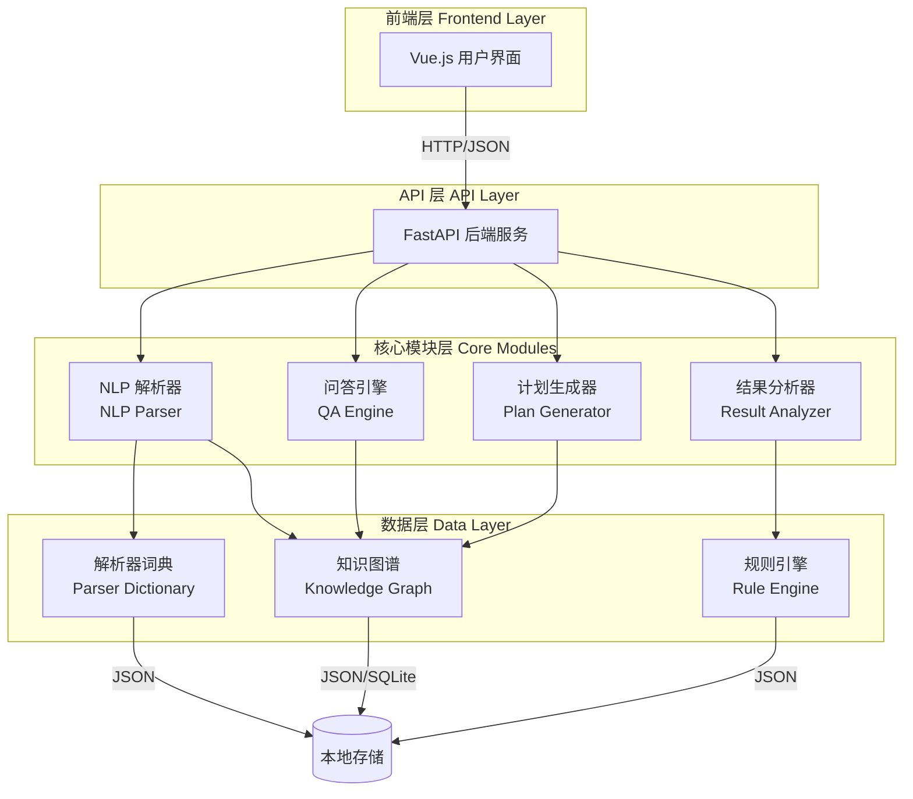
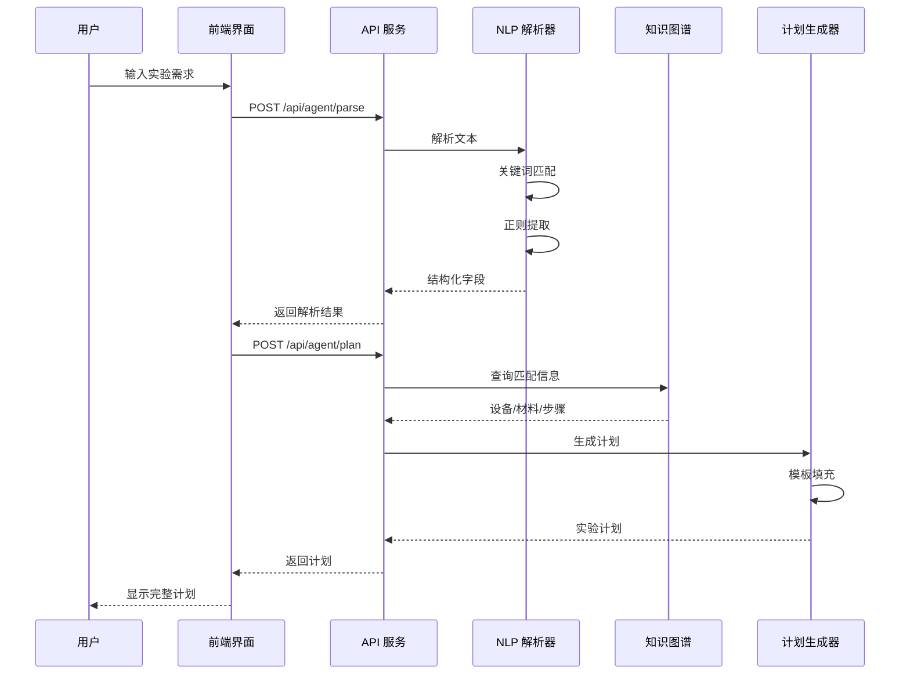
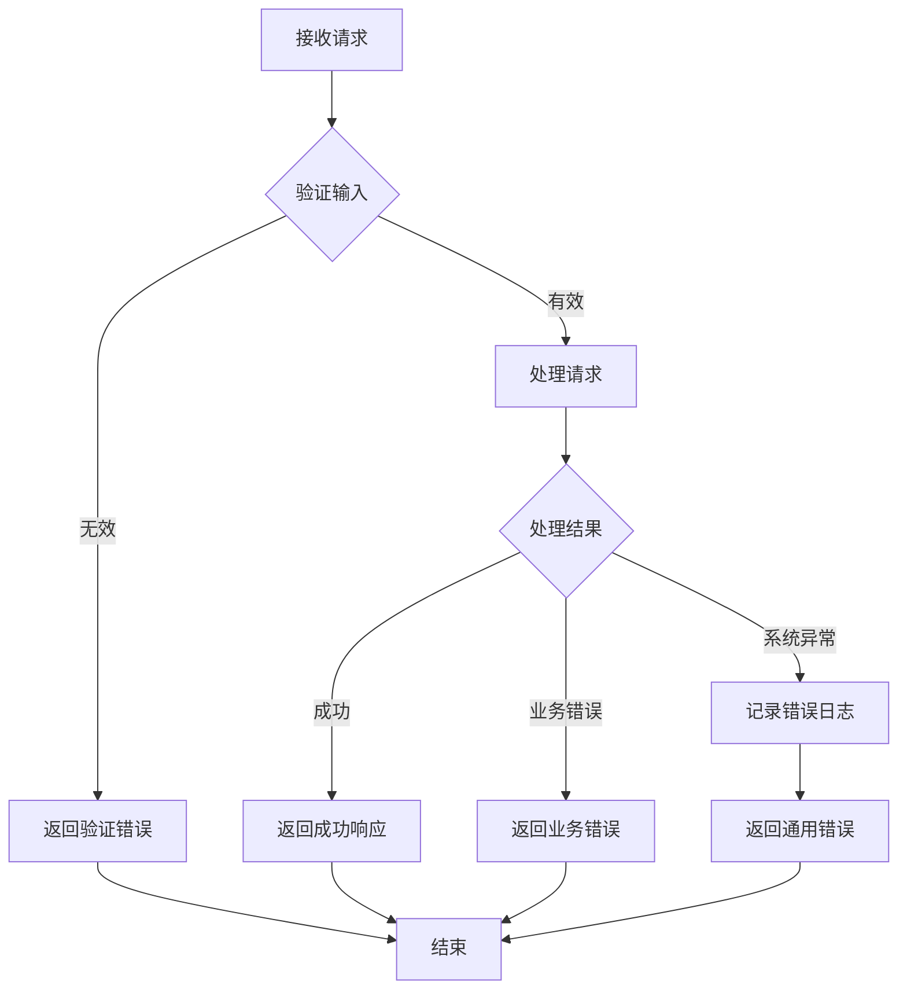

# 技术设计文档：本地轻量化 AI 智能体

## Overview

本地轻量化 AI 智能体是一个完全本地部署的实验室智能分析系统，通过规则引擎和知识图谱技术实现实验需求的智能解析、实验计划生成、智能问答和结果分析功能。系统采用轻量级技术栈，无需依赖外部 AI API 或重型机器学习框架，确保数据安全和快速响应。

### 设计目标

1. **完全本地化**：所有处理在本地完成，不向外部发送数据
2. **轻量高效**：使用关键词匹配和规则引擎，避免重型 ML 框架
3. **快速响应**：2 秒内完成完整的解析-匹配-生成流程
4. **易于扩展**：支持动态添加知识条目和规则配置
5. **用户友好**：提供直观的 Web 界面和清晰的 API

### 技术选型

- **后端框架**：FastAPI（Python）- 高性能异步框架
- **知识存储**：JSON 文件 + SQLite（可选）- 轻量级存储方案
- **NLP 处理**：正则表达式 + 关键词匹配 - 无需深度学习
- **前端框架**：Vue.js 3 - 与现有实验室系统一致
- **API 通信**：RESTful API + JSON 格式

## Architecture

### 系统架构图



### 模块职责

#### 1. NLP 解析器 (NLP Parser)
- **职责**：解析用户输入的实验需求文本，提取结构化字段
- **输入**：自然语言文本
- **输出**：结构化字段 JSON 对象
- **核心算法**：
  - 关键词匹配（基于词典）
  - 正则表达式提取（时间、数值、单位）
  - 字段分类器（基于规则）

#### 2. 知识图谱 (Knowledge Graph)
- **职责**：存储和查询实验相关知识
- **存储内容**：实验类型、设备、材料、指标、步骤及其关联关系
- **查询能力**：根据实验类型快速检索相关信息
- **存储方案**：JSON 文件（默认）或 SQLite（可选）

#### 3. 问答引擎 (QA Engine)
- **职责**：理解用户问题并提供准确回答
- **输入**：用户问题文本
- **输出**：格式化的回答文本
- **核心算法**：
  - 意图识别（基于关键词）
  - 知识检索（查询知识图谱）
  - 回答生成（基于模板）

#### 4. 实验计划生成器 (Plan Generator)
- **职责**：根据结构化字段生成完整的实验计划
- **输入**：结构化字段 + 知识图谱匹配结果
- **输出**：完整的实验计划文档
- **核心算法**：
  - 模板填充
  - 知识增强（从知识图谱补充信息）
  - 格式化输出

#### 5. 结果分析器 (Result Analyzer)
- **职责**：分析实验结果并检测异常
- **输入**：实验结果数据
- **输出**：分析报告（包含异常标记和建议）
- **核心算法**：
  - 规则引擎评估
  - 阈值比较
  - 异常检测

### 数据流



## Components and Interfaces

### 1. NLP 解析器组件

#### 类设计

```python
class NLPParser:
    """自然语言处理解析器"""
    
    def __init__(self, dictionary: ParserDictionary):
        self.dictionary = dictionary
        self.field_extractors = self._init_extractors()
    
    def parse(self, text: str) -> ParsedFields:
        """解析实验需求文本"""
        pass
    
    def extract_purpose(self, text: str) -> str:
        """提取实验目的"""
        pass
    
    def extract_sample_type(self, text: str) -> str:
        """提取样品类型"""
        pass
    
    def extract_indicators(self, text: str) -> List[str]:
        """提取检测指标"""
        pass
    
    def extract_equipment(self, text: str) -> List[str]:
        """提取所需设备"""
        pass
    
    def extract_materials(self, text: str) -> List[str]:
        """提取所需材料"""
        pass
    
    def extract_steps(self, text: str) -> List[str]:
        """提取实验步骤"""
        pass
    
    def extract_time(self, text: str) -> str:
        """提取预计时间"""
        pass
```

#### 解析算法

**关键词匹配算法**：
1. 加载词典中的关键词列表
2. 对输入文本进行分词（简单空格分割或中文分词）
3. 遍历每个字段的关键词列表
4. 计算匹配度（匹配关键词数量/总关键词数量）
5. 提取匹配度最高的字段内容

**正则表达式提取**：
- 时间表达式：`(\d+)\s*(小时|分钟|天|周)`
- 数值表达式：`(\d+\.?\d*)\s*(mg|ml|g|L|μg)`
- 温度表达式：`(\d+)\s*°C`
- 浓度表达式：`(\d+\.?\d*)\s*(%|ppm|mol/L)`

#### 接口定义

```python
@dataclass
class ParsedFields:
    """解析后的结构化字段"""
    purpose: str = ""
    sample_type: str = ""
    indicators: List[str] = field(default_factory=list)
    equipment: List[str] = field(default_factory=list)
    materials: List[str] = field(default_factory=list)
    steps: List[str] = field(default_factory=list)
    estimated_time: str = ""
    confidence: float = 0.0  # 解析置信度
```

### 2. 知识图谱组件

#### 类设计

```python
class KnowledgeGraph:
    """知识图谱管理器"""
    
    def __init__(self, storage_path: str, use_sqlite: bool = False):
        self.storage_path = storage_path
        self.use_sqlite = use_sqlite
        self.data = self._load_data()
    
    def query_equipment(self, experiment_type: str) -> List[Equipment]:
        """查询实验类型相关的设备"""
        pass
    
    def query_materials(self, experiment_type: str) -> List[Material]:
        """查询实验类型相关的材料"""
        pass
    
    def query_indicators(self, experiment_type: str) -> List[Indicator]:
        """查询实验类型相关的指标"""
        pass
    
    def query_steps(self, experiment_type: str) -> List[Step]:
        """查询实验类型相关的步骤"""
        pass
    
    def add_entry(self, entry: KnowledgeEntry) -> bool:
        """添加知识条目"""
        pass
    
    def export_to_json(self, output_path: str) -> bool:
        """导出为 JSON 格式"""
        pass
    
    def import_from_json(self, input_path: str) -> bool:
        """从 JSON 导入"""
        pass
```

#### 数据结构

**JSON 存储格式**：

```json
{
  "experiment_types": [
    {
      "id": "water_heavy_metal",
      "name": "水样重金属检测",
      "category": "环境检测",
      "equipment_ids": ["eq_001", "eq_002"],
      "material_ids": ["mat_001", "mat_002"],
      "indicator_ids": ["ind_001", "ind_002"],
      "step_ids": ["step_001", "step_002", "step_003"]
    }
  ],
  "equipment": [
    {
      "id": "eq_001",
      "name": "原子吸收光谱仪",
      "model": "AAS-2000",
      "category": "分析仪器",
      "specifications": "检测限: 0.001 mg/L"
    }
  ],
  "materials": [
    {
      "id": "mat_001",
      "name": "硝酸",
      "concentration": "65%",
      "cas_number": "7697-37-2",
      "safety_level": "危险"
    }
  ],
  "indicators": [
    {
      "id": "ind_001",
      "name": "铅含量",
      "unit": "mg/L",
      "method": "原子吸收法",
      "threshold": {
        "min": 0,
        "max": 0.01
      }
    }
  ],
  "steps": [
    {
      "id": "step_001",
      "order": 1,
      "title": "样品预处理",
      "description": "取100ml水样，加入5ml硝酸，加热消解",
      "duration": "30分钟",
      "temperature": "95°C"
    }
  ]
}
```

**SQLite 表结构**（可选）：

```sql
-- 实验类型表
CREATE TABLE experiment_types (
    id TEXT PRIMARY KEY,
    name TEXT NOT NULL,
    category TEXT,
    created_at TIMESTAMP DEFAULT CURRENT_TIMESTAMP
);

-- 设备表
CREATE TABLE equipment (
    id TEXT PRIMARY KEY,
    name TEXT NOT NULL,
    model TEXT,
    category TEXT,
    specifications TEXT
);

-- 材料表
CREATE TABLE materials (
    id TEXT PRIMARY KEY,
    name TEXT NOT NULL,
    concentration TEXT,
    cas_number TEXT,
    safety_level TEXT
);

-- 指标表
CREATE TABLE indicators (
    id TEXT PRIMARY KEY,
    name TEXT NOT NULL,
    unit TEXT,
    method TEXT,
    threshold_min REAL,
    threshold_max REAL
);

-- 步骤表
CREATE TABLE steps (
    id TEXT PRIMARY KEY,
    order_num INTEGER,
    title TEXT NOT NULL,
    description TEXT,
    duration TEXT,
    temperature TEXT
);

-- 关联表
CREATE TABLE experiment_equipment (
    experiment_id TEXT,
    equipment_id TEXT,
    PRIMARY KEY (experiment_id, equipment_id)
);

CREATE TABLE experiment_materials (
    experiment_id TEXT,
    material_id TEXT,
    PRIMARY KEY (experiment_id, material_id)
);

CREATE TABLE experiment_indicators (
    experiment_id TEXT,
    indicator_id TEXT,
    PRIMARY KEY (experiment_id, indicator_id)
);

CREATE TABLE experiment_steps (
    experiment_id TEXT,
    step_id TEXT,
    PRIMARY KEY (experiment_id, step_id)
);
```

#### 查询算法

**基于 JSON 的查询**：
1. 加载完整 JSON 数据到内存
2. 根据实验类型 ID 查找对应的关联 ID 列表
3. 根据关联 ID 列表查找具体实体
4. 返回实体列表

**性能优化**：
- 启动时加载数据到内存（缓存）
- 使用字典索引加速查找（O(1) 复杂度）
- 定期持久化修改到磁盘

### 3. 问答引擎组件

#### 类设计

```python
class QAEngine:
    """问答引擎"""
    
    def __init__(self, knowledge_graph: KnowledgeGraph, templates: AnswerTemplates):
        self.kg = knowledge_graph
        self.templates = templates
        self.intent_classifier = IntentClassifier()
    
    def answer(self, question: str) -> str:
        """回答用户问题"""
        pass
    
    def classify_intent(self, question: str) -> QuestionIntent:
        """识别问题意图"""
        pass
    
    def retrieve_knowledge(self, intent: QuestionIntent) -> List[Any]:
        """检索相关知识"""
        pass
    
    def generate_answer(self, intent: QuestionIntent, knowledge: List[Any]) -> str:
        """生成回答"""
        pass
```

#### 意图识别算法

**问题类型分类**：
- **设备查询**：关键词包含"设备"、"仪器"、"需要什么"
- **材料查询**：关键词包含"材料"、"试剂"、"化学品"
- **步骤查询**：关键词包含"步骤"、"怎么做"、"如何操作"
- **指标查询**：关键词包含"指标"、"检测什么"、"测什么"
- **时间查询**：关键词包含"多久"、"时间"、"需要多长"

**意图识别流程**：
1. 提取问题中的关键词
2. 匹配意图关键词列表
3. 计算每个意图的匹配分数
4. 返回分数最高的意图

#### 回答模板

```python
ANSWER_TEMPLATES = {
    "equipment": "进行{experiment_type}需要以下设备：\n{equipment_list}",
    "materials": "进行{experiment_type}需要以下材料：\n{material_list}",
    "steps": "进行{experiment_type}的步骤如下：\n{step_list}",
    "indicators": "进行{experiment_type}需要检测以下指标：\n{indicator_list}",
    "default": "抱歉，我没有找到相关信息。请尝试更具体的问题。"
}
```

### 4. 实验计划生成器组件

#### 类设计

```python
class PlanGenerator:
    """实验计划生成器"""
    
    def __init__(self, knowledge_graph: KnowledgeGraph, templates: PlanTemplates):
        self.kg = knowledge_graph
        self.templates = templates
    
    def generate(self, parsed_fields: ParsedFields) -> ExperimentPlan:
        """生成实验计划"""
        pass
    
    def enrich_with_knowledge(self, parsed_fields: ParsedFields) -> EnrichedFields:
        """使用知识图谱增强字段"""
        pass
    
    def fill_template(self, enriched_fields: EnrichedFields) -> str:
        """填充模板"""
        pass
```

#### 生成算法

**步骤**：
1. 接收解析后的结构化字段
2. 根据实验类型查询知识图谱
3. 合并用户输入和知识图谱信息
4. 填充实验计划模板
5. 格式化输出

**模板结构**：

```markdown
# 实验计划

## 1. 实验目的
{purpose}

## 2. 样品信息
- 样品类型：{sample_type}
- 样品数量：{sample_count}

## 3. 检测指标
{indicators}

## 4. 所需设备
{equipment_list}

## 5. 所需材料
{material_list}

## 6. 实验步骤
{step_list}

## 7. 预计时间
{estimated_time}

## 8. 注意事项
{safety_notes}
```

### 5. 结果分析器组件

#### 类设计

```python
class ResultAnalyzer:
    """结果分析器"""
    
    def __init__(self, rule_engine: RuleEngine):
        self.rule_engine = rule_engine
    
    def analyze(self, result_data: ResultData) -> AnalysisReport:
        """分析实验结果"""
        pass
    
    def detect_anomalies(self, result_data: ResultData) -> List[Anomaly]:
        """检测异常"""
        pass
    
    def generate_suggestions(self, anomalies: List[Anomaly]) -> List[str]:
        """生成建议"""
        pass
```

#### 规则引擎

```python
class RuleEngine:
    """规则引擎"""
    
    def __init__(self, rules_config: Dict):
        self.rules = self._load_rules(rules_config)
    
    def evaluate(self, data: Dict, rule_id: str) -> RuleResult:
        """评估规则"""
        pass
    
    def add_rule(self, rule: Rule) -> bool:
        """添加规则"""
        pass
    
    def update_threshold(self, indicator: str, threshold: Threshold) -> bool:
        """更新阈值"""
        pass
```

**规则配置格式**：

```json
{
  "rules": [
    {
      "id": "rule_001",
      "name": "铅含量阈值检查",
      "indicator": "铅含量",
      "type": "threshold",
      "threshold": {
        "min": 0,
        "max": 0.01,
        "unit": "mg/L"
      },
      "severity": "high",
      "message": "铅含量超标",
      "suggestion": "建议重新采样检测，确认是否存在污染源"
    },
    {
      "id": "rule_002",
      "name": "pH 值范围检查",
      "indicator": "pH",
      "type": "range",
      "range": {
        "min": 6.5,
        "max": 8.5
      },
      "severity": "medium",
      "message": "pH 值异常",
      "suggestion": "检查样品保存条件和测量仪器校准"
    }
  ]
}
```

### 6. 解析器词典组件

#### 数据结构

```json
{
  "purpose_keywords": [
    "检测", "测定", "分析", "鉴定", "评估", "监测"
  ],
  "sample_type_keywords": {
    "水样": ["水样", "水质", "水体", "饮用水", "地表水"],
    "土壤": ["土壤", "土质", "泥土", "底泥"],
    "空气": ["空气", "大气", "气体"]
  },
  "indicator_keywords": {
    "重金属": ["重金属", "铅", "汞", "镉", "铬", "砷"],
    "有机物": ["有机物", "苯", "甲苯", "二甲苯"],
    "微生物": ["微生物", "细菌", "大肠杆菌", "菌落总数"]
  },
  "equipment_keywords": [
    "光谱仪", "色谱仪", "质谱仪", "显微镜", "天平", "离心机"
  ],
  "material_keywords": [
    "试剂", "标准品", "缓冲液", "溶剂", "酸", "碱"
  ],
  "time_patterns": [
    "(\\d+)\\s*(小时|h|hour)",
    "(\\d+)\\s*(分钟|min|minute)",
    "(\\d+)\\s*(天|day)",
    "(\\d+)\\s*(周|week)"
  ],
  "value_patterns": [
    "(\\d+\\.?\\d*)\\s*(mg|ml|g|L|μg|μl)",
    "(\\d+\\.?\\d*)\\s*(%|ppm|ppb)",
    "(\\d+)\\s*°C"
  ]
}
```

## Data Models

### 核心数据模型

#### 1. ParsedFields（解析字段）

```python
@dataclass
class ParsedFields:
    """解析后的结构化字段"""
    purpose: str = ""                    # 实验目的
    sample_type: str = ""                # 样品类型
    indicators: List[str] = field(default_factory=list)  # 检测指标
    equipment: List[str] = field(default_factory=list)   # 所需设备
    materials: List[str] = field(default_factory=list)   # 所需材料
    steps: List[str] = field(default_factory=list)       # 实验步骤
    estimated_time: str = ""             # 预计时间
    confidence: float = 0.0              # 解析置信度
    
    def to_dict(self) -> Dict:
        """转换为字典"""
        return asdict(self)
    
    def is_valid(self) -> bool:
        """验证字段完整性"""
        return bool(self.purpose and self.sample_type)
```

#### 2. KnowledgeEntry（知识条目）

```python
@dataclass
class Equipment:
    """设备实体"""
    id: str
    name: str
    model: str = ""
    category: str = ""
    specifications: str = ""

@dataclass
class Material:
    """材料实体"""
    id: str
    name: str
    concentration: str = ""
    cas_number: str = ""
    safety_level: str = ""

@dataclass
class Indicator:
    """指标实体"""
    id: str
    name: str
    unit: str = ""
    method: str = ""
    threshold_min: Optional[float] = None
    threshold_max: Optional[float] = None

@dataclass
class Step:
    """步骤实体"""
    id: str
    order: int
    title: str
    description: str
    duration: str = ""
    temperature: str = ""

@dataclass
class ExperimentType:
    """实验类型实体"""
    id: str
    name: str
    category: str = ""
    equipment_ids: List[str] = field(default_factory=list)
    material_ids: List[str] = field(default_factory=list)
    indicator_ids: List[str] = field(default_factory=list)
    step_ids: List[str] = field(default_factory=list)
```

#### 3. ExperimentPlan（实验计划）

```python
@dataclass
class ExperimentPlan:
    """实验计划"""
    id: str
    purpose: str
    sample_type: str
    indicators: List[Indicator]
    equipment: List[Equipment]
    materials: List[Material]
    steps: List[Step]
    estimated_time: str
    safety_notes: List[str] = field(default_factory=list)
    created_at: datetime = field(default_factory=datetime.now)
    
    def to_markdown(self) -> str:
        """转换为 Markdown 格式"""
        pass
    
    def to_dict(self) -> Dict:
        """转换为字典"""
        return asdict(self)
```

#### 4. AnalysisReport（分析报告）

```python
@dataclass
class Anomaly:
    """异常信息"""
    indicator: str
    value: float
    threshold_min: Optional[float]
    threshold_max: Optional[float]
    severity: str  # "low", "medium", "high"
    message: str
    suggestion: str

@dataclass
class AnalysisReport:
    """分析报告"""
    result_id: str
    status: str  # "normal", "warning", "error"
    anomalies: List[Anomaly] = field(default_factory=list)
    summary: str = ""
    analyzed_at: datetime = field(default_factory=datetime.now)
    
    def to_dict(self) -> Dict:
        """转换为字典"""
        return asdict(self)
```

#### 5. API 请求/响应模型

```python
# 请求模型
class ParseRequest(BaseModel):
    """解析请求"""
    text: str
    
    @validator('text')
    def text_not_empty(cls, v):
        if not v or not v.strip():
            raise ValueError('文本不能为空')
        return v

class PlanRequest(BaseModel):
    """计划生成请求"""
    parsed_fields: Dict
    
    @validator('parsed_fields')
    def fields_valid(cls, v):
        if not v.get('purpose') or not v.get('sample_type'):
            raise ValueError('必须包含实验目的和样品类型')
        return v

class QARequest(BaseModel):
    """问答请求"""
    question: str
    
    @validator('question')
    def question_not_empty(cls, v):
        if not v or not v.strip():
            raise ValueError('问题不能为空')
        return v

class AnalysisRequest(BaseModel):
    """分析请求"""
    result_data: Dict
    
    @validator('result_data')
    def data_valid(cls, v):
        if not v:
            raise ValueError('结果数据不能为空')
        return v

# 响应模型
class APIResponse(BaseModel):
    """统一 API 响应"""
    success: bool
    data: Optional[Dict] = None
    error: Optional[str] = None
    error_code: Optional[str] = None
    timestamp: datetime = Field(default_factory=datetime.now)
```

### 数据验证规则

#### ParsedFields 验证
- `purpose`: 非空字符串，长度 5-500 字符
- `sample_type`: 非空字符串，长度 2-100 字符
- `indicators`: 列表，每项长度 2-100 字符
- `equipment`: 列表，每项长度 2-100 字符
- `materials`: 列表，每项长度 2-100 字符
- `estimated_time`: 字符串，匹配时间格式正则
- `confidence`: 浮点数，范围 0.0-1.0

#### KnowledgeEntry 验证
- `id`: 非空字符串，唯一性约束
- `name`: 非空字符串，长度 2-200 字符
- 所有 ID 引用必须存在于对应实体表中

#### ExperimentPlan 验证
- 必须包含至少一个 indicator
- 必须包含至少一个 step
- `estimated_time` 必须为有效时间格式

#### AnalysisReport 验证
- `status` 必须为 "normal", "warning", "error" 之一
- `anomalies` 中的 `severity` 必须为 "low", "medium", "high" 之一
- 每个 `Anomaly` 必须包含 `message` 和 `suggestion`


## Correctness Properties

*属性是系统在所有有效执行中应该保持为真的特征或行为——本质上是关于系统应该做什么的形式化陈述。属性作为人类可读规范和机器可验证正确性保证之间的桥梁。*

### Property 1: 字段提取完整性

*对于任何*包含实验信息的文本输入，NLP 解析器应该能够识别并提取所有可识别的结构化字段（实验目的、样品类型、检测指标、设备、材料、步骤、时间），且提取的字段应该与输入文本中的信息一致。

**验证：需求 1.1, 1.2, 1.3, 1.4, 1.5, 1.6, 1.7**

### Property 2: JSON 序列化往返保持等价性

*对于任何*有效的数据对象（ParsedFields、KnowledgeEntry、ExperimentPlan、RuleConfig、ParserDictionary），将其序列化为 JSON 格式后再反序列化，应该得到与原对象等价的对象（所有字段值相同）。

**验证：需求 1.11, 2.5, 10.9, 11.7, 11.8, 12.12, 12.13**

### Property 3: 知识图谱查询幂等性

*对于任何*实验类型 ID，在知识图谱中进行多次查询（查询设备、材料、指标、步骤），每次查询应该返回相同的结果集，且结果的顺序和内容保持一致。

**验证：需求 2.7, 2.8, 2.9, 2.10**

### Property 4: 数据验证一致性

*对于任何*输入数据（知识条目、规则配置、阈值、词典条目），验证逻辑应该：
- 对有效数据返回成功
- 对无效数据返回失败并提供错误信息
- 对相同数据的多次验证返回相同结果

**验证：需求 3.10, 10.6, 11.5, 11.6, 11.9**

### Property 5: 知识条目唯一性

*对于任何*知识条目，尝试添加具有相同 ID 的条目两次，第二次添加应该失败并返回重复错误提示。

**验证：需求 3.11**

### Property 6: 问答意图分类确定性

*对于任何*用户问题文本，问答引擎应该能够识别出唯一的问题类型（设备查询、材料查询、步骤查询、指标查询），且对相同问题的多次分类返回相同的问题类型。

**验证：需求 4.1, 4.2, 4.3, 4.4, 4.5**

### Property 7: 问答回答格式完整性

*对于任何*成功检索到匹配结果的问题，生成的回答应该包含：
- 问题相关的实验类型信息
- 检索到的具体内容（设备/材料/步骤/指标列表）
- 格式化的文本结构

**验证：需求 4.8**

### Property 8: 实验计划字段完整性

*对于任何*有效的 ParsedFields 输入，生成的 ExperimentPlan 应该包含所有输入字段的内容，并且包含从知识图谱增强的信息（设备列表、材料列表、详细步骤）。

**验证：需求 5.6, 5.7, 5.8, 5.9, 5.10, 5.11, 5.12, 5.13**

### Property 9: 阈值判断正确性

*对于任何*数值和阈值配置（包含上限和下限），结果分析器应该正确判断：
- 数值 > 上限 → 标记为异常（超出上限）
- 数值 < 下限 → 标记为异常（低于下限）
- 下限 ≤ 数值 ≤ 上限 → 标记为正常

**验证：需求 6.4, 6.5, 6.8**

### Property 10: 异常信息完整性

*对于任何*检测到的异常，分析报告应该包含：
- 异常提示信息（描述异常情况）
- 分析建议（提供解决方案）
- 异常严重程度（low/medium/high）
- 相关指标和数值信息

**验证：需求 6.6, 6.7, 6.9**

### Property 11: CRUD 操作一致性

*对于任何*新添加的数据（知识条目、规则、词典条目），添加操作成功后：
- 应该能够通过查询操作检索到该数据
- 检索到的数据应该与添加的数据等价
- 删除操作后应该无法再检索到该数据

**验证：需求 10.1, 10.2, 10.3, 10.4, 10.5, 10.7, 12.8, 12.9, 12.10**

### Property 12: 批量导入完整性

*对于任何*有效的批量知识数据 JSON 文件，导入操作完成后，知识图谱应该包含 JSON 文件中的所有条目，且每个条目的内容与 JSON 中的定义一致。

**验证：需求 10.8**

### Property 13: 规则引擎即时生效

*对于任何*新配置或更新的规则，在应用操作完成后，立即使用该规则进行评估应该使用新规则的逻辑，而不是旧规则。

**验证：需求 11.10**

### Property 14: 词典更新即时生效

*对于任何*对解析器词典的更新（添加、删除、修改关键词或正则模式），更新操作完成后，立即进行的解析操作应该使用更新后的词典。

**验证：需求 12.11**

### Property 15: 错误响应格式一致性

*对于任何*导致错误的操作（无效输入、处理失败、资源不存在），系统应该返回包含以下字段的错误响应：
- 错误代码（error_code）
- 错误描述（error）
- 建议的解决方案（可选）
- 时间戳（timestamp）

**验证：需求 14.1, 14.2, 14.3, 14.4, 14.5, 14.8, 14.9, 14.10**

## Error Handling

### 错误分类

系统定义以下错误类别：

#### 1. 输入验证错误 (400 Bad Request)
- **错误代码**: `INVALID_INPUT`
- **触发条件**: 
  - 空文本输入
  - 缺少必需字段
  - 字段格式不正确
  - 数据类型不匹配
- **处理策略**: 返回详细的验证错误信息，指出具体哪个字段有问题
- **示例**:
```json
{
  "success": false,
  "error": "输入文本不能为空",
  "error_code": "INVALID_INPUT",
  "details": {
    "field": "text",
    "constraint": "not_empty"
  }
}
```

#### 2. 解析失败错误 (422 Unprocessable Entity)
- **错误代码**: `PARSE_FAILED`
- **触发条件**:
  - 文本无法识别任何字段
  - 解析置信度过低
  - 文本格式异常
- **处理策略**: 返回友好提示，建议用户重新组织输入
- **示例**:
```json
{
  "success": false,
  "error": "无法从输入文本中识别实验信息",
  "error_code": "PARSE_FAILED",
  "suggestion": "请确保文本包含实验目的、样品类型等关键信息"
}
```

#### 3. 资源不存在错误 (404 Not Found)
- **错误代码**: `RESOURCE_NOT_FOUND`
- **触发条件**:
  - 查询的实验类型不存在
  - 知识条目 ID 不存在
  - 规则 ID 不存在
- **处理策略**: 返回默认建议或空结果
- **示例**:
```json
{
  "success": false,
  "error": "未找到指定的实验类型",
  "error_code": "RESOURCE_NOT_FOUND",
  "suggestion": "请检查实验类型名称是否正确"
}
```

#### 4. 重复资源错误 (409 Conflict)
- **错误代码**: `DUPLICATE_ENTRY`
- **触发条件**:
  - 添加重复 ID 的知识条目
  - 添加重复的规则
- **处理策略**: 返回冲突信息，建议更新而非添加
- **示例**:
```json
{
  "success": false,
  "error": "该 ID 的知识条目已存在",
  "error_code": "DUPLICATE_ENTRY",
  "existing_id": "eq_001",
  "suggestion": "请使用更新接口修改现有条目"
}
```

#### 5. 系统内部错误 (500 Internal Server Error)
- **错误代码**: `INTERNAL_ERROR`
- **触发条件**:
  - 文件读写失败
  - 数据库连接失败
  - 未预期的异常
- **处理策略**: 记录详细错误堆栈到日志，向用户返回通用错误信息
- **示例**:
```json
{
  "success": false,
  "error": "系统处理请求时发生错误",
  "error_code": "INTERNAL_ERROR",
  "suggestion": "请稍后重试，如问题持续请联系管理员"
}
```

### 错误处理流程



### 容错机制

#### 1. NLP 解析器容错
- **低置信度处理**: 当解析置信度 < 0.5 时，返回部分结果并标记低置信度字段
- **空字段处理**: 无法识别的字段返回空字符串或空列表，不中断整个解析流程
- **默认值填充**: 对于可选字段，使用合理的默认值

#### 2. 知识图谱容错
- **查询失败降级**: 查询失败时返回空结果集，不抛出异常
- **部分匹配**: 当完全匹配失败时，尝试模糊匹配或返回相似结果
- **缓存失效处理**: 缓存失效时重新加载数据，对用户透明

#### 3. 问答引擎容错
- **意图识别失败**: 返回默认提示信息，引导用户重新提问
- **知识检索为空**: 返回"暂无相关信息"并提供相关建议
- **模板填充失败**: 使用简化模板或纯文本返回

#### 4. 计划生成器容错
- **知识增强失败**: 仅使用用户输入的信息生成计划
- **模板缺失**: 使用默认模板或生成简单格式的计划
- **字段缺失**: 标记缺失字段，生成不完整但可用的计划

#### 5. 结果分析器容错
- **规则评估失败**: 跳过失败的规则，继续评估其他规则
- **阈值缺失**: 使用默认阈值或跳过该指标的检测
- **数据格式错误**: 尝试类型转换，失败则标记为无法分析

### 日志记录策略

所有错误都应该记录到日志文件，包含以下信息：
- 时间戳
- 错误级别（ERROR, WARNING, INFO）
- 错误代码
- 错误消息
- 请求上下文（用户 ID、请求路径、请求参数）
- 错误堆栈（仅限系统内部错误）

## Testing Strategy

### 测试方法概述

本系统采用**双重测试策略**：
1. **单元测试**：验证具体示例、边界条件和错误处理
2. **属性测试**：验证跨所有输入的通用属性

### 属性测试配置

#### 测试框架选择
- **Python**: 使用 `hypothesis` 库进行属性测试
- **最小迭代次数**: 每个属性测试运行 100 次迭代
- **标签格式**: 每个测试使用注释标记对应的设计属性

示例：
```python
from hypothesis import given, strategies as st

# Feature: local-ai-agent, Property 2: JSON 序列化往返保持等价性
@given(st.builds(ParsedFields))
def test_parsed_fields_json_roundtrip(parsed_fields):
    """测试 ParsedFields 的 JSON 序列化往返"""
    json_data = parsed_fields.to_dict()
    restored = ParsedFields.from_dict(json_data)
    assert parsed_fields == restored
```

#### 数据生成策略

**ParsedFields 生成器**：
```python
parsed_fields_strategy = st.builds(
    ParsedFields,
    purpose=st.text(min_size=5, max_size=500),
    sample_type=st.text(min_size=2, max_size=100),
    indicators=st.lists(st.text(min_size=2, max_size=100), min_size=0, max_size=10),
    equipment=st.lists(st.text(min_size=2, max_size=100), min_size=0, max_size=10),
    materials=st.lists(st.text(min_size=2, max_size=100), min_size=0, max_size=10),
    steps=st.lists(st.text(min_size=5, max_size=200), min_size=0, max_size=20),
    estimated_time=st.text(min_size=0, max_size=50),
    confidence=st.floats(min_value=0.0, max_value=1.0)
)
```

**KnowledgeEntry 生成器**：
```python
equipment_strategy = st.builds(
    Equipment,
    id=st.text(min_size=3, max_size=20, alphabet=st.characters(whitelist_categories=('Lu', 'Ll', 'Nd'))),
    name=st.text(min_size=2, max_size=200),
    model=st.text(min_size=0, max_size=100),
    category=st.sampled_from(['分析仪器', '制备设备', '辅助设备']),
    specifications=st.text(min_size=0, max_size=500)
)
```

**阈值和数值生成器**：
```python
threshold_strategy = st.builds(
    Threshold,
    min=st.floats(min_value=0, max_value=100),
    max=st.floats(min_value=0, max_value=1000)
).filter(lambda t: t.min < t.max)

test_value_strategy = st.floats(min_value=-10, max_value=1100)
```

### 单元测试策略

#### 1. NLP 解析器测试

**示例测试**：
```python
def test_parse_water_heavy_metal_detection():
    """测试水样重金属检测需求的解析"""
    text = "我需要检测水样中的重金属含量，包括铅、汞、镉"
    result = parser.parse(text)
    assert "重金属" in result.indicators
    assert "水样" in result.sample_type

def test_parse_with_time_expression():
    """测试时间表达式提取"""
    text = "实验预计需要2小时30分钟"
    result = parser.parse(text)
    assert "2小时30分钟" in result.estimated_time or "2.5小时" in result.estimated_time
```

**边界条件测试**：
```python
def test_parse_empty_text():
    """测试空文本输入"""
    with pytest.raises(ValueError, match="文本不能为空"):
        parser.parse("")

def test_parse_whitespace_only():
    """测试纯空格输入"""
    with pytest.raises(ValueError):
        parser.parse("   \n\t  ")

def test_parse_unrecognizable_text():
    """测试无法识别的文本"""
    result = parser.parse("这是一段完全无关的文本")
    assert result.confidence < 0.3
```

#### 2. 知识图谱测试

**示例测试**：
```python
def test_query_equipment_for_water_analysis():
    """测试查询水质分析相关设备"""
    equipment_list = kg.query_equipment("water_heavy_metal")
    assert len(equipment_list) > 0
    assert any("光谱仪" in eq.name for eq in equipment_list)

def test_add_and_query_knowledge_entry():
    """测试添加和查询知识条目"""
    new_equipment = Equipment(
        id="eq_test_001",
        name="测试设备",
        category="测试"
    )
    kg.add_entry(new_equipment)
    result = kg.query_by_id("eq_test_001")
    assert result.name == "测试设备"
```

**边界条件测试**：
```python
def test_query_nonexistent_experiment_type():
    """测试查询不存在的实验类型"""
    result = kg.query_equipment("nonexistent_type")
    assert result == []

def test_add_duplicate_entry():
    """测试添加重复条目"""
    equipment = Equipment(id="eq_001", name="设备1")
    kg.add_entry(equipment)
    with pytest.raises(ValueError, match="已存在"):
        kg.add_entry(equipment)
```

#### 3. 问答引擎测试

**示例测试**：
```python
def test_answer_equipment_question():
    """测试设备查询问题"""
    answer = qa_engine.answer("水质检测需要什么设备？")
    assert "设备" in answer or "仪器" in answer
    assert len(answer) > 0

def test_answer_material_question():
    """测试材料查询问题"""
    answer = qa_engine.answer("需要哪些试剂？")
    assert "试剂" in answer or "材料" in answer
```

#### 4. 实验计划生成器测试

**示例测试**：
```python
def test_generate_complete_plan():
    """测试生成完整实验计划"""
    fields = ParsedFields(
        purpose="检测水样重金属",
        sample_type="水样",
        indicators=["铅", "汞"]
    )
    plan = plan_generator.generate(fields)
    assert plan.purpose == fields.purpose
    assert len(plan.equipment) > 0
    assert len(plan.steps) > 0
```

#### 5. 结果分析器测试

**示例测试**：
```python
def test_analyze_normal_result():
    """测试正常结果分析"""
    result_data = {"铅含量": 0.005}  # 正常范围内
    report = analyzer.analyze(result_data)
    assert report.status == "normal"
    assert len(report.anomalies) == 0

def test_analyze_abnormal_result():
    """测试异常结果分析"""
    result_data = {"铅含量": 0.05}  # 超出阈值
    report = analyzer.analyze(result_data)
    assert report.status in ["warning", "error"]
    assert len(report.anomalies) > 0
    assert any("铅" in a.indicator for a in report.anomalies)
```

### 集成测试

#### 完整流程测试
```python
def test_complete_workflow():
    """测试从解析到计划生成的完整流程"""
    # 1. 解析
    text = "我需要检测水样中的重金属含量"
    parsed = parser.parse(text)
    
    # 2. 生成计划
    plan = plan_generator.generate(parsed)
    
    # 3. 验证
    assert plan.purpose != ""
    assert len(plan.equipment) > 0
    assert len(plan.steps) > 0
```

#### API 端点测试
```python
def test_parse_endpoint():
    """测试解析 API 端点"""
    response = client.post("/api/agent/parse", json={
        "text": "检测水样重金属"
    })
    assert response.status_code == 200
    assert response.json()["success"] == True

def test_plan_endpoint():
    """测试计划生成 API 端点"""
    response = client.post("/api/agent/plan", json={
        "parsed_fields": {
            "purpose": "检测水样重金属",
            "sample_type": "水样"
        }
    })
    assert response.status_code == 200
```

### 性能测试

#### 响应时间测试
```python
def test_parse_performance():
    """测试解析性能"""
    text = "检测水样中的重金属含量"
    start = time.time()
    parser.parse(text)
    duration = time.time() - start
    assert duration < 0.5  # 应在 500ms 内完成

def test_complete_workflow_performance():
    """测试完整流程性能"""
    text = "检测水样中的重金属含量"
    start = time.time()
    parsed = parser.parse(text)
    plan = plan_generator.generate(parsed)
    duration = time.time() - start
    assert duration < 2.0  # 应在 2 秒内完成
```

#### 并发测试
```python
def test_concurrent_requests():
    """测试并发请求处理"""
    import concurrent.futures
    
    def make_request():
        return client.post("/api/agent/parse", json={
            "text": "检测水样重金属"
        })
    
    with concurrent.futures.ThreadPoolExecutor(max_workers=10) as executor:
        futures = [executor.submit(make_request) for _ in range(10)]
        results = [f.result() for f in futures]
    
    assert all(r.status_code == 200 for r in results)
```

### 测试覆盖率目标

- **代码覆盖率**: ≥ 80%
- **分支覆盖率**: ≥ 70%
- **属性测试覆盖**: 所有 15 个正确性属性
- **API 端点覆盖**: 100%（4 个端点）

### 持续集成

测试应该在以下情况下自动运行：
1. 每次代码提交（commit）
2. 每次合并请求（pull request）
3. 每日定时构建

测试失败应该阻止代码合并到主分支。

