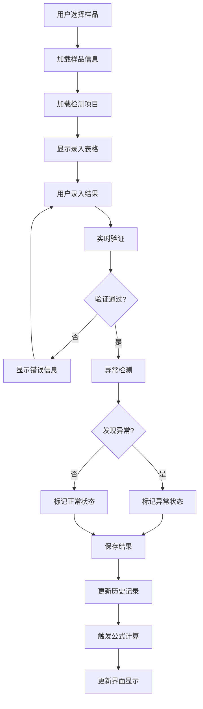
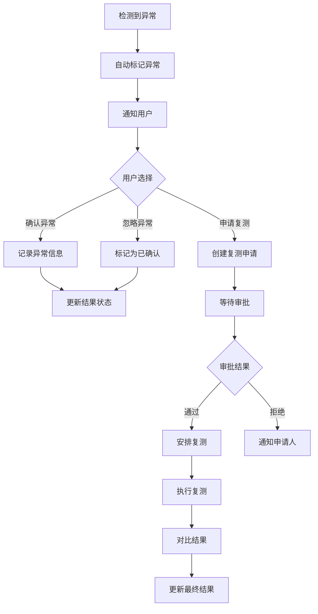

# 结果录入功能增强设计文档

## 概述

本文档详细描述了实验室管理系统中结果录入功能的技术设计方案。该功能将现有的基础结果录入页面增强为功能完整的检测结果管理系统，包括样品信息展示、多类型结果录入、异常检测、复测管理、历史记录等核心功能。

## 术语表

- **ResultEntrySystem**: 结果录入系统，负责管理检测结果的录入和处理
- **SampleInfoPanel**: 样品信息面板，展示详细的样品信息
- **TestItemGrid**: 检测项表格，用于录入和管理检测结果
- **AnomalyDetector**: 异常检测器，自动识别异常结果
- **RetestManager**: 复测管理器，处理复测申请和流程
- **ValidationEngine**: 验证引擎，实时验证录入数据
- **HistoryTracker**: 历史跟踪器，记录和展示历史数据
- **FormulaCalculator**: 公式计算器，自动计算衍生结果
- **DataExporter**: 数据导出器，支持多种格式导出
- **PermissionController**: 权限控制器，管理用户操作权限

## 系统架构

### 整体架构设计

```
┌─────────────────────────────────────────────────────────────┐
│                    结果录入功能增强系统                        │
├─────────────────────────────────────────────────────────────┤
│  UI层 (Vue Components)                                      │
│  ├── ResultEntry.vue (主页面)                               │
│  ├── SampleInfoPanel.vue (样品信息面板)                     │
│  ├── TestItemGrid.vue (检测项表格)                          │
│  ├── AnomalyMarker.vue (异常标记组件)                       │
│  ├── RetestDialog.vue (复测申请对话框)                      │
│  └── HistoryViewer.vue (历史记录查看器)                     │
├─────────────────────────────────────────────────────────────┤
│  业务逻辑层 (Composables & Services)                        │
│  ├── useResultEntry.ts (结果录入逻辑)                       │
│  ├── useAnomalyDetection.ts (异常检测逻辑)                  │
│  ├── useFormulaCalculation.ts (公式计算逻辑)                │
│  ├── useValidation.ts (数据验证逻辑)                        │
│  └── usePermission.ts (权限控制逻辑)                        │
├─────────────────────────────────────────────────────────────┤
│  数据访问层 (API Services)                                   │
│  ├── resultApi.ts (结果API)                                 │
│  ├── sampleApi.ts (样品API)                                 │
│  ├── taskApi.ts (任务API)                                   │
│  └── formulaApi.ts (公式API)                                │
└─────────────────────────────────────────────────────────────┘
```
### 核心组件设计

#### 1. 样品信息展示增强 (SampleInfoPanel)

**设计目标**: 将当前简单的样品选择区域增强为完整的样品信息展示面板

**功能特性**:
- 详细样品信息展示（条码、名称、类型、委托方、接收日期、状态等）
- 样品状态实时更新
- 样品流转历史展示
- 样品关联信息（分样、合样关系）

**技术实现**:
```typescript
interface SampleInfo {
  id: string
  barcode: string
  name: string
  sampleType: string
  client: string
  source: string
  receivedDate: Date
  currentLocation: string
  status: SampleStatus
  quantity: number
  unit: string
  createdBy: string
  createdAt: Date
  updatedAt: Date
  // 新增字段
  description?: string
  priority: 'LOW' | 'NORMAL' | 'HIGH' | 'URGENT'
  expiryDate?: Date
  storageConditions?: string
  relatedSamples?: RelatedSample[]
  transferHistory?: TransferRecord[]
}

interface RelatedSample {
  id: string
  barcode: string
  name: string
  relationship: 'PARENT' | 'CHILD' | 'MERGED_FROM' | 'MERGED_TO'
}

interface TransferRecord {
  id: string
  fromLocation: string
  toLocation: string
  transferredBy: string
  transferredAt: Date
  reason?: string
}
```

#### 2. 检测结果录入表格增强 (TestItemGrid)

**设计目标**: 增强检测结果录入表格，添加检测方法、正常范围、数据来源等字段

**功能特性**:
- 检测方法信息展示
- 正常范围显示和验证
- 数据来源选择（手工/仪器）
- 仪器信息录入
- 实时异常检测
- 公式计算结果展示

**表格列设计**:
```typescript
interface TestItemColumn {
  testItemName: string      // 检测项目名称
  testMethod: string        // 检测方法
  methodCode: string        // 方法标准号
  unit: string             // 单位
  dataType: 'number' | 'text' | 'boolean'  // 数据类型
  normalRange?: string     // 正常范围
  result: TestResult       // 检测结果
  calculatedResult?: CalculatedResult  // 计算结果
  dataSource: 'MANUAL' | 'INSTRUMENT'  // 数据来源
  instrumentId?: string    // 仪器编号
  operator: string         // 操作人员
  enteredAt: Date         // 录入时间
  status: 'PENDING' | 'NORMAL' | 'ABNORMAL' | 'RETEST'  // 状态
  remarks?: string        // 备注
  validationErrors?: ValidationError[]  // 验证错误
}

interface TestResult {
  value?: number
  textValue?: string
  booleanValue?: boolean
  unit?: string
  precision?: number
}

interface CalculatedResult {
  value: number
  unit: string
  formula: string
  dependencies: string[]
  calculatedAt: Date
}
```
#### 3. 异常检测和标记功能 (AnomalyDetector)

**设计目标**: 实现自动异常检测和手动异常标记功能

**异常检测规则**:
- 数值超出正常范围
- 与历史数据偏差过大
- 数据格式不符合要求
- 必填字段缺失

**技术实现**:
```typescript
interface AnomalyDetectionRule {
  id: string
  name: string
  type: 'RANGE_CHECK' | 'DEVIATION_CHECK' | 'FORMAT_CHECK' | 'REQUIRED_CHECK'
  parameters: Record<string, any>
  enabled: boolean
  severity: 'WARNING' | 'ERROR'
}

interface AnomalyResult {
  isAnomaly: boolean
  type: AnomalyType
  severity: 'LOW' | 'MEDIUM' | 'HIGH'
  reason: string
  suggestedAction: string
  detectedAt: Date
  detectedBy: 'SYSTEM' | 'USER'
  markedBy?: string
}

enum AnomalyType {
  OUT_OF_RANGE = 'OUT_OF_RANGE',
  DEVIATION = 'DEVIATION', 
  FORMAT_ERROR = 'FORMAT_ERROR',
  MISSING_DATA = 'MISSING_DATA',
  MANUAL_MARK = 'MANUAL_MARK'
}

class AnomalyDetector {
  detectAnomalies(result: TestResult, testItem: TestItem, historicalData: TestResult[]): AnomalyResult[]
  markManualAnomaly(resultId: string, reason: string, markedBy: string): Promise<void>
  clearAnomalyMark(resultId: string, clearedBy: string): Promise<void>
}
```

#### 4. 复测申请功能 (RetestManager)

**设计目标**: 提供完整的复测申请和管理功能

**功能特性**:
- 复测申请提交
- 复测原因记录
- 复测状态跟踪
- 复测历史查看
- 复测结果对比

**技术实现**:
```typescript
interface RetestRequest {
  id: string
  originalResultId: string
  sampleId: string
  testItemId: string
  reason: string
  requestedBy: string
  requestedAt: Date
  approvedBy?: string
  approvedAt?: Date
  status: 'PENDING' | 'APPROVED' | 'REJECTED' | 'COMPLETED'
  priority: 'LOW' | 'NORMAL' | 'HIGH' | 'URGENT'
  expectedCompletionDate?: Date
  notes?: string
}

interface RetestResult {
  id: string
  retestRequestId: string
  result: TestResult
  operator: string
  completedAt: Date
  comparisonWithOriginal: ResultComparison
  conclusion: string
}

interface ResultComparison {
  originalValue: any
  retestValue: any
  deviation: number
  deviationPercentage: number
  isConsistent: boolean
  analysis: string
}

class RetestManager {
  submitRetestRequest(request: Omit<RetestRequest, 'id' | 'requestedAt'>): Promise<RetestRequest>
  approveRetestRequest(requestId: string, approvedBy: string): Promise<void>
  rejectRetestRequest(requestId: string, rejectedBy: string, reason: string): Promise<void>
  getRetestHistory(sampleId: string, testItemId?: string): Promise<RetestRequest[]>
  compareResults(originalResultId: string, retestResultId: string): Promise<ResultComparison>
}
```
#### 5. 历史记录展示增强 (HistoryTracker)

**设计目标**: 提供完整的历史记录查看和追踪功能

**功能特性**:
- 结果修改历史
- 操作审计日志
- 数据来源追踪
- 时间线展示
- 变更对比

**技术实现**:
```typescript
interface HistoryRecord {
  id: string
  entityType: 'RESULT' | 'SAMPLE' | 'TEST_ITEM'
  entityId: string
  operation: 'CREATE' | 'UPDATE' | 'DELETE' | 'APPROVE' | 'REJECT'
  operatedBy: string
  operatedAt: Date
  changes: FieldChange[]
  reason?: string
  ipAddress?: string
  userAgent?: string
}

interface FieldChange {
  fieldName: string
  fieldLabel: string
  oldValue: any
  newValue: any
  changeType: 'ADDED' | 'MODIFIED' | 'REMOVED'
}

interface TimelineEvent {
  id: string
  timestamp: Date
  type: 'RESULT_ENTRY' | 'ANOMALY_DETECTED' | 'RETEST_REQUESTED' | 'APPROVAL' | 'MODIFICATION'
  title: string
  description: string
  operator: string
  icon: string
  color: string
  details?: Record<string, any>
}

class HistoryTracker {
  getEntityHistory(entityType: string, entityId: string): Promise<HistoryRecord[]>
  getTimelineEvents(sampleId: string, testItemId?: string): Promise<TimelineEvent[]>
  compareVersions(entityId: string, version1: string, version2: string): Promise<FieldChange[]>
  exportHistory(entityId: string, format: 'JSON' | 'CSV' | 'PDF'): Promise<Blob>
}
```

## 数据流设计

### 结果录入流程



### 异常处理流程


## 用户界面设计

### 页面布局设计

```
┌─────────────────────────────────────────────────────────────┐
│                        页面标题栏                            │
│  结果录入 | 录入检测结果数据                                  │
├─────────────────────────────────────────────────────────────┤
│                      样品选择区域                            │
│  [样品条码输入] [🔍] [样品下拉选择]                          │
├─────────────────────────────────────────────────────────────┤
│                    样品信息展示面板                          │
│  ┌─ 基本信息 ─────────────────────────────────────────────┐  │
│  │ 条码: LAB001  名称: 水质样品A  类型: 水质              │  │
│  │ 委托方: 环保局  来源: 实验室A  接收日期: 2024-03-10    │  │
│  │ 状态: 检测中  位置: 检测室1  数量: 500ml               │  │
│  └─────────────────────────────────────────────────────────┘  │
│  ┌─ 扩展信息 ─────────────────────────────────────────────┐  │
│  │ 优先级: 普通  有效期: 2024-03-20  存储条件: 4°C       │  │
│  │ 创建人: 张三  创建时间: 2024-03-10 09:00               │  │
│  └─────────────────────────────────────────────────────────┘  │
├─────────────────────────────────────────────────────────────┤
│                    检测结果录入区域                          │
│  ┌─ 检测项目表格 ─────────────────────────────────────────┐  │
│  │ 项目名称 │方法│单位│检测结果│正常范围│状态│数据来源│操作│  │
│  │ pH值     │GB │   │  7.2   │6.5-8.5 │正常│手工录入│复测│  │
│  │ 总硬度   │GB │mg/L│  450  │≤450    │异常│仪器导入│复测│  │
│  │ 细菌总数 │GB │CFU │   80   │≤100    │正常│手工录入│    │  │
│  └─────────────────────────────────────────────────────────┘  │
│  [💾 保存结果] [📤 导出数据] [🔄 刷新] [⚙️ 设置]           │
├─────────────────────────────────────────────────────────────┤
│                      历史记录区域                            │
│  ┌─ 历史结果 ─────────────────────────────────────────────┐  │
│  │ 时间线视图 │ 表格视图 │ 对比视图                        │  │
│  │ 2024-03-10 14:30 - pH值录入 (张三)                     │  │
│  │ 2024-03-10 15:00 - 总硬度异常标记 (李四)               │  │
│  │ 2024-03-10 15:30 - 复测申请提交 (李四)                 │  │
│  └─────────────────────────────────────────────────────────┘  │
└─────────────────────────────────────────────────────────────┘
```

### 响应式设计

**桌面端 (≥1200px)**:
- 三栏布局：样品信息 | 检测表格 | 历史记录
- 表格显示所有列
- 侧边栏显示详细信息

**平板端 (768px-1199px)**:
- 两栏布局：主要内容 | 侧边栏
- 表格隐藏部分非关键列
- 可折叠的信息面板

**移动端 (<768px)**:
- 单栏布局，垂直堆叠
- 卡片式表格显示
- 抽屉式侧边栏

### 交互设计规范

#### 1. 数据录入交互

**数值输入**:
- 支持键盘快捷键 (Tab切换, Enter确认)
- 实时格式验证和提示
- 超出范围时红色边框警告
- 支持科学计数法输入

**文本输入**:
- 自动完成历史输入
- 字符长度限制提示
- 支持多行文本输入

**选择输入**:
- 下拉选择支持搜索过滤
- 单选/多选清晰区分
- 默认值智能推荐

#### 2. 状态指示设计

**结果状态颜色**:
- 正常: 绿色 (#52c41a)
- 异常: 红色 (#ff4d4f) 
- 待录入: 灰色 (#d9d9d9)
- 复测中: 橙色 (#fa8c16)

**图标系统**:
- ✅ 正常结果
- ⚠️ 异常警告
- 🔄 复测中
- 📊 计算结果
- 🔧 仪器导入
- ✏️ 手工录入

#### 3. 操作反馈设计

**成功操作**:
- 绿色Toast提示
- 图标动画效果
- 数据自动刷新

**错误处理**:
- 红色错误提示
- 具体错误信息
- 操作建议指导

**加载状态**:
- 骨架屏加载
- 进度条显示
- 操作禁用状态
## 技术实现方案

### 前端技术栈

**核心框架**:
- Vue 3.3+ (Composition API)
- TypeScript 5.0+
- Element Plus UI组件库
- Pinia 状态管理

**工具库**:
- VueUse (组合式工具函数)
- Day.js (日期处理)
- Lodash-es (工具函数)
- Echarts (图表展示)

### 组件架构设计

#### 1. 主页面组件 (ResultEntry.vue)

```vue
<template>
  <div class="result-entry">
    <!-- 样品选择区域 -->
    <SampleSelector 
      v-model:selected-sample="selectedSample"
      @sample-changed="handleSampleChange"
    />
    
    <!-- 样品信息面板 -->
    <SampleInfoPanel 
      v-if="selectedSample"
      :sample="selectedSample"
      :expanded="infoPanelExpanded"
      @toggle-expand="infoPanelExpanded = !infoPanelExpanded"
    />
    
    <!-- 检测结果录入区域 -->
    <TestItemGrid
      v-if="selectedSample"
      :sample-id="selectedSample.id"
      :test-items="testItems"
      @result-changed="handleResultChange"
      @anomaly-detected="handleAnomalyDetected"
      @retest-requested="handleRetestRequested"
    />
    
    <!-- 历史记录区域 -->
    <HistoryViewer
      v-if="selectedSample"
      :sample-id="selectedSample.id"
      :show-timeline="true"
    />
    
    <!-- 对话框组件 -->
    <AnomalyDialog v-model="anomalyDialogVisible" :anomaly-data="currentAnomaly" />
    <RetestDialog v-model="retestDialogVisible" :retest-data="currentRetest" />
  </div>
</template>

<script setup lang="ts">
import { ref, computed, watch } from 'vue'
import { useResultEntry } from '@/composables/useResultEntry'
import { useAnomalyDetection } from '@/composables/useAnomalyDetection'
import { useRetestManagement } from '@/composables/useRetestManagement'

// 组合式函数
const {
  selectedSample,
  testItems,
  loadTestItems,
  saveResult,
  loading
} = useResultEntry()

const {
  detectAnomalies,
  markAnomaly,
  currentAnomaly,
  anomalyDialogVisible
} = useAnomalyDetection()

const {
  submitRetestRequest,
  currentRetest,
  retestDialogVisible
} = useRetestManagement()

// 响应式数据
const infoPanelExpanded = ref(true)

// 事件处理
const handleSampleChange = async (sample: Sample) => {
  selectedSample.value = sample
  await loadTestItems(sample.id)
}

const handleResultChange = async (resultData: TestResultInput) => {
  await saveResult(resultData)
  await detectAnomalies(resultData)
}

const handleAnomalyDetected = (anomaly: AnomalyResult) => {
  currentAnomaly.value = anomaly
  anomalyDialogVisible.value = true
}

const handleRetestRequested = (retestRequest: RetestRequest) => {
  currentRetest.value = retestRequest
  retestDialogVisible.value = true
}
</script>
```

#### 2. 样品信息面板组件 (SampleInfoPanel.vue)

```vue
<template>
  <el-card class="sample-info-panel" :class="{ 'expanded': expanded }">
    <template #header>
      <div class="panel-header">
        <span>样品信息</span>
        <el-button 
          type="text" 
          @click="$emit('toggle-expand')"
          :icon="expanded ? ArrowUp : ArrowDown"
        />
      </div>
    </template>
    
    <!-- 基本信息 -->
    <el-descriptions :column="3" border size="small">
      <el-descriptions-item label="样品条码">
        <el-tag type="primary">{{ sample.barcode }}</el-tag>
      </el-descriptions-item>
      <el-descriptions-item label="样品名称">
        {{ sample.name }}
      </el-descriptions-item>
      <el-descriptions-item label="样品类型">
        {{ sample.sampleType }}
      </el-descriptions-item>
      <!-- 更多字段... -->
    </el-descriptions>
    
    <!-- 扩展信息 (可折叠) -->
    <el-collapse v-if="expanded" v-model="activeCollapse">
      <el-collapse-item title="详细信息" name="details">
        <SampleDetailInfo :sample="sample" />
      </el-collapse-item>
      <el-collapse-item title="流转历史" name="history">
        <SampleTransferHistory :sample-id="sample.id" />
      </el-collapse-item>
      <el-collapse-item title="关联样品" name="related">
        <RelatedSamples :sample-id="sample.id" />
      </el-collapse-item>
    </el-collapse>
  </el-card>
</template>

<script setup lang="ts">
import { ref } from 'vue'
import { ArrowUp, ArrowDown } from '@element-plus/icons-vue'
import type { Sample } from '@/types'

interface Props {
  sample: Sample
  expanded: boolean
}

defineProps<Props>()
defineEmits<{
  'toggle-expand': []
}>()

const activeCollapse = ref(['details'])
</script>
```

#### 3. 检测项表格组件 (TestItemGrid.vue)

```vue
<template>
  <el-card class="test-item-grid">
    <template #header>
      <div class="grid-header">
        <span>检测结果录入</span>
        <div class="header-actions">
          <el-button type="primary" @click="saveAllResults" :loading="saving">
            <el-icon><DocumentAdd /></el-icon>
            保存全部
          </el-button>
          <el-button @click="exportResults">
            <el-icon><Download /></el-icon>
            导出
          </el-button>
        </div>
      </div>
    </template>
    
    <el-table 
      :data="testItems" 
      border 
      stripe
      :row-class-name="getRowClassName"
      @cell-click="handleCellClick"
    >
      <!-- 检测项目列 -->
      <el-table-column prop="name" label="检测项目" width="180" fixed="left">
        <template #default="{ row }">
          <div class="test-item-name">
            <span>{{ row.name }}</span>
            <el-tooltip v-if="row.description" :content="row.description">
              <el-icon class="info-icon"><InfoFilled /></el-icon>
            </el-tooltip>
          </div>
        </template>
      </el-table-column>
      
      <!-- 检测方法列 -->
      <el-table-column prop="method" label="检测方法" width="150">
        <template #default="{ row }">
          <div class="method-info">
            <div>{{ row.methodName }}</div>
            <el-text type="info" size="small">{{ row.methodCode }}</el-text>
          </div>
        </template>
      </el-table-column>
      
      <!-- 单位列 -->
      <el-table-column prop="unit" label="单位" width="80" />
      
      <!-- 检测结果列 -->
      <el-table-column label="检测结果" width="200">
        <template #default="{ row, $index }">
          <ResultInput
            v-model="row.result"
            :data-type="row.dataType"
            :validation-rules="row.validationRules"
            @input="handleResultInput(row, $index)"
            @validation-error="handleValidationError(row, $index, $event)"
          />
        </template>
      </el-table-column>
      
      <!-- 正常范围列 -->
      <el-table-column prop="normalRange" label="正常范围" width="120">
        <template #default="{ row }">
          <span v-if="row.normalRange">{{ row.normalRange }}</span>
          <el-text v-else type="info">未设置</el-text>
        </template>
      </el-table-column>
      
      <!-- 状态列 -->
      <el-table-column label="状态" width="100">
        <template #default="{ row }">
          <ResultStatus :status="row.status" :anomaly="row.anomaly" />
        </template>
      </el-table-column>
      
      <!-- 数据来源列 -->
      <el-table-column label="数据来源" width="120">
        <template #default="{ row }">
          <DataSourceSelector 
            v-model="row.dataSource"
            @change="handleDataSourceChange(row, $event)"
          />
        </template>
      </el-table-column>
      
      <!-- 操作列 -->
      <el-table-column label="操作" width="150" fixed="right">
        <template #default="{ row, $index }">
          <div class="action-buttons">
            <el-button 
              v-if="row.status === 'ABNORMAL'"
              type="warning" 
              size="small"
              @click="requestRetest(row, $index)"
            >
              申请复测
            </el-button>
            <el-button 
              type="info" 
              size="small"
              @click="viewHistory(row)"
            >
              历史
            </el-button>
          </div>
        </template>
      </el-table-column>
    </el-table>
  </el-card>
</template>

<script setup lang="ts">
import { ref, computed } from 'vue'
import { ElMessage } from 'element-plus'
import { DocumentAdd, Download, InfoFilled } from '@element-plus/icons-vue'
import type { TestItem, TestResult } from '@/types'

interface Props {
  sampleId: string
  testItems: TestItem[]
}

const props = defineProps<Props>()

const emit = defineEmits<{
  'result-changed': [data: TestResultInput]
  'anomaly-detected': [anomaly: AnomalyResult]
  'retest-requested': [request: RetestRequest]
}>()

const saving = ref(false)

// 计算属性
const hasUnsavedChanges = computed(() => {
  return props.testItems.some(item => item.hasChanges)
})

// 方法
const handleResultInput = async (testItem: TestItem, index: number) => {
  // 实时验证和异常检测
  const validationResult = await validateResult(testItem.result, testItem.validationRules)
  if (!validationResult.isValid) {
    handleValidationError(testItem, index, validationResult.errors)
    return
  }
  
  // 异常检测
  const anomalyResult = await detectAnomaly(testItem)
  if (anomalyResult.isAnomaly) {
    emit('anomaly-detected', anomalyResult)
  }
  
  // 触发结果变更事件
  emit('result-changed', {
    sampleId: props.sampleId,
    testItemId: testItem.id,
    result: testItem.result,
    dataSource: testItem.dataSource
  })
}

const saveAllResults = async () => {
  saving.value = true
  try {
    // 批量保存逻辑
    await batchSaveResults(props.testItems)
    ElMessage.success('保存成功')
  } catch (error) {
    ElMessage.error('保存失败: ' + error.message)
  } finally {
    saving.value = false
  }
}

const getRowClassName = ({ row }: { row: TestItem }) => {
  if (row.status === 'ABNORMAL') return 'anomaly-row'
  if (row.hasChanges) return 'changed-row'
  return ''
}
</script>
```
### 组合式函数设计

#### 1. 结果录入逻辑 (useResultEntry.ts)

```typescript
import { ref, reactive, computed } from 'vue'
import { resultApi, sampleApi, taskApi } from '@/services/api'
import type { Sample, TestItem, TestResult } from '@/types'

export function useResultEntry() {
  // 响应式状态
  const selectedSample = ref<Sample | null>(null)
  const testItems = ref<TestItem[]>([])
  const loading = ref(false)
  const saving = ref(false)
  
  // 计算属性
  const hasUnsavedChanges = computed(() => {
    return testItems.value.some(item => item.hasChanges)
  })
  
  const completionRate = computed(() => {
    const total = testItems.value.length
    const completed = testItems.value.filter(item => item.result.value !== null).length
    return total > 0 ? (completed / total) * 100 : 0
  })
  
  // 方法
  const loadSamples = async (filters?: SampleFilters) => {
    loading.value = true
    try {
      const response = await sampleApi.getList({
        ...filters,
        status: 'IN_TESTING'
      })
      return response.items
    } finally {
      loading.value = false
    }
  }
  
  const loadTestItems = async (sampleId: string) => {
    loading.value = true
    try {
      const [tasks, existingResults] = await Promise.all([
        taskApi.getBySample(sampleId),
        resultApi.getResultsBySample(sampleId)
      ])
      
      // 合并任务和已有结果
      testItems.value = tasks.map(task => ({
        id: task.testItemId,
        name: task.testItemName,
        methodName: task.methodName,
        methodCode: task.methodCode,
        unit: task.unit,
        dataType: task.dataType,
        normalRange: task.normalRange,
        validationRules: task.validationRules,
        result: findExistingResult(existingResults, task.testItemId) || createEmptyResult(),
        status: determineStatus(existingResults, task.testItemId),
        dataSource: 'MANUAL',
        hasChanges: false
      }))
    } finally {
      loading.value = false
    }
  }
  
  const saveResult = async (resultData: TestResultInput) => {
    try {
      const result = await resultApi.createResult({
        sampleId: resultData.sampleId,
        testItemId: resultData.testItemId,
        value: resultData.result.value,
        textValue: resultData.result.textValue,
        booleanValue: resultData.result.booleanValue,
        unit: resultData.result.unit,
        source: resultData.dataSource,
        instrumentId: resultData.instrumentId
      })
      
      // 更新本地状态
      updateLocalTestItem(resultData.testItemId, result)
      
      return result
    } catch (error) {
      throw new Error(`保存结果失败: ${error.message}`)
    }
  }
  
  const batchSaveResults = async (items: TestItem[]) => {
    const changedItems = items.filter(item => item.hasChanges)
    if (changedItems.length === 0) return
    
    saving.value = true
    try {
      const savePromises = changedItems.map(item => 
        saveResult({
          sampleId: selectedSample.value!.id,
          testItemId: item.id,
          result: item.result,
          dataSource: item.dataSource
        })
      )
      
      await Promise.all(savePromises)
      
      // 重置变更标记
      changedItems.forEach(item => {
        item.hasChanges = false
      })
    } finally {
      saving.value = false
    }
  }
  
  const exportResults = async (format: 'EXCEL' | 'PDF' | 'CSV') => {
    if (!selectedSample.value) return
    
    try {
      const blob = await resultApi.exportResults({
        sampleId: selectedSample.value.id,
        format,
        includeHistory: true
      })
      
      // 下载文件
      const url = URL.createObjectURL(blob)
      const a = document.createElement('a')
      a.href = url
      a.download = `${selectedSample.value.barcode}_results.${format.toLowerCase()}`
      a.click()
      URL.revokeObjectURL(url)
    } catch (error) {
      throw new Error(`导出失败: ${error.message}`)
    }
  }
  
  // 辅助函数
  const findExistingResult = (results: TestResult[], testItemId: string) => {
    return results.find(r => r.testItemId === testItemId)
  }
  
  const createEmptyResult = (): TestResult => ({
    value: null,
    textValue: null,
    booleanValue: null,
    unit: null
  })
  
  const determineStatus = (results: TestResult[], testItemId: string) => {
    const result = findExistingResult(results, testItemId)
    if (!result) return 'PENDING'
    if (result.isAbnormal) return 'ABNORMAL'
    return 'NORMAL'
  }
  
  const updateLocalTestItem = (testItemId: string, result: TestResult) => {
    const item = testItems.value.find(item => item.id === testItemId)
    if (item) {
      item.result = result
      item.status = result.isAbnormal ? 'ABNORMAL' : 'NORMAL'
      item.hasChanges = false
    }
  }
  
  return {
    // 状态
    selectedSample,
    testItems,
    loading,
    saving,
    
    // 计算属性
    hasUnsavedChanges,
    completionRate,
    
    // 方法
    loadSamples,
    loadTestItems,
    saveResult,
    batchSaveResults,
    exportResults
  }
}
```

#### 2. 异常检测逻辑 (useAnomalyDetection.ts)

```typescript
import { ref, reactive } from 'vue'
import { anomalyApi } from '@/services/api'
import type { TestItem, AnomalyResult, AnomalyRule } from '@/types'

export function useAnomalyDetection() {
  // 响应式状态
  const anomalyRules = ref<AnomalyRule[]>([])
  const currentAnomaly = ref<AnomalyResult | null>(null)
  const anomalyDialogVisible = ref(false)
  
  // 异常检测规则
  const defaultRules: AnomalyRule[] = [
    {
      id: 'range_check',
      name: '范围检查',
      type: 'RANGE_CHECK',
      enabled: true,
      severity: 'ERROR'
    },
    {
      id: 'deviation_check', 
      name: '偏差检查',
      type: 'DEVIATION_CHECK',
      enabled: true,
      severity: 'WARNING'
    }
  ]
  
  // 方法
  const loadAnomalyRules = async () => {
    try {
      anomalyRules.value = await anomalyApi.getRules()
    } catch (error) {
      // 使用默认规则
      anomalyRules.value = defaultRules
    }
  }
  
  const detectAnomalies = async (testItem: TestItem): Promise<AnomalyResult[]> => {
    const results: AnomalyResult[] = []
    
    for (const rule of anomalyRules.value) {
      if (!rule.enabled) continue
      
      const anomaly = await applyRule(rule, testItem)
      if (anomaly) {
        results.push(anomaly)
      }
    }
    
    return results
  }
  
  const applyRule = async (rule: AnomalyRule, testItem: TestItem): Promise<AnomalyResult | null> => {
    switch (rule.type) {
      case 'RANGE_CHECK':
        return checkRange(testItem, rule)
      case 'DEVIATION_CHECK':
        return await checkDeviation(testItem, rule)
      case 'FORMAT_CHECK':
        return checkFormat(testItem, rule)
      default:
        return null
    }
  }
  
  const checkRange = (testItem: TestItem, rule: AnomalyRule): AnomalyResult | null => {
    if (!testItem.normalRange || testItem.result.value === null) return null
    
    const value = Number(testItem.result.value)
    if (isNaN(value)) return null
    
    const range = parseRange(testItem.normalRange)
    if (!range) return null
    
    const isOutOfRange = value < range.min || value > range.max
    
    if (isOutOfRange) {
      return {
        isAnomaly: true,
        type: 'OUT_OF_RANGE',
        severity: rule.severity === 'ERROR' ? 'HIGH' : 'MEDIUM',
        reason: `检测值 ${value} 超出正常范围 ${testItem.normalRange}`,
        suggestedAction: '建议复测确认',
        detectedAt: new Date(),
        detectedBy: 'SYSTEM'
      }
    }
    
    return null
  }
  
  const checkDeviation = async (testItem: TestItem, rule: AnomalyRule): Promise<AnomalyResult | null> => {
    if (testItem.result.value === null) return null
    
    try {
      // 获取历史数据
      const historicalResults = await anomalyApi.getHistoricalResults(testItem.id, 10)
      if (historicalResults.length < 3) return null // 需要足够的历史数据
      
      const currentValue = Number(testItem.result.value)
      const historicalValues = historicalResults.map(r => Number(r.value)).filter(v => !isNaN(v))
      
      const mean = historicalValues.reduce((sum, val) => sum + val, 0) / historicalValues.length
      const stdDev = Math.sqrt(
        historicalValues.reduce((sum, val) => sum + Math.pow(val - mean, 2), 0) / historicalValues.length
      )
      
      const deviation = Math.abs(currentValue - mean)
      const threshold = 2 * stdDev // 2σ 规则
      
      if (deviation > threshold) {
        return {
          isAnomaly: true,
          type: 'DEVIATION',
          severity: 'MEDIUM',
          reason: `检测值与历史均值偏差过大 (偏差: ${deviation.toFixed(2)}, 阈值: ${threshold.toFixed(2)})`,
          suggestedAction: '建议检查检测过程或复测',
          detectedAt: new Date(),
          detectedBy: 'SYSTEM'
        }
      }
    } catch (error) {
      console.warn('偏差检查失败:', error)
    }
    
    return null
  }
  
  const markManualAnomaly = async (testItemId: string, reason: string) => {
    try {
      const anomaly = await anomalyApi.markAnomaly({
        testItemId,
        type: 'MANUAL_MARK',
        reason,
        markedBy: 'USER'
      })
      
      return anomaly
    } catch (error) {
      throw new Error(`标记异常失败: ${error.message}`)
    }
  }
  
  const clearAnomalyMark = async (anomalyId: string) => {
    try {
      await anomalyApi.clearAnomaly(anomalyId)
    } catch (error) {
      throw new Error(`清除异常标记失败: ${error.message}`)
    }
  }
  
  // 辅助函数
  const parseRange = (rangeStr: string) => {
    // 解析范围字符串，如 "6.5-8.5", "≤450", "≥10"
    if (rangeStr.includes('-')) {
      const [min, max] = rangeStr.split('-').map(Number)
      return { min, max }
    } else if (rangeStr.startsWith('≤')) {
      return { min: -Infinity, max: Number(rangeStr.substring(1)) }
    } else if (rangeStr.startsWith('≥')) {
      return { min: Number(rangeStr.substring(1)), max: Infinity }
    }
    return null
  }
  
  return {
    // 状态
    anomalyRules,
    currentAnomaly,
    anomalyDialogVisible,
    
    // 方法
    loadAnomalyRules,
    detectAnomalies,
    markManualAnomaly,
    clearAnomalyMark
  }
}
```
## 数据模型设计

### 核心数据类型

```typescript
// 扩展的样品信息接口
interface EnhancedSample extends Sample {
  // 基础字段继承自现有 Sample 接口
  
  // 新增字段
  description?: string                    // 样品描述
  priority: 'LOW' | 'NORMAL' | 'HIGH' | 'URGENT'  // 优先级
  expiryDate?: Date                      // 有效期
  storageConditions?: string             // 存储条件
  relatedSamples?: RelatedSample[]       // 关联样品
  transferHistory?: TransferRecord[]     // 流转历史
  customFields?: Record<string, any>     // 自定义字段
}

// 增强的检测项接口
interface EnhancedTestItem {
  id: string
  name: string                          // 检测项名称
  code: string                          // 检测项编码
  description?: string                  // 描述
  category: string                      // 分类
  
  // 检测方法信息
  methodId: string                      // 方法ID
  methodName: string                    // 方法名称
  methodCode: string                    // 方法标准号
  methodVersion?: string                // 方法版本
  
  // 数据类型和验证
  dataType: 'number' | 'text' | 'boolean' | 'date' | 'file'
  unit?: string                         // 单位
  precision?: number                    // 精度
  normalRange?: string                  // 正常范围
  validationRules: ValidationRule[]     // 验证规则
  
  // 计算相关
  isCalculated: boolean                 // 是否为计算项
  formula?: Formula                     // 计算公式
  dependencies?: string[]               // 依赖项
  
  // 状态和结果
  result: TestResult                    // 检测结果
  status: TestItemStatus               // 状态
  anomaly?: AnomalyResult              // 异常信息
  
  // 元数据
  dataSource: 'MANUAL' | 'INSTRUMENT' | 'CALCULATED'  // 数据来源
  instrumentId?: string                 // 仪器ID
  operator?: string                     // 操作人员
  enteredAt?: Date                     // 录入时间
  modifiedAt?: Date                    // 修改时间
  
  // UI状态
  hasChanges: boolean                  // 是否有未保存的更改
  isEditing: boolean                   // 是否正在编辑
  validationErrors?: ValidationError[] // 验证错误
}

// 检测结果接口
interface TestResult {
  id?: string
  value?: number                       // 数值结果
  textValue?: string                   // 文本结果
  booleanValue?: boolean               // 布尔结果
  dateValue?: Date                     // 日期结果
  fileValue?: FileInfo                 // 文件结果
  unit?: string                        // 单位
  precision?: number                   // 精度
  
  // 质量信息
  isAbnormal?: boolean                 // 是否异常
  confidence?: number                  // 置信度
  uncertainty?: number                 // 不确定度
  
  // 审计信息
  enteredBy: string                    // 录入人
  enteredAt: Date                      // 录入时间
  reviewedBy?: string                  // 审核人
  reviewedAt?: Date                    // 审核时间
  
  // 来源信息
  source: 'MANUAL' | 'INSTRUMENT' | 'CALCULATED'
  instrumentId?: string                // 仪器ID
  rawData?: any                        // 原始数据
  
  // 备注和附件
  remarks?: string                     // 备注
  attachments?: FileInfo[]             // 附件
}

// 验证规则接口
interface ValidationRule {
  id: string
  type: 'REQUIRED' | 'RANGE' | 'FORMAT' | 'CUSTOM'
  parameters: Record<string, any>
  errorMessage: string
  severity: 'ERROR' | 'WARNING' | 'INFO'
}

// 公式接口
interface Formula {
  id: string
  name: string
  expression: string                   // 公式表达式
  variables: FormulaVariable[]         // 变量定义
  constants?: Record<string, number>   // 常量定义
  functions?: string[]                 // 使用的函数
  description?: string                 // 公式说明
}

interface FormulaVariable {
  name: string                         // 变量名
  testItemId: string                   // 对应的检测项ID
  description?: string                 // 变量说明
}

// 异常结果接口
interface AnomalyResult {
  id?: string
  isAnomaly: boolean
  type: AnomalyType
  severity: 'LOW' | 'MEDIUM' | 'HIGH'
  reason: string                       // 异常原因
  suggestedAction: string              // 建议操作
  
  // 检测信息
  detectedAt: Date                     // 检测时间
  detectedBy: 'SYSTEM' | 'USER'        // 检测方式
  detectionRule?: string               // 检测规则
  
  // 处理信息
  status: 'PENDING' | 'CONFIRMED' | 'RESOLVED' | 'IGNORED'
  handledBy?: string                   // 处理人
  handledAt?: Date                     // 处理时间
  resolution?: string                  // 处理方案
  
  // 关联信息
  testResultId: string                 // 关联的检测结果ID
  retestRequestId?: string             // 关联的复测申请ID
}

// 复测请求接口
interface RetestRequest {
  id: string
  originalResultId: string             // 原始结果ID
  sampleId: string                     // 样品ID
  testItemId: string                   // 检测项ID
  
  // 申请信息
  reason: string                       // 复测原因
  requestedBy: string                  // 申请人
  requestedAt: Date                    // 申请时间
  priority: 'LOW' | 'NORMAL' | 'HIGH' | 'URGENT'
  expectedCompletionDate?: Date        // 期望完成日期
  
  // 审批信息
  status: 'PENDING' | 'APPROVED' | 'REJECTED' | 'IN_PROGRESS' | 'COMPLETED'
  approvedBy?: string                  // 审批人
  approvedAt?: Date                    // 审批时间
  rejectionReason?: string             // 拒绝原因
  
  // 执行信息
  assignedTo?: string                  // 分配给
  startedAt?: Date                     // 开始时间
  completedAt?: Date                   // 完成时间
  
  // 结果信息
  retestResults?: TestResult[]         // 复测结果
  conclusion?: string                  // 结论
  finalResult?: TestResult             // 最终结果
  
  // 备注和附件
  notes?: string                       // 备注
  attachments?: FileInfo[]             // 附件
}

// 历史记录接口
interface HistoryRecord {
  id: string
  entityType: 'SAMPLE' | 'TEST_RESULT' | 'ANOMALY' | 'RETEST'
  entityId: string                     // 实体ID
  
  // 操作信息
  operation: 'CREATE' | 'UPDATE' | 'DELETE' | 'APPROVE' | 'REJECT' | 'SUBMIT'
  operatedBy: string                   // 操作人
  operatedAt: Date                     // 操作时间
  
  // 变更信息
  changes: FieldChange[]               // 字段变更
  reason?: string                      // 操作原因
  
  // 环境信息
  ipAddress?: string                   // IP地址
  userAgent?: string                   // 用户代理
  sessionId?: string                   // 会话ID
  
  // 业务信息
  businessContext?: Record<string, any> // 业务上下文
}

interface FieldChange {
  fieldName: string                    // 字段名
  fieldLabel: string                   // 字段标签
  oldValue: any                        // 旧值
  newValue: any                        // 新值
  changeType: 'ADDED' | 'MODIFIED' | 'REMOVED'  // 变更类型
}

// 文件信息接口
interface FileInfo {
  id: string
  name: string                         // 文件名
  size: number                         // 文件大小
  type: string                         // 文件类型
  url: string                          // 文件URL
  uploadedBy: string                   // 上传人
  uploadedAt: Date                     // 上传时间
  checksum?: string                    // 校验和
}

// 枚举类型
enum TestItemStatus {
  PENDING = 'PENDING',                 // 待录入
  IN_PROGRESS = 'IN_PROGRESS',         // 录入中
  COMPLETED = 'COMPLETED',             // 已完成
  ABNORMAL = 'ABNORMAL',               // 异常
  RETEST = 'RETEST'                    // 复测中
}

enum AnomalyType {
  OUT_OF_RANGE = 'OUT_OF_RANGE',       // 超出范围
  DEVIATION = 'DEVIATION',             // 偏差过大
  FORMAT_ERROR = 'FORMAT_ERROR',       // 格式错误
  MISSING_DATA = 'MISSING_DATA',       // 数据缺失
  MANUAL_MARK = 'MANUAL_MARK',         // 手动标记
  INSTRUMENT_ERROR = 'INSTRUMENT_ERROR' // 仪器错误
}
```
## API接口设计

### 结果管理API扩展

```typescript
// 扩展现有的结果API
interface ResultApiExtension {
  // 批量操作
  batchCreateResults(requests: CreateResultRequest[]): Promise<TestResult[]>
  batchUpdateResults(updates: UpdateResultRequest[]): Promise<TestResult[]>
  batchDeleteResults(resultIds: string[]): Promise<void>
  
  // 验证和计算
  validateResult(request: ValidateResultRequest): Promise<ValidationResult>
  calculateFormula(formulaId: string, variables: Record<string, number>): Promise<CalculationResult>
  
  // 异常管理
  detectAnomalies(resultId: string): Promise<AnomalyResult[]>
  markAnomaly(request: MarkAnomalyRequest): Promise<AnomalyResult>
  clearAnomaly(anomalyId: string): Promise<void>
  
  // 复测管理
  requestRetest(request: RetestRequest): Promise<RetestRequest>
  approveRetest(requestId: string, approvedBy: string): Promise<void>
  rejectRetest(requestId: string, rejectedBy: string, reason: string): Promise<void>
  getRetestHistory(sampleId: string, testItemId?: string): Promise<RetestRequest[]>
  
  // 历史和审计
  getResultHistory(resultId: string): Promise<HistoryRecord[]>
  getOperationLog(filters: LogFilters): Promise<OperationLog[]>
  
  // 导出功能
  exportResults(request: ExportRequest): Promise<Blob>
  generateReport(request: ReportRequest): Promise<Blob>
}

// 请求接口
interface CreateResultRequest {
  sampleId: string
  testItemId: string
  value?: number
  textValue?: string
  booleanValue?: boolean
  unit?: string
  source: 'MANUAL' | 'INSTRUMENT' | 'CALCULATED'
  instrumentId?: string
  remarks?: string
  attachments?: string[]  // 文件ID数组
}

interface ValidateResultRequest {
  testItemId: string
  result: TestResult
  validationRules?: ValidationRule[]
}

interface ValidationResult {
  isValid: boolean
  errors: ValidationError[]
  warnings: ValidationWarning[]
}

interface ValidationError {
  field: string
  message: string
  severity: 'ERROR' | 'WARNING'
  code: string
}

interface MarkAnomalyRequest {
  testResultId: string
  type: AnomalyType
  reason: string
  severity: 'LOW' | 'MEDIUM' | 'HIGH'
  suggestedAction?: string
}

interface ExportRequest {
  sampleIds?: string[]
  testItemIds?: string[]
  dateRange?: {
    start: Date
    end: Date
  }
  format: 'EXCEL' | 'CSV' | 'PDF'
  includeHistory?: boolean
  includeAnomalies?: boolean
  template?: string
}
```

### 样品信息API扩展

```typescript
interface SampleApiExtension {
  // 详细信息获取
  getSampleDetail(sampleId: string): Promise<EnhancedSample>
  getSampleTransferHistory(sampleId: string): Promise<TransferRecord[]>
  getRelatedSamples(sampleId: string): Promise<RelatedSample[]>
  
  // 样品状态管理
  updateSampleStatus(sampleId: string, status: SampleStatus, reason?: string): Promise<void>
  addSampleNote(sampleId: string, note: string): Promise<void>
  
  // 自定义字段
  updateCustomFields(sampleId: string, fields: Record<string, any>): Promise<void>
  getCustomFieldDefinitions(): Promise<CustomFieldDefinition[]>
}

interface CustomFieldDefinition {
  id: string
  name: string
  label: string
  type: 'text' | 'number' | 'date' | 'select' | 'boolean'
  required: boolean
  options?: string[]  // 用于select类型
  validation?: ValidationRule[]
}
```

### 检测项和方法API

```typescript
interface TestItemApi {
  // 检测项管理
  getTestItems(filters?: TestItemFilters): Promise<EnhancedTestItem[]>
  getTestItemDetail(testItemId: string): Promise<EnhancedTestItem>
  
  // 方法管理
  getTestMethods(filters?: MethodFilters): Promise<TestMethod[]>
  getMethodDetail(methodId: string): Promise<TestMethod>
  
  // 公式管理
  getFormulas(testItemId?: string): Promise<Formula[]>
  validateFormula(formula: Formula): Promise<FormulaValidationResult>
  testFormula(formulaId: string, testData: Record<string, number>): Promise<number>
}

interface TestMethod {
  id: string
  name: string
  code: string
  version: string
  description?: string
  category: string
  
  // 方法参数
  parameters: MethodParameter[]
  equipment: string[]
  reagents: string[]
  
  // 质量控制
  qcRequirements: QCRequirement[]
  validationRules: ValidationRule[]
  
  // 文档
  sop?: FileInfo
  attachments?: FileInfo[]
  
  // 元数据
  createdBy: string
  createdAt: Date
  updatedBy?: string
  updatedAt?: Date
  status: 'ACTIVE' | 'INACTIVE' | 'DRAFT'
}

interface MethodParameter {
  name: string
  label: string
  type: 'number' | 'text' | 'select'
  required: boolean
  defaultValue?: any
  options?: string[]
  validation?: ValidationRule[]
}

interface QCRequirement {
  type: 'BLANK' | 'DUPLICATE' | 'SPIKE' | 'STANDARD'
  frequency: number  // 频率（每n个样品）
  acceptanceCriteria: string
  description?: string
}
```

## 性能优化设计

### 前端性能优化

#### 1. 组件懒加载
```typescript
// 路由级别的懒加载
const ResultEntry = () => import('@/views/result/ResultEntry.vue')

// 组件级别的懒加载
const HistoryViewer = defineAsyncComponent(() => import('@/components/HistoryViewer.vue'))
const AnomalyDialog = defineAsyncComponent(() => import('@/components/AnomalyDialog.vue'))
```

#### 2. 数据虚拟化
```typescript
// 大数据量表格虚拟滚动
import { ElTableV2 } from 'element-plus'

// 历史记录虚拟列表
import { VirtualList } from '@tanstack/vue-virtual'
```

#### 3. 状态管理优化
```typescript
// 使用Pinia进行状态管理
export const useResultStore = defineStore('result', () => {
  // 缓存策略
  const cache = new Map<string, TestResult[]>()
  const cacheTimeout = 5 * 60 * 1000 // 5分钟缓存
  
  // 防抖保存
  const debouncedSave = debounce(async (data: TestResult) => {
    await saveResult(data)
  }, 1000)
  
  // 批量更新
  const batchUpdate = (updates: TestResult[]) => {
    // 批量更新逻辑
  }
  
  return {
    cache,
    debouncedSave,
    batchUpdate
  }
})
```

#### 4. 网络请求优化
```typescript
// 请求合并
const requestBatcher = new RequestBatcher({
  batchSize: 10,
  delay: 100
})

// 请求缓存
const apiCache = new LRUCache<string, any>({
  max: 100,
  ttl: 5 * 60 * 1000
})

// 并发控制
const concurrencyLimit = pLimit(5)
```

### 后端性能优化

#### 1. 数据库查询优化
```sql
-- 添加复合索引
CREATE INDEX idx_test_result_sample_item ON test_results(sample_id, test_item_id);
CREATE INDEX idx_test_result_entered_at ON test_results(entered_at);
CREATE INDEX idx_anomaly_result_status ON anomaly_results(test_result_id, status);

-- 分区表（按时间分区）
CREATE TABLE test_results_2024 PARTITION OF test_results
FOR VALUES FROM ('2024-01-01') TO ('2025-01-01');
```

#### 2. 缓存策略
```typescript
// Redis缓存配置
const cacheConfig = {
  // 样品信息缓存（1小时）
  sampleInfo: { ttl: 3600 },
  
  // 检测项配置缓存（24小时）
  testItems: { ttl: 86400 },
  
  // 用户权限缓存（30分钟）
  permissions: { ttl: 1800 }
}

// 缓存预热
const warmupCache = async () => {
  // 预加载常用数据
  await Promise.all([
    cacheService.warmup('active_samples'),
    cacheService.warmup('test_methods'),
    cacheService.warmup('validation_rules')
  ])
}
```

#### 3. 异步处理
```typescript
// 异步任务队列
const taskQueue = new Queue('result-processing', {
  redis: redisConfig,
  defaultJobOptions: {
    removeOnComplete: 100,
    removeOnFail: 50
  }
})

// 批量处理任务
taskQueue.process('batch-save-results', async (job) => {
  const { results } = job.data
  await batchSaveResults(results)
})

// 异常检测任务
taskQueue.process('anomaly-detection', async (job) => {
  const { resultId } = job.data
  await performAnomalyDetection(resultId)
})
```
## 安全性设计

### 权限控制

#### 1. 基于角色的访问控制 (RBAC)
```typescript
// 权限定义
enum Permission {
  // 结果录入权限
  RESULT_ENTRY_VIEW = 'result:entry:view',
  RESULT_ENTRY_CREATE = 'result:entry:create',
  RESULT_ENTRY_UPDATE = 'result:entry:update',
  RESULT_ENTRY_DELETE = 'result:entry:delete',
  
  // 异常管理权限
  ANOMALY_MARK = 'anomaly:mark',
  ANOMALY_CLEAR = 'anomaly:clear',
  ANOMALY_VIEW_ALL = 'anomaly:view:all',
  
  // 复测管理权限
  RETEST_REQUEST = 'retest:request',
  RETEST_APPROVE = 'retest:approve',
  RETEST_EXECUTE = 'retest:execute',
  
  // 数据导出权限
  DATA_EXPORT = 'data:export',
  REPORT_GENERATE = 'report:generate',
  
  // 历史查看权限
  HISTORY_VIEW = 'history:view',
  AUDIT_LOG_VIEW = 'audit:log:view'
}

// 角色定义
const roles = {
  ANALYST: [
    Permission.RESULT_ENTRY_VIEW,
    Permission.RESULT_ENTRY_CREATE,
    Permission.RESULT_ENTRY_UPDATE,
    Permission.ANOMALY_MARK,
    Permission.RETEST_REQUEST,
    Permission.HISTORY_VIEW
  ],
  
  SENIOR_ANALYST: [
    ...roles.ANALYST,
    Permission.ANOMALY_CLEAR,
    Permission.RETEST_APPROVE,
    Permission.DATA_EXPORT
  ],
  
  LAB_MANAGER: [
    ...roles.SENIOR_ANALYST,
    Permission.RESULT_ENTRY_DELETE,
    Permission.ANOMALY_VIEW_ALL,
    Permission.RETEST_EXECUTE,
    Permission.REPORT_GENERATE,
    Permission.AUDIT_LOG_VIEW
  ]
}

// 权限检查中间件
const checkPermission = (permission: Permission) => {
  return (req: Request, res: Response, next: NextFunction) => {
    const user = req.user
    if (!user || !hasPermission(user, permission)) {
      return res.status(403).json({
        error: 'INSUFFICIENT_PERMISSIONS',
        message: '权限不足'
      })
    }
    next()
  }
}
```

#### 2. 数据级权限控制
```typescript
// 数据访问控制
interface DataAccessRule {
  userId: string
  resourceType: 'SAMPLE' | 'TEST_RESULT' | 'RETEST_REQUEST'
  resourceIds?: string[]  // 特定资源ID，为空表示所有
  conditions?: AccessCondition[]  // 访问条件
  permissions: Permission[]
}

interface AccessCondition {
  field: string
  operator: 'eq' | 'in' | 'contains' | 'startsWith'
  value: any
}

// 数据过滤器
class DataAccessFilter {
  async filterSamples(userId: string, samples: Sample[]): Promise<Sample[]> {
    const rules = await getDataAccessRules(userId, 'SAMPLE')
    return samples.filter(sample => this.checkAccess(sample, rules))
  }
  
  async filterResults(userId: string, results: TestResult[]): Promise<TestResult[]> {
    const rules = await getDataAccessRules(userId, 'TEST_RESULT')
    return results.filter(result => this.checkAccess(result, rules))
  }
  
  private checkAccess(resource: any, rules: DataAccessRule[]): boolean {
    return rules.some(rule => this.matchesRule(resource, rule))
  }
  
  private matchesRule(resource: any, rule: DataAccessRule): boolean {
    // 检查资源ID
    if (rule.resourceIds && !rule.resourceIds.includes(resource.id)) {
      return false
    }
    
    // 检查条件
    if (rule.conditions) {
      return rule.conditions.every(condition => 
        this.evaluateCondition(resource, condition)
      )
    }
    
    return true
  }
}
```

### 数据安全

#### 1. 数据加密
```typescript
// 敏感数据加密
class DataEncryption {
  private readonly algorithm = 'aes-256-gcm'
  private readonly keyDerivation = 'pbkdf2'
  
  async encryptSensitiveData(data: any): Promise<EncryptedData> {
    const key = await this.deriveKey()
    const iv = crypto.randomBytes(16)
    const cipher = crypto.createCipher(this.algorithm, key)
    cipher.setAAD(Buffer.from('result-data'))
    
    let encrypted = cipher.update(JSON.stringify(data), 'utf8', 'hex')
    encrypted += cipher.final('hex')
    
    const authTag = cipher.getAuthTag()
    
    return {
      data: encrypted,
      iv: iv.toString('hex'),
      authTag: authTag.toString('hex'),
      algorithm: this.algorithm
    }
  }
  
  async decryptSensitiveData(encryptedData: EncryptedData): Promise<any> {
    const key = await this.deriveKey()
    const decipher = crypto.createDecipher(
      encryptedData.algorithm, 
      key
    )
    
    decipher.setAAD(Buffer.from('result-data'))
    decipher.setAuthTag(Buffer.from(encryptedData.authTag, 'hex'))
    
    let decrypted = decipher.update(encryptedData.data, 'hex', 'utf8')
    decrypted += decipher.final('utf8')
    
    return JSON.parse(decrypted)
  }
}

interface EncryptedData {
  data: string
  iv: string
  authTag: string
  algorithm: string
}
```

#### 2. 数据完整性验证
```typescript
// 数据完整性检查
class DataIntegrityChecker {
  async generateChecksum(data: TestResult): Promise<string> {
    const normalizedData = this.normalizeData(data)
    const hash = crypto.createHash('sha256')
    hash.update(JSON.stringify(normalizedData))
    return hash.digest('hex')
  }
  
  async verifyIntegrity(data: TestResult, expectedChecksum: string): Promise<boolean> {
    const actualChecksum = await this.generateChecksum(data)
    return actualChecksum === expectedChecksum
  }
  
  private normalizeData(data: TestResult): any {
    // 标准化数据格式，确保一致性
    return {
      ...data,
      enteredAt: data.enteredAt.toISOString(),
      value: data.value !== null ? Number(data.value) : null
    }
  }
}

// 数字签名
class DigitalSignature {
  async signResult(result: TestResult, privateKey: string): Promise<string> {
    const data = JSON.stringify(result)
    const sign = crypto.createSign('RSA-SHA256')
    sign.update(data)
    return sign.sign(privateKey, 'base64')
  }
  
  async verifySignature(
    result: TestResult, 
    signature: string, 
    publicKey: string
  ): Promise<boolean> {
    const data = JSON.stringify(result)
    const verify = crypto.createVerify('RSA-SHA256')
    verify.update(data)
    return verify.verify(publicKey, signature, 'base64')
  }
}
```

### 审计日志

#### 1. 操作审计
```typescript
// 审计日志记录器
class AuditLogger {
  async logOperation(operation: AuditOperation): Promise<void> {
    const auditRecord = {
      id: generateUUID(),
      timestamp: new Date(),
      userId: operation.userId,
      sessionId: operation.sessionId,
      ipAddress: operation.ipAddress,
      userAgent: operation.userAgent,
      
      // 操作信息
      action: operation.action,
      resource: operation.resource,
      resourceId: operation.resourceId,
      
      // 变更信息
      oldValue: operation.oldValue,
      newValue: operation.newValue,
      changes: operation.changes,
      
      // 业务信息
      reason: operation.reason,
      businessContext: operation.businessContext,
      
      // 安全信息
      riskLevel: this.assessRiskLevel(operation),
      checksum: await this.generateChecksum(operation)
    }
    
    // 写入审计日志
    await this.writeAuditLog(auditRecord)
    
    // 高风险操作实时告警
    if (auditRecord.riskLevel === 'HIGH') {
      await this.sendSecurityAlert(auditRecord)
    }
  }
  
  private assessRiskLevel(operation: AuditOperation): 'LOW' | 'MEDIUM' | 'HIGH' {
    // 风险评估逻辑
    if (operation.action === 'DELETE' || operation.action === 'BULK_UPDATE') {
      return 'HIGH'
    }
    if (operation.action === 'UPDATE' && operation.resource === 'TEST_RESULT') {
      return 'MEDIUM'
    }
    return 'LOW'
  }
}

interface AuditOperation {
  userId: string
  sessionId: string
  ipAddress: string
  userAgent: string
  action: string
  resource: string
  resourceId: string
  oldValue?: any
  newValue?: any
  changes?: FieldChange[]
  reason?: string
  businessContext?: Record<string, any>
}
```

## 测试策略

### 单元测试

#### 1. 组合式函数测试
```typescript
// useResultEntry.test.ts
import { describe, it, expect, vi } from 'vitest'
import { useResultEntry } from '@/composables/useResultEntry'

describe('useResultEntry', () => {
  it('应该正确加载检测项目', async () => {
    const { loadTestItems, testItems } = useResultEntry()
    
    // Mock API响应
    vi.mocked(taskApi.getBySample).mockResolvedValue(mockTasks)
    vi.mocked(resultApi.getResultsBySample).mockResolvedValue(mockResults)
    
    await loadTestItems('sample-1')
    
    expect(testItems.value).toHaveLength(3)
    expect(testItems.value[0].name).toBe('pH值')
  })
  
  it('应该正确保存检测结果', async () => {
    const { saveResult } = useResultEntry()
    
    const resultData = {
      sampleId: 'sample-1',
      testItemId: 'item-1',
      result: { value: 7.2 },
      dataSource: 'MANUAL'
    }
    
    vi.mocked(resultApi.createResult).mockResolvedValue(mockResult)
    
    const result = await saveResult(resultData)
    
    expect(result.value).toBe(7.2)
    expect(resultApi.createResult).toHaveBeenCalledWith({
      sampleId: 'sample-1',
      testItemId: 'item-1',
      value: 7.2,
      source: 'MANUAL'
    })
  })
})
```

#### 2. 异常检测测试
```typescript
// useAnomalyDetection.test.ts
describe('useAnomalyDetection', () => {
  it('应该检测出超出范围的异常', async () => {
    const { detectAnomalies } = useAnomalyDetection()
    
    const testItem = {
      id: 'item-1',
      normalRange: '6.5-8.5',
      result: { value: 9.2 }
    }
    
    const anomalies = await detectAnomalies(testItem)
    
    expect(anomalies).toHaveLength(1)
    expect(anomalies[0].type).toBe('OUT_OF_RANGE')
    expect(anomalies[0].severity).toBe('HIGH')
  })
  
  it('应该检测出偏差异常', async () => {
    const { detectAnomalies } = useAnomalyDetection()
    
    // Mock历史数据
    vi.mocked(anomalyApi.getHistoricalResults).mockResolvedValue([
      { value: 7.0 }, { value: 7.1 }, { value: 7.2 }
    ])
    
    const testItem = {
      id: 'item-1',
      result: { value: 9.5 }  // 明显偏离历史均值
    }
    
    const anomalies = await detectAnomalies(testItem)
    
    expect(anomalies.some(a => a.type === 'DEVIATION')).toBe(true)
  })
})
```

### 集成测试

#### 1. API集成测试
```typescript
// resultEntry.integration.test.ts
describe('结果录入集成测试', () => {
  it('应该完成完整的结果录入流程', async () => {
    // 1. 选择样品
    const samples = await sampleApi.getList({ status: 'IN_TESTING' })
    expect(samples.items).toHaveLength(2)
    
    const selectedSample = samples.items[0]
    
    // 2. 加载检测项目
    const tasks = await taskApi.getBySample(selectedSample.id)
    expect(tasks).toHaveLength(3)
    
    // 3. 录入结果
    const resultData = {
      sampleId: selectedSample.id,
      testItemId: tasks[0].testItemId,
      value: 7.2,
      source: 'MANUAL'
    }
    
    const result = await resultApi.createResult(resultData)
    expect(result.id).toBeDefined()
    
    // 4. 验证异常检测
    const anomalies = await anomalyApi.detectAnomalies(result.id)
    expect(anomalies).toHaveLength(0)  // 正常值，无异常
    
    // 5. 验证历史记录
    const history = await resultApi.getResultHistory(result.id)
    expect(history).toHaveLength(1)
    expect(history[0].operation).toBe('CREATE')
  })
})
```

### 端到端测试

#### 1. 用户流程测试
```typescript
// e2e/resultEntry.spec.ts
import { test, expect } from '@playwright/test'

test('结果录入完整流程', async ({ page }) => {
  // 登录
  await page.goto('/login')
  await page.fill('[data-testid="username"]', 'testuser')
  await page.fill('[data-testid="password"]', 'password')
  await page.click('[data-testid="login-button"]')
  
  // 进入结果录入页面
  await page.goto('/result/entry')
  
  // 选择样品
  await page.fill('[data-testid="sample-barcode"]', 'LAB001')
  await page.click('[data-testid="search-sample"]')
  
  // 等待样品信息加载
  await expect(page.locator('[data-testid="sample-info"]')).toBeVisible()
  
  // 录入检测结果
  await page.fill('[data-testid="result-input-0"]', '7.2')
  await page.selectOption('[data-testid="data-source-0"]', 'MANUAL')
  
  // 保存结果
  await page.click('[data-testid="save-results"]')
  
  // 验证保存成功
  await expect(page.locator('.el-message--success')).toBeVisible()
  
  // 验证结果显示
  await expect(page.locator('[data-testid="result-status-0"]')).toHaveText('正常')
})

test('异常结果处理流程', async ({ page }) => {
  await page.goto('/result/entry')
  
  // 选择样品并录入异常值
  await page.fill('[data-testid="sample-barcode"]', 'LAB002')
  await page.click('[data-testid="search-sample"]')
  await page.fill('[data-testid="result-input-0"]', '15.5')  // 超出正常范围
  
  // 验证异常检测
  await expect(page.locator('[data-testid="anomaly-warning"]')).toBeVisible()
  
  // 申请复测
  await page.click('[data-testid="request-retest-0"]')
  await page.fill('[data-testid="retest-reason"]', '结果异常，需要复测确认')
  await page.click('[data-testid="submit-retest"]')
  
  // 验证复测申请成功
  await expect(page.locator('.el-message--success')).toContainText('复测申请已提交')
})
```

## 部署和运维

### 部署配置

#### 1. Docker配置
```dockerfile
# Dockerfile.frontend
FROM node:18-alpine AS builder

WORKDIR /app
COPY package*.json ./
RUN npm ci --only=production

COPY . .
RUN npm run build

FROM nginx:alpine
COPY --from=builder /app/dist /usr/share/nginx/html
COPY nginx.conf /etc/nginx/nginx.conf

EXPOSE 80
CMD ["nginx", "-g", "daemon off;"]
```

#### 2. 环境配置
```yaml
# docker-compose.yml
version: '3.8'

services:
  frontend:
    build:
      context: .
      dockerfile: Dockerfile.frontend
    ports:
      - "3000:80"
    environment:
      - NODE_ENV=production
      - API_BASE_URL=http://backend:3001
    depends_on:
      - backend
    
  backend:
    build:
      context: ../backend-api
      dockerfile: Dockerfile
    ports:
      - "3001:3001"
    environment:
      - NODE_ENV=production
      - DATABASE_URL=postgresql://user:pass@db:5432/lims
      - REDIS_URL=redis://redis:6379
    depends_on:
      - db
      - redis
    
  db:
    image: postgres:15
    environment:
      - POSTGRES_DB=lims
      - POSTGRES_USER=user
      - POSTGRES_PASSWORD=pass
    volumes:
      - postgres_data:/var/lib/postgresql/data
    
  redis:
    image: redis:7-alpine
    volumes:
      - redis_data:/data

volumes:
  postgres_data:
  redis_data:
```

### 监控和告警

#### 1. 性能监控
```typescript
// 前端性能监控
class PerformanceMonitor {
  private metrics = new Map<string, number[]>()
  
  recordMetric(name: string, value: number) {
    if (!this.metrics.has(name)) {
      this.metrics.set(name, [])
    }
    this.metrics.get(name)!.push(value)
  }
  
  getAverageMetric(name: string): number {
    const values = this.metrics.get(name) || []
    return values.reduce((sum, val) => sum + val, 0) / values.length
  }
  
  // 页面加载时间监控
  monitorPageLoad() {
    window.addEventListener('load', () => {
      const loadTime = performance.timing.loadEventEnd - performance.timing.navigationStart
      this.recordMetric('page_load_time', loadTime)
    })
  }
  
  // API响应时间监控
  monitorApiResponse(apiName: string, startTime: number) {
    const responseTime = Date.now() - startTime
    this.recordMetric(`api_${apiName}_response_time`, responseTime)
  }
}
```

#### 2. 错误监控
```typescript
// 错误监控和上报
class ErrorMonitor {
  private errorQueue: ErrorReport[] = []
  
  captureError(error: Error, context?: any) {
    const errorReport: ErrorReport = {
      id: generateUUID(),
      timestamp: new Date(),
      message: error.message,
      stack: error.stack,
      url: window.location.href,
      userAgent: navigator.userAgent,
      userId: getCurrentUserId(),
      context
    }
    
    this.errorQueue.push(errorReport)
    this.flushErrors()
  }
  
  private async flushErrors() {
    if (this.errorQueue.length === 0) return
    
    try {
      await fetch('/api/errors', {
        method: 'POST',
        headers: { 'Content-Type': 'application/json' },
        body: JSON.stringify(this.errorQueue)
      })
      this.errorQueue = []
    } catch (err) {
      console.error('Failed to report errors:', err)
    }
  }
}

interface ErrorReport {
  id: string
  timestamp: Date
  message: string
  stack?: string
  url: string
  userAgent: string
  userId?: string
  context?: any
}
```

这个详细的设计文档涵盖了结果录入功能增强的所有重要方面，包括架构设计、组件设计、数据模型、API接口、性能优化、安全性、测试策略和部署运维。文档提供了具体的技术实现方案和代码示例，可以作为开发团队的实施指南。