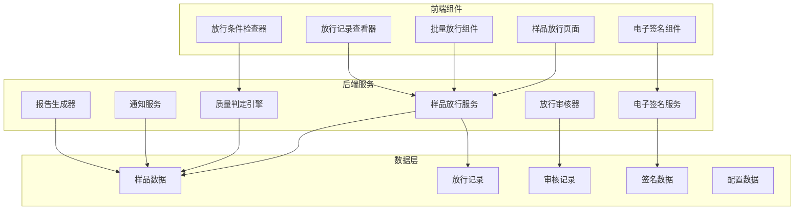
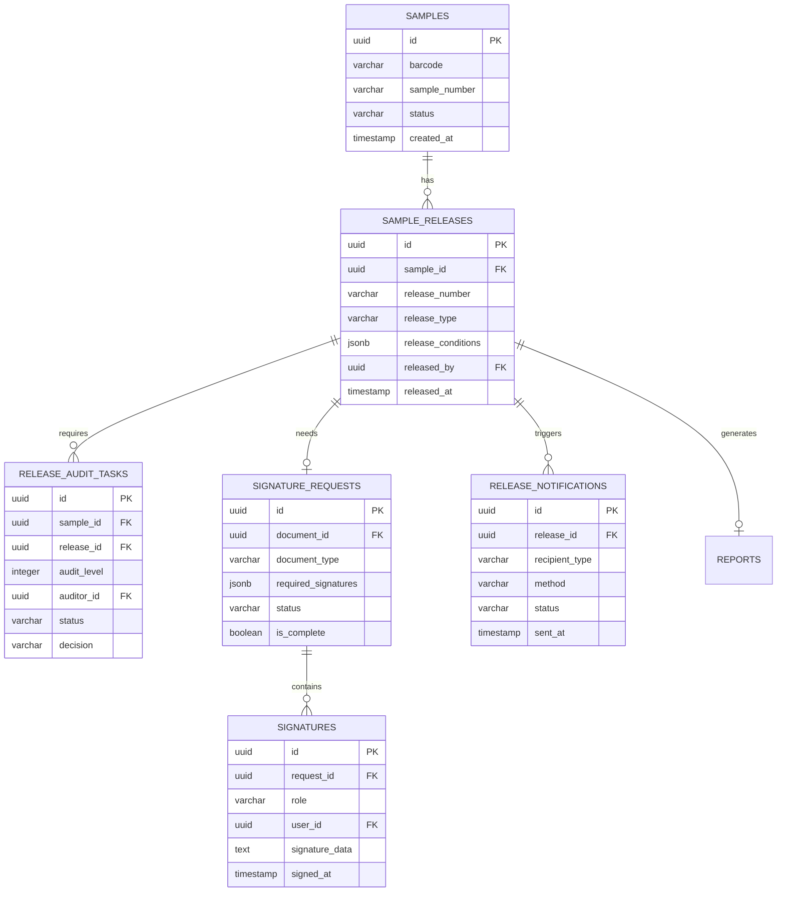
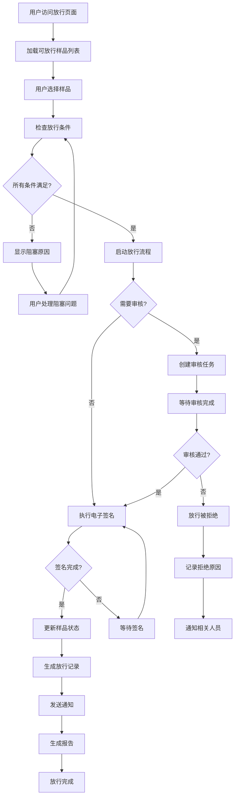
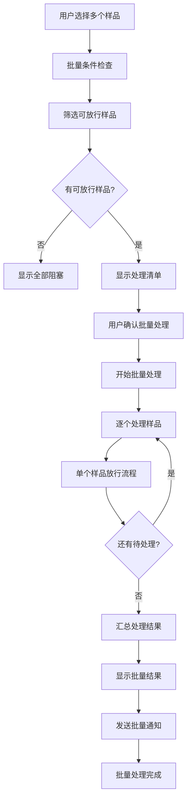
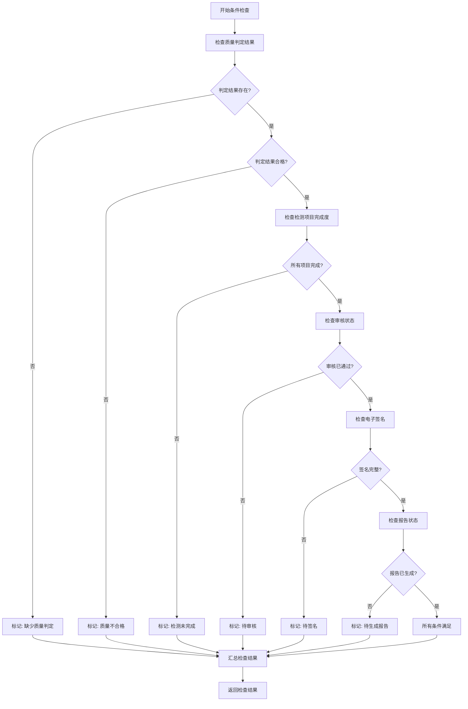
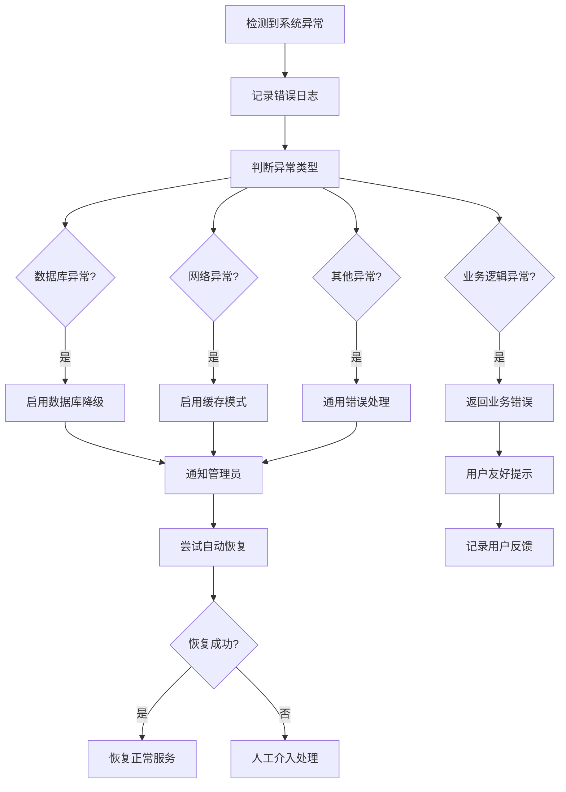
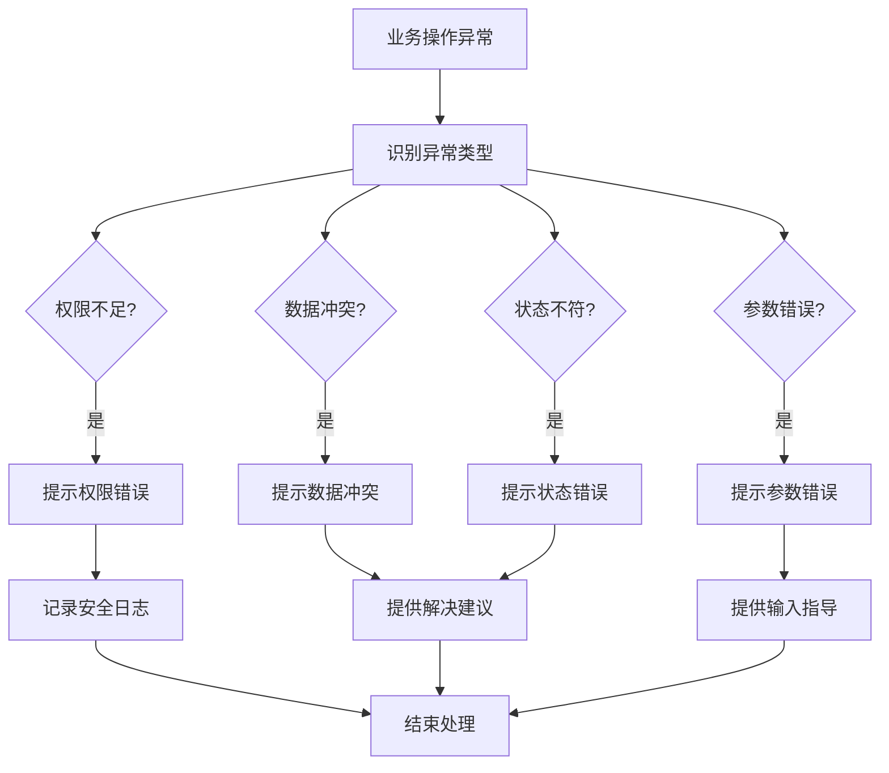
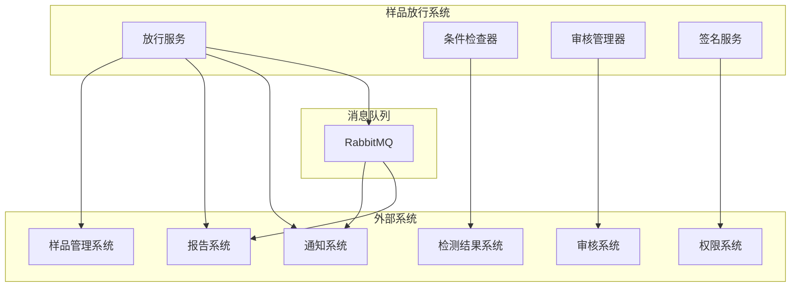

# 检测样品放行页面设计文档

## 概述

检测样品放行页面是实验室管理系统中的核心功能模块，负责管理已完成检测的样品的放行流程。该设计文档基于需求文档中定义的10个核心需求，提供了完整的技术设计方案，确保系统能够安全、高效地处理样品放行业务。

### 设计目标

- **安全性**: 确保只有符合条件的样品才能被放行，防止不合格样品流出
- **可追溯性**: 完整记录放行过程中的所有操作和决策
- **高效性**: 支持批量处理，提高工作效率
- **合规性**: 满足实验室质量管理体系要求
- **可扩展性**: 支持不同类型样品的个性化放行条件配置

### 核心功能

1. 样品放行条件检查和验证
2. 批量样品放行处理
3. 放行审核流程管理
4. 电子签名和授权验证
5. 放行记录管理和监管链维护
6. 放行通知和报告生成
7. 放行条件配置管理
8. 放行数据查询和统计分析
9. 异常样品处理
10. 系统集成和数据同步

## 架构设计

### 系统架构概览

采用分层架构模式，确保系统的可维护性和可扩展性：

```
┌─────────────────────────────────────────────────────────────┐
│                    用户界面层 (UI Layer)                      │
├─────────────────────────────────────────────────────────────┤
│                    业务逻辑层 (Business Layer)                │
├─────────────────────────────────────────────────────────────┤
│                    数据访问层 (Data Access Layer)             │
├─────────────────────────────────────────────────────────────┤
│                    数据存储层 (Data Storage Layer)            │
└─────────────────────────────────────────────────────────────┘
```

### 核心组件架构


### 微服务架构设计

系统采用微服务架构，各服务职责明确，便于独立开发和部署：

#### 1. 样品放行服务 (Sample Release Service)
- **职责**: 核心放行业务逻辑处理
- **功能**: 放行条件检查、批量放行、状态管理
- **接口**: RESTful API
- **数据库**: PostgreSQL (主数据)

#### 2. 质量判定引擎 (Quality Judgment Engine)
- **职责**: 自动质量判定和规则引擎
- **功能**: 判定规则执行、结果计算、异常检测
- **接口**: 内部服务调用
- **数据库**: PostgreSQL (判定规则和结果)

#### 3. 放行审核器 (Release Auditor)
- **职责**: 审核流程管理
- **功能**: 审核任务分配、状态跟踪、决策记录
- **接口**: RESTful API
- **数据库**: PostgreSQL (审核记录)

#### 4. 电子签名服务 (Electronic Signature Service)
- **职责**: 数字签名和身份验证
- **功能**: 签名生成、验证、存储
- **接口**: RESTful API
- **数据库**: PostgreSQL (签名数据) + HSM (密钥管理)

#### 5. 通知服务 (Notification Service)
- **职责**: 消息通知和推送
- **功能**: 邮件通知、短信通知、系统消息
- **接口**: 消息队列 (RabbitMQ)
- **数据库**: Redis (通知状态缓存)

#### 6. 报告生成器 (Report Generator)
- **职责**: 检测报告生成和管理
- **功能**: 模板渲染、PDF生成、报告分发
- **接口**: RESTful API
- **数据库**: PostgreSQL (报告数据) + 文件存储

## 组件和接口设计

### 前端组件架构

#### 1. 样品放行主页面 (SampleReleasePage.vue)
```typescript
interface SampleReleasePageProps {
  // 页面级别的配置
}

interface SampleReleasePageState {
  samples: Sample[]
  selectedSamples: string[]
  filters: ReleaseFilters
  loading: boolean
  batchProcessing: boolean
}
```

#### 2. 放行条件检查器 (ReleaseConditionChecker.vue)
```typescript
interface ReleaseConditionCheckerProps {
  sampleId: string
  autoCheck?: boolean
}

interface ReleaseCondition {
  id: string
  name: string
  type: 'quality' | 'audit' | 'test_completion' | 'custom'
  status: 'passed' | 'failed' | 'pending'
  message: string
  details?: any
}
```

#### 3. 批量放行组件 (BatchReleaseProcessor.vue)
```typescript
interface BatchReleaseProcessorProps {
  sampleIds: string[]
  onProgress?: (progress: BatchProgress) => void
  onComplete?: (result: BatchResult) => void
}

interface BatchProgress {
  total: number
  processed: number
  successful: number
  failed: number
  current?: string
}
```

#### 4. 电子签名组件 (ElectronicSignature.vue)
```typescript
interface ElectronicSignatureProps {
  documentId: string
  requiredSignatures: SignatureRequirement[]
  readonly?: boolean
}

interface SignatureRequirement {
  role: 'releaser' | 'reviewer' | 'approver'
  required: boolean
  completed: boolean
  userId?: string
  userName?: string
  signedAt?: Date
}
```

### 后端服务接口设计

#### 1. 样品放行服务接口

```typescript
// 获取可放行样品列表
GET /api/samples/releasable
Query Parameters:
- page: number
- pageSize: number
- sampleType?: string
- clientName?: string
- priority?: string
- dateRange?: string

Response:
{
  items: ReleasableSample[]
  total: number
  page: number
  pageSize: number
}

// 检查样品放行条件
GET /api/samples/{sampleId}/release-conditions
Response:
{
  sampleId: string
  conditions: ReleaseCondition[]
  canRelease: boolean
  blockingReasons?: string[]
}

// 执行单个样品放行
POST /api/samples/{sampleId}/release
Body:
{
  releaseReason?: string
  signatureData: SignatureData
  notifyClient?: boolean
}

// 批量样品放行
POST /api/samples/batch-release
Body:
{
  sampleIds: string[]
  releaseReason?: string
  signatureData: SignatureData
  notifyClient?: boolean
}
```
#### 2. 质量判定引擎接口

```typescript
// 执行质量判定
POST /api/quality/judgment
Body:
{
  sampleId: string
  ruleIds?: string[]
  performedBy: string
}

Response:
{
  sampleId: string
  result: 'QUALIFIED' | 'UNQUALIFIED'
  basisDetails: JudgmentBasisDetail[]
  isAutomatic: boolean
  judgedBy: string
  judgedAt: Date
}

// 获取判定结果
GET /api/quality/judgment/{sampleId}

// 复核判定结果
POST /api/quality/judgment/{judgmentId}/review
Body:
{
  newResult: 'QUALIFIED' | 'UNQUALIFIED'
  reason: string
  reviewedBy: string
}
```

#### 3. 放行审核器接口

```typescript
// 启动审核流程
POST /api/audit/release/{sampleId}
Body:
{
  auditLevel: number
  requestedBy: string
  reason?: string
}

// 获取审核状态
GET /api/audit/release/{sampleId}/status

// 执行审核决定
POST /api/audit/tasks/{taskId}/decision
Body:
{
  decision: 'approved' | 'rejected' | 'returned'
  comments?: string
  auditorId: string
}
```

#### 4. 电子签名服务接口

```typescript
// 创建签名请求
POST /api/signatures/request
Body:
{
  documentId: string
  documentType: 'release_record' | 'report'
  requiredSignatures: SignatureRequirement[]
  requestedBy: string
}

// 执行签名
POST /api/signatures/sign
Body:
{
  requestId: string
  role: string
  userId: string
  password: string
  comments?: string
}

// 验证签名
GET /api/signatures/{signatureId}/verify
```

## 数据模型设计

### 核心数据模型

#### 1. 样品放行记录 (SampleRelease)

```sql
CREATE TABLE sample_releases (
    id UUID PRIMARY KEY DEFAULT gen_random_uuid(),
    sample_id UUID NOT NULL REFERENCES samples(id),
    release_number VARCHAR(50) UNIQUE NOT NULL,
    release_type VARCHAR(20) NOT NULL DEFAULT 'normal', -- normal, emergency, conditional
    release_conditions JSONB NOT NULL, -- 放行条件检查结果
    release_reason TEXT,
    released_by UUID NOT NULL REFERENCES users(id),
    released_at TIMESTAMP NOT NULL DEFAULT NOW(),
    
    -- 审核信息
    audit_required BOOLEAN NOT NULL DEFAULT false,
    audit_level INTEGER,
    audit_status VARCHAR(20), -- pending, approved, rejected
    audited_by UUID REFERENCES users(id),
    audited_at TIMESTAMP,
    audit_comments TEXT,
    
    -- 签名信息
    signature_request_id UUID REFERENCES signature_requests(id),
    signatures_complete BOOLEAN NOT NULL DEFAULT false,
    
    -- 通知信息
    client_notified BOOLEAN NOT NULL DEFAULT false,
    notification_sent_at TIMESTAMP,
    notification_method VARCHAR(20), -- email, sms, system
    
    -- 报告信息
    report_generated BOOLEAN NOT NULL DEFAULT false,
    report_id UUID REFERENCES reports(id),
    
    -- 元数据
    created_at TIMESTAMP NOT NULL DEFAULT NOW(),
    updated_at TIMESTAMP NOT NULL DEFAULT NOW(),
    
    CONSTRAINT valid_release_type CHECK (release_type IN ('normal', 'emergency', 'conditional')),
    CONSTRAINT valid_audit_status CHECK (audit_status IN ('pending', 'approved', 'rejected'))
);

-- 索引
CREATE INDEX idx_sample_releases_sample_id ON sample_releases(sample_id);
CREATE INDEX idx_sample_releases_released_at ON sample_releases(released_at);
CREATE INDEX idx_sample_releases_release_number ON sample_releases(release_number);
CREATE INDEX idx_sample_releases_audit_status ON sample_releases(audit_status);
```

#### 2. 放行条件配置 (ReleaseConditionConfig)

```sql
CREATE TABLE release_condition_configs (
    id UUID PRIMARY KEY DEFAULT gen_random_uuid(),
    name VARCHAR(100) NOT NULL,
    description TEXT,
    sample_type VARCHAR(50), -- 适用的样品类型，NULL表示通用
    sample_category VARCHAR(50), -- 适用的样品类别
    
    -- 条件定义
    conditions JSONB NOT NULL, -- 条件配置数组
    priority INTEGER NOT NULL DEFAULT 0, -- 优先级，数字越大优先级越高
    
    -- 审核要求
    audit_required BOOLEAN NOT NULL DEFAULT false,
    audit_level INTEGER, -- 审核级别
    
    -- 签名要求
    signature_required BOOLEAN NOT NULL DEFAULT true,
    required_signatures JSONB, -- 必需的签名角色
    
    -- 状态
    is_active BOOLEAN NOT NULL DEFAULT true,
    
    -- 元数据
    created_by UUID NOT NULL REFERENCES users(id),
    created_at TIMESTAMP NOT NULL DEFAULT NOW(),
    updated_at TIMESTAMP NOT NULL DEFAULT NOW(),
    
    CONSTRAINT valid_priority CHECK (priority >= 0),
    CONSTRAINT valid_audit_level CHECK (audit_level IS NULL OR audit_level > 0)
);

-- 索引
CREATE INDEX idx_release_condition_configs_sample_type ON release_condition_configs(sample_type);
CREATE INDEX idx_release_condition_configs_active ON release_condition_configs(is_active);
CREATE INDEX idx_release_condition_configs_priority ON release_condition_configs(priority DESC);
```

#### 3. 放行审核任务 (ReleaseAuditTask)

```sql
CREATE TABLE release_audit_tasks (
    id UUID PRIMARY KEY DEFAULT gen_random_uuid(),
    sample_id UUID NOT NULL REFERENCES samples(id),
    release_id UUID REFERENCES sample_releases(id),
    
    -- 审核信息
    audit_level INTEGER NOT NULL,
    auditor_id UUID NOT NULL REFERENCES users(id),
    status VARCHAR(20) NOT NULL DEFAULT 'pending',
    priority VARCHAR(10) NOT NULL DEFAULT 'normal',
    
    -- 审核结果
    decision VARCHAR(20), -- approved, rejected, returned
    comments TEXT,
    attachments JSONB, -- 附件信息
    
    -- 时间信息
    assigned_at TIMESTAMP NOT NULL DEFAULT NOW(),
    due_date TIMESTAMP,
    started_at TIMESTAMP,
    completed_at TIMESTAMP,
    
    -- 元数据
    created_by UUID NOT NULL REFERENCES users(id),
    created_at TIMESTAMP NOT NULL DEFAULT NOW(),
    updated_at TIMESTAMP NOT NULL DEFAULT NOW(),
    
    CONSTRAINT valid_status CHECK (status IN ('pending', 'in_progress', 'completed', 'cancelled')),
    CONSTRAINT valid_priority CHECK (priority IN ('low', 'normal', 'high', 'urgent')),
    CONSTRAINT valid_decision CHECK (decision IS NULL OR decision IN ('approved', 'rejected', 'returned'))
);

-- 索引
CREATE INDEX idx_release_audit_tasks_sample_id ON release_audit_tasks(sample_id);
CREATE INDEX idx_release_audit_tasks_auditor_id ON release_audit_tasks(auditor_id);
CREATE INDEX idx_release_audit_tasks_status ON release_audit_tasks(status);
CREATE INDEX idx_release_audit_tasks_assigned_at ON release_audit_tasks(assigned_at);
```
#### 4. 电子签名请求 (SignatureRequest)

```sql
CREATE TABLE signature_requests (
    id UUID PRIMARY KEY DEFAULT gen_random_uuid(),
    document_id UUID NOT NULL, -- 关联的文档ID（样品放行记录或报告）
    document_type VARCHAR(20) NOT NULL, -- release_record, report
    
    -- 签名要求
    required_signatures JSONB NOT NULL, -- 必需的签名配置
    current_step INTEGER NOT NULL DEFAULT 1,
    total_steps INTEGER NOT NULL,
    
    -- 状态
    status VARCHAR(20) NOT NULL DEFAULT 'pending',
    is_complete BOOLEAN NOT NULL DEFAULT false,
    
    -- 时间信息
    requested_by UUID NOT NULL REFERENCES users(id),
    requested_at TIMESTAMP NOT NULL DEFAULT NOW(),
    completed_at TIMESTAMP,
    expires_at TIMESTAMP,
    
    -- 元数据
    created_at TIMESTAMP NOT NULL DEFAULT NOW(),
    updated_at TIMESTAMP NOT NULL DEFAULT NOW(),
    
    CONSTRAINT valid_document_type CHECK (document_type IN ('release_record', 'report')),
    CONSTRAINT valid_status CHECK (status IN ('pending', 'in_progress', 'completed', 'expired', 'cancelled')),
    CONSTRAINT valid_steps CHECK (current_step <= total_steps AND total_steps > 0)
);

-- 签名记录表
CREATE TABLE signatures (
    id UUID PRIMARY KEY DEFAULT gen_random_uuid(),
    request_id UUID NOT NULL REFERENCES signature_requests(id),
    
    -- 签名信息
    role VARCHAR(20) NOT NULL, -- releaser, reviewer, approver
    user_id UUID NOT NULL REFERENCES users(id),
    user_name VARCHAR(100) NOT NULL,
    
    -- 签名数据
    signature_data TEXT NOT NULL, -- 加密的签名数据
    signature_hash VARCHAR(64) NOT NULL, -- 签名哈希值
    certificate_info JSONB, -- 证书信息
    
    -- 签名内容
    comments TEXT, -- 签名意见
    ip_address INET, -- 签名时的IP地址
    user_agent TEXT, -- 用户代理信息
    
    -- 时间信息
    signed_at TIMESTAMP NOT NULL DEFAULT NOW(),
    
    -- 验证信息
    is_valid BOOLEAN NOT NULL DEFAULT true,
    verified_at TIMESTAMP,
    
    CONSTRAINT valid_role CHECK (role IN ('releaser', 'reviewer', 'approver')),
    CONSTRAINT unique_request_role UNIQUE (request_id, role)
);

-- 索引
CREATE INDEX idx_signature_requests_document ON signature_requests(document_id, document_type);
CREATE INDEX idx_signature_requests_status ON signature_requests(status);
CREATE INDEX idx_signatures_request_id ON signatures(request_id);
CREATE INDEX idx_signatures_user_id ON signatures(user_id);
```

#### 5. 放行通知记录 (ReleaseNotification)

```sql
CREATE TABLE release_notifications (
    id UUID PRIMARY KEY DEFAULT gen_random_uuid(),
    release_id UUID NOT NULL REFERENCES sample_releases(id),
    
    -- 通知信息
    recipient_type VARCHAR(20) NOT NULL, -- client, internal, system
    recipient_id VARCHAR(100), -- 接收者ID（用户ID或客户ID）
    recipient_name VARCHAR(100),
    recipient_contact VARCHAR(200), -- 联系方式（邮箱、手机号等）
    
    -- 通知内容
    notification_type VARCHAR(20) NOT NULL, -- release_complete, audit_required, etc.
    subject VARCHAR(200),
    content TEXT,
    template_id UUID, -- 使用的通知模板ID
    
    -- 发送信息
    method VARCHAR(20) NOT NULL, -- email, sms, system, webhook
    status VARCHAR(20) NOT NULL DEFAULT 'pending',
    sent_at TIMESTAMP,
    delivered_at TIMESTAMP,
    read_at TIMESTAMP,
    
    -- 错误信息
    error_message TEXT,
    retry_count INTEGER NOT NULL DEFAULT 0,
    max_retries INTEGER NOT NULL DEFAULT 3,
    
    -- 元数据
    created_at TIMESTAMP NOT NULL DEFAULT NOW(),
    updated_at TIMESTAMP NOT NULL DEFAULT NOW(),
    
    CONSTRAINT valid_recipient_type CHECK (recipient_type IN ('client', 'internal', 'system')),
    CONSTRAINT valid_method CHECK (method IN ('email', 'sms', 'system', 'webhook')),
    CONSTRAINT valid_status CHECK (status IN ('pending', 'sent', 'delivered', 'failed', 'cancelled'))
);

-- 索引
CREATE INDEX idx_release_notifications_release_id ON release_notifications(release_id);
CREATE INDEX idx_release_notifications_status ON release_notifications(status);
CREATE INDEX idx_release_notifications_sent_at ON release_notifications(sent_at);
```

### 数据关系图



## 用户界面设计

### 页面布局设计

#### 1. 样品放行主页面布局

```
┌─────────────────────────────────────────────────────────────┐
│                        页面标题栏                            │
│  样品放行管理                                    [帮助] [设置] │
├─────────────────────────────────────────────────────────────┤
│                        筛选条件栏                            │
│ [样品类型▼] [客户名称____] [状态▼] [日期范围____] [搜索] [重置] │
├─────────────────────────────────────────────────────────────┤
│                        操作工具栏                            │
│ [☑全选] [批量放行] [导出数据] [刷新]           显示: 50/页 ▼  │
├─────────────────────────────────────────────────────────────┤
│                        样品列表区域                          │
│ ☑ │样品编号│样品名称│客户│类型│状态│放行条件│操作            │
│ ☑ │SP001   │水样   │A公司│环境│完成│✓通过  │[查看][放行]    │
│ ☑ │SP002   │土样   │B公司│环境│完成│✗阻塞  │[查看][详情]    │
│ ☑ │SP003   │食品   │C公司│食品│完成│✓通过  │[查看][放行]    │
├─────────────────────────────────────────────────────────────┤
│                        分页导航栏                            │
│                    ← 上一页  1 2 3 4 5  下一页 →             │
└─────────────────────────────────────────────────────────────┘
```

#### 2. 样品放行详情页面布局

```
┌─────────────────────────────────────────────────────────────┐
│                        样品基本信息                          │
│ 样品编号: SP001        样品名称: 环境水样                    │
│ 客户名称: A环保公司    样品类型: 环境检测                    │
│ 接收日期: 2024-01-15   当前状态: 检测完成                   │
├─────────────────────────────────────────────────────────────┤
│                        放行条件检查                          │
│ ✓ 质量判定: 合格 (自动判定)                                 │
│ ✓ 检测项目: 全部完成 (15/15)                               │
│ ✓ 审核流程: 已通过 (二级审核)                               │
│ ✓ 报告生成: 已完成                                         │
│ ✗ 电子签名: 待签名 (缺少批准人签名)                         │
├─────────────────────────────────────────────────────────────┤
│                        电子签名状态                          │
│ 编制人: ✓ 张三 (2024-01-20 10:30)                          │
│ 审核人: ✓ 李四 (2024-01-20 14:15)                          │
│ 批准人: ⏳ 待王五签名                                       │
├─────────────────────────────────────────────────────────────┤
│                        操作按钮区域                          │
│              [返回列表] [刷新状态] [执行放行]                │
└─────────────────────────────────────────────────────────────┘
```
#### 3. 批量放行处理页面布局

```
┌─────────────────────────────────────────────────────────────┐
│                        批量放行处理                          │
│ 已选择样品: 5个                                   [取消批量] │
├─────────────────────────────────────────────────────────────┤
│                        选中样品列表                          │
│ SP001 │环境水样│A公司│✓可放行                               │
│ SP003 │食品样品│C公司│✓可放行                               │
│ SP005 │土壤样品│D公司│✗阻塞 (缺少审核)                      │
│ SP007 │水质样品│E公司│✓可放行                               │
│ SP009 │空气样品│F公司│✓可放行                               │
├─────────────────────────────────────────────────────────────┤
│                        处理进度                              │
│ ████████████████████████████████████████ 80% (4/5)          │
│ 当前处理: SP009 - 空气样品                                   │
├─────────────────────────────────────────────────────────────┤
│                        处理结果                              │
│ ✓ 成功: 3个样品已放行                                       │
│ ✗ 失败: 1个样品放行失败                                     │
│ ⏳ 待处理: 1个样品等待处理                                   │
├─────────────────────────────────────────────────────────────┤
│                        操作按钮                              │
│              [开始处理] [暂停] [查看详情] [导出结果]          │
└─────────────────────────────────────────────────────────────┘
```

### 交互设计规范

#### 1. 状态指示器设计

- **可放行状态**: 绿色圆点 + "可放行" 文字
- **阻塞状态**: 红色圆点 + "阻塞" 文字 + 具体原因
- **审核中状态**: 黄色圆点 + "审核中" 文字
- **处理中状态**: 蓝色转圈动画 + "处理中" 文字

#### 2. 操作反馈设计

- **成功操作**: 绿色通知条，3秒后自动消失
- **错误操作**: 红色通知条，需要用户手动关闭
- **警告信息**: 橙色通知条，5秒后自动消失
- **加载状态**: 骨架屏 + 加载动画

#### 3. 表单验证设计

- **实时验证**: 输入框失去焦点时验证
- **错误提示**: 红色边框 + 错误文字提示
- **成功提示**: 绿色边框 + 成功图标
- **必填标识**: 红色星号标记

## 业务流程设计

### 核心业务流程

#### 1. 样品放行主流程



#### 2. 批量放行流程



#### 3. 放行条件检查流程



### 异常处理流程

#### 1. 系统异常处理



#### 2. 业务异常处理



## API接口设计

### RESTful API 设计规范

#### 1. 基础规范

- **Base URL**: `https://api.lab.com/v1`
- **认证方式**: Bearer Token (JWT)
- **内容类型**: `application/json`
- **字符编码**: UTF-8
- **时间格式**: ISO 8601 (YYYY-MM-DDTHH:mm:ss.sssZ)

#### 2. 响应格式标准

```typescript
// 成功响应格式
interface SuccessResponse<T> {
  success: true
  data: T
  message?: string
  timestamp: string
  requestId: string
}

// 错误响应格式
interface ErrorResponse {
  success: false
  error: {
    code: string
    message: string
    details?: any
  }
  timestamp: string
  requestId: string
}

// 分页响应格式
interface PaginatedResponse<T> {
  success: true
  data: {
    items: T[]
    pagination: {
      page: number
      pageSize: number
      total: number
      totalPages: number
      hasNext: boolean
      hasPrev: boolean
    }
  }
  timestamp: string
  requestId: string
}
```
#### 3. 具体API端点设计

```typescript
// 样品放行相关API
interface SampleReleaseAPI {
  // 获取可放行样品列表
  'GET /api/samples/releasable': {
    query: {
      page?: number
      pageSize?: number
      sampleType?: string
      clientName?: string
      priority?: 'low' | 'normal' | 'high' | 'urgent'
      dateRange?: string // ISO date range
    }
    response: PaginatedResponse<ReleasableSample>
  }

  // 检查单个样品放行条件
  'GET /api/samples/:sampleId/release-conditions': {
    response: SuccessResponse<ReleaseConditionCheck>
  }

  // 批量检查放行条件
  'POST /api/samples/batch-check-conditions': {
    body: {
      sampleIds: string[]
    }
    response: SuccessResponse<BatchConditionCheck>
  }

  // 执行单个样品放行
  'POST /api/samples/:sampleId/release': {
    body: {
      releaseReason?: string
      signatureData: SignatureData
      notifyClient?: boolean
      emergencyRelease?: boolean
    }
    response: SuccessResponse<ReleaseRecord>
  }

  // 批量样品放行
  'POST /api/samples/batch-release': {
    body: {
      sampleIds: string[]
      releaseReason?: string
      signatureData: SignatureData
      notifyClient?: boolean
    }
    response: SuccessResponse<BatchReleaseResult>
  }

  // 获取放行记录
  'GET /api/releases/:releaseId': {
    response: SuccessResponse<ReleaseRecord>
  }

  // 查询放行记录列表
  'GET /api/releases': {
    query: {
      page?: number
      pageSize?: number
      sampleType?: string
      clientName?: string
      dateRange?: string
      status?: string
    }
    response: PaginatedResponse<ReleaseRecord>
  }

  // 撤销放行（特殊情况）
  'POST /api/releases/:releaseId/revoke': {
    body: {
      reason: string
      revokedBy: string
    }
    response: SuccessResponse<ReleaseRecord>
  }
}

// 放行条件配置API
interface ReleaseConditionConfigAPI {
  // 获取配置列表
  'GET /api/release-conditions/configs': {
    query: {
      sampleType?: string
      isActive?: boolean
    }
    response: SuccessResponse<ReleaseConditionConfig[]>
  }

  // 创建配置
  'POST /api/release-conditions/configs': {
    body: CreateReleaseConditionConfigDto
    response: SuccessResponse<ReleaseConditionConfig>
  }

  // 更新配置
  'PUT /api/release-conditions/configs/:configId': {
    body: UpdateReleaseConditionConfigDto
    response: SuccessResponse<ReleaseConditionConfig>
  }

  // 删除配置
  'DELETE /api/release-conditions/configs/:configId': {
    response: SuccessResponse<void>
  }
}

// 放行统计API
interface ReleaseStatisticsAPI {
  // 获取放行统计数据
  'GET /api/releases/statistics': {
    query: {
      startDate: string
      endDate: string
      groupBy?: 'day' | 'week' | 'month'
      sampleType?: string
      clientName?: string
    }
    response: SuccessResponse<ReleaseStatistics>
  }

  // 导出放行数据
  'POST /api/releases/export': {
    body: {
      format: 'excel' | 'pdf' | 'csv'
      filters: ReleaseExportFilters
    }
    response: SuccessResponse<ExportResult>
  }

  // 获取放行趋势数据
  'GET /api/releases/trends': {
    query: {
      period: 'week' | 'month' | 'quarter' | 'year'
      metrics: string[] // release_count, release_rate, avg_processing_time
    }
    response: SuccessResponse<TrendData>
  }
}
```

#### 4. 数据传输对象 (DTO) 定义

```typescript
// 可放行样品信息
interface ReleasableSample {
  id: string
  barcode: string
  sampleNumber: string
  sampleName: string
  sampleType: string
  clientName: string
  receivedDate: Date
  currentStatus: SampleStatus
  priority: Priority
  releaseConditions: ReleaseConditionStatus
  estimatedReleaseTime?: Date
}

// 放行条件状态
interface ReleaseConditionStatus {
  canRelease: boolean
  conditions: {
    qualityJudgment: ConditionResult
    testCompletion: ConditionResult
    auditApproval: ConditionResult
    electronicSignature: ConditionResult
    reportGeneration: ConditionResult
  }
  blockingReasons: string[]
}

// 条件检查结果
interface ConditionResult {
  status: 'passed' | 'failed' | 'pending' | 'not_required'
  message: string
  details?: any
  lastChecked: Date
}

// 放行记录
interface ReleaseRecord {
  id: string
  releaseNumber: string
  sampleId: string
  sampleInfo: {
    barcode: string
    sampleNumber: string
    sampleName: string
    clientName: string
  }
  releaseType: 'normal' | 'emergency' | 'conditional'
  releaseConditions: ReleaseConditionCheck
  releaseReason?: string
  releasedBy: {
    userId: string
    userName: string
  }
  releasedAt: Date
  
  // 审核信息
  auditInfo?: {
    required: boolean
    level?: number
    status?: 'pending' | 'approved' | 'rejected'
    auditor?: {
      userId: string
      userName: string
    }
    auditedAt?: Date
    comments?: string
  }
  
  // 签名信息
  signatureInfo: {
    requestId: string
    isComplete: boolean
    signatures: SignatureSummary[]
  }
  
  // 通知信息
  notificationInfo: {
    clientNotified: boolean
    internalNotified: boolean
    sentAt?: Date
    method?: 'email' | 'sms' | 'system'
  }
  
  // 报告信息
  reportInfo?: {
    generated: boolean
    reportId?: string
    generatedAt?: Date
  }
}

// 批量放行结果
interface BatchReleaseResult {
  total: number
  successful: number
  failed: number
  results: {
    sampleId: string
    success: boolean
    releaseRecord?: ReleaseRecord
    error?: string
  }[]
  summary: {
    processingTime: number
    successRate: number
  }
}

// 签名数据
interface SignatureData {
  userId: string
  role: 'releaser' | 'reviewer' | 'approver'
  password: string
  comments?: string
  timestamp: Date
}

// 放行统计数据
interface ReleaseStatistics {
  period: {
    startDate: Date
    endDate: Date
  }
  summary: {
    totalReleases: number
    releaseRate: number
    avgProcessingTime: number
    emergencyReleases: number
  }
  breakdown: {
    bySampleType: Record<string, number>
    byClient: Record<string, number>
    byStatus: Record<string, number>
  }
  trends: {
    daily: TrendPoint[]
    weekly: TrendPoint[]
    monthly: TrendPoint[]
  }
}

interface TrendPoint {
  date: Date
  value: number
  label: string
}
```

## 安全性设计

### 安全架构

#### 1. 认证和授权

```typescript
// 权限定义
enum ReleasePermission {
  VIEW_RELEASABLE_SAMPLES = 'release:view_samples',
  CHECK_RELEASE_CONDITIONS = 'release:check_conditions',
  RELEASE_NORMAL_SAMPLES = 'release:normal',
  RELEASE_EMERGENCY_SAMPLES = 'release:emergency',
  BATCH_RELEASE = 'release:batch',
  REVOKE_RELEASE = 'release:revoke',
  CONFIGURE_CONDITIONS = 'release:configure',
  VIEW_STATISTICS = 'release:statistics',
  EXPORT_DATA = 'release:export'
}

// 角色权限映射
const RolePermissions = {
  'lab_technician': [
    ReleasePermission.VIEW_RELEASABLE_SAMPLES,
    ReleasePermission.CHECK_RELEASE_CONDITIONS
  ],
  'quality_manager': [
    ReleasePermission.VIEW_RELEASABLE_SAMPLES,
    ReleasePermission.CHECK_RELEASE_CONDITIONS,
    ReleasePermission.RELEASE_NORMAL_SAMPLES,
    ReleasePermission.VIEW_STATISTICS
  ],
  'lab_director': [
    ...Object.values(ReleasePermission)
  ]
}
```

#### 2. 数据安全

```typescript
// 敏感数据加密配置
interface EncryptionConfig {
  // 电子签名数据加密
  signatureEncryption: {
    algorithm: 'AES-256-GCM'
    keyRotationPeriod: '90d'
    keyDerivation: 'PBKDF2'
  }
  
  // 放行记录完整性保护
  recordIntegrity: {
    hashAlgorithm: 'SHA-256'
    digitalSignature: true
    timestamping: true
  }
  
  // 通信加密
  transport: {
    protocol: 'TLS 1.3'
    certificateValidation: true
    pinning: true
  }
}

// 数据脱敏规则
interface DataMaskingRules {
  clientContact: 'partial' // 部分遮蔽
  signatureData: 'full' // 完全遮蔽
  auditComments: 'conditional' // 条件遮蔽
}
```

#### 3. 审计日志

```typescript
// 安全事件定义
enum SecurityEvent {
  UNAUTHORIZED_ACCESS_ATTEMPT = 'security.unauthorized_access',
  PERMISSION_DENIED = 'security.permission_denied',
  SUSPICIOUS_BATCH_OPERATION = 'security.suspicious_batch',
  SIGNATURE_VERIFICATION_FAILED = 'security.signature_failed',
  DATA_EXPORT_ATTEMPT = 'security.data_export',
  CONFIGURATION_CHANGED = 'security.config_changed',
  EMERGENCY_RELEASE = 'security.emergency_release'
}

// 审计日志结构
interface SecurityAuditLog {
  id: string
  event: SecurityEvent
  severity: 'low' | 'medium' | 'high' | 'critical'
  userId?: string
  sessionId: string
  ipAddress: string
  userAgent: string
  resource: string
  action: string
  result: 'success' | 'failure' | 'blocked'
  details: Record<string, any>
  timestamp: Date
  
  // 风险评估
  riskScore: number
  riskFactors: string[]
  
  // 响应信息
  responseAction?: 'none' | 'alert' | 'block' | 'investigate'
  alertSent?: boolean
}
```

## 性能设计

### 性能目标

#### 1. 响应时间要求

```typescript
interface PerformanceTargets {
  // 页面加载性能
  pageLoad: {
    initialLoad: '< 2s' // 首次加载时间
    subsequentLoad: '< 1s' // 后续加载时间
    dataRefresh: '< 500ms' // 数据刷新时间
  }
  
  // API响应性能
  apiResponse: {
    conditionCheck: '< 200ms' // 单个样品条件检查
    batchCheck: '< 2s' // 批量条件检查（100个样品）
    singleRelease: '< 1s' // 单个样品放行
    batchRelease: '< 30s' // 批量放行（100个样品）
    dataQuery: '< 1s' // 数据查询
    reportGeneration: '< 5s' // 报告生成
  }
  
  // 并发性能
  concurrency: {
    maxConcurrentUsers: 50 // 最大并发用户数
    maxConcurrentReleases: 10 // 最大并发放行操作
    queueProcessingRate: '100 samples/min' // 队列处理速率
  }
}
```

#### 2. 性能优化策略

```typescript
// 缓存策略
interface CacheStrategy {
  // Redis缓存配置
  redis: {
    // 样品条件检查结果缓存
    conditionCheck: {
      ttl: '5m'
      keyPattern: 'release:condition:{sampleId}'
      invalidateOn: ['sample_status_change', 'test_result_update']
    }
    
    // 用户权限缓存
    permissions: {
      ttl: '30m'
      keyPattern: 'user:permissions:{userId}'
      invalidateOn: ['role_change', 'permission_update']
    }
    
    // 配置数据缓存
    config: {
      ttl: '1h'
      keyPattern: 'release:config:{sampleType}'
      invalidateOn: ['config_update']
    }
  }
  
  // 浏览器缓存配置
  browser: {
    staticAssets: '1y' // 静态资源缓存
    apiResponses: '5m' // API响应缓存
    userPreferences: '1d' // 用户偏好缓存
  }
}

// 数据库优化
interface DatabaseOptimization {
  // 索引策略
  indexes: {
    samples: ['status', 'sample_type', 'client_name', 'received_date']
    releases: ['sample_id', 'released_at', 'release_number']
    audit_tasks: ['sample_id', 'auditor_id', 'status']
    signatures: ['request_id', 'user_id', 'signed_at']
  }
  
  // 分区策略
  partitioning: {
    releases: 'monthly' // 按月分区
    audit_logs: 'weekly' // 按周分区
    notifications: 'daily' // 按日分区
  }
  
  // 查询优化
  queryOptimization: {
    batchSize: 100 // 批量查询大小
    connectionPoolSize: 20 // 连接池大小
    queryTimeout: '30s' // 查询超时时间
  }
}
```

#### 3. 监控和告警

```typescript
// 性能监控指标
interface PerformanceMetrics {
  // 应用性能指标
  application: {
    responseTime: 'avg, p95, p99'
    throughput: 'requests/second'
    errorRate: 'percentage'
    availability: 'uptime percentage'
  }
  
  // 业务性能指标
  business: {
    releaseProcessingTime: 'avg time from request to completion'
    batchProcessingEfficiency: 'samples processed per minute'
    conditionCheckAccuracy: 'false positive/negative rate'
    userSatisfactionScore: 'based on user feedback'
  }
  
  // 系统资源指标
  system: {
    cpuUsage: 'percentage'
    memoryUsage: 'percentage'
    diskIO: 'operations per second'
    networkLatency: 'milliseconds'
  }
}

// 告警规则
interface AlertRules {
  critical: {
    apiResponseTime: '> 5s'
    errorRate: '> 5%'
    systemAvailability: '< 99%'
    batchProcessingFailure: '> 10%'
  }
  
  warning: {
    apiResponseTime: '> 2s'
    errorRate: '> 2%'
    concurrentUsers: '> 40'
    queueBacklog: '> 100 items'
  }
}
```

## 集成设计

### 系统集成架构

#### 1. 内部系统集成


#### 2. 集成接口设计

```typescript
// 样品管理系统集成
interface SampleManagementIntegration {
  // 获取样品信息
  getSampleInfo(sampleId: string): Promise<SampleInfo>
  
  // 更新样品状态
  updateSampleStatus(sampleId: string, status: SampleStatus): Promise<void>
  
  // 批量获取样品信息
  getBatchSampleInfo(sampleIds: string[]): Promise<SampleInfo[]>
  
  // 监听样品状态变更
  onSampleStatusChange(callback: (event: SampleStatusChangeEvent) => void): void
}

// 检测结果系统集成
interface TestResultIntegration {
  // 获取检测结果
  getTestResults(sampleId: string): Promise<TestResult[]>
  
  // 检查检测完成度
  checkTestCompletion(sampleId: string): Promise<TestCompletionStatus>
  
  // 获取质量判定结果
  getQualityJudgment(sampleId: string): Promise<QualityJudgment>
  
  // 监听检测结果更新
  onTestResultUpdate(callback: (event: TestResultUpdateEvent) => void): void
}

// 审核系统集成
interface AuditSystemIntegration {
  // 创建审核任务
  createAuditTask(request: CreateAuditTaskRequest): Promise<AuditTask>
  
  // 获取审核状态
  getAuditStatus(sampleId: string): Promise<AuditStatus>
  
  // 监听审核完成
  onAuditComplete(callback: (event: AuditCompleteEvent) => void): void
}

// 报告系统集成
interface ReportSystemIntegration {
  // 触发报告生成
  generateReport(request: GenerateReportRequest): Promise<ReportGenerationResult>
  
  // 获取报告状态
  getReportStatus(reportId: string): Promise<ReportStatus>
  
  // 分发报告
  distributeReport(reportId: string, recipients: Recipient[]): Promise<DistributionResult>
}
```

#### 3. 消息队列集成

```typescript
// 消息队列配置
interface MessageQueueConfig {
  // RabbitMQ配置
  rabbitmq: {
    host: string
    port: number
    username: string
    password: string
    vhost: string
    
    // 交换机配置
    exchanges: {
      sampleRelease: {
        name: 'sample.release'
        type: 'topic'
        durable: true
      }
      notifications: {
        name: 'notifications'
        type: 'direct'
        durable: true
      }
    }
    
    // 队列配置
    queues: {
      releaseProcessing: {
        name: 'release.processing'
        durable: true
        maxRetries: 3
      }
      notificationSending: {
        name: 'notification.sending'
        durable: true
        maxRetries: 5
      }
      reportGeneration: {
        name: 'report.generation'
        durable: true
        maxRetries: 2
      }
    }
  }
}

// 消息定义
interface ReleaseMessages {
  // 样品放行开始
  'sample.release.started': {
    sampleId: string
    releaseId: string
    releasedBy: string
    timestamp: Date
  }
  
  // 样品放行完成
  'sample.release.completed': {
    sampleId: string
    releaseId: string
    releaseNumber: string
    releasedBy: string
    timestamp: Date
  }
  
  // 批量放行进度
  'batch.release.progress': {
    batchId: string
    total: number
    processed: number
    successful: number
    failed: number
  }
  
  // 放行失败
  'sample.release.failed': {
    sampleId: string
    releaseId: string
    error: string
    timestamp: Date
  }
}
```

#### 4. 数据同步策略

```typescript
// 数据同步配置
interface DataSyncConfig {
  // 实时同步
  realtime: {
    // 样品状态同步
    sampleStatus: {
      source: 'sample_management'
      target: 'release_system'
      method: 'webhook'
      retryPolicy: {
        maxRetries: 3
        backoffStrategy: 'exponential'
      }
    }
    
    // 检测结果同步
    testResults: {
      source: 'test_result_system'
      target: 'release_system'
      method: 'message_queue'
      batchSize: 50
    }
  }
  
  // 定时同步
  scheduled: {
    // 配置数据同步
    configSync: {
      frequency: '1h'
      source: 'configuration_service'
      target: 'release_system'
    }
    
    // 用户权限同步
    permissionSync: {
      frequency: '30m'
      source: 'permission_system'
      target: 'release_system'
    }
  }
  
  // 数据一致性检查
  consistencyCheck: {
    frequency: '6h'
    scope: ['sample_status', 'test_results', 'audit_status']
    alertOnInconsistency: true
  }
}
```

## 正确性属性

*属性是一个特征或行为，应该在系统的所有有效执行中保持为真——本质上，是关于系统应该做什么的正式声明。属性作为人类可读规范和机器可验证正确性保证之间的桥梁。*

基于前面的prework分析和属性反思，以下是经过优化合并的正确性属性：

### 属性 1: 放行条件综合检查

*对于任何*样品，当执行放行条件检查时，系统应该验证质量判定结果存在且合格、所有必需检测项目已完成、审核流程已通过，并且只有满足所有条件的样品才能被标记为可放行状态。

**验证需求: 1.2, 1.3, 1.4, 1.6**

### 属性 2: 条件不满足时的阻塞处理

*对于任何*不满足放行条件的样品，系统应该阻止放行操作并显示具体的阻塞原因，确保用户了解需要解决的问题。

**验证需求: 1.5, 1.6**

### 属性 3: 批量处理条件检查一致性

*对于任何*批量选择的样品集合，系统对每个样品执行的条件检查结果应该与单独检查该样品时的结果一致，并且能够正确识别和警告不符合条件的样品。

**验证需求: 2.2, 2.3**

### 属性 4: 批量处理记录完整性

*对于任何*成功的批量放行操作，系统应该为每个样品创建独立的放行记录，并生成准确的处理结果摘要，确保批量操作的可追溯性。

**验证需求: 2.5, 2.6**

### 属性 5: 审核流程自动化管理

*对于任何*配置了审核要求的样品，系统应该根据样品类型和重要性自动确定审核级别，启动相应的审核流程，并将任务分配给合适的审核人员。

**验证需求: 3.1, 3.2, 3.3**

### 属性 6: 审核结果处理一致性

*对于任何*完成的审核任务，系统应该正确记录审核意见和决定，如果审核被拒绝则阻止样品放行并记录拒绝原因。

**验证需求: 3.5, 3.6**

### 属性 7: 电子签名验证完整性

*对于任何*放行操作，系统应该要求并验证电子签名，检查用户权限和签名有效性，如果验证失败则拒绝放行操作。

**验证需求: 4.1, 4.2, 4.3, 4.5**

### 属性 8: 签名数据存储关联性

*对于任何*成功的电子签名，系统应该记录完整的签名信息（签名人、时间、数据）并将其正确关联到相应的放行记录中。

**验证需求: 4.4, 4.6**

### 属性 9: 放行记录创建完整性

*对于任何*成功放行的样品，系统应该创建包含所有必要信息的完整放行记录，包括放行时间、人员、原因、去向信息，并生成唯一的放行编号。

**验证需求: 5.1, 5.2, 5.3, 5.5**

### 属性 10: 样品状态更新一致性

*对于任何*成功放行的样品，系统应该将样品状态更新为"已放行"，并确保状态变更在所有相关系统中保持一致。

**验证需求: 5.4, 10.1**

### 属性 11: 放行记录不可篡改性

*对于任何*已创建的放行记录，系统应该通过加密哈希和数字签名确保记录的完整性，防止未授权的修改。

**验证需求: 5.6**

### 属性 12: 通知发送完整性

*对于任何*完成的样品放行，系统应该向委托方和相关内部人员发送通知，并记录所有通知的发送状态和时间。

**验证需求: 6.1, 6.2, 6.6**

### 属性 13: 报告生成和分发一致性

*对于任何*需要生成检测报告的样品，系统应该自动生成包含放行信息和电子签名的最终报告，并提供下载和分发功能。

**验证需求: 6.3, 6.4, 6.5**

### 属性 14: 配置管理灵活性

*对于任何*样品类型，系统应该支持配置不同的放行条件、检测项目要求、审核级别和签名要求，并在配置变更时记录变更历史。

**验证需求: 7.2, 7.3, 7.4, 7.5, 7.6**

### 属性 15: 查询筛选准确性

*对于任何*查询请求，系统应该根据指定的筛选条件（时间范围、样品类型、委托方等）返回准确的放行记录，确保查询结果的正确性。

**验证需求: 8.1, 8.2**

### 属性 16: 统计分析准确性

*对于任何*统计请求，系统应该提供准确的放行统计报表、趋势分析图表，支持自定义统计周期和维度，并支持多种格式的数据导出。

**验证需求: 8.3, 8.4, 8.5, 8.6**

### 属性 17: 异常样品保护机制

*对于任何*存在异常检测结果的样品，系统应该标记为异常状态，阻止自动放行，并在需要时启动人工审核流程。

**验证需求: 9.1, 9.2, 9.3**

### 属性 18: 异常处理记录完整性

*对于任何*异常样品的处理，系统应该记录完整的处理过程和决定，如果经审核后可以放行则记录特殊放行原因，并生成相应的标识和警告信息。

**验证需求: 9.4, 9.5, 9.6**

### 属性 19: 系统集成数据同步一致性

*对于任何*与外部系统的数据交互，放行系统应该与样品管理、检测结果、审核、报告和权限系统保持实时数据同步，确保数据的一致性和准确性。

**验证需求: 10.1, 10.2, 10.3, 10.4, 10.5**

### 属性 20: 集成异常处理机制

*对于任何*系统集成异常情况，放行系统应该记录详细的错误信息，提供适当的降级处理方案，确保核心功能的可用性。

**验证需求: 10.6**

## 错误处理

### 错误分类和处理策略

#### 1. 业务逻辑错误

```typescript
enum BusinessErrorCode {
  // 放行条件错误
  RELEASE_CONDITIONS_NOT_MET = 'RELEASE_001',
  QUALITY_JUDGMENT_MISSING = 'RELEASE_002',
  TEST_INCOMPLETE = 'RELEASE_003',
  AUDIT_PENDING = 'RELEASE_004',
  SIGNATURE_INCOMPLETE = 'RELEASE_005',
  
  // 权限错误
  INSUFFICIENT_PERMISSION = 'AUTH_001',
  SIGNATURE_UNAUTHORIZED = 'AUTH_002',
  AUDIT_UNAUTHORIZED = 'AUTH_003',
  
  // 状态错误
  INVALID_SAMPLE_STATUS = 'STATUS_001',
  ALREADY_RELEASED = 'STATUS_002',
  RELEASE_REVOKED = 'STATUS_003',
  
  // 配置错误
  INVALID_CONFIGURATION = 'CONFIG_001',
  MISSING_RELEASE_CONFIG = 'CONFIG_002'
}

interface BusinessError {
  code: BusinessErrorCode
  message: string
  details?: any
  suggestions?: string[]
  retryable: boolean
}
```

#### 2. 系统错误处理

```typescript
enum SystemErrorCode {
  // 数据库错误
  DATABASE_CONNECTION_FAILED = 'DB_001',
  DATABASE_QUERY_TIMEOUT = 'DB_002',
  DATABASE_CONSTRAINT_VIOLATION = 'DB_003',
  
  // 外部服务错误
  EXTERNAL_SERVICE_UNAVAILABLE = 'EXT_001',
  EXTERNAL_SERVICE_TIMEOUT = 'EXT_002',
  EXTERNAL_SERVICE_AUTH_FAILED = 'EXT_003',
  
  // 系统资源错误
  MEMORY_INSUFFICIENT = 'SYS_001',
  DISK_SPACE_INSUFFICIENT = 'SYS_002',
  NETWORK_UNREACHABLE = 'SYS_003'
}

// 错误恢复策略
interface ErrorRecoveryStrategy {
  // 重试策略
  retry: {
    maxAttempts: number
    backoffStrategy: 'linear' | 'exponential' | 'fixed'
    baseDelay: number
    maxDelay: number
  }
  
  // 降级策略
  fallback: {
    enabled: boolean
    fallbackMethod: 'cache' | 'default' | 'manual'
    fallbackData?: any
  }
  
  // 通知策略
  notification: {
    alertLevel: 'info' | 'warning' | 'error' | 'critical'
    notifyUsers: boolean
    notifyAdmins: boolean
  }
}
```

## 测试策略

### 双重测试方法

系统采用单元测试和基于属性的测试相结合的方法，确保全面的测试覆盖：

#### 1. 单元测试策略

**单元测试重点**：
- 具体示例和边界情况验证
- 组件间集成点测试
- 错误条件和异常处理
- 用户界面交互逻辑

**测试框架**：
- 前端：Jest + Vue Test Utils
- 后端：Jest + Supertest
- 数据库：Jest + 测试数据库

#### 2. 基于属性的测试策略

**属性测试重点**：
- 验证设计文档中定义的20个正确性属性
- 通过随机化输入实现全面的输入覆盖
- 验证系统在各种条件下的通用正确性

**测试配置**：
- 最小迭代次数：每个属性测试100次
- 测试库：fast-check (JavaScript)
- 标签格式：**Feature: sample-release-page, Property {number}: {property_text}**

#### 3. 测试实现示例

```typescript
// 属性测试示例：属性1 - 放行条件综合检查
describe('Property-based Tests', () => {
  test('Property 1: 放行条件综合检查', async () => {
    // Feature: sample-release-page, Property 1: 放行条件综合检查
    await fc.assert(
      fc.asyncProperty(
        fc.record({
          sampleId: fc.string(),
          qualityJudgment: fc.record({
            exists: fc.boolean(),
            result: fc.constantFrom('QUALIFIED', 'UNQUALIFIED')
          }),
          testCompletion: fc.record({
            total: fc.integer({ min: 1, max: 20 }),
            completed: fc.integer({ min: 0, max: 20 })
          }),
          auditStatus: fc.constantFrom('pending', 'approved', 'rejected')
        }),
        async (sampleData) => {
          const conditionCheck = await checkReleaseConditions(sampleData.sampleId)
          
          const shouldBeReleasable = 
            sampleData.qualityJudgment.exists &&
            sampleData.qualityJudgment.result === 'QUALIFIED' &&
            sampleData.testCompletion.completed === sampleData.testCompletion.total &&
            sampleData.auditStatus === 'approved'
          
          expect(conditionCheck.canRelease).toBe(shouldBeReleasable)
          
          if (!shouldBeReleasable) {
            expect(conditionCheck.blockingReasons.length).toBeGreaterThan(0)
          }
        }
      ),
      { numRuns: 100 }
    )
  })
  
  // 更多属性测试...
})

// 单元测试示例
describe('Unit Tests', () => {
  test('应该正确显示放行条件检查结果', async () => {
    const mockSample = {
      id: 'sample-001',
      status: 'AUDIT_COMPLETE',
      qualityJudgment: { result: 'QUALIFIED' }
    }
    
    const result = await checkReleaseConditions(mockSample.id)
    
    expect(result.canRelease).toBe(true)
    expect(result.conditions.qualityJudgment.status).toBe('passed')
  })
  
  test('应该处理批量放行中的部分失败情况', async () => {
    const sampleIds = ['sample-001', 'sample-002', 'sample-003']
    // sample-002 不满足放行条件
    
    const result = await batchRelease(sampleIds)
    
    expect(result.total).toBe(3)
    expect(result.successful).toBe(2)
    expect(result.failed).toBe(1)
    expect(result.results).toHaveLength(3)
  })
})
```

通过这种双重测试策略，我们确保了：
- **单元测试**捕获具体的错误和边界情况
- **属性测试**验证系统的通用正确性和鲁棒性
- **综合覆盖**通过随机化测试发现意外的错误模式

每个正确性属性都必须通过对应的属性测试实现，确保设计文档中的规范得到验证。