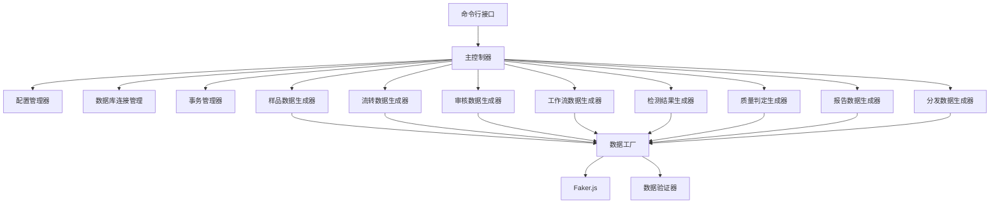
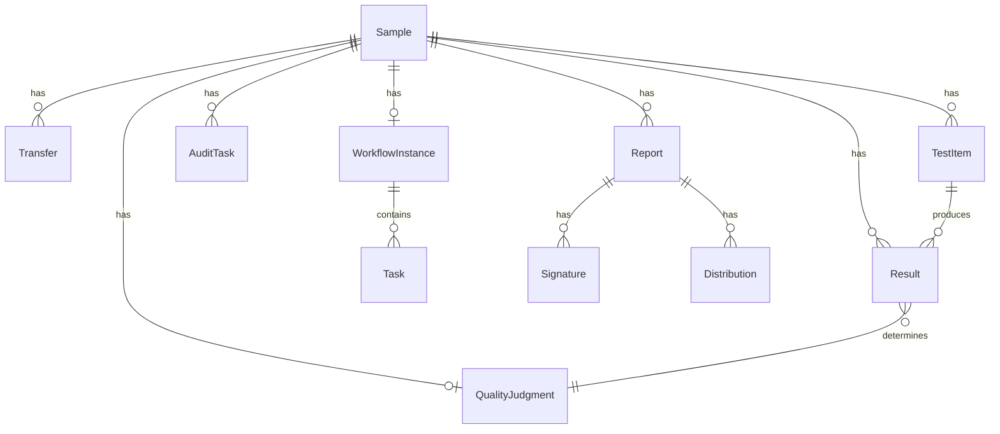

# 测试数据填充功能 - 技术设计文档

## 概述

测试数据填充功能为实验室管理系统提供了一个统一的数据生成工具,用于在开发、测试和演示环境中快速创建完整、一致且多样化的测试数据。该功能通过可执行脚本的方式,为系统的各个模块生成符合业务逻辑的模拟数据,确保所有页面都能展示完整的功能。

### 设计目标

1. **完整性**: 为所有主要模块生成测试数据
2. **一致性**: 确保数据之间的关联关系正确,符合业务逻辑
3. **多样性**: 生成不同状态、类型和场景的数据
4. **可控性**: 支持选择性填充和数据清除
5. **可维护性**: 代码结构清晰,易于扩展新的数据类型

## 架构设计

### 整体架构

系统采用模块化的数据填充架构,每个业务模块对应一个独立的数据生成器(Seeder),由主控制器统一调度和管理。



### 核心组件

#### 1. 主控制器 (SeedController)

负责协调整个数据填充流程,管理各个数据生成器的执行顺序和依赖关系。

**职责:**
- 解析命令行参数
- 初始化数据库连接
- 管理事务边界
- 调度各个数据生成器
- 收集和输出统计信息
- 错误处理和回滚

#### 2. 数据生成器 (Seeders)

每个数据生成器负责特定模块的数据创建,遵循统一的接口规范。

**通用接口:**
```typescript
interface ISeeder {
  name: string;
  dependencies: string[]; // 依赖的其他生成器
  seed(context: SeedContext): Promise<SeedResult>;
  clear(context: SeedContext): Promise<void>;
}
```

#### 3. 数据工厂 (DataFactory)

提供通用的数据生成方法,封装 Faker.js 和自定义的数据生成逻辑。

**功能:**
- 生成符合中国习惯的姓名、地址、电话等
- 生成符合业务规则的编号和条码
- 生成合理的时间序列
- 生成符合范围的数值数据

#### 4. 配置管理器 (ConfigManager)

管理数据填充的配置参数,如数据量、时间范围等。

#### 5. 数据验证器 (Validator)

验证生成的数据是否符合数据库约束和业务规则。

## 组件和接口

### 数据生成器详细设计

#### SampleSeeder - 样品数据生成器

**功能:** 生成样品基础数据

**生成策略:**
- 数量: 30-50 个样品
- 类型分布: 水质(40%)、土壤(30%)、食品(20%)、其他(10%)
- 状态分布: 
  - REGISTERED(10%)
  - IN_TESTING(20%)
  - TESTING_COMPLETE(25%)
  - IN_AUDIT(20%)
  - AUDIT_COMPLETE(15%)
  - RELEASED(10%)
- 优先级分布: LOW(20%)、NORMAL(50%)、HIGH(20%)、URGENT(10%)
- 时间范围: 过去 90 天内

**关键字段生成规则:**
- `barcode`: SAMPLE-YYYY-NNNN 格式
- `sampleNumber`: SYYYY-MMDD-NNN 格式
- `clientName`: 随机公司名称
- `receivedDate`: 随机日期(过去90天)
- `samplingDate`: receivedDate 前 1-7 天

#### TransferSeeder - 流转数据生成器

**功能:** 为样品生成流转记录

**依赖:** SampleSeeder

**生成策略:**
- 每个样品生成 2-4 条流转记录
- 状态分布: PENDING(15%)、IN_TRANSIT(20%)、RECEIVED(60%)、REJECTED(5%)
- 时间序列: 流转日期按时间顺序递增
- 确认状态: RECEIVED 状态的记录双方都已确认

**关键字段生成规则:**
- `fromLocation`: 随机实验室位置
- `toLocation`: 不同于 fromLocation 的位置
- `transferDate`: 样品接收日期后的递增时间
- `receivedDate`: transferDate 后 1-3 天(RECEIVED 状态)

#### AuditSeeder - 审核数据生成器

**功能:** 生成审核任务数据

**依赖:** SampleSeeder

**生成策略:**
- 为状态 >= IN_AUDIT 的样品生成审核任务
- 审核级别: 1-3 级
- 状态分布: PENDING(20%)、IN_PROGRESS(10%)、APPROVED(60%)、REJECTED(10%)
- 审核时长: 2-48 小时

**关键字段生成规则:**
- `level`: 根据样品状态确定审核级别
- `auditorId`: 随机分配审核人员
- `submittedAt`: 样品进入审核状态的时间
- `completedAt`: submittedAt 后 2-48 小时(已完成状态)
- `decision`: 根据 status 确定
- `comments`: 根据 decision 生成相应的审核意见

#### WorkflowSeeder - 工作流实例生成器

**功能:** 基于工作流模板生成工作流实例

**依赖:** SampleSeeder

**生成策略:**
- 为 60% 的样品创建工作流实例
- 状态分布: RUNNING(30%)、COMPLETED(50%)、SUSPENDED(10%)、TERMINATED(10%)
- 为每个实例生成 3-8 个任务

**关键字段生成规则:**
- `workflowId`: 随机选择已有的工作流模板
- `currentNodes`: RUNNING 状态时设置当前节点
- `status`: 根据样品状态推断
- `variables`: 生成工作流变量数据

**任务生成规则:**
- `status`: PENDING(20%)、ASSIGNED(15%)、IN_PROGRESS(15%)、COMPLETED(45%)、REJECTED(5%)
- `assignedTo`: 随机分配技术人员
- `priority`: 继承样品优先级

#### ResultSeeder - 检测结果生成器

**功能:** 生成检测结果数据

**依赖:** SampleSeeder

**生成策略:**
- 为每个检测项目生成 3-6 个检测参数结果
- 来源分布: MANUAL(40%)、INSTRUMENT(50%)、CALCULATED(10%)
- 异常率: 5% 的结果标记为异常
- 复测率: 2% 的结果有复测记录

**关键字段生成规则:**
- `parameter`: 根据样品类型选择合适的检测参数
- `value`: 根据参数类型生成合理范围的数值
- `unit`: 根据参数类型确定单位
- `method`: 关联到已有的检测方法
- `isAbnormal`: 5% 概率为 true
- `isRetest`: 2% 概率为 true

#### JudgmentSeeder - 质量判定生成器

**功能:** 生成质量判定数据

**依赖:** SampleSeeder, ResultSeeder

**生成策略:**
- 为状态 >= TESTING_COMPLETE 的样品生成判定记录
- 结果分布: QUALIFIED(75%)、UNQUALIFIED(20%)、PENDING(5%)
- 自动判定比例: 80%
- 10% 的判定记录有历史变更

**关键字段生成规则:**
- `result`: 根据检测结果数值判断
- `basis`: 生成判定依据的 JSON 数据
- `isAutomatic`: 80% 概率为 true
- `judgedBy`: 自动判定时为系统,否则为随机人员

#### ReportSeeder - 报告数据生成器

**功能:** 生成检测报告数据

**依赖:** SampleSeeder, JudgmentSeeder

**生成策略:**
- 为状态 >= AUDIT_COMPLETE 的样品生成报告
- 状态分布: DRAFT(10%)、PENDING_SIGNATURE(15%)、SIGNED(50%)、DISTRIBUTED(20%)、RECALLED(5%)
- 签名数量: 1-3 个签名

**关键字段生成规则:**
- `reportNumber`: REPORT-YYYY-NNNNNN 格式
- `templateId`: 随机选择激活的报告模板
- `content`: 基于模板生成报告内容
- `status`: 根据样品状态推断
- `generatedAt`: 判定完成后的时间

**签名生成规则:**
- `signerRole`: 检测员、审核员、批准人
- `signatureData`: 模拟的加密签名数据
- `signedAt`: 按角色顺序递增的时间

#### DistributionSeeder - 分发数据生成器

**功能:** 生成报告分发记录

**依赖:** ReportSeeder

**生成策略:**
- 为状态 >= SIGNED 的报告生成分发记录
- 每个报告 1-3 条分发记录
- 方式分布: EMAIL(60%)、DOWNLOAD(30%)、PRINT(10%)
- 状态分布: PENDING(10%)、SENT(70%)、RECEIVED(15%)、FAILED(5%)

**关键字段生成规则:**
- `method`: 随机选择分发方式
- `recipient`: 样品客户名称
- `recipientEmail`: EMAIL 方式时生成邮箱
- `status`: 根据分发方式和时间推断
- `sentAt`: 报告签名后的时间

### 数据工厂方法

```typescript
class DataFactory {
  // 生成中文姓名
  generateChineseName(): string
  
  // 生成公司名称
  generateCompanyName(): string
  
  // 生成样品编号
  generateSampleNumber(date: Date): string
  
  // 生成条码
  generateBarcode(prefix: string, sequence: number): string
  
  // 生成电话号码
  generatePhoneNumber(): string
  
  // 生成邮箱地址
  generateEmail(name: string): string
  
  // 生成实验室位置
  generateLabLocation(): string
  
  // 生成检测参数值
  generateParameterValue(parameter: string, sampleType: string): number
  
  // 生成时间序列
  generateTimeSequence(startDate: Date, count: number, interval: TimeInterval): Date[]
  
  // 生成审核意见
  generateAuditComment(decision: AuditDecision): string
  
  // 生成判定依据
  generateJudgmentBasis(results: Result[]): string
}
```

## 数据模型

### 核心数据结构

#### SeedContext

```typescript
interface SeedContext {
  prisma: PrismaClient;
  config: SeedConfig;
  cache: Map<string, any>; // 缓存已生成的数据
  stats: SeedStats;
}
```

#### SeedConfig

```typescript
interface SeedConfig {
  // 数据量配置
  sampleCount: number;
  transferPerSample: number;
  auditTaskCount: number;
  workflowInstanceRatio: number;
  resultPerTestItem: number;
  
  // 时间范围配置
  dateRangeStart: Date;
  dateRangeEnd: Date;
  
  // 分布配置
  sampleTypeDistribution: Record<string, number>;
  statusDistribution: Record<string, number>;
  priorityDistribution: Record<string, number>;
  
  // 选项
  clearExisting: boolean;
  modules: string[]; // 要填充的模块列表
  verbose: boolean;
}
```

#### SeedResult

```typescript
interface SeedResult {
  seederName: string;
  recordsCreated: number;
  duration: number;
  errors: string[];
}
```

#### SeedStats

```typescript
interface SeedStats {
  totalRecords: number;
  recordsByModule: Record<string, number>;
  startTime: Date;
  endTime?: Date;
  duration?: number;
}
```

### 数据关系图



## 错误处理

### 错误类型

1. **数据库连接错误**: 无法连接到数据库
2. **数据验证错误**: 生成的数据不符合约束
3. **依赖错误**: 依赖的数据不存在
4. **事务错误**: 事务提交失败

### 错误处理策略

#### 1. 连接错误

```typescript
try {
  await prisma.$connect();
} catch (error) {
  console.error('数据库连接失败:', error.message);
  process.exit(1);
}
```

#### 2. 数据验证错误

```typescript
try {
  await validator.validate(data);
  await prisma.model.create({ data });
} catch (error) {
  if (error instanceof ValidationError) {
    console.warn(`数据验证失败,跳过: ${error.message}`);
    stats.skipped++;
  } else {
    throw error;
  }
}
```

#### 3. 事务回滚

```typescript
try {
  await prisma.$transaction(async (tx) => {
    // 执行所有数据生成操作
    for (const seeder of seeders) {
      await seeder.seed(context);
    }
  });
} catch (error) {
  console.error('数据填充失败,已回滚所有更改:', error.message);
  throw error;
}
```

#### 4. 部分失败处理

对于非关键错误,记录警告但继续执行:

```typescript
const results: SeedResult[] = [];
for (const seeder of seeders) {
  try {
    const result = await seeder.seed(context);
    results.push(result);
  } catch (error) {
    console.warn(`${seeder.name} 执行失败: ${error.message}`);
    results.push({
      seederName: seeder.name,
      recordsCreated: 0,
      duration: 0,
      errors: [error.message]
    });
  }
}
```

## 测试策略

### 单元测试

测试各个数据生成器的核心逻辑:

1. **数据工厂测试**
   - 测试生成的数据格式正确
   - 测试生成的数据在合理范围内
   - 测试中文数据生成正确

2. **数据生成器测试**
   - 测试生成的记录数量正确
   - 测试数据关联关系正确
   - 测试时间序列逻辑正确

3. **验证器测试**
   - 测试能检测出无效数据
   - 测试能通过有效数据

### 集成测试

测试完整的数据填充流程:

1. **完整流程测试**
   - 测试从头到尾执行所有生成器
   - 验证生成的数据可以被系统正常使用
   - 验证数据之间的关联关系正确

2. **选择性填充测试**
   - 测试只填充指定模块
   - 验证依赖关系正确处理

3. **清除功能测试**
   - 测试清除测试数据
   - 验证不会误删生产数据

4. **回滚测试**
   - 模拟中途失败
   - 验证事务正确回滚

### 数据验证测试

验证生成的数据质量:

1. **约束验证**
   - 所有外键关联有效
   - 所有必填字段有值
   - 唯一约束不冲突

2. **业务逻辑验证**
   - 时间序列合理
   - 状态转换合理
   - 数值范围合理

3. **多样性验证**
   - 各种状态都有覆盖
   - 各种类型都有覆盖
   - 边界值有覆盖

### 测试配置

**单元测试:**
- 使用内存数据库或 mock
- 测试单个函数的逻辑
- 快速执行

**集成测试:**
- 使用测试数据库
- 测试完整流程
- 每次测试前清空数据库

**测试数据量:**
- 单元测试: 小数据集(5-10 条记录)
- 集成测试: 中等数据集(20-30 条记录)
- 性能测试: 大数据集(100+ 条记录)

## 实现计划

### 阶段 1: 基础设施 (2-3 天)

1. 创建项目结构
2. 实现主控制器
3. 实现数据工厂
4. 实现配置管理器
5. 实现数据验证器
6. 创建命令行接口

### 阶段 2: 核心数据生成器 (3-4 天)

1. 实现 SampleSeeder
2. 实现 TransferSeeder
3. 实现 ResultSeeder
4. 实现 AuditSeeder
5. 编写单元测试

### 阶段 3: 高级数据生成器 (2-3 天)

1. 实现 WorkflowSeeder
2. 实现 JudgmentSeeder
3. 实现 ReportSeeder
4. 实现 DistributionSeeder
5. 编写单元测试

### 阶段 4: 集成和测试 (2-3 天)

1. 集成所有生成器
2. 编写集成测试
3. 数据验证测试
4. 性能优化
5. 文档编写

### 阶段 5: 完善和部署 (1-2 天)

1. 错误处理完善
2. 日志输出优化
3. 使用文档编写
4. 部署脚本

## 部署和使用

### 安装

```bash
cd backend-api
npm install
```

### 配置

创建配置文件 `seed.config.json`:

```json
{
  "sampleCount": 50,
  "transferPerSample": 3,
  "auditTaskCount": 60,
  "workflowInstanceRatio": 0.6,
  "resultPerTestItem": 4,
  "dateRangeStart": "2024-01-01",
  "dateRangeEnd": "2024-03-31",
  "clearExisting": false,
  "modules": ["all"],
  "verbose": true
}
```

### 使用方法

#### 填充所有模块数据

```bash
npm run seed
```

#### 填充指定模块数据

```bash
npm run seed -- --modules=samples,transfers,audits
```

#### 清除测试数据后重新填充

```bash
npm run seed -- --clear
```

#### 使用自定义配置

```bash
npm run seed -- --config=custom-seed.config.json
```

#### 查看帮助

```bash
npm run seed -- --help
```

### 输出示例

```
🌱 开始数据填充...

📊 配置信息:
  - 样品数量: 50
  - 流转记录/样品: 3
  - 审核任务数量: 60
  - 工作流实例比例: 60%
  - 检测结果/项目: 4
  - 时间范围: 2024-01-01 至 2024-03-31

🔄 执行数据生成器...

✅ SampleSeeder 完成
   - 创建记录: 50
   - 耗时: 2.3s

✅ TransferSeeder 完成
   - 创建记录: 142
   - 耗时: 1.8s

✅ AuditSeeder 完成
   - 创建记录: 63
   - 耗时: 1.2s

✅ WorkflowSeeder 完成
   - 创建记录: 30 (实例) + 156 (任务)
   - 耗时: 3.1s

✅ ResultSeeder 完成
   - 创建记录: 198
   - 耗时: 2.5s

✅ JudgmentSeeder 完成
   - 创建记录: 42
   - 耗时: 0.9s

✅ ReportSeeder 完成
   - 创建记录: 38 (报告) + 89 (签名)
   - 耗时: 2.1s

✅ DistributionSeeder 完成
   - 创建记录: 76
   - 耗时: 1.3s

🎉 数据填充完成!

📈 统计摘要:
  - 总记录数: 884
  - 总耗时: 15.2s
  - 平均速度: 58 记录/秒

模块详情:
  - 样品: 50
  - 流转记录: 142
  - 审核任务: 63
  - 工作流实例: 30
  - 工作流任务: 156
  - 检测结果: 198
  - 质量判定: 42
  - 报告: 38
  - 签名: 89
  - 分发记录: 76
```

### 故障排除

#### 数据库连接失败

```
错误: 无法连接到数据库
解决: 检查 .env 文件中的 DATABASE_URL 配置
```

#### 外键约束错误

```
错误: 外键约束失败
解决: 确保依赖的数据已存在,或使用 --clear 选项重新开始
```

#### 唯一约束冲突

```
错误: 唯一约束冲突
解决: 使用 --clear 选项清除已有测试数据
```

## 维护和扩展

### 添加新的数据生成器

1. 创建新的 Seeder 类,实现 `ISeeder` 接口
2. 在 `seeders/index.ts` 中注册新的生成器
3. 添加相应的单元测试
4. 更新文档

示例:

```typescript
// seeders/CustomSeeder.ts
export class CustomSeeder implements ISeeder {
  name = 'CustomSeeder';
  dependencies = ['SampleSeeder'];
  
  async seed(context: SeedContext): Promise<SeedResult> {
    const startTime = Date.now();
    let recordsCreated = 0;
    const errors: string[] = [];
    
    try {
      // 实现数据生成逻辑
      const samples = context.cache.get('samples');
      for (const sample of samples) {
        // 生成数据
        recordsCreated++;
      }
    } catch (error) {
      errors.push(error.message);
    }
    
    return {
      seederName: this.name,
      recordsCreated,
      duration: Date.now() - startTime,
      errors
    };
  }
  
  async clear(context: SeedContext): Promise<void> {
    // 实现清除逻辑
  }
}
```

### 修改数据生成规则

修改对应 Seeder 类中的生成逻辑和配置参数。

### 性能优化

1. **批量插入**: 使用 `createMany` 代替多次 `create`
2. **并行执行**: 对于无依赖关系的生成器,可以并行执行
3. **缓存优化**: 合理使用 context.cache 避免重复查询
4. **索引优化**: 确保数据库有适当的索引

### 数据质量监控

定期检查生成的测试数据质量:

1. 运行数据验证脚本
2. 检查数据分布是否符合预期
3. 检查关联关系是否正确
4. 检查是否有异常数据

## 安全考虑

### 环境隔离

- **严禁在生产环境运行数据填充脚本**
- 使用环境变量区分开发、测试和生产环境
- 在脚本中添加环境检查

```typescript
if (process.env.NODE_ENV === 'production') {
  throw new Error('禁止在生产环境运行数据填充脚本!');
}
```

### 数据标识

- 所有测试数据添加特殊标识
- 便于识别和清理测试数据
- 避免与真实数据混淆

### 权限控制

- 数据填充脚本需要数据库写权限
- 建议使用专门的测试数据库账号
- 限制脚本的执行权限

### 数据清理

- 提供安全的数据清理功能
- 清理前进行二次确认
- 记录清理操作日志

## 总结

测试数据填充功能为实验室管理系统提供了一个强大而灵活的测试数据生成工具。通过模块化的设计、完善的错误处理和丰富的配置选项,该功能能够快速生成高质量的测试数据,大大提高了开发和测试效率。

### 关键特性

1. **模块化设计**: 每个业务模块独立的数据生成器,易于维护和扩展
2. **数据一致性**: 严格的依赖管理和验证机制,确保数据关联正确
3. **数据多样性**: 丰富的配置选项和随机化策略,覆盖各种场景
4. **事务安全**: 完整的事务管理和回滚机制,保证数据完整性
5. **易于使用**: 简洁的命令行接口和清晰的输出信息

### 未来改进方向

1. **可视化界面**: 提供 Web 界面管理数据填充
2. **数据模板**: 支持自定义数据生成模板
3. **增量填充**: 支持在已有数据基础上增量添加
4. **数据导出**: 支持将生成的数据导出为 SQL 或 JSON
5. **性能监控**: 添加性能监控和优化建议
