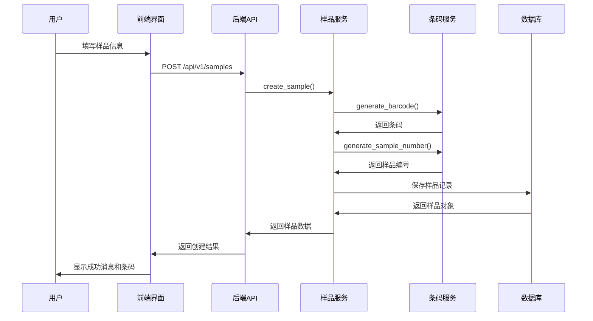
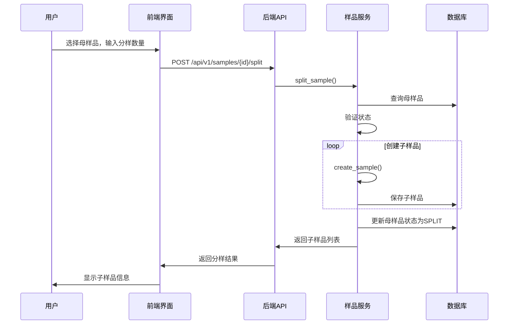

# 实验室管理系统 - 八大模块详细说明

## 📋 文档概述

本文档详细说明实验室智能管理系统的八大核心模块的设计思路、技术实现和具体功能。

**文档版本**: 1.0  
**创建日期**: 2026-05-16  
**系统架构**: 前后端分离架构（Vue 3 + FastAPI）

---

## 🎯 系统架构总览

### 技术栈

**前端技术栈**
- Vue 3.5.26 + TypeScript 5.9.3 - 核心框架
- Vite 7.3.0 - 构建工具
- Pinia 3.0.4 - 状态管理
- Vue Router 4.6.4 - 路由管理
- Element Plus 2.13.1 - UI组件库
- Axios 1.13.3 - HTTP客户端
- ECharts 6.0.0 - 数据可视化

**后端技术栈**
- Python 3.11+ - 编程语言
- FastAPI 0.104+ - Web框架
- SQLAlchemy 2.0+ - ORM框架
- PostgreSQL 14+ - 数据库
- Redis 5.0+ - 缓存和消息队列
- Pydantic 2.5+ - 数据验证

### 分层架构

```
┌─────────────────────────────────────────────────────────────┐
│                    前端 (Vue 3)                              │
│  ┌──────────────┐  ┌──────────────┐  ┌──────────────┐      │
│  │   UI层       │  │  状态管理层   │  │   服务层     │      │
│  │  (Views)     │  │  (Pinia)     │  │  (API)       │      │
│  └──────────────┘  └──────────────┘  └──────────────┘      │
└─────────────────────┬───────────────────────────────────────┘
                      │ HTTP/HTTPS
                      ▼
┌─────────────────────────────────────────────────────────────┐
│                  后端 (FastAPI)                              │
│  ┌──────────────┐  ┌──────────────┐  ┌──────────────┐      │
│  │  路由层      │  │  服务层      │  │  数据访问层   │      │
│  │  (Routers)   │  │  (Services)  │  │  (Repository)│      │
│  └──────────────┘  └──────────────┘  └──────────────┘      │
│  ┌──────────────┐  ┌──────────────┐                        │
│  │  ORM层       │  │  数据库      │                        │
│  │  (Models)    │  │  (PostgreSQL)│                        │
│  └──────────────┘  └──────────────┘                        │
└─────────────────────────────────────────────────────────────┘
```

---

## 📦 模块一：样品管理模块

### 模块概述

样品管理模块是实验室管理系统的核心模块，负责样品从登记、流转、检测到放行的全生命周期管理。

### 核心功能

1. **样品登记** - 样品信息录入和条码生成
2. **样品查询** - 多条件查询和高级筛选
3. **样品流转** - 样品位置变更和监管链追踪
4. **样品分样** - 母样品分成多个子样品
5. **样品合样** - 多个样品合并为一个样品
6. **留样管理** - 留样登记和到期提醒
7. **样品放行** - 样品检测完成后的放行流程

### 前端实现

#### 目录结构
```
src/views/sample/
├── SampleManagement.vue          # 样品列表页
├── SampleRegistration.vue        # 样品登记页
├── SampleDetail.vue              # 样品详情页
├── SampleTransferManagement.vue  # 样品流转管理
├── RetentionManagement.vue       # 留样管理
└── SampleRelease.vue             # 样品放行

src/components/sample/
├── SampleTransfer.vue            # 样品流转组件
├── SampleSplit.vue               # 样品分样组件
├── SampleMerge.vue               # 样品合并组件
├── SampleReturn.vue              # 样品退回组件
├── BarcodeDisplay.vue            # 条码显示组件
└── ChainOfCustody.vue            # 监管链组件

src/stores/
└── sample.ts                     # 样品状态管理

src/services/api/
└── sample.ts                     # 样品API服务
```

#### 核心组件设计

**SampleManagement.vue - 样品列表页**
- 功能：样品查询、筛选、批量操作、导出
- 技术实现：
  - 使用 Element Plus Table 组件展示样品列表
  - 支持分页、排序、多条件筛选
  - 集成条码扫描功能
  - 支持批量删除、批量导出

**SampleRegistration.vue - 样品登记页**
- 功能：样品信息录入、条码自动生成、附件上传
- 技术实现：
  - 使用 Element Plus Form 组件构建表单
  - 集成 Pydantic 验证规则
  - 自动生成唯一条码（格式：SP{YYYYMMDD}{6位序列号}）
  - 支持文件上传和预览

**SampleDetail.vue - 样品详情页**
- 功能：查看样品完整信息、流转历史、检测记录
- 技术实现：
  - 使用 Tabs 组件组织多个信息面板
  - 实时显示样品状态
  - 展示完整的监管链记录
  - 支持快捷操作（流转、分样、合样）

### 后端实现

#### 目录结构
```
app/api/v1/
└── samples.py                    # 样品API路由

app/services/
├── sample_service.py             # 样品业务逻辑
├── barcode_service.py            # 条码生成服务
└── transfer_service.py           # 流转服务

app/repositories/
└── sample_repository.py          # 样品数据访问

app/models/
└── sample.py                     # 样品ORM模型

app/schemas/
└── sample.py                     # 样品Pydantic模型
```

#### 核心服务设计

**sample_service.py - 样品业务逻辑服务**

核心方法：
- `create_sample()` - 创建样品，自动生成条码和样品编号
- `get_samples()` - 分页查询样品，支持多条件过滤
- `get_sample_by_id()` - 根据ID查询样品详情
- `get_sample_by_barcode()` - 根据条码查询样品
- `update_sample()` - 更新样品，支持乐观锁（版本控制）
- `update_sample_status()` - 更新样品状态
- `split_sample()` - 分样操作，建立父子样品关系
- `merge_samples()` - 合样操作，记录来源样品
- `delete_sample()` - 软删除样品
- `batch_delete_samples()` - 批量删除样品

业务逻辑特点：
- 完整的事务管理（commit/rollback）
- 详细的日志记录
- 业务规则验证（状态检查、权限检查）
- 乐观锁支持（版本控制）
- 异常处理和错误转换

**barcode_service.py - 条码生成服务**

核心方法：
- `generate_barcode()` - 生成唯一条码
- `generate_sample_number()` - 生成样品编号
- `validate_barcode()` - 验证条码格式

条码生成规则：
- 格式：`SP{YYYYMMDD}{6位序列号}`
- 示例：`SP202605160000001`
- 保证唯一性：使用数据库序列或Redis计数器

**transfer_service.py - 流转服务**

核心方法：
- `transfer_sample()` - 样品流转
- `get_transfer_history()` - 获取流转历史
- `get_chain_of_custody()` - 获取监管链记录

流转记录包含：
- 流转时间
- 流转人员
- 源位置和目标位置
- 流转原因
- 接收人签名

### 数据模型

```python
class Sample(Base):
    """样品ORM模型"""
    __tablename__ = "samples"
    
    id = Column(String(36), primary_key=True)
    barcode = Column(String(50), unique=True, nullable=False, index=True)
    sample_number = Column(String(50), unique=True, nullable=False)
    client_name = Column(String(200), nullable=False)
    sample_name = Column(String(200), nullable=False)
    sample_type = Column(String(100))
    quantity = Column(Float)
    unit = Column(String(50))
    status = Column(Enum(SampleStatus), default=SampleStatus.REGISTERED)
    storage_location = Column(String(200))
    received_date = Column(DateTime, nullable=False)
    sampling_date = Column(DateTime)
    priority = Column(String(20), default="NORMAL")
    
    # 分样/合样关系
    parent_sample_id = Column(String(36), ForeignKey("samples.id"))
    merged_from_ids = Column(JSON)  # 合样来源ID列表
    
    # 审计字段
    created_at = Column(DateTime, default=datetime.utcnow)
    updated_at = Column(DateTime, default=datetime.utcnow, onupdate=datetime.utcnow)
    created_by = Column(String(36), ForeignKey("users.id"))
    version = Column(Integer, default=1)  # 乐观锁版本号
    
    # 关系
    parent_sample = relationship("Sample", remote_side=[id], backref="child_samples")
    transfers = relationship("SampleTransfer", back_populates="sample")
    test_results = relationship("TestResult", back_populates="sample")
```

### API接口设计

```python
# 样品CRUD
POST   /api/v1/samples              # 创建样品
GET    /api/v1/samples              # 获取样品列表（分页）
GET    /api/v1/samples/{id}         # 获取样品详情
PATCH  /api/v1/samples/{id}         # 更新样品
DELETE /api/v1/samples/{id}         # 删除样品

# 样品操作
POST   /api/v1/samples/{id}/split   # 分样
POST   /api/v1/samples/merge         # 合样
POST   /api/v1/samples/{id}/transfer # 流转
POST   /api/v1/samples/{id}/release  # 放行

# 样品查询
GET    /api/v1/samples/barcode/{barcode}  # 根据条码查询
GET    /api/v1/samples/{id}/history        # 获取流转历史
GET    /api/v1/samples/{id}/chain-of-custody # 获取监管链
```

### 关键技术实现

#### 1. 条码自动生成

```python
async def generate_barcode(self) -> str:
    """生成唯一条码"""
    today = datetime.now().strftime("%Y%m%d")
    
    # 使用Redis计数器保证唯一性
    key = f"barcode:sequence:{today}"
    sequence = await self.redis.incr(key)
    await self.redis.expire(key, 86400)  # 24小时过期
    
    barcode = f"SP{today}{sequence:06d}"
    return barcode
```

#### 2. 样品分样

```python
async def split_sample(
    self,
    parent_id: str,
    split_info: SplitSampleRequest
) -> List[Sample]:
    """分样操作"""
    # 1. 验证母样品存在
    parent_sample = await self.get_sample_by_id(parent_id)
    
    # 2. 验证母样品状态允许分样
    if parent_sample.status not in [SampleStatus.REGISTERED, SampleStatus.IN_TESTING]:
        raise ValidationException("当前状态不允许分样")
    
    # 3. 创建子样品
    child_samples = []
    for i in range(split_info.count):
        child_data = {
            "client_name": parent_sample.client_name,
            "sample_name": f"{parent_sample.sample_name}-{i+1}",
            "sample_type": parent_sample.sample_type,
            "parent_sample_id": parent_id,
            "status": SampleStatus.REGISTERED
        }
        child_sample = await self.create_sample(child_data, created_by=split_info.operator)
        child_samples.append(child_sample)
    
    # 4. 更新母样品状态
    await self.update_sample_status(parent_id, SampleStatus.SPLIT)
    
    return child_samples
```

#### 3. 监管链追踪

```python
async def get_chain_of_custody(self, sample_id: str) -> List[ChainOfCustodyRecord]:
    """获取监管链记录"""
    transfers = await self.transfer_repo.get_by_sample_id(sample_id)
    
    chain = []
    for transfer in transfers:
        record = ChainOfCustodyRecord(
            timestamp=transfer.transferred_at,
            from_location=transfer.from_location,
            to_location=transfer.to_location,
            transferred_by=transfer.transferred_by,
            received_by=transfer.received_by,
            purpose=transfer.purpose,
            signature=transfer.signature
        )
        chain.append(record)
    
    return chain
```

### 业务流程

#### 样品登记流程



#### 样品分样流程



---


## 🔧 模块二：工作流管理模块详细说明

### 模块架构

```
工作流管理模块
├── 工作流设计器 (可视化设计)
├── 工作流引擎 (流程执行)
├── 任务管理 (任务分配和执行)
└── 检测方法库 (方法管理)
```

### 前端实现详解

#### 1. 工作流设计器 (WorkflowDesigner.vue)

**核心功能:**
- 拖拽式节点编辑
- 节点连线配置
- 节点属性设置
- 流程验证

**技术实现:**
```typescript
// 使用 Vue Flow 或自定义Canvas实现
import { VueFlow } from '@vue-flow/core'

interface WorkflowNode {
  id: string
  type: 'start' | 'end' | 'task' | 'decision' | 'parallel' | 'merge'
  position: { x: number; y: number }
  data: {
    label: string
    config: NodeConfig
  }
}

interface WorkflowEdge {
  id: string
  source: string
  target: string
  label?: string
  condition?: string
}

// 节点类型配置
const nodeTypes = {
  start: StartNode,      // 开始节点
  end: EndNode,          // 结束节点
  task: TaskNode,        // 任务节点
  decision: DecisionNode, // 决策节点
  parallel: ParallelNode, // 并行节点
  merge: MergeNode       // 合并节点
}
```

**节点配置示例:**
```typescript
// 任务节点配置
interface TaskNodeConfig {
  name: string
  description: string
  assignmentRule: 'auto' | 'manual' | 'role'
  assignedRole?: string
  assignedUser?: string
  estimatedDuration?: number
  requiredFields: string[]
  validationRules: ValidationRule[]
}

// 决策节点配置
interface DecisionNodeConfig {
  name: string
  condition: string  // 条件表达式
  branches: {
    true: string   // 满足条件时的下一个节点ID
    false: string  // 不满足条件时的下一个节点ID
  }
}
```

#### 2. 工作流模板管理 (WorkflowTemplates.vue)

**功能实现:**
```typescript
// 工作流模板Store
export const useWorkflowStore = defineStore('workflow', () => {
  const templates = ref<WorkflowTemplate[]>([])
  const currentTemplate = ref<WorkflowTemplate | null>(null)
  
  // 获取模板列表
  async function fetchTemplates() {
    const response = await workflowApi.getTemplates()
    templates.value = response.data
  }
  
  // 创建模板
  async function createTemplate(template: WorkflowTemplateCreate) {
    const response = await workflowApi.createTemplate(template)
    templates.value.push(response.data)
    return response.data
  }
  
  // 复制模板
  async function duplicateTemplate(templateId: string) {
    const template = templates.value.find(t => t.id === templateId)
    if (!template) return
    
    const newTemplate = {
      ...template,
      name: `${template.name} (副本)`,
      id: undefined,
      version: '1.0.0'
    }
    
    return await createTemplate(newTemplate)
  }
  
  return {
    templates,
    currentTemplate,
    fetchTemplates,
    createTemplate,
    duplicateTemplate
  }
})
```

#### 3. 任务管理 (TaskList.vue)

**任务列表功能:**
```vue
<template>
  <div class="task-list">
    <!-- 筛选器 -->
    <el-form :inline="true">
      <el-form-item label="状态">
        <el-select v-model="filters.status" multiple>
          <el-option label="待处理" value="pending" />
          <el-option label="进行中" value="in_progress" />
          <el-option label="已完成" value="completed" />
        </el-select>
      </el-form-item>
      <el-form-item label="优先级">
        <el-select v-model="filters.priority">
          <el-option label="全部" value="" />
          <el-option label="紧急" value="urgent" />
          <el-option label="高" value="high" />
          <el-option label="普通" value="normal" />
        </el-select>
      </el-form-item>
    </el-form>
    
    <!-- 任务表格 -->
    <el-table :data="tasks" @row-click="handleRowClick">
      <el-table-column prop="taskNumber" label="任务编号" />
      <el-table-column prop="sampleName" label="样品名称" />
      <el-table-column prop="methodName" label="检测方法" />
      <el-table-column prop="status" label="状态">
        <template #default="{ row }">
          <el-tag :type="getStatusType(row.status)">
            {{ getStatusLabel(row.status) }}
          </el-tag>
        </template>
      </el-table-column>
      <el-table-column prop="assignedTo" label="负责人" />
      <el-table-column prop="dueDate" label="截止日期" />
      <el-table-column label="操作">
        <template #default="{ row }">
          <el-button size="small" @click="handleStart(row)">
            开始
          </el-button>
          <el-button size="small" @click="handleComplete(row)">
            完成
          </el-button>
        </template>
      </el-table-column>
    </el-table>
  </div>
</template>

<script setup lang="ts">
import { ref, onMounted } from 'vue'
import { useTaskStore } from '@/stores/task'

const taskStore = useTaskStore()
const tasks = computed(() => taskStore.tasks)
const filters = ref({
  status: [],
  priority: ''
})

onMounted(() => {
  taskStore.fetchTasks(filters.value)
})

function handleStart(task: Task) {
  taskStore.startTask(task.id)
}

function handleComplete(task: Task) {
  router.push(`/workflow/task/${task.id}/complete`)
}
</script>
```

### 后端实现详解

#### 1. 工作流服务 (workflow_service.py)

**核心方法实现:**

```python
class WorkflowService:
    """工作流服务"""
    
    async def create_template(
        self,
        template_data: WorkflowTemplateCreate
    ) -> WorkflowTemplate:
        """创建工作流模板"""
        # 1. 验证节点配置
        self._validate_nodes(template_data.nodes)
        
        # 2. 验证连线配置
        self._validate_edges(template_data.edges, template_data.nodes)
        
        # 3. 检查死循环
        if self._has_cycle(template_data.nodes, template_data.edges):
            raise ValidationException("工作流包含死循环")
        
        # 4. 检查孤立节点
        if self._has_orphan_nodes(template_data.nodes, template_data.edges):
            raise ValidationException("工作流包含孤立节点")
        
        # 5. 保存模板
        template = await self.workflow_repo.create(template_data.dict())
        await self.db.commit()
        
        return template
    
    async def start_workflow(
        self,
        sample_id: str,
        template_id: str
    ) -> WorkflowInstance:
        """启动工作流实例"""
        # 1. 获取模板
        template = await self.get_template(template_id)
        
        # 2. 验证样品状态
        sample = await self.sample_service.get_sample_by_id(sample_id)
        if sample.status != SampleStatus.REGISTERED:
            raise ValidationException("样品状态不允许启动工作流")
        
        # 3. 创建工作流实例
        instance = WorkflowInstance(
            template_id=template_id,
            sample_id=sample_id,
            status=WorkflowStatus.RUNNING,
            current_node_ids=[self._get_start_node_id(template)],
            variables={}
        )
        
        # 4. 创建初始任务
        start_node = self._get_start_node(template)
        next_nodes = self._get_next_nodes(start_node, template)
        
        for node in next_nodes:
            if node.type == NodeType.TASK:
                await self.task_service.create_task_from_node(
                    instance.id,
                    node,
                    sample_id
                )
        
        # 5. 保存实例
        await self.workflow_repo.create_instance(instance)
        await self.db.commit()
        
        return instance
    
    async def complete_node(
        self,
        instance_id: str,
        node_id: str,
        data: dict
    ) -> None:
        """完成节点"""
        # 1. 获取实例
        instance = await self.get_instance(instance_id)
        
        # 2. 验证节点是否激活
        if node_id not in instance.current_node_ids:
            raise ValidationException("节点未激活")
        
        # 3. 更新实例变量
        instance.variables.update(data)
        
        # 4. 标记节点完成
        instance.completed_node_ids.append(node_id)
        instance.current_node_ids.remove(node_id)
        
        # 5. 获取下一个节点
        template = await self.get_template(instance.template_id)
        current_node = self._get_node_by_id(template, node_id)
        next_nodes = self._get_next_nodes(current_node, template)
        
        # 6. 处理不同类型的节点
        for next_node in next_nodes:
            if next_node.type == NodeType.TASK:
                # 创建任务
                await self.task_service.create_task_from_node(
                    instance.id,
                    next_node,
                    instance.sample_id
                )
                instance.current_node_ids.append(next_node.id)
                
            elif next_node.type == NodeType.DECISION:
                # 评估条件
                condition_result = self._evaluate_condition(
                    next_node.config.condition,
                    instance.variables
                )
                target_node_id = (
                    next_node.config.branches['true'] 
                    if condition_result 
                    else next_node.config.branches['false']
                )
                instance.current_node_ids.append(target_node_id)
                
            elif next_node.type == NodeType.END:
                # 工作流结束
                instance.status = WorkflowStatus.COMPLETED
                instance.completed_at = datetime.utcnow()
        
        # 7. 保存实例
        await self.workflow_repo.update_instance(instance)
        await self.db.commit()
    
    def _validate_nodes(self, nodes: List[WorkflowNode]) -> None:
        """验证节点配置"""
        # 检查是否有开始节点
        start_nodes = [n for n in nodes if n.type == NodeType.START]
        if len(start_nodes) != 1:
            raise ValidationException("工作流必须有且仅有一个开始节点")
        
        # 检查是否有结束节点
        end_nodes = [n for n in nodes if n.type == NodeType.END]
        if len(end_nodes) < 1:
            raise ValidationException("工作流必须至少有一个结束节点")
    
    def _has_cycle(
        self,
        nodes: List[WorkflowNode],
        edges: List[WorkflowEdge]
    ) -> bool:
        """检查是否有死循环"""
        # 使用DFS检测环
        graph = self._build_graph(nodes, edges)
        visited = set()
        rec_stack = set()
        
        def dfs(node_id: str) -> bool:
            visited.add(node_id)
            rec_stack.add(node_id)
            
            for neighbor in graph.get(node_id, []):
                if neighbor not in visited:
                    if dfs(neighbor):
                        return True
                elif neighbor in rec_stack:
                    return True
            
            rec_stack.remove(node_id)
            return False
        
        for node in nodes:
            if node.id not in visited:
                if dfs(node.id):
                    return True
        
        return False
```

#### 2. 任务服务 (task_service.py)

```python
class TaskService:
    """任务服务"""
    
    async def create_task_from_node(
        self,
        workflow_instance_id: str,
        node: WorkflowNode,
        sample_id: str
    ) -> Task:
        """从工作流节点创建任务"""
        # 1. 准备任务数据
        task_data = {
            "workflow_instance_id": workflow_instance_id,
            "workflow_node_id": node.id,
            "sample_id": sample_id,
            "name": node.data.label,
            "description": node.data.config.description,
            "status": TaskStatus.PENDING,
            "priority": self._calculate_priority(sample_id),
            "estimated_duration": node.data.config.estimatedDuration
        }
        
        # 2. 自动分配任务
        if node.data.config.assignmentRule == 'auto':
            assigned_user = await self.assignment_engine.assign_task(task_data)
            task_data["assigned_to"] = assigned_user.id
            task_data["status"] = TaskStatus.ASSIGNED
        elif node.data.config.assignmentRule == 'role':
            # 根据角色分配
            task_data["assigned_role"] = node.data.config.assignedRole
        
        # 3. 创建任务
        task = await self.task_repo.create(task_data)
        await self.db.commit()
        
        # 4. 发送通知
        if task.assigned_to:
            await self.notification_service.send_task_notification(task)
        
        return task
    
    async def start_task(self, task_id: str, user_id: str) -> Task:
        """开始任务"""
        task = await self.get_task(task_id)
        
        # 验证权限
        if task.assigned_to != user_id:
            raise PermissionException("无权操作此任务")
        
        # 更新状态
        task.status = TaskStatus.IN_PROGRESS
        task.started_at = datetime.utcnow()
        
        await self.task_repo.update(task)
        await self.db.commit()
        
        return task
    
    async def complete_task(
        self,
        task_id: str,
        result_data: dict,
        user_id: str
    ) -> Task:
        """完成任务"""
        task = await self.get_task(task_id)
        
        # 验证权限
        if task.assigned_to != user_id:
            raise PermissionException("无权操作此任务")
        
        # 验证结果数据
        self._validate_result_data(task, result_data)
        
        # 更新任务
        task.status = TaskStatus.COMPLETED
        task.completed_at = datetime.utcnow()
        task.result_data = result_data
        
        await self.task_repo.update(task)
        
        # 通知工作流引擎
        await self.workflow_service.complete_node(
            task.workflow_instance_id,
            task.workflow_node_id,
            result_data
        )
        
        await self.db.commit()
        
        return task
```

#### 3. 自动分配引擎 (assignment_engine.py)

```python
class AssignmentEngine:
    """任务自动分配引擎"""
    
    async def assign_task(self, task_data: dict) -> User:
        """自动分配任务"""
        # 1. 获取候选人员
        candidates = await self._get_candidates(task_data)
        
        if not candidates:
            raise ValidationException("没有可用的人员")
        
        # 2. 计算每个候选人的得分
        scores = []
        for candidate in candidates:
            score = await self._calculate_score(candidate, task_data)
            scores.append((candidate, score))
        
        # 3. 选择得分最高的人员
        scores.sort(key=lambda x: x[1], reverse=True)
        selected_user = scores[0][0]
        
        logger.info(f"任务自动分配给: {selected_user.name}")
        
        return selected_user
    
    async def _get_candidates(self, task_data: dict) -> List[User]:
        """获取候选人员"""
        # 根据角色、技能、可用性等条件筛选
        query = self.db.query(User).filter(
            User.is_active == True,
            User.roles.any(Role.name == task_data.get("required_role"))
        )
        
        candidates = await query.all()
        return candidates
    
    async def _calculate_score(
        self,
        user: User,
        task_data: dict
    ) -> float:
        """计算人员得分"""
        score = 0.0
        
        # 1. 工作负载得分 (权重: 40%)
        current_tasks = await self._get_user_current_tasks(user.id)
        workload_score = max(0, 100 - len(current_tasks) * 10)
        score += workload_score * 0.4
        
        # 2. 技能匹配得分 (权重: 30%)
        required_skills = task_data.get("required_skills", [])
        user_skills = [s.name for s in user.skills]
        skill_match = len(set(required_skills) & set(user_skills))
        skill_score = (skill_match / len(required_skills) * 100) if required_skills else 50
        score += skill_score * 0.3
        
        # 3. 历史表现得分 (权重: 20%)
        performance = await self._get_user_performance(user.id)
        score += performance * 0.2
        
        # 4. 可用性得分 (权重: 10%)
        availability = await self._check_availability(user.id)
        score += (100 if availability else 0) * 0.1
        
        return score
```

### API接口设计

```python
# 工作流模板管理
POST   /api/v1/workflows/templates              # 创建模板
GET    /api/v1/workflows/templates              # 获取模板列表
GET    /api/v1/workflows/templates/{id}         # 获取模板详情
PUT    /api/v1/workflows/templates/{id}         # 更新模板
DELETE /api/v1/workflows/templates/{id}         # 删除模板
POST   /api/v1/workflows/templates/{id}/duplicate # 复制模板

# 工作流实例管理
POST   /api/v1/workflows/instances              # 启动工作流
GET    /api/v1/workflows/instances              # 获取实例列表
GET    /api/v1/workflows/instances/{id}         # 获取实例详情
POST   /api/v1/workflows/instances/{id}/nodes/{node_id}/complete # 完成节点
POST   /api/v1/workflows/instances/{id}/suspend # 暂停工作流
POST   /api/v1/workflows/instances/{id}/resume  # 恢复工作流
POST   /api/v1/workflows/instances/{id}/terminate # 终止工作流

# 任务管理
GET    /api/v1/tasks                            # 获取任务列表
GET    /api/v1/tasks/{id}                       # 获取任务详情
POST   /api/v1/tasks/{id}/start                 # 开始任务
POST   /api/v1/tasks/{id}/complete              # 完成任务
POST   /api/v1/tasks/{id}/assign                # 分配任务
POST   /api/v1/tasks/{id}/reassign              # 重新分配任务

# 检测方法管理
POST   /api/v1/methods                          # 创建方法
GET    /api/v1/methods                          # 获取方法列表
GET    /api/v1/methods/{id}                     # 获取方法详情
PUT    /api/v1/methods/{id}                     # 更新方法
DELETE /api/v1/methods/{id}                     # 删除方法
```

### 数据模型

```python
class WorkflowTemplate(Base):
    """工作流模板"""
    __tablename__ = "workflow_templates"
    
    id = Column(String(36), primary_key=True)
    name = Column(String(200), nullable=False)
    description = Column(Text)
    version = Column(String(20), default="1.0.0")
    sample_types = Column(JSON)  # 适用的样品类型
    nodes = Column(JSON)  # 节点配置
    edges = Column(JSON)  # 连线配置
    is_active = Column(Boolean, default=True)
    created_at = Column(DateTime, default=datetime.utcnow)
    updated_at = Column(DateTime, onupdate=datetime.utcnow)
    created_by = Column(String(36), ForeignKey("users.id"))

class WorkflowInstance(Base):
    """工作流实例"""
    __tablename__ = "workflow_instances"
    
    id = Column(String(36), primary_key=True)
    template_id = Column(String(36), ForeignKey("workflow_templates.id"))
    sample_id = Column(String(36), ForeignKey("samples.id"))
    status = Column(Enum(WorkflowStatus))
    current_node_ids = Column(JSON)  # 当前激活的节点
    completed_node_ids = Column(JSON)  # 已完成的节点
    variables = Column(JSON)  # 工作流变量
    started_at = Column(DateTime, default=datetime.utcnow)
    completed_at = Column(DateTime)

class Task(Base):
    """任务"""
    __tablename__ = "tasks"
    
    id = Column(String(36), primary_key=True)
    workflow_instance_id = Column(String(36), ForeignKey("workflow_instances.id"))
    workflow_node_id = Column(String(36))
    sample_id = Column(String(36), ForeignKey("samples.id"))
    name = Column(String(200), nullable=False)
    description = Column(Text)
    status = Column(Enum(TaskStatus))
    priority = Column(String(20))
    assigned_to = Column(String(36), ForeignKey("users.id"))
    assigned_role = Column(String(100))
    estimated_duration = Column(Integer)  # 预计耗时(分钟)
    started_at = Column(DateTime)
    completed_at = Column(DateTime)
    due_date = Column(DateTime)
    result_data = Column(JSON)
```

---


## 📊 模块三：结果管理模块详细说明

### 模块架构

```
结果管理模块
├── 结果录入 (手工录入、批量录入)
├── 结果导入 (Excel导入)
├── 公式计算 (自动计算引擎)
└── 异常管理 (异常检测、复测流程)
```

### 前端实现详解

#### 1. 结果录入 (ResultEntry.vue)

**功能实现:**
```vue
<template>
  <div class="result-entry">
    <el-form :model="form" ref="formRef">
      <!-- 样品信息 -->
      <el-card title="样品信息">
        <el-descriptions :column="2">
          <el-descriptions-item label="样品编号">
            {{ sample.sampleNumber }}
          </el-descriptions-item>
          <el-descriptions-item label="样品名称">
            {{ sample.sampleName }}
          </el-descriptions-item>
        </el-descriptions>
      </el-card>
      
      <!-- 检测项目 -->
      <el-card title="检测项目">
        <el-table :data="testItems">
          <el-table-column prop="itemName" label="检测项目" />
          <el-table-column prop="unit" label="单位" />
          <el-table-column label="检测结果">
            <template #default="{ row, $index }">
              <el-input
                v-model="form.results[$index].value"
                @blur="handleResultChange(row, $index)"
              />
            </template>
          </el-table-column>
          <el-table-column label="计算结果">
            <template #default="{ row, $index }">
              <span v-if="row.formula">
                {{ form.results[$index].calculatedValue }}
              </span>
            </template>
          </el-table-column>
          <el-table-column label="状态">
            <template #default="{ row, $index }">
              <el-tag
                v-if="form.results[$index].isAnomalous"
                type="danger"
              >
                异常
              </el-tag>
            </template>
          </el-table-column>
        </el-table>
      </el-card>
      
      <!-- 操作按钮 -->
      <el-form-item>
        <el-button @click="handleSaveDraft">保存草稿</el-button>
        <el-button type="primary" @click="handleSubmit">提交</el-button>
      </el-form-item>
    </el-form>
  </div>
</template>

<script setup lang="ts">
import { ref, reactive, onMounted } from 'vue'
import { useResultStore } from '@/stores/result'
import { useFormulaEngine } from '@/composables/useFormulaEngine'

const resultStore = useResultStore()
const formulaEngine = useFormulaEngine()

const form = reactive({
  results: []
})

// 结果变更时触发
async function handleResultChange(row: TestItem, index: number) {
  const result = form.results[index]
  
  // 1. 如果有公式，自动计算
  if (row.formula) {
    result.calculatedValue = await formulaEngine.calculate(
      row.formula,
      form.results
    )
  }
  
  // 2. 异常检测
  result.isAnomalous = await resultStore.checkAnomaly(
    row.id,
    result.value
  )
}

// 提交结果
async function handleSubmit() {
  await resultStore.submitResults(form.results)
  ElMessage.success('结果提交成功')
}
</script>
```

#### 2. 结果导入 (ResultImport.vue)

**Excel导入功能:**
```typescript
// 使用 SheetJS 解析Excel
import * as XLSX from 'xlsx'

async function handleFileUpload(file: File) {
  const data = await file.arrayBuffer()
  const workbook = XLSX.read(data)
  const worksheet = workbook.Sheets[workbook.SheetNames[0]]
  
  // 解析数据
  const jsonData = XLSX.utils.sheet_to_json(worksheet)
  
  // 数据映射和验证
  const results = jsonData.map((row: any) => ({
    sampleBarcode: row['样品条码'],
    testItemCode: row['检测项目代码'],
    value: row['检测结果'],
    unit: row['单位']
  }))
  
  // 验证数据
  const validation = await resultStore.validateImportData(results)
  
  if (validation.errors.length > 0) {
    // 显示错误
    showValidationErrors(validation.errors)
  } else {
    // 导入数据
    await resultStore.importResults(results)
    ElMessage.success('导入成功')
  }
}
```

#### 3. 公式配置 (FormulaConfig.vue)

**公式编辑器:**
```vue
<template>
  <div class="formula-editor">
    <el-form :model="formula">
      <el-form-item label="公式名称">
        <el-input v-model="formula.name" />
      </el-form-item>
      
      <el-form-item label="公式表达式">
        <el-input
          v-model="formula.expression"
          type="textarea"
          :rows="4"
          placeholder="例如: (A + B) / 2"
        />
      </el-form-item>
      
      <el-form-item label="变量">
        <el-table :data="formula.variables">
          <el-table-column prop="name" label="变量名" />
          <el-table-column prop="description" label="说明" />
          <el-table-column prop="testItemId" label="关联检测项">
            <template #default="{ row }">
              <el-select v-model="row.testItemId">
                <el-option
                  v-for="item in testItems"
                  :key="item.id"
                  :label="item.name"
                  :value="item.id"
                />
              </el-select>
            </template>
          </el-table-column>
        </el-table>
      </el-form-item>
      
      <el-form-item label="测试">
        <el-button @click="handleTest">测试公式</el-button>
        <span v-if="testResult">
          结果: {{ testResult }}
        </span>
      </el-form-item>
    </el-form>
  </div>
</template>

<script setup lang="ts">
import { ref } from 'vue'
import { useFormulaEngine } from '@/composables/useFormulaEngine'

const formulaEngine = useFormulaEngine()
const testResult = ref<number | null>(null)

async function handleTest() {
  try {
    testResult.value = await formulaEngine.calculate(
      formula.expression,
      testData
    )
  } catch (error) {
    ElMessage.error('公式错误: ' + error.message)
  }
}
</script>
```

### 后端实现详解

#### 1. 结果服务 (result_service.py)

```python
class ResultService:
    """结果服务"""
    
    async def create_result(
        self,
        result_data: TestResultCreate,
        created_by: str
    ) -> TestResult:
        """创建检测结果"""
        # 1. 验证样品和检测项
        sample = await self.sample_service.get_sample_by_id(result_data.sample_id)
        test_item = await self.method_service.get_test_item(result_data.test_item_id)
        
        # 2. 准备结果数据
        result_dict = result_data.dict()
        result_dict.update({
            "source": ResultSource.MANUAL,
            "created_by": created_by,
            "created_at": datetime.utcnow()
        })
        
        # 3. 如果有公式，自动计算
        if test_item.formula:
            calculated_value = await self.formula_service.calculate(
                test_item.formula,
                result_data.sample_id
            )
            result_dict["calculated_value"] = calculated_value
        
        # 4. 异常检测
        is_anomalous = await self.anomaly_service.check_anomaly(
            test_item.id,
            result_dict.get("raw_value") or result_dict.get("calculated_value")
        )
        result_dict["is_anomalous"] = is_anomalous
        
        # 5. 保存结果
        result = await self.result_repo.create(result_dict)
        await self.db.commit()
        
        # 6. 如果异常，创建复测任务
        if is_anomalous:
            await self.create_retest_task(result.id)
        
        return result
    
    async def import_results(
        self,
        import_data: List[ResultImportData],
        created_by: str
    ) -> ImportResult:
        """批量导入结果"""
        success_count = 0
        error_count = 0
        errors = []
        
        for data in import_data:
            try:
                # 1. 根据条码查找样品
                sample = await self.sample_service.get_sample_by_barcode(
                    data.sample_barcode
                )
                
                # 2. 根据代码查找检测项
                test_item = await self.method_service.get_test_item_by_code(
                    data.test_item_code
                )
                
                # 3. 创建结果
                result_data = TestResultCreate(
                    sample_id=sample.id,
                    test_item_id=test_item.id,
                    raw_value=data.value,
                    unit=data.unit
                )
                
                await self.create_result(result_data, created_by)
                success_count += 1
                
            except Exception as e:
                error_count += 1
                errors.append({
                    "row": data.row_number,
                    "error": str(e)
                })
        
        return ImportResult(
            success_count=success_count,
            error_count=error_count,
            errors=errors
        )
    
    async def create_retest_task(self, result_id: str) -> Task:
        """创建复测任务"""
        result = await self.get_result(result_id)
        
        task_data = {
            "name": f"复测 - {result.test_item.name}",
            "sample_id": result.sample_id,
            "test_item_id": result.test_item_id,
            "original_result_id": result_id,
            "status": TaskStatus.PENDING,
            "priority": "high"
        }
        
        task = await self.task_service.create_task(task_data)
        return task
```

#### 2. 公式服务 (formula_service.py)

```python
class FormulaService:
    """公式服务"""
    
    async def calculate(
        self,
        formula: Formula,
        sample_id: str
    ) -> float:
        """计算公式"""
        # 1. 获取变量值
        variables = {}
        for var in formula.variables:
            result = await self.result_repo.get_by_sample_and_item(
                sample_id,
                var.test_item_id
            )
            if not result:
                raise ValidationException(f"缺少变量 {var.name} 的值")
            variables[var.name] = result.raw_value
        
        # 2. 解析公式
        expression = formula.expression
        for var_name, var_value in variables.items():
            expression = expression.replace(var_name, str(var_value))
        
        # 3. 计算结果
        try:
            result = eval(expression, {"__builtins__": {}}, {
                "abs": abs,
                "round": round,
                "pow": pow,
                "sqrt": math.sqrt,
                "log": math.log,
                "exp": math.exp
            })
            return float(result)
        except Exception as e:
            raise ValidationException(f"公式计算错误: {str(e)}")
    
    async def validate_formula(self, formula: Formula) -> bool:
        """验证公式"""
        # 1. 检查语法
        try:
            compile(formula.expression, '<string>', 'eval')
        except SyntaxError as e:
            raise ValidationException(f"公式语法错误: {str(e)}")
        
        # 2. 检查变量
        for var in formula.variables:
            if var.name not in formula.expression:
                raise ValidationException(f"变量 {var.name} 未在公式中使用")
        
        # 3. 测试计算
        test_variables = {var.name: 1.0 for var in formula.variables}
        try:
            self._evaluate_expression(formula.expression, test_variables)
        except Exception as e:
            raise ValidationException(f"公式测试失败: {str(e)}")
        
        return True
```

#### 3. 异常服务 (anomaly_service.py)

```python
class AnomalyService:
    """异常检测服务"""
    
    async def check_anomaly(
        self,
        test_item_id: str,
        value: float
    ) -> bool:
        """检查结果是否异常"""
        test_item = await self.method_service.get_test_item(test_item_id)
        
        # 1. 范围检查
        if test_item.min_value is not None and value < test_item.min_value:
            return True
        if test_item.max_value is not None and value > test_item.max_value:
            return True
        
        # 2. 历史数据对比
        historical_results = await self.result_repo.get_recent_results(
            test_item_id,
            limit=20
        )
        
        if len(historical_results) >= 5:
            values = [r.raw_value for r in historical_results]
            mean = statistics.mean(values)
            std = statistics.stdev(values)
            
            # 3σ原则
            if abs(value - mean) > 3 * std:
                return True
        
        return False
    
    async def analyze_anomaly(
        self,
        result_id: str
    ) -> AnomalyAnalysis:
        """分析异常原因"""
        result = await self.result_repo.get(result_id)
        
        reasons = []
        
        # 1. 检查是否超出规格范围
        if result.test_item.min_value and result.raw_value < result.test_item.min_value:
            reasons.append(f"低于最小值 {result.test_item.min_value}")
        if result.test_item.max_value and result.raw_value > result.test_item.max_value:
            reasons.append(f"高于最大值 {result.test_item.max_value}")
        
        # 2. 检查与历史数据的偏差
        historical_results = await self.result_repo.get_recent_results(
            result.test_item_id,
            limit=20
        )
        
        if historical_results:
            values = [r.raw_value for r in historical_results]
            mean = statistics.mean(values)
            deviation = abs(result.raw_value - mean) / mean * 100
            
            if deviation > 20:
                reasons.append(f"与历史平均值偏差 {deviation:.1f}%")
        
        return AnomalyAnalysis(
            result_id=result_id,
            is_anomalous=True,
            reasons=reasons,
            recommendation="建议进行复测"
        )
```

### API接口设计

```python
# 结果管理
POST   /api/v1/results                          # 创建结果
GET    /api/v1/results                          # 获取结果列表
GET    /api/v1/results/{id}                     # 获取结果详情
PUT    /api/v1/results/{id}                     # 更新结果
DELETE /api/v1/results/{id}                     # 删除结果
POST   /api/v1/results/import                   # 批量导入结果
POST   /api/v1/results/export                   # 导出结果

# 公式管理
POST   /api/v1/formulas                         # 创建公式
GET    /api/v1/formulas                         # 获取公式列表
GET    /api/v1/formulas/{id}                    # 获取公式详情
PUT    /api/v1/formulas/{id}                    # 更新公式
DELETE /api/v1/formulas/{id}                    # 删除公式
POST   /api/v1/formulas/{id}/test               # 测试公式
POST   /api/v1/formulas/{id}/calculate          # 计算公式

# 异常管理
GET    /api/v1/anomalies                        # 获取异常列表
GET    /api/v1/anomalies/{id}                   # 获取异常详情
POST   /api/v1/anomalies/{id}/analyze           # 分析异常
POST   /api/v1/anomalies/{id}/retest            # 申请复测
POST   /api/v1/anomalies/{id}/resolve           # 解决异常
```

### 数据模型

```python
class TestResult(Base):
    """检测结果"""
    __tablename__ = "test_results"
    
    id = Column(String(36), primary_key=True)
    sample_id = Column(String(36), ForeignKey("samples.id"))
    test_method_id = Column(String(36), ForeignKey("test_methods.id"))
    test_item_id = Column(String(36), ForeignKey("test_items.id"))
    raw_value = Column(Float)  # 原始值
    calculated_value = Column(Float)  # 计算值
    unit = Column(String(50))
    is_anomalous = Column(Boolean, default=False)
    anomaly_reason = Column(Text)
    source = Column(Enum(ResultSource))  # MANUAL, INSTRUMENT, CALCULATED
    formula_id = Column(String(36), ForeignKey("formulas.id"))
    created_at = Column(DateTime, default=datetime.utcnow)
    created_by = Column(String(36), ForeignKey("users.id"))

class Formula(Base):
    """计算公式"""
    __tablename__ = "formulas"
    
    id = Column(String(36), primary_key=True)
    name = Column(String(200), nullable=False)
    expression = Column(Text, nullable=False)  # 公式表达式
    variables = Column(JSON)  # 变量定义
    description = Column(Text)
    is_active = Column(Boolean, default=True)
    created_at = Column(DateTime, default=datetime.utcnow)
    created_by = Column(String(36), ForeignKey("users.id"))

class Anomaly(Base):
    """异常记录"""
    __tablename__ = "anomalies"
    
    id = Column(String(36), primary_key=True)
    result_id = Column(String(36), ForeignKey("test_results.id"))
    anomaly_type = Column(String(50))  # OUT_OF_RANGE, DEVIATION, etc.
    severity = Column(String(20))  # LOW, MEDIUM, HIGH
    reasons = Column(JSON)
    status = Column(String(20))  # PENDING, RETESTING, RESOLVED
    resolution = Column(Text)
    resolved_at = Column(DateTime)
    resolved_by = Column(String(36), ForeignKey("users.id"))
```

---


## 🔍 模块四：审核管理模块详细说明

### 模块架构

```
审核管理模块
├── 审核任务管理 (任务创建、分配、执行)
├── 审核流程引擎 (多级审核、并行审核)
├── 电子签名 (数字签名、签名验证)
└── 审核记录追溯 (完整审计日志)
```

### 前端实现详解

#### 1. 审核任务列表 (AuditTaskList.vue)

**功能实现:**
```vue
<template>
  <div class="audit-task-list">
    <!-- 筛选器 -->
    <el-form :inline="true" :model="filters">
      <el-form-item label="审核状态">
        <el-select v-model="filters.status" multiple>
          <el-option label="待审核" value="pending" />
          <el-option label="审核中" value="in_progress" />
          <el-option label="已通过" value="approved" />
          <el-option label="已拒绝" value="rejected" />
        </el-select>
      </el-form-item>
      <el-form-item label="审核级别">
        <el-select v-model="filters.level">
          <el-option label="全部" value="" />
          <el-option label="一级审核" value="1" />
          <el-option label="二级审核" value="2" />
          <el-option label="三级审核" value="3" />
        </el-select>
      </el-form-item>
      <el-form-item>
        <el-button type="primary" @click="handleSearch">查询</el-button>
      </el-form-item>
    </el-form>
    
    <!-- 任务表格 -->
    <el-table :data="auditTasks" @row-click="handleRowClick">
      <el-table-column prop="taskNumber" label="任务编号" width="150" />
      <el-table-column prop="sampleInfo" label="样品信息" width="200">
        <template #default="{ row }">
          <div>{{ row.sample.sampleNumber }}</div>
          <div class="text-gray">{{ row.sample.sampleName }}</div>
        </template>
      </el-table-column>
      <el-table-column prop="auditLevel" label="审核级别" width="100">
        <template #default="{ row }">
          <el-tag>{{ `L${row.auditLevel}` }}</el-tag>
        </template>
      </el-table-column>
      <el-table-column prop="status" label="状态" width="100">
        <template #default="{ row }">
          <el-tag :type="getStatusType(row.status)">
            {{ getStatusLabel(row.status) }}
          </el-tag>
        </template>
      </el-table-column>
      <el-table-column prop="assignedTo" label="审核人" width="120" />
      <el-table-column prop="createdAt" label="创建时间" width="160" />
      <el-table-column label="操作" width="200" fixed="right">
        <template #default="{ row }">
          <el-button
            v-if="row.status === 'pending'"
            size="small"
            type="primary"
            @click.stop="handleAudit(row)"
          >
            审核
          </el-button>
          <el-button
            size="small"
            @click.stop="handleViewDetail(row)"
          >
            查看
          </el-button>
        </template>
      </el-table-column>
    </el-table>
    
    <!-- 分页 -->
    <el-pagination
      v-model:current-page="pagination.page"
      v-model:page-size="pagination.pageSize"
      :total="pagination.total"
      @current-change="handlePageChange"
    />
  </div>
</template>

<script setup lang="ts">
import { ref, reactive, onMounted } from 'vue'
import { useAuditStore } from '@/stores/audit'
import { useRouter } from 'vue-router'

const auditStore = useAuditStore()
const router = useRouter()

const filters = reactive({
  status: [],
  level: ''
})

const pagination = reactive({
  page: 1,
  pageSize: 20,
  total: 0
})

const auditTasks = computed(() => auditStore.auditTasks)

onMounted(() => {
  fetchAuditTasks()
})

async function fetchAuditTasks() {
  await auditStore.fetchAuditTasks({
    ...filters,
    page: pagination.page,
    pageSize: pagination.pageSize
  })
  pagination.total = auditStore.total
}

function handleAudit(task: AuditTask) {
  router.push(`/audit/task/${task.id}/review`)
}

function handleViewDetail(task: AuditTask) {
  router.push(`/audit/task/${task.id}`)
}

function getStatusType(status: string) {
  const typeMap = {
    pending: 'warning',
    in_progress: 'primary',
    approved: 'success',
    rejected: 'danger'
  }
  return typeMap[status] || 'info'
}

function getStatusLabel(status: string) {
  const labelMap = {
    pending: '待审核',
    in_progress: '审核中',
    approved: '已通过',
    rejected: '已拒绝'
  }
  return labelMap[status] || status
}
</script>
```

#### 2. 审核执行页面 (AuditReview.vue)

**功能实现:**
```vue
<template>
  <div class="audit-review">
    <!-- 样品信息 -->
    <el-card title="样品信息" class="mb-4">
      <el-descriptions :column="2">
        <el-descriptions-item label="样品编号">
          {{ auditTask.sample.sampleNumber }}
        </el-descriptions-item>
        <el-descriptions-item label="样品名称">
          {{ auditTask.sample.sampleName }}
        </el-descriptions-item>
        <el-descriptions-item label="客户名称">
          {{ auditTask.sample.clientName }}
        </el-descriptions-item>
        <el-descriptions-item label="样品类型">
          {{ auditTask.sample.sampleType }}
        </el-descriptions-item>
      </el-descriptions>
    </el-card>
    
    <!-- 检测结果 -->
    <el-card title="检测结果" class="mb-4">
      <el-table :data="auditTask.testResults">
        <el-table-column prop="testItemName" label="检测项目" />
        <el-table-column prop="rawValue" label="原始值" />
        <el-table-column prop="calculatedValue" label="计算值" />
        <el-table-column prop="unit" label="单位" />
        <el-table-column prop="standardRange" label="标准范围" />
        <el-table-column label="是否合格">
          <template #default="{ row }">
            <el-tag :type="row.isQualified ? 'success' : 'danger'">
              {{ row.isQualified ? '合格' : '不合格' }}
            </el-tag>
          </template>
        </el-table-column>
      </el-table>
    </el-card>
    
    <!-- 审核历史 -->
    <el-card title="审核历史" class="mb-4">
      <el-timeline>
        <el-timeline-item
          v-for="record in auditTask.auditHistory"
          :key="record.id"
          :timestamp="record.auditedAt"
        >
          <div>
            <strong>{{ record.auditorName }}</strong>
            <el-tag :type="record.decision === 'approved' ? 'success' : 'danger'" class="ml-2">
              {{ record.decision === 'approved' ? '通过' : '拒绝' }}
            </el-tag>
          </div>
          <div v-if="record.comments" class="mt-2">
            备注: {{ record.comments }}
          </div>
        </el-timeline-item>
      </el-timeline>
    </el-card>
    
    <!-- 审核表单 -->
    <el-card title="审核意见">
      <el-form :model="auditForm" ref="formRef" :rules="rules">
        <el-form-item label="审核决定" prop="decision">
          <el-radio-group v-model="auditForm.decision">
            <el-radio label="approved">通过</el-radio>
            <el-radio label="rejected">拒绝</el-radio>
            <el-radio label="returned">退回</el-radio>
          </el-radio-group>
        </el-form-item>
        
        <el-form-item label="审核意见" prop="comments">
          <el-input
            v-model="auditForm.comments"
            type="textarea"
            :rows="4"
            placeholder="请输入审核意见"
          />
        </el-form-item>
        
        <el-form-item label="电子签名" prop="signature">
          <el-input
            v-model="auditForm.password"
            type="password"
            placeholder="请输入密码进行电子签名"
          />
        </el-form-item>
        
        <el-form-item>
          <el-button type="primary" @click="handleSubmit">
            提交审核
          </el-button>
          <el-button @click="handleCancel">
            取消
          </el-button>
        </el-form-item>
      </el-form>
    </el-card>
  </div>
</template>

<script setup lang="ts">
import { ref, reactive, onMounted } from 'vue'
import { useRoute, useRouter } from 'vue-router'
import { useAuditStore } from '@/stores/audit'
import { ElMessage, ElMessageBox } from 'element-plus'

const route = useRoute()
const router = useRouter()
const auditStore = useAuditStore()

const auditTask = ref<AuditTask | null>(null)
const auditForm = reactive({
  decision: 'approved',
  comments: '',
  password: ''
})

const rules = {
  decision: [{ required: true, message: '请选择审核决定' }],
  comments: [{ required: true, message: '请输入审核意见' }],
  password: [{ required: true, message: '请输入密码进行电子签名' }]
}

onMounted(async () => {
  const taskId = route.params.id as string
  auditTask.value = await auditStore.getAuditTask(taskId)
})

async function handleSubmit() {
  try {
    await ElMessageBox.confirm(
      '确认提交审核意见吗？提交后将无法修改。',
      '确认提交',
      { type: 'warning' }
    )
    
    await auditStore.submitAudit(auditTask.value!.id, {
      decision: auditForm.decision,
      comments: auditForm.comments,
      password: auditForm.password
    })
    
    ElMessage.success('审核提交成功')
    router.push('/audit/tasks')
  } catch (error) {
    if (error !== 'cancel') {
      ElMessage.error('审核提交失败: ' + error.message)
    }
  }
}

function handleCancel() {
  router.back()
}
</script>
```

### 后端实现详解

#### 1. 审核服务 (audit_service.py)

参考文件：`d:\data\backend-api\app\services\audit_service.py`

**核心方法实现:**

```python
class AuditService:
    """审核服务"""
    
    async def create_audit_task(
        self,
        sample_id: str,
        audit_type: str,
        created_by: str
    ) -> AuditTask:
        """创建审核任务"""
        # 1. 验证样品状态
        sample = await self.sample_service.get_sample_by_id(sample_id)
        if sample.status != SampleStatus.TESTING_COMPLETED:
            raise ValidationException("样品状态不允许创建审核任务")
        
        # 2. 获取审核配置
        audit_config = await self._get_audit_config(sample.sample_type, audit_type)
        
        # 3. 创建审核任务
        task_data = {
            "sample_id": sample_id,
            "audit_type": audit_type,
            "audit_level": 1,  # 从第一级开始
            "total_levels": audit_config.total_levels,
            "status": AuditStatus.PENDING,
            "created_by": created_by
        }
        
        # 4. 自动分配审核人
        auditor = await self._assign_auditor(audit_config, level=1)
        if auditor:
            task_data["assigned_to"] = auditor.id
            task_data["status"] = AuditStatus.ASSIGNED
        
        # 5. 保存任务
        task = await self.audit_repo.create_task(task_data)
        await self.db.commit()
        
        # 6. 发送通知
        if auditor:
            await self._send_audit_notification(task, auditor)
        
        return task
    
    async def submit_audit(
        self,
        task_id: str,
        audit_data: AuditSubmission,
        auditor_id: str
    ) -> AuditTask:
        """提交审核"""
        # 1. 获取任务
        task = await self.get_audit_task(task_id)
        
        # 2. 验证权限
        if task.assigned_to != auditor_id:
            raise PermissionException("无权审核此任务")
        
        # 3. 验证电子签名
        await self.signature_service.verify_signature(
            auditor_id,
            audit_data.password
        )
        
        # 4. 创建审核记录
        record_data = {
            "audit_task_id": task_id,
            "auditor_id": auditor_id,
            "audit_level": task.audit_level,
            "decision": audit_data.decision,
            "comments": audit_data.comments,
            "audited_at": datetime.utcnow(),
            "signature": await self.signature_service.create_signature(
                auditor_id,
                task_id,
                audit_data.decision
            )
        }
        
        record = await self.audit_repo.create_record(record_data)
        
        # 5. 更新任务状态
        if audit_data.decision == AuditDecision.APPROVED:
            # 通过：检查是否需要下一级审核
            if task.audit_level < task.total_levels:
                # 创建下一级审核任务
                await self._create_next_level_task(task)
            else:
                # 所有级别审核完成
                task.status = AuditStatus.APPROVED
                task.completed_at = datetime.utcnow()
                
                # 更新样品状态
                await self.sample_service.update_sample_status(
                    task.sample_id,
                    SampleStatus.AUDIT_APPROVED
                )
        
        elif audit_data.decision == AuditDecision.REJECTED:
            # 拒绝：审核流程结束
            task.status = AuditStatus.REJECTED
            task.completed_at = datetime.utcnow()
            
            # 更新样品状态
            await self.sample_service.update_sample_status(
                task.sample_id,
                SampleStatus.AUDIT_REJECTED
            )
        
        elif audit_data.decision == AuditDecision.RETURNED:
            # 退回：返回上一级或返回检测
            task.status = AuditStatus.RETURNED
            
            # 创建复测任务
            await self.result_service.create_retest_task(task.sample_id)
        
        # 6. 保存更新
        await self.audit_repo.update_task(task)
        await self.db.commit()
        
        return task
```

### API接口设计

```python
# 审核任务管理
POST   /api/v1/audit/tasks                      # 创建审核任务
GET    /api/v1/audit/tasks                      # 获取审核任务列表
GET    /api/v1/audit/tasks/{id}                 # 获取审核任务详情
POST   /api/v1/audit/tasks/{id}/submit          # 提交审核
POST   /api/v1/audit/tasks/{id}/assign          # 分配审核人
POST   /api/v1/audit/tasks/{id}/reassign        # 重新分配

# 审核记录
GET    /api/v1/audit/records                    # 获取审核记录列表
GET    /api/v1/audit/records/{id}               # 获取审核记录详情
GET    /api/v1/audit/samples/{sample_id}/history # 获取样品审核历史

# 审核统计
GET    /api/v1/audit/statistics                 # 获取审核统计
GET    /api/v1/audit/statistics/by-auditor      # 按审核人统计
GET    /api/v1/audit/statistics/by-level        # 按审核级别统计

# 电子签名
POST   /api/v1/signatures/create                # 创建签名
POST   /api/v1/signatures/verify                # 验证签名
GET    /api/v1/signatures/{id}                  # 获取签名详情
```

### 数据模型

```python
class AuditTask(Base):
    """审核任务"""
    __tablename__ = "audit_tasks"
    
    id = Column(String(36), primary_key=True)
    task_number = Column(String(50), unique=True, nullable=False)
    sample_id = Column(String(36), ForeignKey("samples.id"))
    audit_type = Column(String(50))  # RESULT, REPORT, RELEASE
    audit_level = Column(Integer)  # 当前审核级别
    total_levels = Column(Integer)  # 总审核级别
    status = Column(Enum(AuditStatus))
    assigned_to = Column(String(36), ForeignKey("users.id"))
    parent_task_id = Column(String(36), ForeignKey("audit_tasks.id"))
    next_task_id = Column(String(36), ForeignKey("audit_tasks.id"))
    created_at = Column(DateTime, default=datetime.utcnow)
    completed_at = Column(DateTime)
    created_by = Column(String(36), ForeignKey("users.id"))
    
    # 关系
    sample = relationship("Sample", back_populates="audit_tasks")
    auditor = relationship("User", foreign_keys=[assigned_to])
    records = relationship("AuditRecord", back_populates="audit_task")

class AuditRecord(Base):
    """审核记录"""
    __tablename__ = "audit_records"
    
    id = Column(String(36), primary_key=True)
    audit_task_id = Column(String(36), ForeignKey("audit_tasks.id"))
    auditor_id = Column(String(36), ForeignKey("users.id"))
    audit_level = Column(Integer)
    decision = Column(Enum(AuditDecision))  # APPROVED, REJECTED, RETURNED
    comments = Column(Text)
    signature = Column(Text)  # 电子签名
    audited_at = Column(DateTime, default=datetime.utcnow)
    
    # 关系
    audit_task = relationship("AuditTask", back_populates="records")
    auditor = relationship("User")

class ElectronicSignature(Base):
    """电子签名"""
    __tablename__ = "electronic_signatures"
    
    id = Column(String(36), primary_key=True)
    user_id = Column(String(36), ForeignKey("users.id"))
    document_id = Column(String(36))  # 关联的文档ID
    document_type = Column(String(50))  # AUDIT, REPORT, RELEASE
    signature_hash = Column(String(64))  # SHA-256哈希
    encrypted_signature = Column(Text)  # 加密后的签名
    signature_data = Column(JSON)  # 签名元数据
    created_at = Column(DateTime, default=datetime.utcnow)
    ip_address = Column(String(50))
    
    # 关系
    user = relationship("User")
```

---


## 📄 模块五：报告管理模块详细说明

### 模块架构

```
报告管理模块
├── 报告模板管理 (模板设计、版本控制)
├── 报告生成引擎 (数据填充、格式化)
├── 报告预览与编辑 (在线预览、手动调整)
└── PDF导出与打印 (PDF生成、电子签章)
```

### 前端实现详解

#### 1. 报告模板管理 (ReportTemplateManagement.vue)

**功能实现:**
```vue
<template>
  <div class="report-template-management">
    <!-- 工具栏 -->
    <el-row class="toolbar mb-4">
      <el-col :span="12">
        <el-button type="primary" @click="handleCreate">
          <el-icon><Plus /></el-icon>
          新建模板
        </el-button>
        <el-button @click="handleImport">
          <el-icon><Upload /></el-icon>
          导入模板
        </el-button>
      </el-col>
      <el-col :span="12" class="text-right">
        <el-input
          v-model="searchKeyword"
          placeholder="搜索模板名称"
          style="width: 300px"
          @input="handleSearch"
        >
          <template #prefix>
            <el-icon><Search /></el-icon>
          </template>
        </el-input>
      </el-col>
    </el-row>
    
    <!-- 模板列表 -->
    <el-table :data="templates" @row-click="handleRowClick">
      <el-table-column prop="name" label="模板名称" width="200" />
      <el-table-column prop="reportType" label="报告类型" width="150">
        <template #default="{ row }">
          <el-tag>{{ getReportTypeLabel(row.reportType) }}</el-tag>
        </template>
      </el-table-column>
      <el-table-column prop="version" label="版本" width="100" />
      <el-table-column prop="sampleTypes" label="适用样品类型" width="200">
        <template #default="{ row }">
          <el-tag
            v-for="type in row.sampleTypes"
            :key="type"
            class="mr-1"
            size="small"
          >
            {{ type }}
          </el-tag>
        </template>
      </el-table-column>
      <el-table-column prop="isDefault" label="默认模板" width="100">
        <template #default="{ row }">
          <el-tag v-if="row.isDefault" type="success">是</el-tag>
          <span v-else>否</span>
        </template>
      </el-table-column>
      <el-table-column prop="createdAt" label="创建时间" width="160" />
      <el-table-column label="操作" width="300" fixed="right">
        <template #default="{ row }">
          <el-button size="small" @click.stop="handleEdit(row)">
            编辑
          </el-button>
          <el-button size="small" @click.stop="handlePreview(row)">
            预览
          </el-button>
          <el-button size="small" @click.stop="handleDuplicate(row)">
            复制
          </el-button>
          <el-button
            size="small"
            type="danger"
            @click.stop="handleDelete(row)"
          >
            删除
          </el-button>
        </template>
      </el-table-column>
    </el-table>
    
    <!-- 分页 -->
    <el-pagination
      v-model:current-page="pagination.page"
      v-model:page-size="pagination.pageSize"
      :total="pagination.total"
      @current-change="handlePageChange"
    />
  </div>
</template>

<script setup lang="ts">
import { ref, reactive, onMounted } from 'vue'
import { useReportStore } from '@/stores/report'
import { useRouter } from 'vue-router'
import { ElMessage, ElMessageBox } from 'element-plus'

const reportStore = useReportStore()
const router = useRouter()

const searchKeyword = ref('')
const templates = computed(() => reportStore.templates)
const pagination = reactive({
  page: 1,
  pageSize: 20,
  total: 0
})

onMounted(() => {
  fetchTemplates()
})

async function fetchTemplates() {
  await reportStore.fetchTemplates({
    keyword: searchKeyword.value,
    page: pagination.page,
    pageSize: pagination.pageSize
  })
  pagination.total = reportStore.total
}

function handleCreate() {
  router.push('/report/template/create')
}

function handleEdit(template: ReportTemplate) {
  router.push(`/report/template/${template.id}/edit`)
}

function handlePreview(template: ReportTemplate) {
  router.push(`/report/template/${template.id}/preview`)
}

async function handleDuplicate(template: ReportTemplate) {
  try {
    await reportStore.duplicateTemplate(template.id)
    ElMessage.success('模板复制成功')
    fetchTemplates()
  } catch (error) {
    ElMessage.error('模板复制失败: ' + error.message)
  }
}

async function handleDelete(template: ReportTemplate) {
  try {
    await ElMessageBox.confirm(
      '确认删除此模板吗？删除后无法恢复。',
      '确认删除',
      { type: 'warning' }
    )
    
    await reportStore.deleteTemplate(template.id)
    ElMessage.success('模板删除成功')
    fetchTemplates()
  } catch (error) {
    if (error !== 'cancel') {
      ElMessage.error('模板删除失败: ' + error.message)
    }
  }
}

function getReportTypeLabel(type: string) {
  const labelMap = {
    test_report: '检测报告',
    inspection_report: '检验报告',
    analysis_report: '分析报告',
    certificate: '证书'
  }
  return labelMap[type] || type
}
</script>
```

#### 2. 报告生成页面 (ReportGeneration.vue)

**功能实现:**
```vue
<template>
  <div class="report-generation">
    <!-- 步骤条 -->
    <el-steps :active="currentStep" finish-status="success" class="mb-4">
      <el-step title="选择样品" />
      <el-step title="选择模板" />
      <el-step title="填充数据" />
      <el-step title="预览确认" />
    </el-steps>
    
    <!-- 步骤1: 选择样品 -->
    <div v-if="currentStep === 0" class="step-content">
      <el-card title="选择样品">
        <el-table
          :data="samples"
          @selection-change="handleSampleSelection"
        >
          <el-table-column type="selection" width="55" />
          <el-table-column prop="sampleNumber" label="样品编号" />
          <el-table-column prop="sampleName" label="样品名称" />
          <el-table-column prop="clientName" label="客户名称" />
          <el-table-column prop="status" label="状态">
            <template #default="{ row }">
              <el-tag :type="getStatusType(row.status)">
                {{ getStatusLabel(row.status) }}
              </el-tag>
            </template>
          </el-table-column>
        </el-table>
        
        <div class="mt-4 text-right">
          <el-button type="primary" @click="nextStep" :disabled="selectedSamples.length === 0">
            下一步
          </el-button>
        </div>
      </el-card>
    </div>
    
    <!-- 步骤2: 选择模板 -->
    <div v-if="currentStep === 1" class="step-content">
      <el-card title="选择报告模板">
        <el-radio-group v-model="selectedTemplateId">
          <el-row :gutter="20">
            <el-col
              v-for="template in availableTemplates"
              :key="template.id"
              :span="8"
            >
              <el-card class="template-card" :class="{ selected: selectedTemplateId === template.id }">
                <el-radio :label="template.id">
                  <div class="template-info">
                    <h4>{{ template.name }}</h4>
                    <p>{{ template.description }}</p>
                    <el-tag v-if="template.isDefault" type="success" size="small">
                      默认模板
                    </el-tag>
                  </div>
                </el-radio>
              </el-card>
            </el-col>
          </el-row>
        </el-radio-group>
        
        <div class="mt-4 text-right">
          <el-button @click="prevStep">上一步</el-button>
          <el-button type="primary" @click="nextStep" :disabled="!selectedTemplateId">
            下一步
          </el-button>
        </div>
      </el-card>
    </div>
    
    <!-- 步骤3: 填充数据 -->
    <div v-if="currentStep === 2" class="step-content">
      <el-card title="填充报告数据">
        <el-form :model="reportData" label-width="120px">
          <el-form-item label="报告标题">
            <el-input v-model="reportData.title" />
          </el-form-item>
          
          <el-form-item label="报告编号">
            <el-input v-model="reportData.reportNumber" />
          </el-form-item>
          
          <el-form-item label="报告日期">
            <el-date-picker
              v-model="reportData.reportDate"
              type="date"
              placeholder="选择日期"
            />
          </el-form-item>
          
          <el-form-item label="结论">
            <el-input
              v-model="reportData.conclusion"
              type="textarea"
              :rows="4"
            />
          </el-form-item>
          
          <el-form-item label="备注">
            <el-input
              v-model="reportData.remarks"
              type="textarea"
              :rows="3"
            />
          </el-form-item>
        </el-form>
        
        <div class="mt-4 text-right">
          <el-button @click="prevStep">上一步</el-button>
          <el-button type="primary" @click="generateReport">
            生成报告
          </el-button>
        </div>
      </el-card>
    </div>
    
    <!-- 步骤4: 预览确认 -->
    <div v-if="currentStep === 3" class="step-content">
      <el-card title="报告预览">
        <div class="report-preview" v-html="reportHtml"></div>
        
        <div class="mt-4 text-right">
          <el-button @click="prevStep">返回修改</el-button>
          <el-button type="primary" @click="handleSaveReport">
            保存报告
          </el-button>
          <el-button type="success" @click="handleExportPDF">
            导出PDF
          </el-button>
        </div>
      </el-card>
    </div>
  </div>
</template>

<script setup lang="ts">
import { ref, reactive, computed, onMounted } from 'vue'
import { useReportStore } from '@/stores/report'
import { useSampleStore } from '@/stores/sample'
import { ElMessage } from 'element-plus'

const reportStore = useReportStore()
const sampleStore = useSampleStore()

const currentStep = ref(0)
const selectedSamples = ref<Sample[]>([])
const selectedTemplateId = ref<string>('')
const reportData = reactive({
  title: '',
  reportNumber: '',
  reportDate: new Date(),
  conclusion: '',
  remarks: ''
})
const reportHtml = ref('')

const samples = computed(() => sampleStore.auditApprovedSamples)
const availableTemplates = computed(() => reportStore.availableTemplates)

onMounted(() => {
  sampleStore.fetchAuditApprovedSamples()
})

function handleSampleSelection(selection: Sample[]) {
  selectedSamples.value = selection
}

function nextStep() {
  if (currentStep.value === 1) {
    // 加载可用模板
    reportStore.fetchAvailableTemplates(selectedSamples.value[0].sampleType)
  }
  currentStep.value++
}

function prevStep() {
  currentStep.value--
}

async function generateReport() {
  try {
    const result = await reportStore.generateReport({
      sampleIds: selectedSamples.value.map(s => s.id),
      templateId: selectedTemplateId.value,
      data: reportData
    })
    
    reportHtml.value = result.html
    currentStep.value = 3
  } catch (error) {
    ElMessage.error('报告生成失败: ' + error.message)
  }
}

async function handleSaveReport() {
  try {
    await reportStore.saveReport({
      sampleIds: selectedSamples.value.map(s => s.id),
      templateId: selectedTemplateId.value,
      data: reportData,
      html: reportHtml.value
    })
    
    ElMessage.success('报告保存成功')
  } catch (error) {
    ElMessage.error('报告保存失败: ' + error.message)
  }
}

async function handleExportPDF() {
  try {
    const pdfBlob = await reportStore.exportPDF(reportHtml.value)
    
    // 下载PDF
    const url = URL.createObjectURL(pdfBlob)
    const link = document.createElement('a')
    link.href = url
    link.download = `${reportData.reportNumber}.pdf`
    link.click()
    URL.revokeObjectURL(url)
    
    ElMessage.success('PDF导出成功')
  } catch (error) {
    ElMessage.error('PDF导出失败: ' + error.message)
  }
}
</script>
```

### 后端实现详解

#### 1. 报告服务 (report_service.py)

参考文件：`d:\data\backend-api\app\services\report_service.py`

**核心方法实现:**

```python
class ReportService:
    """报告服务"""
    
    def __init__(
        self,
        db: Session,
        report_repo: ReportRepository,
        template_repo: TemplateRepository,
        sample_service: SampleService,
        result_service: ResultService,
        template_engine: TemplateEngine,
        pdf_service: PDFService
    ):
        self.db = db
        self.report_repo = report_repo
        self.template_repo = template_repo
        self.sample_service = sample_service
        self.result_service = result_service
        self.template_engine = template_engine
        self.pdf_service = pdf_service
    
    async def create_template(
        self,
        template_data: ReportTemplateCreate,
        created_by: str
    ) -> ReportTemplate:
        """创建报告模板"""
        # 1. 验证模板内容
        self._validate_template_content(template_data.content)
        
        # 2. 准备模板数据
        template_dict = template_data.dict()
        template_dict.update({
            "version": "1.0.0",
            "created_by": created_by,
            "created_at": datetime.utcnow()
        })
        
        # 3. 保存模板
        template = await self.template_repo.create(template_dict)
        await self.db.commit()
        
        return template
    
    async def generate_report(
        self,
        sample_ids: List[str],
        template_id: str,
        report_data: dict,
        generated_by: str
    ) -> Report:
        """生成报告"""
        # 1. 获取模板
        template = await self.template_repo.get(template_id)
        if not template:
            raise NotFoundException("模板不存在")
        
        # 2. 获取样品数据
        samples = []
        for sample_id in sample_ids:
            sample = await self.sample_service.get_sample_by_id(sample_id)
            
            # 验证样品状态
            if sample.status != SampleStatus.AUDIT_APPROVED:
                raise ValidationException(f"样品 {sample.sample_number} 未通过审核")
            
            # 获取检测结果
            results = await self.result_service.get_results_by_sample(sample_id)
            
            samples.append({
                "sample": sample,
                "results": results
            })
        
        # 3. 准备模板数据
        template_data = {
            "report": report_data,
            "samples": samples,
            "generated_at": datetime.utcnow().strftime("%Y-%m-%d %H:%M:%S"),
            "generated_by": generated_by
        }
        
        # 4. 渲染模板
        html_content = await self.template_engine.render(
            template.content,
            template_data
        )
        
        # 5. 生成报告编号
        report_number = await self._generate_report_number()
        
        # 6. 保存报告
        report_dict = {
            "report_number": report_number,
            "template_id": template_id,
            "sample_ids": sample_ids,
            "title": report_data.get("title"),
            "report_type": template.report_type,
            "content": html_content,
            "data": report_data,
            "status": ReportStatus.DRAFT,
            "generated_by": generated_by,
            "generated_at": datetime.utcnow()
        }
        
        report = await self.report_repo.create(report_dict)
        await self.db.commit()
        
        return report
    
    async def export_pdf(
        self,
        report_id: str,
        with_signature: bool = False
    ) -> bytes:
        """导出PDF"""
        # 1. 获取报告
        report = await self.get_report(report_id)
        
        # 2. 生成PDF
        pdf_bytes = await self.pdf_service.generate_pdf(
            report.content,
            options={
                "format": "A4",
                "margin": {
                    "top": "2cm",
                    "right": "2cm",
                    "bottom": "2cm",
                    "left": "2cm"
                },
                "printBackground": True
            }
        )
        
        # 3. 如果需要电子签章
        if with_signature:
            pdf_bytes = await self._add_electronic_seal(pdf_bytes, report)
        
        # 4. 保存PDF记录
        await self.report_repo.update(report.id, {
            "pdf_generated_at": datetime.utcnow(),
            "pdf_size": len(pdf_bytes)
        })
        await self.db.commit()
        
        return pdf_bytes
    
    async def _generate_report_number(self) -> str:
        """生成报告编号"""
        today = datetime.now().strftime("%Y%m%d")
        
        # 使用Redis计数器
        key = f"report:sequence:{today}"
        sequence = await self.redis.incr(key)
        await self.redis.expire(key, 86400)
        
        report_number = f"RPT{today}{sequence:06d}"
        return report_number
    
    def _validate_template_content(self, content: str) -> None:
        """验证模板内容"""
        # 1. 检查是否为有效的HTML
        try:
            from bs4 import BeautifulSoup
            soup = BeautifulSoup(content, 'html.parser')
        except Exception as e:
            raise ValidationException(f"模板内容格式错误: {str(e)}")
        
        # 2. 检查必需的占位符
        required_placeholders = [
            "{{ report.title }}",
            "{{ report.reportNumber }}",
            "{{ report.reportDate }}"
        ]
        
        for placeholder in required_placeholders:
            if placeholder not in content:
                raise ValidationException(f"模板缺少必需的占位符: {placeholder}")
```

#### 2. 模板引擎 (template_engine.py)

```python
class TemplateEngine:
    """模板引擎"""
    
    def __init__(self):
        from jinja2 import Environment, BaseLoader
        self.env = Environment(loader=BaseLoader())
        
        # 注册自定义过滤器
        self.env.filters['format_date'] = self._format_date
        self.env.filters['format_number'] = self._format_number
    
    async def render(
        self,
        template_content: str,
        data: dict
    ) -> str:
        """渲染模板"""
        try:
            template = self.env.from_string(template_content)
            html = template.render(**data)
            return html
        except Exception as e:
            raise ValidationException(f"模板渲染失败: {str(e)}")
    
    def _format_date(self, value, format_string='%Y-%m-%d'):
        """日期格式化过滤器"""
        if isinstance(value, str):
            value = datetime.fromisoformat(value)
        return value.strftime(format_string)
    
    def _format_number(self, value, decimals=2):
        """数字格式化过滤器"""
        return f"{float(value):.{decimals}f}"
```

#### 3. PDF服务 (pdf_service.py)

```python
class PDFService:
    """PDF服务"""
    
    async def generate_pdf(
        self,
        html_content: str,
        options: dict = None
    ) -> bytes:
        """生成PDF"""
        # 使用 WeasyPrint 或 wkhtmltopdf
        from weasyprint import HTML, CSS
        
        # 默认选项
        default_options = {
            "format": "A4",
            "margin": {
                "top": "2cm",
                "right": "2cm",
                "bottom": "2cm",
                "left": "2cm"
            }
        }
        
        if options:
            default_options.update(options)
        
        # 添加CSS样式
        css_content = self._get_default_css()
        
        # 生成PDF
        html = HTML(string=html_content)
        css = CSS(string=css_content)
        
        pdf_bytes = html.write_pdf(stylesheets=[css])
        
        return pdf_bytes
    
    def _get_default_css(self) -> str:
        """获取默认CSS样式"""
        return """
        @page {
            size: A4;
            margin: 2cm;
        }
        
        body {
            font-family: "SimSun", serif;
            font-size: 12pt;
            line-height: 1.6;
        }
        
        h1 {
            font-size: 18pt;
            text-align: center;
            margin-bottom: 20px;
        }
        
        table {
            width: 100%;
            border-collapse: collapse;
            margin: 10px 0;
        }
        
        table th, table td {
            border: 1px solid #000;
            padding: 8px;
            text-align: left;
        }
        
        table th {
            background-color: #f0f0f0;
            font-weight: bold;
        }
        
        .signature-section {
            margin-top: 40px;
        }
        
        .signature-box {
            display: inline-block;
            width: 200px;
            border-bottom: 1px solid #000;
            margin: 0 20px;
        }
        """
    
    async def add_watermark(
        self,
        pdf_bytes: bytes,
        watermark_text: str
    ) -> bytes:
        """添加水印"""
        from PyPDF2 import PdfReader, PdfWriter
        from reportlab.pdfgen import canvas
        from reportlab.lib.pagesizes import A4
        import io
        
        # 创建水印PDF
        watermark_buffer = io.BytesIO()
        c = canvas.Canvas(watermark_buffer, pagesize=A4)
        c.setFont("Helvetica", 60)
        c.setFillColorRGB(0.5, 0.5, 0.5, alpha=0.3)
        c.saveState()
        c.translate(300, 400)
        c.rotate(45)
        c.drawCentredString(0, 0, watermark_text)
        c.restoreState()
        c.save()
        
        # 合并水印
        watermark_buffer.seek(0)
        watermark_pdf = PdfReader(watermark_buffer)
        
        input_pdf = PdfReader(io.BytesIO(pdf_bytes))
        output_pdf = PdfWriter()
        
        for page in input_pdf.pages:
            page.merge_page(watermark_pdf.pages[0])
            output_pdf.add_page(page)
        
        output_buffer = io.BytesIO()
        output_pdf.write(output_buffer)
        output_buffer.seek(0)
        
        return output_buffer.read()
```

### API接口设计

```python
# 报告模板管理
POST   /api/v1/reports/templates                # 创建模板
GET    /api/v1/reports/templates                # 获取模板列表
GET    /api/v1/reports/templates/{id}           # 获取模板详情
PUT    /api/v1/reports/templates/{id}           # 更新模板
DELETE /api/v1/reports/templates/{id}           # 删除模板
POST   /api/v1/reports/templates/{id}/duplicate # 复制模板

# 报告生成
POST   /api/v1/reports/generate                 # 生成报告
GET    /api/v1/reports                          # 获取报告列表
GET    /api/v1/reports/{id}                     # 获取报告详情
PUT    /api/v1/reports/{id}                     # 更新报告
DELETE /api/v1/reports/{id}                     # 删除报告

# 报告导出
GET    /api/v1/reports/{id}/export/pdf          # 导出PDF
GET    /api/v1/reports/{id}/export/word         # 导出Word
POST   /api/v1/reports/{id}/print               # 打印报告

# 报告审批
POST   /api/v1/reports/{id}/submit              # 提交审批
POST   /api/v1/reports/{id}/approve             # 批准报告
POST   /api/v1/reports/{id}/reject              # 拒绝报告
```

### 数据模型

```python
class ReportTemplate(Base):
    """报告模板"""
    __tablename__ = "report_templates"
    
    id = Column(String(36), primary_key=True)
    name = Column(String(200), nullable=False)
    report_type = Column(String(50))  # TEST_REPORT, INSPECTION_REPORT, etc.
    description = Column(Text)
    content = Column(Text, nullable=False)  # HTML模板内容
    sample_types = Column(JSON)  # 适用的样品类型
    version = Column(String(20), default="1.0.0")
    is_default = Column(Boolean, default=False)
    is_active = Column(Boolean, default=True)
    created_at = Column(DateTime, default=datetime.utcnow)
    updated_at = Column(DateTime, onupdate=datetime.utcnow)
    created_by = Column(String(36), ForeignKey("users.id"))

class Report(Base):
    """报告"""
    __tablename__ = "reports"
    
    id = Column(String(36), primary_key=True)
    report_number = Column(String(50), unique=True, nullable=False)
    template_id = Column(String(36), ForeignKey("report_templates.id"))
    sample_ids = Column(JSON)  # 关联的样品ID列表
    title = Column(String(200))
    report_type = Column(String(50))
    content = Column(Text)  # 渲染后的HTML内容
    data = Column(JSON)  # 报告数据
    status = Column(Enum(ReportStatus))  # DRAFT, SUBMITTED, APPROVED, PUBLISHED
    generated_at = Column(DateTime, default=datetime.utcnow)
    generated_by = Column(String(36), ForeignKey("users.id"))
    approved_at = Column(DateTime)
    approved_by = Column(String(36), ForeignKey("users.id"))
    pdf_generated_at = Column(DateTime)
    pdf_size = Column(Integer)
    
    # 关系
    template = relationship("ReportTemplate")
    generator = relationship("User", foreign_keys=[generated_by])
    approver = relationship("User", foreign_keys=[approved_by])
```

---


## 📈 模块六：统计分析模块详细说明

### 模块架构

```
统计分析模块
├── 数据统计 (样品统计、检测统计、审核统计)
├── 图表可视化 (ECharts图表、趋势分析)
├── 自定义报表 (报表设计、数据导出)
└── 数据缓存 (Redis缓存、定时刷新)
```

### 前端实现详解

#### 1. 统计仪表盘 (StatisticsDashboard.vue)

**功能实现:**
```vue
<template>
  <div class="statistics-dashboard">
    <!-- 概览卡片 -->
    <el-row :gutter="20" class="mb-4">
      <el-col :span="6">
        <el-card class="stat-card">
          <div class="stat-icon sample">
            <el-icon><Document /></el-icon>
          </div>
          <div class="stat-content">
            <div class="stat-value">{{ statistics.totalSamples }}</div>
            <div class="stat-label">样品总数</div>
          </div>
        </el-card>
      </el-col>
      
      <el-col :span="6">
        <el-card class="stat-card">
          <div class="stat-icon testing">
            <el-icon><Loading /></el-icon>
          </div>
          <div class="stat-content">
            <div class="stat-value">{{ statistics.testingSamples }}</div>
            <div class="stat-label">检测中</div>
          </div>
        </el-card>
      </el-col>
      
      <el-col :span="6">
        <el-card class="stat-card">
          <div class="stat-icon completed">
            <el-icon><CircleCheck /></el-icon>
          </div>
          <div class="stat-content">
            <div class="stat-value">{{ statistics.completedSamples }}</div>
            <div class="stat-label">已完成</div>
          </div>
        </el-card>
      </el-col>
      
      <el-col :span="6">
        <el-card class="stat-card">
          <div class="stat-icon rate">
            <el-icon><TrendCharts /></el-icon>
          </div>
          <div class="stat-content">
            <div class="stat-value">{{ statistics.qualificationRate }}%</div>
            <div class="stat-label">合格率</div>
          </div>
        </el-card>
      </el-col>
    </el-row>
    
    <!-- 图表区域 -->
    <el-row :gutter="20" class="mb-4">
      <!-- 样品趋势图 -->
      <el-col :span="12">
        <el-card title="样品趋势">
          <div ref="sampleTrendChart" style="height: 300px"></div>
        </el-card>
      </el-col>
      
      <!-- 样品类型分布 -->
      <el-col :span="12">
        <el-card title="样品类型分布">
          <div ref="sampleTypeChart" style="height: 300px"></div>
        </el-card>
      </el-col>
    </el-row>
    
    <el-row :gutter="20" class="mb-4">
      <!-- 检测项目统计 -->
      <el-col :span="12">
        <el-card title="检测项目统计">
          <div ref="testItemChart" style="height: 300px"></div>
        </el-card>
      </el-col>
      
      <!-- 审核通过率 -->
      <el-col :span="12">
        <el-card title="审核通过率">
          <div ref="auditRateChart" style="height: 300px"></div>
        </el-card>
      </el-col>
    </el-row>
    
    <!-- 数据表格 -->
    <el-card title="详细数据">
      <el-table :data="detailData">
        <el-table-column prop="date" label="日期" width="120" />
        <el-table-column prop="totalSamples" label="样品总数" width="100" />
        <el-table-column prop="completedSamples" label="已完成" width="100" />
        <el-table-column prop="qualifiedSamples" label="合格数" width="100" />
        <el-table-column prop="qualificationRate" label="合格率" width="100">
          <template #default="{ row }">
            {{ row.qualificationRate }}%
          </template>
        </el-table-column>
        <el-table-column prop="averageDuration" label="平均耗时(天)" width="120" />
      </el-table>
    </el-card>
  </div>
</template>

<script setup lang="ts">
import { ref, reactive, onMounted, nextTick } from 'vue'
import { useStatisticsStore } from '@/stores/statistics'
import * as echarts from 'echarts'

const statisticsStore = useStatisticsStore()

const statistics = computed(() => statisticsStore.overview)
const detailData = computed(() => statisticsStore.detailData)

const sampleTrendChart = ref<HTMLElement>()
const sampleTypeChart = ref<HTMLElement>()
const testItemChart = ref<HTMLElement>()
const auditRateChart = ref<HTMLElement>()

onMounted(async () => {
  await statisticsStore.fetchOverview()
  await statisticsStore.fetchDetailData()
  
  nextTick(() => {
    initCharts()
  })
})

function initCharts() {
  initSampleTrendChart()
  initSampleTypeChart()
  initTestItemChart()
  initAuditRateChart()
}

function initSampleTrendChart() {
  const chart = echarts.init(sampleTrendChart.value!)
  
  const option = {
    tooltip: {
      trigger: 'axis'
    },
    legend: {
      data: ['样品总数', '已完成', '合格数']
    },
    xAxis: {
      type: 'category',
      data: statisticsStore.trendData.dates
    },
    yAxis: {
      type: 'value'
    },
    series: [
      {
        name: '样品总数',
        type: 'line',
        data: statisticsStore.trendData.totalSamples,
        smooth: true
      },
      {
        name: '已完成',
        type: 'line',
        data: statisticsStore.trendData.completedSamples,
        smooth: true
      },
      {
        name: '合格数',
        type: 'line',
        data: statisticsStore.trendData.qualifiedSamples,
        smooth: true
      }
    ]
  }
  
  chart.setOption(option)
}

function initSampleTypeChart() {
  const chart = echarts.init(sampleTypeChart.value!)
  
  const option = {
    tooltip: {
      trigger: 'item'
    },
    legend: {
      orient: 'vertical',
      left: 'left'
    },
    series: [
      {
        name: '样品类型',
        type: 'pie',
        radius: '50%',
        data: statisticsStore.sampleTypeData,
        emphasis: {
          itemStyle: {
            shadowBlur: 10,
            shadowOffsetX: 0,
            shadowColor: 'rgba(0, 0, 0, 0.5)'
          }
        }
      }
    ]
  }
  
  chart.setOption(option)
}

function initTestItemChart() {
  const chart = echarts.init(testItemChart.value!)
  
  const option = {
    tooltip: {
      trigger: 'axis',
      axisPointer: {
        type: 'shadow'
      }
    },
    xAxis: {
      type: 'category',
      data: statisticsStore.testItemData.names
    },
    yAxis: {
      type: 'value'
    },
    series: [
      {
        name: '检测次数',
        type: 'bar',
        data: statisticsStore.testItemData.counts,
        itemStyle: {
          color: '#409EFF'
        }
      }
    ]
  }
  
  chart.setOption(option)
}

function initAuditRateChart() {
  const chart = echarts.init(auditRateChart.value!)
  
  const option = {
    tooltip: {
      trigger: 'axis'
    },
    xAxis: {
      type: 'category',
      data: statisticsStore.auditRateData.dates
    },
    yAxis: {
      type: 'value',
      max: 100,
      axisLabel: {
        formatter: '{value}%'
      }
    },
    series: [
      {
        name: '通过率',
        type: 'line',
        data: statisticsStore.auditRateData.rates,
        smooth: true,
        areaStyle: {
          color: 'rgba(64, 158, 255, 0.2)'
        },
        itemStyle: {
          color: '#409EFF'
        }
      }
    ]
  }
  
  chart.setOption(option)
}
</script>

<style scoped>
.stat-card {
  display: flex;
  align-items: center;
  padding: 20px;
}

.stat-icon {
  width: 60px;
  height: 60px;
  border-radius: 50%;
  display: flex;
  align-items: center;
  justify-content: center;
  font-size: 30px;
  margin-right: 20px;
}

.stat-icon.sample {
  background-color: #e3f2fd;
  color: #2196f3;
}

.stat-icon.testing {
  background-color: #fff3e0;
  color: #ff9800;
}

.stat-icon.completed {
  background-color: #e8f5e9;
  color: #4caf50;
}

.stat-icon.rate {
  background-color: #f3e5f5;
  color: #9c27b0;
}

.stat-content {
  flex: 1;
}

.stat-value {
  font-size: 32px;
  font-weight: bold;
  color: #333;
}

.stat-label {
  font-size: 14px;
  color: #999;
  margin-top: 5px;
}
</style>
```

#### 2. 自定义报表 (CustomReport.vue)

**功能实现:**
```vue
<template>
  <div class="custom-report">
    <!-- 报表配置 -->
    <el-card title="报表配置" class="mb-4">
      <el-form :model="reportConfig" label-width="120px">
        <el-form-item label="报表名称">
          <el-input v-model="reportConfig.name" />
        </el-form-item>
        
        <el-form-item label="统计维度">
          <el-checkbox-group v-model="reportConfig.dimensions">
            <el-checkbox label="date">日期</el-checkbox>
            <el-checkbox label="sampleType">样品类型</el-checkbox>
            <el-checkbox label="client">客户</el-checkbox>
            <el-checkbox label="testItem">检测项目</el-checkbox>
          </el-checkbox-group>
        </el-form-item>
        
        <el-form-item label="统计指标">
          <el-checkbox-group v-model="reportConfig.metrics">
            <el-checkbox label="totalSamples">样品总数</el-checkbox>
            <el-checkbox label="completedSamples">已完成数</el-checkbox>
            <el-checkbox label="qualificationRate">合格率</el-checkbox>
            <el-checkbox label="averageDuration">平均耗时</el-checkbox>
          </el-checkbox-group>
        </el-form-item>
        
        <el-form-item label="时间范围">
          <el-date-picker
            v-model="reportConfig.dateRange"
            type="daterange"
            range-separator="至"
            start-placeholder="开始日期"
            end-placeholder="结束日期"
          />
        </el-form-item>
        
        <el-form-item>
          <el-button type="primary" @click="generateReport">
            生成报表
          </el-button>
          <el-button @click="exportReport">
            导出Excel
          </el-button>
        </el-form-item>
      </el-form>
    </el-card>
    
    <!-- 报表结果 -->
    <el-card v-if="reportData.length > 0" title="报表结果">
      <el-table :data="reportData" border>
        <el-table-column
          v-for="column in reportColumns"
          :key="column.prop"
          :prop="column.prop"
          :label="column.label"
          :width="column.width"
        />
      </el-table>
    </el-card>
  </div>
</template>

<script setup lang="ts">
import { ref, reactive } from 'vue'
import { useStatisticsStore } from '@/stores/statistics'
import { ElMessage } from 'element-plus'
import * as XLSX from 'xlsx'

const statisticsStore = useStatisticsStore()

const reportConfig = reactive({
  name: '',
  dimensions: [],
  metrics: [],
  dateRange: []
})

const reportData = ref([])
const reportColumns = ref([])

async function generateReport() {
  try {
    const result = await statisticsStore.generateCustomReport(reportConfig)
    reportData.value = result.data
    reportColumns.value = result.columns
    
    ElMessage.success('报表生成成功')
  } catch (error) {
    ElMessage.error('报表生成失败: ' + error.message)
  }
}

function exportReport() {
  // 准备导出数据
  const worksheet = XLSX.utils.json_to_sheet(reportData.value)
  const workbook = XLSX.utils.book_new()
  XLSX.utils.book_append_sheet(workbook, worksheet, '统计报表')
  
  // 导出文件
  XLSX.writeFile(workbook, `${reportConfig.name || '统计报表'}.xlsx`)
  
  ElMessage.success('导出成功')
}
</script>
```

### 后端实现详解

#### 1. 统计服务 (statistics_service.py)

参考文件：`d:\data\backend-api\app\services\statistics_service.py`

**核心方法实现:**

```python
class StatisticsService:
    """统计服务"""
    
    def __init__(
        self,
        db: Session,
        redis: Redis,
        sample_repo: SampleRepository,
        result_repo: ResultRepository,
        audit_repo: AuditRepository
    ):
        self.db = db
        self.redis = redis
        self.sample_repo = sample_repo
        self.result_repo = result_repo
        self.audit_repo = audit_repo
    
    async def get_overview_statistics(
        self,
        start_date: datetime = None,
        end_date: datetime = None
    ) -> OverviewStatistics:
        """获取概览统计"""
        # 1. 尝试从缓存获取
        cache_key = f"statistics:overview:{start_date}:{end_date}"
        cached_data = await self.redis.get(cache_key)
        
        if cached_data:
            return OverviewStatistics(**json.loads(cached_data))
        
        # 2. 查询数据库
        # 样品总数
        total_samples = await self.sample_repo.count(
            start_date=start_date,
            end_date=end_date
        )
        
        # 检测中的样品
        testing_samples = await self.sample_repo.count(
            status=SampleStatus.IN_TESTING,
            start_date=start_date,
            end_date=end_date
        )
        
        # 已完成的样品
        completed_samples = await self.sample_repo.count(
            status=SampleStatus.COMPLETED,
            start_date=start_date,
            end_date=end_date
        )
        
        # 合格率
        qualified_samples = await self.result_repo.count_qualified(
            start_date=start_date,
            end_date=end_date
        )
        
        qualification_rate = (
            qualified_samples / completed_samples * 100
            if completed_samples > 0
            else 0
        )
        
        # 3. 构建统计数据
        statistics = OverviewStatistics(
            total_samples=total_samples,
            testing_samples=testing_samples,
            completed_samples=completed_samples,
            qualified_samples=qualified_samples,
            qualification_rate=round(qualification_rate, 2)
        )
        
        # 4. 缓存结果（5分钟）
        await self.redis.setex(
            cache_key,
            300,
            json.dumps(statistics.dict())
        )
        
        return statistics
    
    async def get_sample_trend(
        self,
        start_date: datetime,
        end_date: datetime,
        interval: str = 'day'
    ) -> SampleTrendData:
        """获取样品趋势数据"""
        # 1. 生成日期序列
        dates = self._generate_date_range(start_date, end_date, interval)
        
        # 2. 查询每个日期的统计数据
        total_samples = []
        completed_samples = []
        qualified_samples = []
        
        for date in dates:
            # 计算日期范围
            if interval == 'day':
                date_start = date
                date_end = date + timedelta(days=1)
            elif interval == 'week':
                date_start = date
                date_end = date + timedelta(weeks=1)
            elif interval == 'month':
                date_start = date
                date_end = date + timedelta(days=30)
            
            # 查询统计数据
            total = await self.sample_repo.count(
                start_date=date_start,
                end_date=date_end
            )
            
            completed = await self.sample_repo.count(
                status=SampleStatus.COMPLETED,
                start_date=date_start,
                end_date=date_end
            )
            
            qualified = await self.result_repo.count_qualified(
                start_date=date_start,
                end_date=date_end
            )
            
            total_samples.append(total)
            completed_samples.append(completed)
            qualified_samples.append(qualified)
        
        # 3. 构建趋势数据
        return SampleTrendData(
            dates=[d.strftime('%Y-%m-%d') for d in dates],
            total_samples=total_samples,
            completed_samples=completed_samples,
            qualified_samples=qualified_samples
        )
    
    async def get_sample_type_distribution(
        self,
        start_date: datetime = None,
        end_date: datetime = None
    ) -> List[TypeDistribution]:
        """获取样品类型分布"""
        # 使用SQL聚合查询
        query = """
        SELECT 
            sample_type,
            COUNT(*) as count
        FROM samples
        WHERE 1=1
        """
        
        params = {}
        
        if start_date:
            query += " AND created_at >= :start_date"
            params['start_date'] = start_date
        
        if end_date:
            query += " AND created_at <= :end_date"
            params['end_date'] = end_date
        
        query += " GROUP BY sample_type ORDER BY count DESC"
        
        result = await self.db.execute(text(query), params)
        rows = result.fetchall()
        
        # 构建分布数据
        distribution = []
        for row in rows:
            distribution.append(TypeDistribution(
                name=row.sample_type,
                value=row.count
            ))
        
        return distribution
    
    async def get_test_item_statistics(
        self,
        start_date: datetime = None,
        end_date: datetime = None,
        limit: int = 10
    ) -> TestItemStatistics:
        """获取检测项目统计"""
        # 查询最常检测的项目
        query = """
        SELECT 
            ti.name,
            COUNT(tr.id) as count
        FROM test_results tr
        JOIN test_items ti ON tr.test_item_id = ti.id
        WHERE 1=1
        """
        
        params = {}
        
        if start_date:
            query += " AND tr.created_at >= :start_date"
            params['start_date'] = start_date
        
        if end_date:
            query += " AND tr.created_at <= :end_date"
            params['end_date'] = end_date
        
        query += " GROUP BY ti.name ORDER BY count DESC LIMIT :limit"
        params['limit'] = limit
        
        result = await self.db.execute(text(query), params)
        rows = result.fetchall()
        
        # 构建统计数据
        names = [row.name for row in rows]
        counts = [row.count for row in rows]
        
        return TestItemStatistics(
            names=names,
            counts=counts
        )
    
    async def get_audit_rate_trend(
        self,
        start_date: datetime,
        end_date: datetime
    ) -> AuditRateTrend:
        """获取审核通过率趋势"""
        # 生成日期序列
        dates = self._generate_date_range(start_date, end_date, 'day')
        
        # 查询每天的审核通过率
        rates = []
        
        for date in dates:
            date_start = date
            date_end = date + timedelta(days=1)
            
            # 查询审核统计
            stats = await self.audit_repo.get_statistics(
                start_date=date_start,
                end_date=date_end
            )
            
            rate = (
                stats['approved'] / stats['total'] * 100
                if stats['total'] > 0
                else 0
            )
            
            rates.append(round(rate, 2))
        
        return AuditRateTrend(
            dates=[d.strftime('%Y-%m-%d') for d in dates],
            rates=rates
        )
    
    async def generate_custom_report(
        self,
        config: CustomReportConfig
    ) -> CustomReportResult:
        """生成自定义报表"""
        # 1. 构建查询
        query = self._build_custom_query(config)
        
        # 2. 执行查询
        result = await self.db.execute(text(query), config.params)
        rows = result.fetchall()
        
        # 3. 格式化数据
        data = []
        for row in rows:
            data.append(dict(row))
        
        # 4. 生成列定义
        columns = self._generate_columns(config)
        
        return CustomReportResult(
            data=data,
            columns=columns
        )
    
    def _generate_date_range(
        self,
        start_date: datetime,
        end_date: datetime,
        interval: str
    ) -> List[datetime]:
        """生成日期序列"""
        dates = []
        current_date = start_date
        
        while current_date <= end_date:
            dates.append(current_date)
            
            if interval == 'day':
                current_date += timedelta(days=1)
            elif interval == 'week':
                current_date += timedelta(weeks=1)
            elif interval == 'month':
                current_date += timedelta(days=30)
        
        return dates
    
    def _build_custom_query(self, config: CustomReportConfig) -> str:
        """构建自定义查询SQL"""
        # 根据配置动态构建SQL查询
        # 这里简化处理，实际应该更复杂
        select_fields = []
        group_by_fields = []
        
        # 添加维度字段
        for dimension in config.dimensions:
            select_fields.append(dimension)
            group_by_fields.append(dimension)
        
        # 添加指标字段
        for metric in config.metrics:
            if metric == 'totalSamples':
                select_fields.append('COUNT(*) as total_samples')
            elif metric == 'completedSamples':
                select_fields.append(
                    "SUM(CASE WHEN status = 'COMPLETED' THEN 1 ELSE 0 END) as completed_samples"
                )
            # ... 其他指标
        
        query = f"""
        SELECT {', '.join(select_fields)}
        FROM samples
        WHERE created_at BETWEEN :start_date AND :end_date
        """
        
        if group_by_fields:
            query += f" GROUP BY {', '.join(group_by_fields)}"
        
        return query
```

### API接口设计

```python
# 统计概览
GET    /api/v1/statistics/overview              # 获取概览统计
GET    /api/v1/statistics/trend                 # 获取趋势数据
GET    /api/v1/statistics/distribution          # 获取分布数据

# 专项统计
GET    /api/v1/statistics/samples               # 样品统计
GET    /api/v1/statistics/test-items            # 检测项目统计
GET    /api/v1/statistics/audit                 # 审核统计
GET    /api/v1/statistics/reports               # 报告统计

# 自定义报表
POST   /api/v1/statistics/custom-report         # 生成自定义报表
GET    /api/v1/statistics/custom-report/{id}    # 获取自定义报表
POST   /api/v1/statistics/custom-report/{id}/export # 导出报表
```

### 数据模型

```python
class StatisticsCache(Base):
    """统计缓存"""
    __tablename__ = "statistics_cache"
    
    id = Column(String(36), primary_key=True)
    cache_key = Column(String(200), unique=True, nullable=False)
    cache_type = Column(String(50))  # OVERVIEW, TREND, DISTRIBUTION
    data = Column(JSON)
    created_at = Column(DateTime, default=datetime.utcnow)
    expires_at = Column(DateTime)

class CustomReport(Base):
    """自定义报表"""
    __tablename__ = "custom_reports"
    
    id = Column(String(36), primary_key=True)
    name = Column(String(200), nullable=False)
    description = Column(Text)
    config = Column(JSON)  # 报表配置
    created_by = Column(String(36), ForeignKey("users.id"))
    created_at = Column(DateTime, default=datetime.utcnow)
    is_public = Column(Boolean, default=False)
```

---


## 🔬 模块七：仪器管理模块详细说明

### 模块架构

```
仪器管理模块
├── 仪器档案管理 (基本信息、技术参数)
├── 校准维护管理 (校准计划、维护记录)
├── 使用记录管理 (使用登记、状态追踪)
└── 预警提醒 (到期提醒、故障预警)
```

### 前端实现详解

#### 1. 仪器列表 (InstrumentList.vue)

**功能实现:**
```vue
<template>
  <div class="instrument-list">
    <!-- 工具栏 -->
    <el-row class="toolbar mb-4">
      <el-col :span="12">
        <el-button type="primary" @click="handleCreate">
          <el-icon><Plus /></el-icon>
          新增仪器
        </el-button>
      </el-col>
      <el-col :span="12" class="text-right">
        <el-input
          v-model="searchKeyword"
          placeholder="搜索仪器名称或编号"
          style="width: 300px"
          @input="handleSearch"
        >
          <template #prefix>
            <el-icon><Search /></el-icon>
          </template>
        </el-input>
      </el-col>
    </el-row>
    
    <!-- 仪器表格 -->
    <el-table :data="instruments" @row-click="handleRowClick">
      <el-table-column prop="instrumentNumber" label="仪器编号" width="150" />
      <el-table-column prop="name" label="仪器名称" width="200" />
      <el-table-column prop="model" label="型号" width="150" />
      <el-table-column prop="manufacturer" label="制造商" width="150" />
      <el-table-column prop="status" label="状态" width="100">
        <template #default="{ row }">
          <el-tag :type="getStatusType(row.status)">
            {{ getStatusLabel(row.status) }}
          </el-tag>
        </template>
      </el-table-column>
      <el-table-column prop="location" label="存放位置" width="150" />
      <el-table-column prop="nextCalibrationDate" label="下次校准日期" width="120">
        <template #default="{ row }">
          <span :class="{ 'text-danger': isCalibrationDue(row.nextCalibrationDate) }">
            {{ row.nextCalibrationDate }}
          </span>
        </template>
      </el-table-column>
      <el-table-column label="操作" width="250" fixed="right">
        <template #default="{ row }">
          <el-button size="small" @click.stop="handleEdit(row)">
            编辑
          </el-button>
          <el-button size="small" @click.stop="handleCalibrate(row)">
            校准
          </el-button>
          <el-button size="small" @click.stop="handleMaintain(row)">
            维护
          </el-button>
        </template>
      </el-table-column>
    </el-table>
    
    <!-- 分页 -->
    <el-pagination
      v-model:current-page="pagination.page"
      v-model:page-size="pagination.pageSize"
      :total="pagination.total"
      @current-change="handlePageChange"
    />
  </div>
</template>

<script setup lang="ts">
import { ref, reactive, onMounted, computed } from 'vue'
import { useInstrumentStore } from '@/stores/instrument'
import { useRouter } from 'vue-router'

const instrumentStore = useInstrumentStore()
const router = useRouter()

const searchKeyword = ref('')
const instruments = computed(() => instrumentStore.instruments)
const pagination = reactive({
  page: 1,
  pageSize: 20,
  total: 0
})

onMounted(() => {
  fetchInstruments()
})

async function fetchInstruments() {
  await instrumentStore.fetchInstruments({
    keyword: searchKeyword.value,
    page: pagination.page,
    pageSize: pagination.pageSize
  })
  pagination.total = instrumentStore.total
}

function handleCreate() {
  router.push('/instrument/create')
}

function handleEdit(instrument: Instrument) {
  router.push(`/instrument/${instrument.id}/edit`)
}

function handleCalibrate(instrument: Instrument) {
  router.push(`/instrument/${instrument.id}/calibrate`)
}

function handleMaintain(instrument: Instrument) {
  router.push(`/instrument/${instrument.id}/maintain`)
}

function getStatusType(status: string) {
  const typeMap = {
    available: 'success',
    in_use: 'primary',
    maintenance: 'warning',
    calibration: 'info',
    fault: 'danger'
  }
  return typeMap[status] || 'info'
}

function getStatusLabel(status: string) {
  const labelMap = {
    available: '可用',
    in_use: '使用中',
    maintenance: '维护中',
    calibration: '校准中',
    fault: '故障'
  }
  return labelMap[status] || status
}

function isCalibrationDue(date: string) {
  const calibrationDate = new Date(date)
  const today = new Date()
  const daysUntilDue = Math.floor((calibrationDate.getTime() - today.getTime()) / (1000 * 60 * 60 * 24))
  return daysUntilDue <= 30 // 30天内到期
}
</script>
```

#### 2. 校准记录 (CalibrationRecord.vue)

**功能实现:**
```vue
<template>
  <div class="calibration-record">
    <el-card title="校准记录">
      <el-form :model="calibrationForm" :rules="rules" ref="formRef" label-width="120px">
        <el-form-item label="仪器名称">
          <el-input v-model="instrument.name" disabled />
        </el-form-item>
        
        <el-form-item label="校准日期" prop="calibrationDate">
          <el-date-picker
            v-model="calibrationForm.calibrationDate"
            type="date"
            placeholder="选择日期"
          />
        </el-form-item>
        
        <el-form-item label="校准结果" prop="result">
          <el-radio-group v-model="calibrationForm.result">
            <el-radio label="qualified">合格</el-radio>
            <el-radio label="unqualified">不合格</el-radio>
          </el-radio-group>
        </el-form-item>
        
        <el-form-item label="校准人员" prop="calibratedBy">
          <el-input v-model="calibrationForm.calibratedBy" />
        </el-form-item>
        
        <el-form-item label="校准机构" prop="calibrationOrg">
          <el-input v-model="calibrationForm.calibrationOrg" />
        </el-form-item>
        
        <el-form-item label="证书编号" prop="certificateNumber">
          <el-input v-model="calibrationForm.certificateNumber" />
        </el-form-item>
        
        <el-form-item label="下次校准日期" prop="nextCalibrationDate">
          <el-date-picker
            v-model="calibrationForm.nextCalibrationDate"
            type="date"
            placeholder="选择日期"
          />
        </el-form-item>
        
        <el-form-item label="校准说明" prop="remarks">
          <el-input
            v-model="calibrationForm.remarks"
            type="textarea"
            :rows="4"
          />
        </el-form-item>
        
        <el-form-item label="附件">
          <el-upload
            :action="uploadUrl"
            :on-success="handleUploadSuccess"
            :file-list="fileList"
          >
            <el-button size="small" type="primary">
              上传证书
            </el-button>
          </el-upload>
        </el-form-item>
        
        <el-form-item>
          <el-button type="primary" @click="handleSubmit">
            提交
          </el-button>
          <el-button @click="handleCancel">
            取消
          </el-button>
        </el-form-item>
      </el-form>
    </el-card>
    
    <!-- 历史记录 -->
    <el-card title="历史校准记录" class="mt-4">
      <el-timeline>
        <el-timeline-item
          v-for="record in calibrationHistory"
          :key="record.id"
          :timestamp="record.calibrationDate"
        >
          <div>
            <el-tag :type="record.result === 'qualified' ? 'success' : 'danger'">
              {{ record.result === 'qualified' ? '合格' : '不合格' }}
            </el-tag>
            <span class="ml-2">校准人员: {{ record.calibratedBy }}</span>
          </div>
          <div v-if="record.remarks" class="mt-2">
            {{ record.remarks }}
          </div>
        </el-timeline-item>
      </el-timeline>
    </el-card>
  </div>
</template>

<script setup lang="ts">
import { ref, reactive, onMounted } from 'vue'
import { useRoute, useRouter } from 'vue-router'
import { useInstrumentStore } from '@/stores/instrument'
import { ElMessage } from 'element-plus'

const route = useRoute()
const router = useRouter()
const instrumentStore = useInstrumentStore()

const instrument = ref<Instrument | null>(null)
const calibrationForm = reactive({
  calibrationDate: new Date(),
  result: 'qualified',
  calibratedBy: '',
  calibrationOrg: '',
  certificateNumber: '',
  nextCalibrationDate: null,
  remarks: '',
  attachments: []
})

const rules = {
  calibrationDate: [{ required: true, message: '请选择校准日期' }],
  result: [{ required: true, message: '请选择校准结果' }],
  calibratedBy: [{ required: true, message: '请输入校准人员' }],
  nextCalibrationDate: [{ required: true, message: '请选择下次校准日期' }]
}

const fileList = ref([])
const calibrationHistory = computed(() => instrumentStore.calibrationHistory)

onMounted(async () => {
  const instrumentId = route.params.id as string
  instrument.value = await instrumentStore.getInstrument(instrumentId)
  await instrumentStore.fetchCalibrationHistory(instrumentId)
})

async function handleSubmit() {
  try {
    await instrumentStore.createCalibrationRecord(
      instrument.value!.id,
      calibrationForm
    )
    
    ElMessage.success('校准记录提交成功')
    router.back()
  } catch (error) {
    ElMessage.error('校准记录提交失败: ' + error.message)
  }
}

function handleCancel() {
  router.back()
}

function handleUploadSuccess(response: any) {
  calibrationForm.attachments.push(response.data.fileId)
}
</script>
```

### 后端实现详解

#### 1. 仪器服务 (instrument_service.py)

参考文件：`d:\data\backend-api\app\services\instrument_service.py`

**核心方法实现:**

```python
class InstrumentService:
    """仪器服务"""
    
    def __init__(
        self,
        db: Session,
        instrument_repo: InstrumentRepository,
        calibration_repo: CalibrationRepository,
        maintenance_repo: MaintenanceRepository
    ):
        self.db = db
        self.instrument_repo = instrument_repo
        self.calibration_repo = calibration_repo
        self.maintenance_repo = maintenance_repo
    
    async def create_instrument(
        self,
        instrument_data: InstrumentCreate,
        created_by: str
    ) -> Instrument:
        """创建仪器"""
        # 1. 生成仪器编号
        instrument_number = await self._generate_instrument_number()
        
        # 2. 准备仪器数据
        instrument_dict = instrument_data.dict()
        instrument_dict.update({
            "instrument_number": instrument_number,
            "status": InstrumentStatus.AVAILABLE,
            "created_by": created_by,
            "created_at": datetime.utcnow(),
            "version": 1
        })
        
        # 3. 保存仪器
        instrument = await self.instrument_repo.create(instrument_dict)
        await self.db.commit()
        
        return instrument
    
    async def update_instrument(
        self,
        instrument_id: str,
        instrument_data: InstrumentUpdate,
        updated_by: str
    ) -> Instrument:
        """更新仪器（支持乐观锁）"""
        # 1. 获取仪器
        instrument = await self.get_instrument(instrument_id)
        
        # 2. 检查版本号（乐观锁）
        if instrument_data.version != instrument.version:
            raise ConcurrencyException("仪器信息已被其他用户修改，请刷新后重试")
        
        # 3. 更新数据
        update_dict = instrument_data.dict(exclude_unset=True)
        update_dict.update({
            "updated_by": updated_by,
            "updated_at": datetime.utcnow(),
            "version": instrument.version + 1
        })
        
        # 4. 保存更新
        updated_instrument = await self.instrument_repo.update(
            instrument_id,
            update_dict
        )
        await self.db.commit()
        
        return updated_instrument
    
    async def create_calibration_record(
        self,
        instrument_id: str,
        calibration_data: CalibrationRecordCreate,
        created_by: str
    ) -> CalibrationRecord:
        """创建校准记录"""
        # 1. 验证仪器存在
        instrument = await self.get_instrument(instrument_id)
        
        # 2. 准备校准记录数据
        record_dict = calibration_data.dict()
        record_dict.update({
            "instrument_id": instrument_id,
            "created_by": created_by,
            "created_at": datetime.utcnow()
        })
        
        # 3. 保存校准记录
        record = await self.calibration_repo.create(record_dict)
        
        # 4. 更新仪器的下次校准日期
        await self.instrument_repo.update(instrument_id, {
            "last_calibration_date": calibration_data.calibration_date,
            "next_calibration_date": calibration_data.next_calibration_date,
            "calibration_status": calibration_data.result
        })
        
        await self.db.commit()
        
        # 5. 如果校准不合格，更新仪器状态
        if calibration_data.result == CalibrationResult.UNQUALIFIED:
            await self.update_instrument_status(
                instrument_id,
                InstrumentStatus.FAULT
            )
        
        return record
    
    async def create_maintenance_record(
        self,
        instrument_id: str,
        maintenance_data: MaintenanceRecordCreate,
        created_by: str
    ) -> MaintenanceRecord:
        """创建维护记录"""
        # 1. 验证仪器存在
        instrument = await self.get_instrument(instrument_id)
        
        # 2. 准备维护记录数据
        record_dict = maintenance_data.dict()
        record_dict.update({
            "instrument_id": instrument_id,
            "created_by": created_by,
            "created_at": datetime.utcnow()
        })
        
        # 3. 保存维护记录
        record = await self.maintenance_repo.create(record_dict)
        
        # 4. 更新仪器的维护信息
        await self.instrument_repo.update(instrument_id, {
            "last_maintenance_date": maintenance_data.maintenance_date,
            "next_maintenance_date": maintenance_data.next_maintenance_date
        })
        
        await self.db.commit()
        
        return record
    
    async def check_calibration_due(self) -> List[Instrument]:
        """检查即将到期的校准"""
        # 查询30天内需要校准的仪器
        due_date = datetime.now() + timedelta(days=30)
        
        instruments = await self.instrument_repo.find_by_calibration_due(due_date)
        
        return instruments
    
    async def send_calibration_reminders(self) -> None:
        """发送校准提醒"""
        # 1. 获取即将到期的仪器
        instruments = await self.check_calibration_due()
        
        # 2. 发送提醒通知
        for instrument in instruments:
            # 计算剩余天数
            days_until_due = (instrument.next_calibration_date - datetime.now()).days
            
            # 发送通知
            await self.notification_service.send_notification(
                title="仪器校准提醒",
                content=f"仪器 {instrument.name}（{instrument.instrument_number}）将在 {days_until_due} 天后到期，请及时安排校准。",
                recipients=[instrument.responsible_person]
            )
    
    async def _generate_instrument_number(self) -> str:
        """生成仪器编号"""
        today = datetime.now().strftime("%Y%m%d")
        
        # 使用Redis计数器
        key = f"instrument:sequence:{today}"
        sequence = await self.redis.incr(key)
        await self.redis.expire(key, 86400)
        
        instrument_number = f"INS{today}{sequence:06d}"
        return instrument_number
```

### API接口设计

```python
# 仪器管理
POST   /api/v1/instruments                      # 创建仪器
GET    /api/v1/instruments                      # 获取仪器列表
GET    /api/v1/instruments/{id}                 # 获取仪器详情
PUT    /api/v1/instruments/{id}                 # 更新仪器
DELETE /api/v1/instruments/{id}                 # 删除仪器

# 校准管理
POST   /api/v1/instruments/{id}/calibrations    # 创建校准记录
GET    /api/v1/instruments/{id}/calibrations    # 获取校准记录列表
GET    /api/v1/calibrations/{id}                # 获取校准记录详情

# 维护管理
POST   /api/v1/instruments/{id}/maintenances    # 创建维护记录
GET    /api/v1/instruments/{id}/maintenances    # 获取维护记录列表
GET    /api/v1/maintenances/{id}                # 获取维护记录详情

# 使用记录
POST   /api/v1/instruments/{id}/usage           # 创建使用记录
GET    /api/v1/instruments/{id}/usage           # 获取使用记录列表

# 预警提醒
GET    /api/v1/instruments/calibration-due      # 获取即将到期的仪器
GET    /api/v1/instruments/maintenance-due      # 获取需要维护的仪器
```

### 数据模型

```python
class Instrument(Base):
    """仪器"""
    __tablename__ = "instruments"
    
    id = Column(String(36), primary_key=True)
    instrument_number = Column(String(50), unique=True, nullable=False)
    name = Column(String(200), nullable=False)
    model = Column(String(100))
    manufacturer = Column(String(200))
    serial_number = Column(String(100))
    purchase_date = Column(Date)
    status = Column(Enum(InstrumentStatus))
    location = Column(String(200))
    responsible_person = Column(String(36), ForeignKey("users.id"))
    
    # 校准信息
    last_calibration_date = Column(Date)
    next_calibration_date = Column(Date)
    calibration_cycle = Column(Integer)  # 校准周期（月）
    calibration_status = Column(String(20))
    
    # 维护信息
    last_maintenance_date = Column(Date)
    next_maintenance_date = Column(Date)
    maintenance_cycle = Column(Integer)  # 维护周期（月）
    
    # 审计字段
    created_at = Column(DateTime, default=datetime.utcnow)
    updated_at = Column(DateTime, onupdate=datetime.utcnow)
    created_by = Column(String(36), ForeignKey("users.id"))
    version = Column(Integer, default=1)  # 乐观锁版本号
    
    # 关系
    calibration_records = relationship("CalibrationRecord", back_populates="instrument")
    maintenance_records = relationship("MaintenanceRecord", back_populates="instrument")

class CalibrationRecord(Base):
    """校准记录"""
    __tablename__ = "calibration_records"
    
    id = Column(String(36), primary_key=True)
    instrument_id = Column(String(36), ForeignKey("instruments.id"))
    calibration_date = Column(Date, nullable=False)
    result = Column(Enum(CalibrationResult))  # QUALIFIED, UNQUALIFIED
    calibrated_by = Column(String(100))
    calibration_org = Column(String(200))
    certificate_number = Column(String(100))
    next_calibration_date = Column(Date)
    remarks = Column(Text)
    attachments = Column(JSON)
    created_at = Column(DateTime, default=datetime.utcnow)
    created_by = Column(String(36), ForeignKey("users.id"))
    
    # 关系
    instrument = relationship("Instrument", back_populates="calibration_records")

class MaintenanceRecord(Base):
    """维护记录"""
    __tablename__ = "maintenance_records"
    
    id = Column(String(36), primary_key=True)
    instrument_id = Column(String(36), ForeignKey("instruments.id"))
    maintenance_date = Column(Date, nullable=False)
    maintenance_type = Column(String(50))  # ROUTINE, REPAIR, UPGRADE
    description = Column(Text)
    maintained_by = Column(String(100))
    cost = Column(Float)
    next_maintenance_date = Column(Date)
    remarks = Column(Text)
    created_at = Column(DateTime, default=datetime.utcnow)
    created_by = Column(String(36), ForeignKey("users.id"))
    
    # 关系
    instrument = relationship("Instrument", back_populates="maintenance_records")
```

---


## 🤖 模块八：AI智能分析模块详细说明

### 模块架构

```
AI智能分析模块
├── 智能对话 (自然语言交互、意图识别)
├── 结果分析 (异常检测、趋势预测)
├── 样品搜索 (智能检索、语义理解)
└── 知识图谱 (实体关系、推理引擎)
```

### 前端实现详解

#### 1. AI智能助手 (AIAssistant.vue)

**功能实现:**
```vue
<template>
  <div class="ai-assistant">
    <!-- 对话区域 -->
    <el-card class="chat-container">
      <div class="message-list" ref="messageListRef">
        <div
          v-for="message in messages"
          :key="message.id"
          :class="['message-item', message.role]"
        >
          <div class="message-avatar">
            <el-avatar v-if="message.role === 'user'" :src="userAvatar" />
            <el-avatar v-else>
              <el-icon><Robot /></el-icon>
            </el-avatar>
          </div>
          
          <div class="message-content">
            <div class="message-text" v-html="message.content"></div>
            
            <!-- 如果有数据卡片 -->
            <div v-if="message.data" class="message-data">
              <el-card v-if="message.data.type === 'sample'">
                <template #header>
                  <span>样品信息</span>
                </template>
                <el-descriptions :column="2">
                  <el-descriptions-item label="样品编号">
                    {{ message.data.sampleNumber }}
                  </el-descriptions-item>
                  <el-descriptions-item label="样品名称">
                    {{ message.data.sampleName }}
                  </el-descriptions-item>
                  <el-descriptions-item label="状态">
                    <el-tag>{{ message.data.status }}</el-tag>
                  </el-descriptions-item>
                </el-descriptions>
                <el-button size="small" @click="viewSample(message.data.id)">
                  查看详情
                </el-button>
              </el-card>
              
              <el-card v-if="message.data.type === 'chart'">
                <div ref="chartRef" style="height: 300px"></div>
              </el-card>
            </div>
            
            <div class="message-time">{{ message.timestamp }}</div>
          </div>
        </div>
        
        <!-- 加载中 -->
        <div v-if="isLoading" class="message-item assistant">
          <div class="message-avatar">
            <el-avatar>
              <el-icon><Robot /></el-icon>
            </el-avatar>
          </div>
          <div class="message-content">
            <div class="typing-indicator">
              <span></span>
              <span></span>
              <span></span>
            </div>
          </div>
        </div>
      </div>
      
      <!-- 输入区域 -->
      <div class="input-area">
        <el-input
          v-model="inputMessage"
          placeholder="输入您的问题..."
          @keyup.enter="handleSend"
        >
          <template #append>
            <el-button
              type="primary"
              :loading="isLoading"
              @click="handleSend"
            >
              发送
            </el-button>
          </template>
        </el-input>
        
        <!-- 快捷问题 -->
        <div class="quick-questions">
          <el-tag
            v-for="question in quickQuestions"
            :key="question"
            class="mr-2 mt-2"
            @click="handleQuickQuestion(question)"
          >
            {{ question }}
          </el-tag>
        </div>
      </div>
    </el-card>
  </div>
</template>

<script setup lang="ts">
import { ref, reactive, nextTick, onMounted } from 'vue'
import { useAIStore } from '@/stores/ai'
import { useRouter } from 'vue-router'
import * as echarts from 'echarts'

const aiStore = useAIStore()
const router = useRouter()

const messages = ref<Message[]>([])
const inputMessage = ref('')
const isLoading = ref(false)
const messageListRef = ref<HTMLElement>()

const quickQuestions = [
  '今天有多少样品待检测？',
  '最近的合格率是多少？',
  '查询样品SP20260516000001',
  '哪些仪器需要校准？'
]

onMounted(() => {
  // 添加欢迎消息
  messages.value.push({
    id: Date.now().toString(),
    role: 'assistant',
    content: '您好！我是AI智能助手，有什么可以帮您的吗？',
    timestamp: new Date().toLocaleTimeString()
  })
})

async function handleSend() {
  if (!inputMessage.value.trim() || isLoading.value) return
  
  // 添加用户消息
  const userMessage = {
    id: Date.now().toString(),
    role: 'user',
    content: inputMessage.value,
    timestamp: new Date().toLocaleTimeString()
  }
  messages.value.push(userMessage)
  
  const question = inputMessage.value
  inputMessage.value = ''
  isLoading.value = true
  
  // 滚动到底部
  scrollToBottom()
  
  try {
    // 调用AI接口
    const response = await aiStore.chat(question)
    
    // 添加AI回复
    const assistantMessage = {
      id: Date.now().toString(),
      role: 'assistant',
      content: response.answer,
      data: response.data,
      timestamp: new Date().toLocaleTimeString()
    }
    messages.value.push(assistantMessage)
    
    // 如果有图表数据，渲染图表
    if (response.data?.type === 'chart') {
      nextTick(() => {
        renderChart(response.data.chartData)
      })
    }
  } catch (error) {
    messages.value.push({
      id: Date.now().toString(),
      role: 'assistant',
      content: '抱歉，我遇到了一些问题，请稍后再试。',
      timestamp: new Date().toLocaleTimeString()
    })
  } finally {
    isLoading.value = false
    scrollToBottom()
  }
}

function handleQuickQuestion(question: string) {
  inputMessage.value = question
  handleSend()
}

function scrollToBottom() {
  nextTick(() => {
    if (messageListRef.value) {
      messageListRef.value.scrollTop = messageListRef.value.scrollHeight
    }
  })
}

function viewSample(sampleId: string) {
  router.push(`/sample/${sampleId}`)
}

function renderChart(chartData: any) {
  // 渲染ECharts图表
  const chartRef = document.querySelector('.message-data [ref="chartRef"]')
  if (chartRef) {
    const chart = echarts.init(chartRef as HTMLElement)
    chart.setOption(chartData)
  }
}
</script>

<style scoped>
.chat-container {
  height: calc(100vh - 200px);
  display: flex;
  flex-direction: column;
}

.message-list {
  flex: 1;
  overflow-y: auto;
  padding: 20px;
}

.message-item {
  display: flex;
  margin-bottom: 20px;
}

.message-item.user {
  flex-direction: row-reverse;
}

.message-avatar {
  margin: 0 10px;
}

.message-content {
  max-width: 60%;
  padding: 10px 15px;
  border-radius: 8px;
  background-color: #f0f0f0;
}

.message-item.user .message-content {
  background-color: #409EFF;
  color: white;
}

.message-text {
  line-height: 1.6;
}

.message-data {
  margin-top: 10px;
}

.message-time {
  font-size: 12px;
  color: #999;
  margin-top: 5px;
}

.typing-indicator {
  display: flex;
  gap: 5px;
}

.typing-indicator span {
  width: 8px;
  height: 8px;
  border-radius: 50%;
  background-color: #999;
  animation: typing 1.4s infinite;
}

.typing-indicator span:nth-child(2) {
  animation-delay: 0.2s;
}

.typing-indicator span:nth-child(3) {
  animation-delay: 0.4s;
}

@keyframes typing {
  0%, 60%, 100% {
    transform: translateY(0);
  }
  30% {
    transform: translateY(-10px);
  }
}

.input-area {
  padding: 20px;
  border-top: 1px solid #e0e0e0;
}

.quick-questions {
  margin-top: 10px;
}
</style>
```

### 后端实现详解

#### 1. AI路由 (routes.py)

参考文件：`d:\data\backend-api\app\agent\routes.py`

**核心路由实现:**

```python
from fastapi import APIRouter, Depends, HTTPException
from app.agent.qa_engine import QAEngine
from app.agent.result_analyzer import ResultAnalyzer
from app.agent.nlp_parser import NLPParser
from app.agent.schemas import ChatRequest, ChatResponse

router = APIRouter(prefix="/api/v1/ai", tags=["AI"])

@router.post("/chat", response_model=ChatResponse)
async def chat(
    request: ChatRequest,
    current_user: User = Depends(get_current_user)
):
    """AI对话接口"""
    # 1. 解析用户问题
    parser = NLPParser()
    parsed_query = await parser.parse(request.question)
    
    # 2. 根据意图调用相应的处理器
    if parsed_query.intent == "sample_query":
        # 样品查询
        qa_engine = QAEngine()
        response = await qa_engine.answer_sample_query(parsed_query)
    
    elif parsed_query.intent == "statistics":
        # 统计查询
        qa_engine = QAEngine()
        response = await qa_engine.answer_statistics_query(parsed_query)
    
    elif parsed_query.intent == "result_analysis":
        # 结果分析
        analyzer = ResultAnalyzer()
        response = await analyzer.analyze(parsed_query)
    
    else:
        # 通用问答
        qa_engine = QAEngine()
        response = await qa_engine.answer_general_query(parsed_query)
    
    return response

@router.post("/analyze-result")
async def analyze_result(
    sample_id: str,
    current_user: User = Depends(get_current_user)
):
    """分析检测结果"""
    analyzer = ResultAnalyzer()
    analysis = await analyzer.analyze_sample_result(sample_id)
    
    return analysis

@router.post("/search-samples")
async def search_samples(
    query: str,
    current_user: User = Depends(get_current_user)
):
    """智能搜索样品"""
    parser = NLPParser()
    search_params = await parser.parse_search_query(query)
    
    # 执行搜索
    samples = await sample_service.search(search_params)
    
    return samples
```


#### 2. 问答引擎 (qa_engine.py)

参考文件：`d:\data\backend-api\app\agent\qa_engine.py`

**核心方法实现:**

```python
class QAEngine:
    """问答引擎"""
    
    def __init__(self):
        self.knowledge_graph = KnowledgeGraph()
        self.rule_engine = RuleEngine()
    
    async def answer_sample_query(self, parsed_query: ParsedQuery) -> ChatResponse:
        """回答样品查询问题"""
        # 1. 提取查询参数
        sample_number = parsed_query.entities.get("sample_number")
        
        if sample_number:
            # 根据样品编号查询
            sample = await sample_service.get_sample_by_number(sample_number)
            
            if sample:
                answer = f"找到样品 {sample.sample_number}：\n"
                answer += f"样品名称：{sample.sample_name}\n"
                answer += f"客户名称：{sample.client_name}\n"
                answer += f"当前状态：{sample.status}\n"
                
                return ChatResponse(
                    answer=answer,
                    data={
                        "type": "sample",
                        "id": sample.id,
                        "sampleNumber": sample.sample_number,
                        "sampleName": sample.sample_name,
                        "status": sample.status
                    }
                )
            else:
                return ChatResponse(
                    answer=f"未找到样品编号为 {sample_number} 的样品。"
                )
        
        # 2. 根据其他条件查询
        filters = self._build_filters(parsed_query)
        samples = await sample_service.search(filters)
        
        if samples:
            answer = f"找到 {len(samples)} 个符合条件的样品：\n"
            for sample in samples[:5]:  # 只显示前5个
                answer += f"- {sample.sample_number}: {sample.sample_name}\n"
            
            return ChatResponse(
                answer=answer,
                data={
                    "type": "sample_list",
                    "samples": [s.dict() for s in samples]
                }
            )
        else:
            return ChatResponse(
                answer="未找到符合条件的样品。"
            )
    
    async def answer_statistics_query(self, parsed_query: ParsedQuery) -> ChatResponse:
        """回答统计查询问题"""
        # 1. 识别统计类型
        stat_type = parsed_query.entities.get("stat_type")
        time_range = parsed_query.entities.get("time_range", "today")
        
        # 2. 获取统计数据
        if stat_type == "sample_count":
            count = await statistics_service.get_sample_count(time_range)
            answer = f"{time_range}共有 {count} 个样品。"
        
        elif stat_type == "qualification_rate":
            rate = await statistics_service.get_qualification_rate(time_range)
            answer = f"{time_range}的合格率为 {rate}%。"
        
        elif stat_type == "pending_samples":
            count = await statistics_service.get_pending_sample_count()
            answer = f"当前有 {count} 个样品待检测。"
        
        else:
            # 获取概览统计
            stats = await statistics_service.get_overview_statistics()
            answer = f"统计概览：\n"
            answer += f"样品总数：{stats.total_samples}\n"
            answer += f"检测中：{stats.testing_samples}\n"
            answer += f"已完成：{stats.completed_samples}\n"
            answer += f"合格率：{stats.qualification_rate}%\n"
        
        return ChatResponse(answer=answer)
    
    async def answer_general_query(self, parsed_query: ParsedQuery) -> ChatResponse:
        """回答通用问题"""
        # 1. 从知识图谱查询
        knowledge = await self.knowledge_graph.query(parsed_query.question)
        
        if knowledge:
            return ChatResponse(answer=knowledge)
        
        # 2. 使用规则引擎
        answer = await self.rule_engine.process(parsed_query)
        
        if answer:
            return ChatResponse(answer=answer)
        
        # 3. 默认回复
        return ChatResponse(
            answer="抱歉，我还不太理解您的问题。您可以尝试换一种方式提问。"
        )
    
    def _build_filters(self, parsed_query: ParsedQuery) -> dict:
        """构建查询过滤器"""
        filters = {}
        
        # 样品类型
        if "sample_type" in parsed_query.entities:
            filters["sample_type"] = parsed_query.entities["sample_type"]
        
        # 客户名称
        if "client_name" in parsed_query.entities:
            filters["client_name"] = parsed_query.entities["client_name"]
        
        # 状态
        if "status" in parsed_query.entities:
            filters["status"] = parsed_query.entities["status"]
        
        # 时间范围
        if "time_range" in parsed_query.entities:
            time_range = parsed_query.entities["time_range"]
            filters["start_date"], filters["end_date"] = self._parse_time_range(time_range)
        
        return filters
```

#### 3. 结果分析器 (result_analyzer.py)

参考文件：`d:\data\backend-api\app\agent\result_analyzer.py`

**核心方法实现:**

```python
class ResultAnalyzer:
    """结果分析器"""
    
    async def analyze_sample_result(self, sample_id: str) -> AnalysisResult:
        """分析样品检测结果"""
        # 1. 获取样品和检测结果
        sample = await sample_service.get_sample_by_id(sample_id)
        results = await result_service.get_results_by_sample(sample_id)
        
        # 2. 异常检测
        anomalies = []
        for result in results:
            if result.is_anomalous:
                anomaly = await self._analyze_anomaly(result)
                anomalies.append(anomaly)
        
        # 3. 趋势分析
        trends = await self._analyze_trends(sample, results)
        
        # 4. 生成建议
        recommendations = await self._generate_recommendations(
            sample,
            results,
            anomalies
        )
        
        # 5. 构建分析报告
        analysis = AnalysisResult(
            sample_id=sample_id,
            summary=self._generate_summary(results, anomalies),
            anomalies=anomalies,
            trends=trends,
            recommendations=recommendations,
            confidence_score=self._calculate_confidence(results)
        )
        
        return analysis
    
    async def _analyze_anomaly(self, result: TestResult) -> AnomalyAnalysis:
        """分析异常"""
        # 1. 获取历史数据
        historical_results = await result_service.get_historical_results(
            result.test_item_id,
            limit=50
        )
        
        # 2. 统计分析
        values = [r.raw_value for r in historical_results]
        mean = statistics.mean(values)
        std = statistics.stdev(values) if len(values) > 1 else 0
        
        # 3. 计算偏差
        deviation = abs(result.raw_value - mean)
        deviation_percent = (deviation / mean * 100) if mean != 0 else 0
        
        # 4. 判断异常类型
        if result.raw_value < result.test_item.min_value:
            anomaly_type = "below_minimum"
            severity = "high"
        elif result.raw_value > result.test_item.max_value:
            anomaly_type = "above_maximum"
            severity = "high"
        elif deviation > 3 * std:
            anomaly_type = "statistical_outlier"
            severity = "medium"
        else:
            anomaly_type = "minor_deviation"
            severity = "low"
        
        # 5. 生成分析
        return AnomalyAnalysis(
            result_id=result.id,
            anomaly_type=anomaly_type,
            severity=severity,
            deviation=deviation,
            deviation_percent=deviation_percent,
            historical_mean=mean,
            historical_std=std,
            possible_causes=self._identify_causes(anomaly_type, result),
            recommended_actions=self._recommend_actions(anomaly_type, severity)
        )
    
    async def _analyze_trends(
        self,
        sample: Sample,
        results: List[TestResult]
    ) -> List[TrendAnalysis]:
        """分析趋势"""
        trends = []
        
        for result in results:
            # 获取历史数据
            historical_results = await result_service.get_historical_results(
                result.test_item_id,
                limit=30
            )
            
            if len(historical_results) < 5:
                continue
            
            # 计算趋势
            values = [r.raw_value for r in historical_results]
            dates = [r.created_at for r in historical_results]
            
            # 线性回归
            slope, intercept = self._linear_regression(dates, values)
            
            # 判断趋势方向
            if slope > 0.1:
                direction = "increasing"
            elif slope < -0.1:
                direction = "decreasing"
            else:
                direction = "stable"
            
            trends.append(TrendAnalysis(
                test_item_id=result.test_item_id,
                test_item_name=result.test_item.name,
                direction=direction,
                slope=slope,
                prediction=self._predict_next_value(slope, intercept, len(values))
            ))
        
        return trends
    
    async def _generate_recommendations(
        self,
        sample: Sample,
        results: List[TestResult],
        anomalies: List[AnomalyAnalysis]
    ) -> List[str]:
        """生成建议"""
        recommendations = []
        
        # 1. 基于异常的建议
        if anomalies:
            high_severity_count = sum(1 for a in anomalies if a.severity == "high")
            
            if high_severity_count > 0:
                recommendations.append(
                    f"发现 {high_severity_count} 个高严重性异常，建议立即进行复测。"
                )
            
            for anomaly in anomalies:
                if anomaly.severity == "high":
                    recommendations.extend(anomaly.recommended_actions)
        
        # 2. 基于趋势的建议
        # ...
        
        # 3. 基于规则的建议
        # ...
        
        return recommendations
    
    def _linear_regression(
        self,
        x: List[datetime],
        y: List[float]
    ) -> Tuple[float, float]:
        """线性回归"""
        # 转换日期为数值
        x_numeric = [(d - x[0]).days for d in x]
        
        n = len(x_numeric)
        sum_x = sum(x_numeric)
        sum_y = sum(y)
        sum_xy = sum(x_i * y_i for x_i, y_i in zip(x_numeric, y))
        sum_x2 = sum(x_i ** 2 for x_i in x_numeric)
        
        # 计算斜率和截距
        slope = (n * sum_xy - sum_x * sum_y) / (n * sum_x2 - sum_x ** 2)
        intercept = (sum_y - slope * sum_x) / n
        
        return slope, intercept
```

#### 4. NLP解析器 (nlp_parser.py)

参考文件：`d:\data\backend-api\app\agent\nlp_parser.py`

**核心方法实现:**

```python
class NLPParser:
    """自然语言解析器"""
    
    def __init__(self):
        self.intent_patterns = self._load_intent_patterns()
        self.entity_patterns = self._load_entity_patterns()
    
    async def parse(self, question: str) -> ParsedQuery:
        """解析用户问题"""
        # 1. 意图识别
        intent = self._identify_intent(question)
        
        # 2. 实体提取
        entities = self._extract_entities(question)
        
        # 3. 构建解析结果
        parsed_query = ParsedQuery(
            original_question=question,
            intent=intent,
            entities=entities,
            confidence=self._calculate_confidence(intent, entities)
        )
        
        return parsed_query
    
    def _identify_intent(self, question: str) -> str:
        """识别意图"""
        question_lower = question.lower()
        
        # 样品查询
        if any(keyword in question_lower for keyword in ["查询", "查找", "搜索", "样品"]):
            return "sample_query"
        
        # 统计查询
        if any(keyword in question_lower for keyword in ["统计", "多少", "数量", "合格率"]):
            return "statistics"
        
        # 结果分析
        if any(keyword in question_lower for keyword in ["分析", "异常", "趋势"]):
            return "result_analysis"
        
        # 仪器查询
        if any(keyword in question_lower for keyword in ["仪器", "设备", "校准"]):
            return "instrument_query"
        
        # 默认
        return "general"
    
    def _extract_entities(self, question: str) -> dict:
        """提取实体"""
        entities = {}
        
        # 1. 样品编号
        sample_number_pattern = r'SP\d{14}'
        match = re.search(sample_number_pattern, question)
        if match:
            entities["sample_number"] = match.group()
        
        # 2. 时间范围
        if "今天" in question:
            entities["time_range"] = "today"
        elif "昨天" in question:
            entities["time_range"] = "yesterday"
        elif "本周" in question:
            entities["time_range"] = "this_week"
        elif "本月" in question:
            entities["time_range"] = "this_month"
        
        # 3. 样品类型
        sample_types = ["食品", "药品", "化妆品", "环境", "水质"]
        for sample_type in sample_types:
            if sample_type in question:
                entities["sample_type"] = sample_type
        
        # 4. 状态
        statuses = {
            "待检测": "REGISTERED",
            "检测中": "IN_TESTING",
            "已完成": "COMPLETED",
            "待审核": "PENDING_AUDIT"
        }
        for status_text, status_value in statuses.items():
            if status_text in question:
                entities["status"] = status_value
        
        return entities
```

### API接口设计

```python
# AI对话
POST   /api/v1/ai/chat                          # AI对话
POST   /api/v1/ai/chat/history                  # 获取对话历史
DELETE /api/v1/ai/chat/history                  # 清空对话历史

# 结果分析
POST   /api/v1/ai/analyze-result                # 分析检测结果
POST   /api/v1/ai/analyze-trend                 # 分析趋势
POST   /api/v1/ai/predict                       # 预测

# 智能搜索
POST   /api/v1/ai/search-samples                # 智能搜索样品
POST   /api/v1/ai/search-instruments            # 智能搜索仪器
POST   /api/v1/ai/search-reports                # 智能搜索报告

# 知识图谱
GET    /api/v1/ai/knowledge-graph               # 获取知识图谱
POST   /api/v1/ai/knowledge-graph/query         # 查询知识图谱
```

### 数据模型

```python
class ChatMessage(Base):
    """对话消息"""
    __tablename__ = "chat_messages"
    
    id = Column(String(36), primary_key=True)
    user_id = Column(String(36), ForeignKey("users.id"))
    role = Column(String(20))  # USER, ASSISTANT
    content = Column(Text)
    intent = Column(String(50))
    entities = Column(JSON)
    created_at = Column(DateTime, default=datetime.utcnow)

class AnalysisRecord(Base):
    """分析记录"""
    __tablename__ = "analysis_records"
    
    id = Column(String(36), primary_key=True)
    sample_id = Column(String(36), ForeignKey("samples.id"))
    analysis_type = Column(String(50))  # ANOMALY, TREND, PREDICTION
    result = Column(JSON)
    confidence_score = Column(Float)
    created_at = Column(DateTime, default=datetime.utcnow)
    created_by = Column(String(36), ForeignKey("users.id"))
```

---

## 📚 总结

本文档详细说明了实验室智能管理系统的八大核心模块：

1. **样品管理模块** - 样品全生命周期管理，包括登记、流转、分样、合样、留样和放行
2. **工作流管理模块** - 可视化工作流设计、自动任务分配、流程引擎
3. **结果管理模块** - 结果录入、导入、公式计算、异常检测
4. **审核管理模块** - 多级审核流程、电子签名、审核记录追溯
5. **报告管理模块** - 报告模板管理、报告生成、PDF导出
6. **统计分析模块** - 数据统计、图表可视化、自定义报表
7. **仪器管理模块** - 仪器档案、校准维护、使用记录、预警提醒
8. **AI智能分析模块** - 智能对话、结果分析、样品搜索、知识图谱

### 技术特点

- **前后端分离架构**：Vue 3 + TypeScript (前端) + FastAPI + Python (后端)
- **数据库**：PostgreSQL 14+ (关系型数据) + Redis 5.0+ (缓存和消息队列)
- **ORM框架**：SQLAlchemy 2.0+ (数据访问层)
- **数据验证**：Pydantic 2.5+ (请求/响应验证)
- **UI组件库**：Element Plus 2.13.1 (企业级UI组件)
- **数据可视化**：ECharts 6.0.0 (图表展示)
- **状态管理**：Pinia 3.0.4 (Vue状态管理)

### 核心功能

- ✅ 完整的样品管理流程
- ✅ 灵活的工作流引擎
- ✅ 智能的结果分析
- ✅ 严格的审核机制
- ✅ 专业的报告生成
- ✅ 全面的统计分析
- ✅ 规范的仪器管理
- ✅ 智能的AI助手

### 系统优势

1. **高度可配置** - 工作流、报告模板、统计报表均可自定义
2. **智能化** - AI辅助分析、自动异常检测、智能任务分配
3. **可追溯** - 完整的审计日志、监管链记录、电子签名
4. **高性能** - Redis缓存、数据库优化、乐观锁并发控制
5. **易扩展** - 模块化设计、清晰的分层架构、标准的API接口

---

**文档版本**: 1.0  
**最后更新**: 2026-05-16  
**作者**: Kiro AI Assistant
